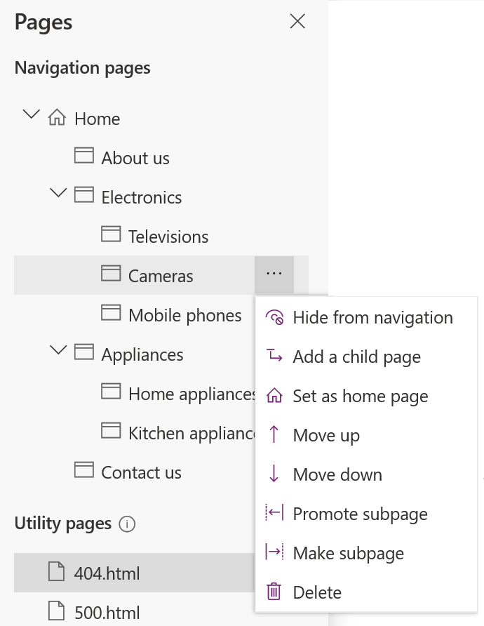

# Manage webpage

1.  [Edit the portal](edit.md) to open it in the maker experience.  

2.  Select **Pages**  from the toolbelt on the left side of the screen.  

3.  Hover over the page you want to manage and select the **Ellipsis** button (…) for the webpage you want to manage.

4.  Select the required action from the context menu:

    - **Hide from navigation**: Hide the page from being displayed in the sitemap.

    - **Add a child page**: Add a child page to the selected page. The child page inherits the page template of its parent page.

    - **Set as home page**: Set the page as the home page. The URL of the new home page is set to the root of the website and URL of the old page is updated accordingly.

    - **Move up**: Move the page up in hierarchy.

    - **Move down**: Move the page down in hierarchy.

 **Note**: Moving a page up or down is supported among the pages at the same level.

    - **Promote subpage**: Decrease the indent and make the child page at the level of the previous page in the hierarchy.

    - **Make subpage**: Increase the indent and make the page a child page of the previous page in the hierarchy.

    - **Delete**: Delete the page.

   

