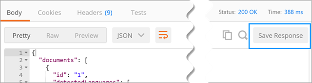

# Describe a custom connector with Postman
[Postman](https://www.getpostman.com/) is a tool for making your API development faster and easier. This tutorial demonstrates how to create a Postman collection, which you can then use to easily create [Custom connectors](register-custom-api.md) in PowerApps.

## Prerequisites
* Install the [Postman app](https://www.getpostman.com/apps)

## Create a Postman Collection
Let's build a Postman Collection for the Azure Cognitive Services [Text Analytics API](https://www.microsoft.com/cognitive-services/en-us/text-analytics-api). This API identifies the language, sentiment, and key phrases in text that you pass to it.

1. The first step in creating a Postman Collection is to create a request. When creating the request, you can set the HTTP verb, the request URL, query or path parameters, headers, and the body. For more information, see [Sending Requests](https://www.getpostman.com/docs/requests) in the Postman documentation. For the Detect Language API endpoint, set the values as follows:
   
    
   
    Details of parameters and values used:
   
   | Parameter | Value |
   | --- | --- |
   | Verb |POST |
   | Request URL |https://westus.api.cognitive.microsoft.com/text/analytics/v2.0/languages |
   | Params |numberOfLanguagesToDetect |
   | Authorization |“No Auth” |
   | Headers |Ocp-Apim-Subscription-Key = <your subscription key>  Content-Type = application/json |
   | Body |<code>{ &nbsp;&nbsp;&nbsp;"documents": [ &nbsp;&nbsp;&nbsp;&nbsp;&nbsp;{ &nbsp;&nbsp;&nbsp;&nbsp;&nbsp;&nbsp;&nbsp;&nbsp;"id": "1", &nbsp;&nbsp;&nbsp;&nbsp;&nbsp;&nbsp;&nbsp;&nbsp;"text": "Hello World" &nbsp;&nbsp;&nbsp;&nbsp;&nbsp;} &nbsp;&nbsp;] }<code> |
2. Click **Send** to make the request and get the response back.
3. Click **Save** to save the request into a Postman Collection.
   
    
4. Provide a **Request name** and **Request description** in the **Save Request** dialog box. You will use these values in your custom connector.
   
    
   
    You can also save the response to the request. Custom connectors currently only support a single response per request. If you save multiple responses per request, only the first one is used.
   
    
5. Continue building your Postman Collection by creating and saving other requests and responses.
6. Once you have completed building the Postman Collection for all your requests and responses, export the collection.
   
    
7. Choose **Collection v1** as the export format.
   
    

You can now use this Postman collection to create a custom connector in PowerApps. For more information, see [Register and use custom connectors in PowerApps](register-custom-api.md). 

