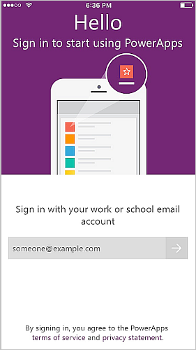
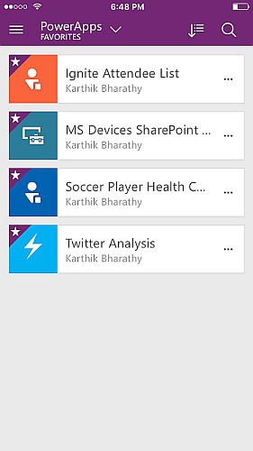
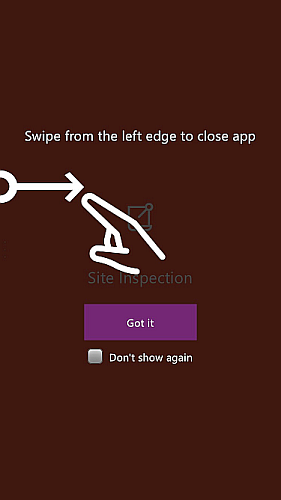
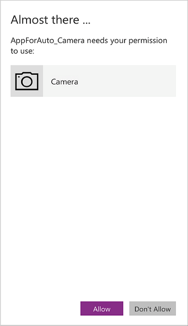

# Use PowerApps on a phone or a tablet
Apps built using PowerApps can run on Windows, iOS, Android, Windows Phone, or in a web browser. Apps running on a mobile device can take advantage of the device's capabilities, such as location and camera. You can download PowerApps Mobile from the Windows Store, the App Store, or Google Play.

## Prerequisites
* One of the following:
  * An app that you built from a [template](get-started-test-drive.md), from [data](get-started-create-from-data.md), or from a [blank canvas](get-started-create-from-blank.md).
  * An app that someone else built and shared with you, granting user permissions.
* PowerApps installed on an iPhone, iPad, Windows Phone, or Android device. Here are the specific versions supported:  
  * iOS versions 9.3 and above
  * Android versions 5 and above
  * Windows 10 Mobile (Preview)

If you're unfamiliar with PowerApps, see [Introduction to PowerApps](getting-started.md).

## Sign in to PowerApps
The first time you open PowerApps, you are prompted to sign in using your Azure Active Directory credentials:  

## Windows 10 Mobile Preview
PowerApps for Windows 10 Mobile is available in the Store as a preview. You can also go to [powerapps.com](https://powerapps.microsoft.com/), and there is a link to Windows Store in the bottom of the page.

Here are system requirements:

* **OS**: Anniversary update Redstone 1 (10.0.14267.1002) or higher required
* **Memory**: At least 2GB of RAM

## App filters and sorting options
Quickly find an app by searching one of these categories:

* **All**: All apps to which you have access, including apps you created and apps that others shared with you.
* **My Apps**: Apps that you have run at least once.
* **Samples**: Sample apps that Microsoft provided to showcase real application scenarios with fictitious data and to help you explore design possibilities.
* **Favorites**: Apps that you've marked by using the "…" option of each app. You can unmark an app to remove it from this list.

    

After you choose a list, you can also sort it by the dates on which apps were most recently opened or modified. These preferences are retained when you close and reopen PowerApps.  

## Open an app
To open an app on a tablet or a phone, tap the app icon, or tap the push notification that appears when someone shares an app with you.

If this is the first time you are using PowerApps, a screen shows the swipe gesture to exit PowerApps.

## Give consent
If an app requires a connection to a data source or requires consent to use the device's capabilities, you must confirm the connection or give consent before you use the app:  

Typically, you are prompted only the first time.

## Exit the app
* On an Android phone, slide to the right (or press the back button and then confirm that you intended to exit the app).
* On an iPhone, slide to the right.
* On Windows 10 Mobile, press the back button.

    

## Share the app
For information about how to share an app from [powerapps.com](https://web.powerapps.com), see [Sharing an app](share-app.md).

## Pin an app to the home screen
If you've downloaded an app and used it at least once, you can pin it to the home screen of your device for quick access. Tap the ellipsis (...) for an app, tap **Pin**, and then follow the instructions that appear.

