# Configure Power BI dashboards

The Higher Education Crisis Financial Impact Tracker app is designed to collect data pertaining to sponsored research programs or projects. Researchers can use the app to submit projected lost effort and loss reasons organized by grant, employee, and pay period.

By using Power BI, you can analyze and visualize the data from the app. The Power BI template described in this article pulls in the data that's collected by the Higher Education Crisis Financial Impact Tracker.

These reports are intended to be used by directors, deans, and research administrators who will monitor the data collected on behalf of their respective departments, sponsors, and colleges or schools.

## Prerequisites

The Higher Education Crisis Financial Impact Tracker app pulls data from Microsoft Dataverse into this Power BI template, which empowers you to securely store, integrate, and automate the data for use with other business apps, including Power BI, Dynamics 365, and Power Automate.

To use this Power BI template, you need these prerequisites:

-  Download the free [Power BI Desktop](https://powerbi.microsoft.com/desktop/) app.

-  Sign up for the [Power BI service](https://powerbi.microsoft.com/get-started/).

-  Create a Dataverse environment with maker permissions to access the portal and read permissions to access data within the entities.

You can configure Power BI dashboards in two ways:

* [Using a blank report canvas](#configure-from-blank-report-canvas)
* [Using a Power BI template](#using-power-bi-template)

## Configure a Power BI report by using a blank report canvas

To configure a Power BI report by using a blank report canvas:

1. Open Power BI Desktop. You might be prompted to **Sign in** to the Power BI service by using your work or school account.

   > [!div class="mx-imgBorder"]
   > 

2. Select **Get data** > **Power Platform** > **Common Data Service**, and then select **Connect**.
  
   > [!div class="mx-imgBorder"]
   > 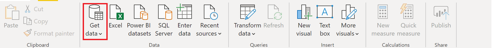

   > [!div class="mx-imgBorder"]
   > 

3. Enter the **Server Url** that's specific to your Dataverse environment. To get the Dataverse environment URL, do the following:

   1. Open [Power Apps](https://make.powerapps.com/?utm_source=padocs&utm_medium=linkinadoc&utm_campaign=referralsfromdoc), select the environment you're going to connect to, select **Settings** in the upper-right corner, and then select **Advanced settings**.

   2. In the new browser tab that opens, copy the root of the URL. This is the unique URL for your environment. The URL will be in the format
    <https://yourenvironmentid.crm.dynamics.com/>. Be sure not to copy the rest of the URL.

    > [!div class="mx-imgBorder"]
    > 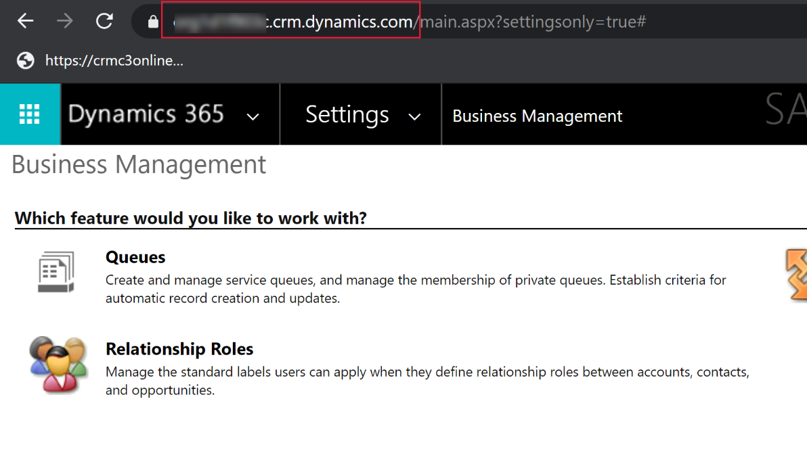

    > [!div class="mx-imgBorder"]
    > 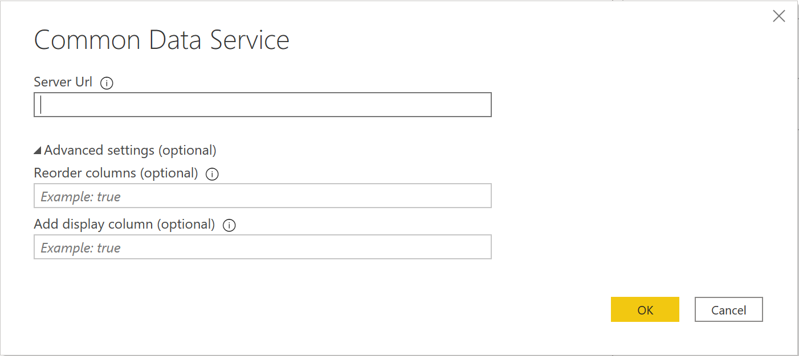

4. After you successfully connect to your environment, you can see the folders for **Entities** and **System** in the **Navigator**. Expand **Entities**, and select the check boxes for the following entities:

   - Account

   - Contact

   - msft_Campus

   - msft_College

   - msft_Department

   - msft_EmployeeCompensation

   - msft_Grant

   - msft_LossReason

   - msft_PayPeriod

   - msft_SponsoredProgram

    > [!div class="mx-imgBorder"]
    > 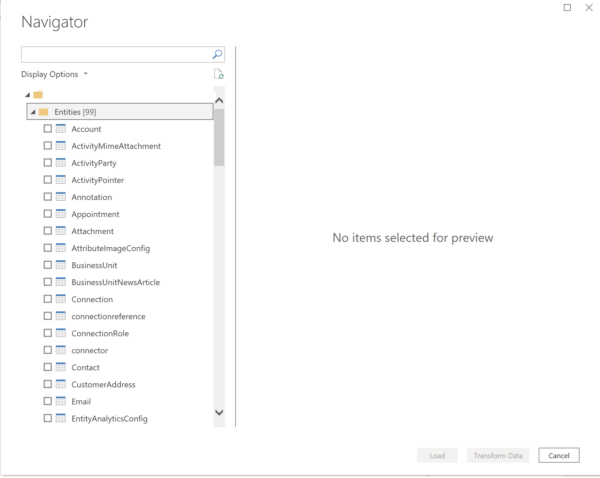

5. After you finish selecting the list of entitites, select **Transform Data**. The Query Editor window opens with the selected tables and data loaded.
  
   > [!div class="mx-imgBorder"]
   > 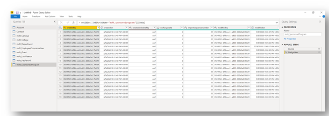

6. For each entity, select **Choose Columns** in the ribbon to open the console and select which fields to use in the data model and in reports.<!--Please note that images should never include information that isn't also available in text, either the main content or alt text.  This is an accessibility requirement. Unfortunately, some of these lists are too long for alt text (which has a maximum of 220 characters), so I've converted them to lists. I'd appreciate your double-checking that they're accurate.-->

   > [!div class="mx-imgBorder"]
   > 

   - The following are suggested fields for the Contact entity:
      - msft_annualbasesalary
      - msft_annualbasesalary_base
      - msft_annualtuitionreimbursement
      - msft_annualtuitionreimbursement_base
      - msft_contacttype
      - msft_department
      - msft_employmentclass
      - msft_showwelcomemessage
      - msft_userid

   - The following are suggested fields for the msft_Campus entity:
      - msft_campusdescription
      - msft_campusid
      - msft_campusname

   - The following are suggested fields for the msft_College entity:
      - msft_campus
      - msft_collegedescription
      - msft_collegeid
      - msft_collegename

   - The following are suggested fields for the msft_Department entity:
      - msft_college
      - msft_departmentdescription
      - msft_departmentid
      - msft_departmentname

   - The following are suggested fields for the msft_EmployeeCompensation entity:
      - msft_effortamount
      - msft_effortamount_base
      - msft_effortpercentage
      - msft_employee
      - msft_employeecompensationid
      - mstf_fte
      - msft_lossamount
      - msft_lossamount_base
      - msft_losspercentage
      - msft_lossreason
      - msft_name
      - msft_paygroup
      - msft_paygroup_display
      - msft_payperiod
      - msft_payrate
      - msft_payrate_base
      - msft_sponsoredprogram

   - The following are suggested fields for the msft_Grant entity:
      - msft_enddate
      - msft_grantdescription
      - msft_grantid
      - msft_grantnumber
      - msft_grantstatus
      - msft_grantstatus_display
      - msft_granttitle
      - msft_principalinvestigator
      - msft_startdate

   - The following are suggested fields for the msft_LossReason entity:
      - msft_lossreasoncode
      - msft_lossreasondescription
      - msft_lossreasonid

   - The following are suggested fields for the msft_PayPeriod entity:
      - msft_enddate
      - msft_payperiodcode
      - msft_payperioddescription
      - msft_payperiodid
      - msft_startdate

   - The following are suggested fields for the msft_SponsoredProgram entity:
      - msft_availablebalance
      - msft_availablebalance_base
      - msft_awardamount
      - msft_awardamount_base
      - msft_coprincipalinvestigator
      - msft_department
      - msft_effortlossimpactamount
      - msft_effortlossimpactamount_base
      - msft_effortlossimpactamount_date
      - msft_effortlossimpactamount_state
      - msft_effortlossimpactpercentage
      - msft_grant
      - msft_primesponsorname
      - msft_sponsoredprogramdescription
      - msft_sponsoredprogramid
      - msft_sponsoredprogramnumber
      - msft_sponsorname

<!--
 - Here are suggested fields for each Entity:

     - Contact
      > [!div class="mx-imgBorder"]
      > 

     - msft_Campus
      > [!div class="mx-imgBorder"]
      > 

     - msft_College
       > [!div class="mx-imgBorder"]
       > 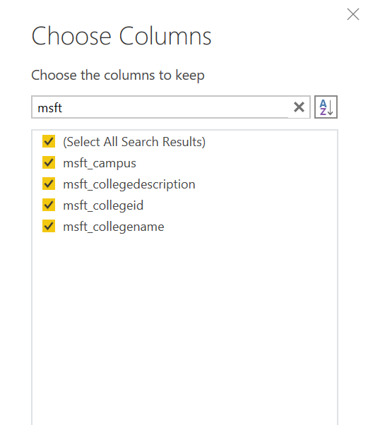

     - msft_Department
       > [!div class="mx-imgBorder"]
       > 

     - msft_EmployeeCompensation
       > [!div class="mx-imgBorder"]
       > 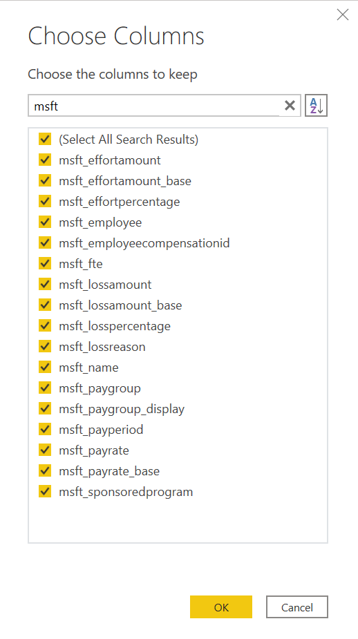

    - msft_Grant

     

    - msft_LossReason
      > [!div class="mx-imgBorder"]
      > 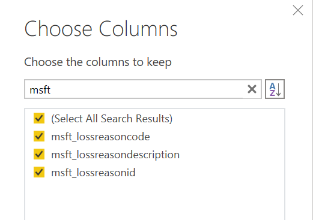

    - msft_PayPeriod
      > [!div class="mx-imgBorder"]
      > 

    - msft_SponsoredProgram
      > [!div class="mx-imgBorder"]
      > 
-->

7. Select **Close & Apply** to close the Query Editor and apply the changes you made.

8. You'll see the following screen in the Power BI report canvas. It might take several minutes for the queries to run.

   > [!div class="mx-imgBorder"]
   > 

9. After the changes are applied, the Power BI report canvas looks
similar to the following screenshot, including the tables listed in the **Fields** panel on the
right side of the page.

   > [!div class="mx-imgBorder"]
   > 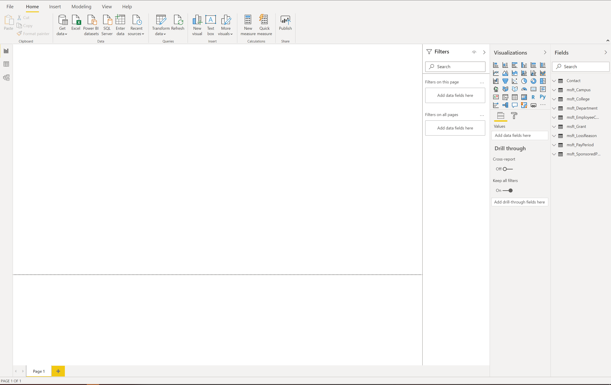

10. Select the icon on the left side of the page to open the **Model** view. You will see the tables that you selected. Use the slider in the lower-right corner to adjust the view size.

    > [!div class="mx-imgBorder"]
    > 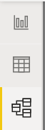

    > [!div class="mx-imgBorder"]
    > 

11. On the **Home** tab, select  **Manage Relationships** to open the console where you'll create new relationships among the entities.

    > [!div class="mx-imgBorder"]
    > 

    When creating or editing relationships among entities, you select the tables and columns to be joined, in addition to the **Cardinality** and **Cross-filter** direction for the relationship.

    > [!div class="mx-imgBorder"]
    > 

13. To use the suggested fields in Dataverse that are pertinent to the Power BI template, your relationship mapping between tables should look like the following.

     |From: Table | To: Table | 
     |---|---|---|
     | msft_College (msft_campus) | msft_Campus (msft_campusid) |
     | msft_Department (msft_college) | msft_College (msft_collegeid) |
     | msft_EmployeeCompensation (msft_lossreason) | msft_LossReason (msft_lossreasonid) |
     | msft_EmployeeCompensation (msft_payperiod) | msft_PayPeriod (msft_payperiodid) |
     | msft_EmployeeCompensation (msft_sponsoredprogram) | msft_SponsoredProgram (msft_sponsoredprogramid) |
     | msft_SponsoredProgram (msft_coprincipalinvestigator) | Contact (contactid) |
     | msft_SponsoredProgram (msft_department) | msft_Department (msft_departmentid) |
     | msft_SponsoredProgram (msft_grant) | msft_Grant (msft_grantid) |

    > [!div class="mx-imgBorder"]
    > 

The following screenshot shows the Entity Relationship Diagram in the Model view.

  > [!div class="mx-imgBorder"]
  > 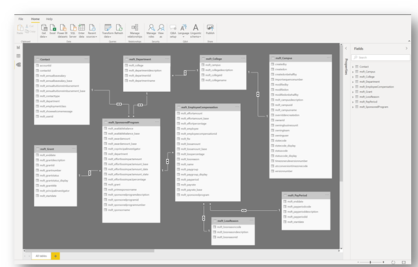

## Configure a Power BI report by using a Power BI template

The Power BI template contains sample data and interactive graphics in a .pbix file format that you can further edit and update in Power BI Desktop. Download the template from [GitHub](https://github.com/microsoft/powerapps-tools/blob/master/Apps/CrisisFinancialImpactTracker/PBITemplate.pbix).

### Open the Power BI template

When you open the template, you're greeted with a Power BI splash screen. You might also be prompted to **Sign in** to the Power BI service by using your work or school account.

When you open the Power BI template, you'll see a series of tabs at the bottom of the report:

- **Legal**: Contains Microsoft legal disclaimer.
- **Home**: Contains sample text that you can use and modify according to yoru preference. 
- **Information**: Contains general information.
- **FAQ**: Contains frequently asked questions.
- **Submissions**: Opens the **Submissions Report** page.

- **Sponsors**: Opens the **Impact by Sponsor Report** page.

- **Department**: Opens the **Department** view.

Your organization can add its logos to all pages in the template by inserting
an image on the page and then copying it to other pages. More information:  [Copy and paste a report visualization](/power-bi/visuals/power-bi-visualization-copy-paste)

## Connect to Dataverse

To use your own data collected by the Higher Education Crisis Financial Impact Tracker app, you need to update the data connection in the template. More information: [Create a Power BI report using the Common Data Service connector](../../maker/data-platform/data-platform-powerbi-connector.md)

To change the data source, select **Transform data** to open Query Editor. In the **Applied Steps** of Query Editor, change the **Source** for each entity. Use the Dataverse environment URL. 

## Issues and feedback 

- To report an issue with the Higher Education Crisis Financial Impact Tracker app, visit <https://aka.ms/crisis-financial-impact-tracker-issues>.
- For feedback about Higher Education Crisis Financial Impact Tracker app, visit <https://aka.ms/crisis-financial-impact-tracker-feedback>.

[!INCLUDE[footer-include](../../includes/footer-banner.md)]