# Configure Power BI dashboards

The Higher Education Crisis Financial Impact Tracker is an app that is designed to collect data pertaining to sponsored research programs, or projects. More specifically,
the app enables researchers to submit the projected Lost Effort and Loss Reason by grant, employee, and pay period.

By using Power BI, you can analyze and visualize the data from the app. This Power BI template pulls in the data that is collected by the Higher Education Crisis Financial Impact Tracker.

These reports are intended to be used by Directors, Deans, and Research Administrators who will monitor the data collected, on behalf of their respective Departments, Sponsors, Colleges and/or Schools.

## Prerequisites

The Higher Education Crisis Financial Impact Tracker app uses Power Apps that work on top of Common Data Service. Data is pulled from Common Data Service into this Power BI template, which empowers you to securely store, integrate and automate the data for use with other business applications, including Power BI, Dynamics 365, Power Automate, and others.

To use this Power BI template, you need these prerequisites:

-  Download the free [Power BI Desktop](https://powerbi.microsoft.com/desktop/) app.

-  Sign up for the [Power BI service](https://powerbi.microsoft.com/get-started/).

-  Common Data Service environment with maker permissions to access the portal and read permissions to access data within the entities.

You can configure Power BI dashboards in two ways:

1. Configure from blank report canvas](#configure-from-blank-report-canvas)
1. Using Power BI template(#using-power-bi-template)

## Configure from  blank report canvas

To configure Power Bi report  from a blank report canvas:

- Open the Power BI, you are greeted with a Power BI splash screen when you open it for the first time. You may also be prompted to **Sign in** to Power BI service using your work or school account.

  > [!div class="mx-imgBorder"]
  > 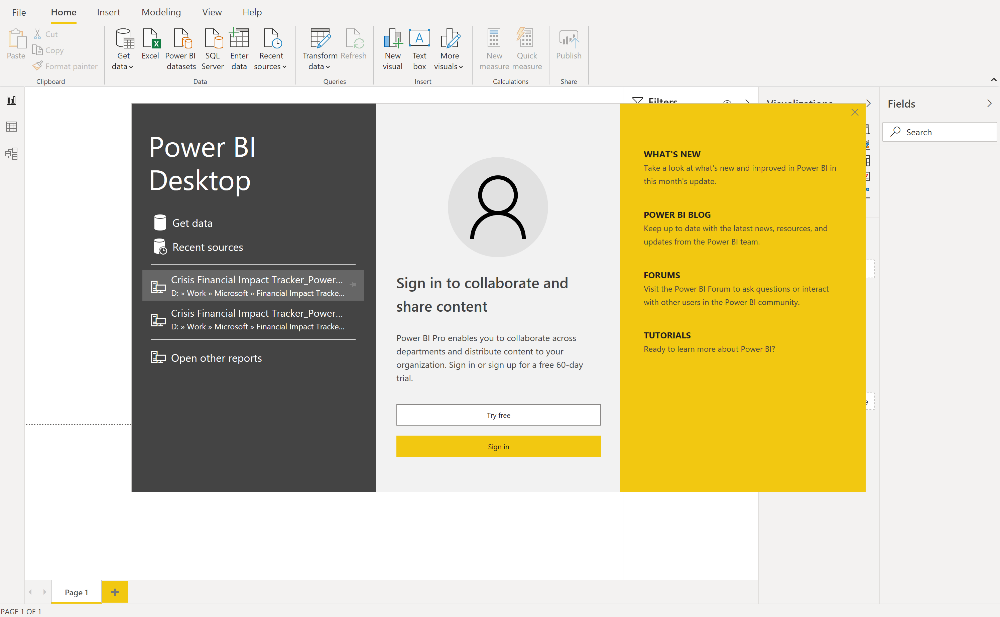

- Select **Get data**, select **Power Platform** and then select Common Data Service and select **Connect**.
  
  > [!div class="mx-imgBorder"]
  > 

  > [!div class="mx-imgBorder"]
  > 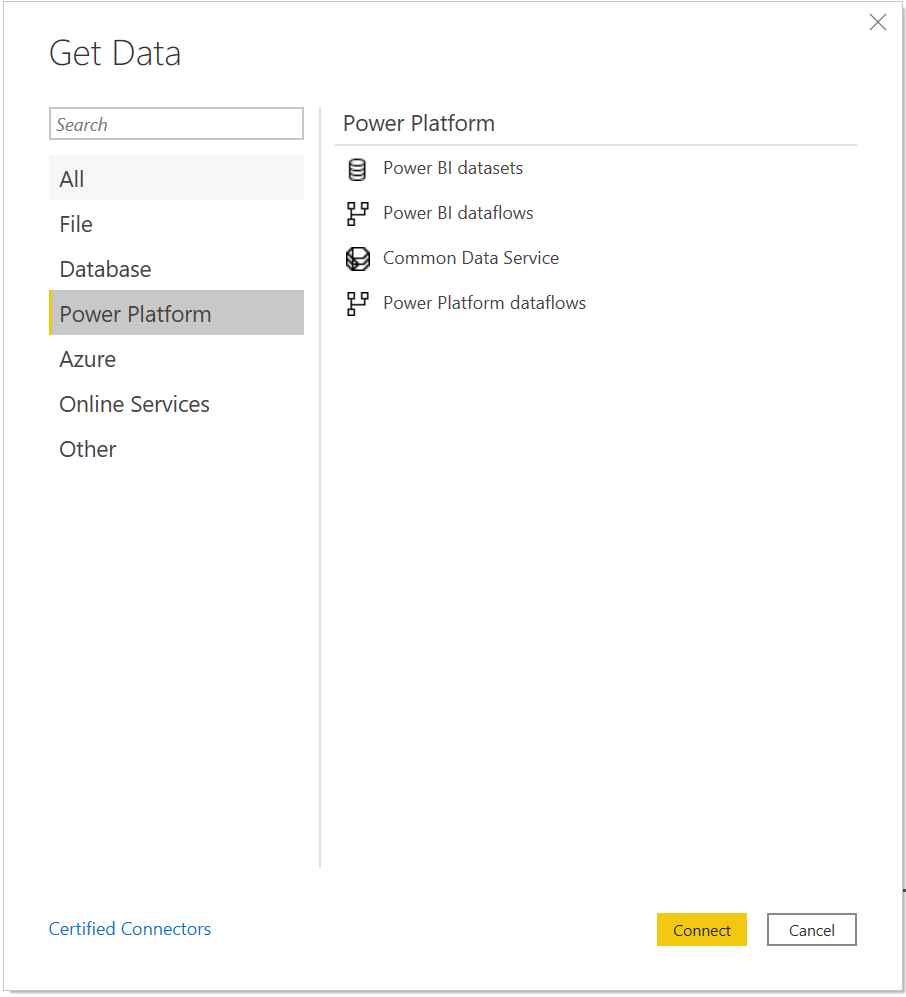

- Enter the **Server Url** that is specific to your Common Data Service environment. To get the Common Data Service environment url:

  - Open [Power Apps](https://make.powerapps.com/?utm_source=padocs&utm_medium=linkinadoc&utm_campaign=referralsfromdoc), select the environment you're going to connect to, select **Settings** in the top-right corner, and then select **Advanced settings**.

  - In the new browser tab that opens, *copy the root of the url*. This is the unique url for your environment. The url will be in the format of
    <https://yourenvironmentid.crm.dynamics.com/>. Make sure not to copy the rest of the url.

    > [!div class="mx-imgBorder"]
    > 

  > [!div class="mx-imgBorder"]
  > 

- After you successfully  connect to your environment, you can see the folders for **Entities** and System in the **Navigator**. Expand **Entities** and select the following tables from the list of Entities (check the boxes):

  

   - Account

   - Contact

   - msft_Campus

   - msft_College

   - msft_Department

   - msft_EmployeeCompensation

   - msft_Grant

   - msft_LossReason

   - msft_PayPeriod

   - msft_SponsoredProgram

- Select **Transform Data** after you finish selecting the list of entities. The Power Query Editor window is opened with the selected tables and data loaded.
  
  > [!div class="mx-imgBorder"]
  > 

- For each entity, select **Choose Columns** tab within the ribbon to open the console and select which fields to use in the data model and in reports.

  > [!div class="mx-imgBorder"]
  > 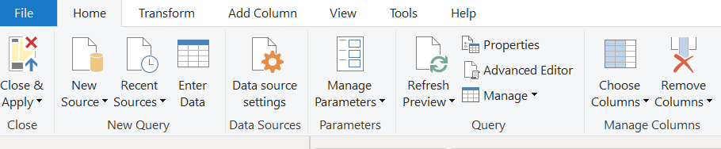

   - Here are suggested fields for each Entity:

     - Contact
      > [!div class="mx-imgBorder"]
      > 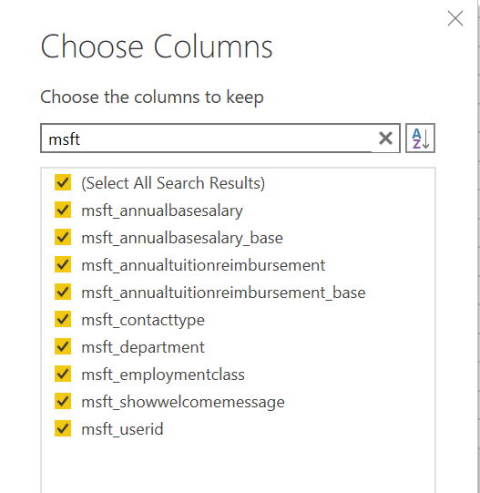

     - msft_Campus
      > [!div class="mx-imgBorder"]
      > 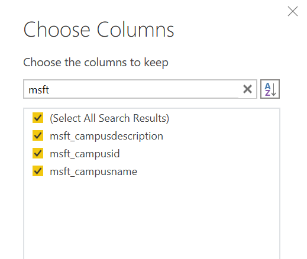

     - msft_College
       > [!div class="mx-imgBorder"]
       > 

     - msft_Department
       > [!div class="mx-imgBorder"]
       > 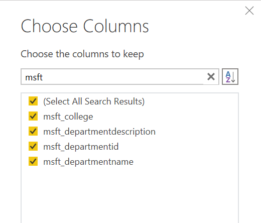

     - msft_EmployeeCompensation
       > [!div class="mx-imgBorder"]
       > 

    - msft_Grant

     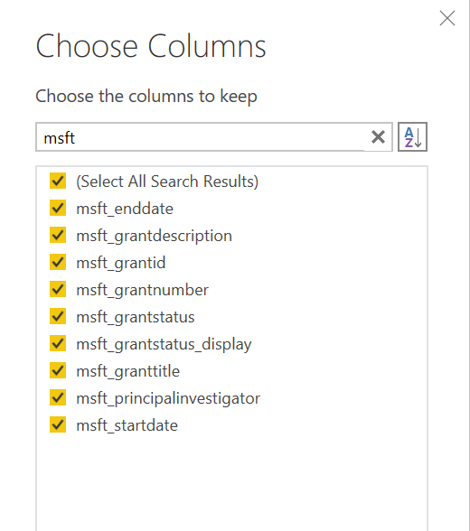

    - msft_LossReason
      > [!div class="mx-imgBorder"]
      > 

    - msft_PayPeriod
      > [!div class="mx-imgBorder"]
      > 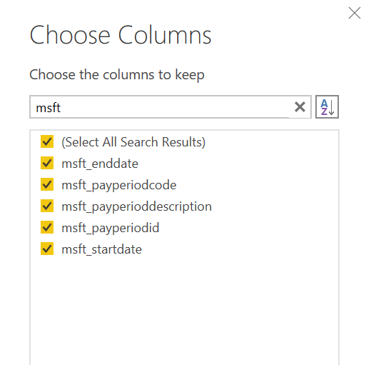

    - msft_SponsoredProgram
      > [!div class="mx-imgBorder"]
      > 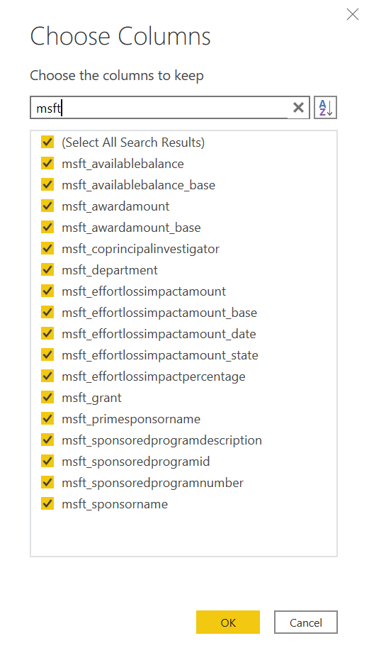

- Select **Close & Apply** to close the Power Query Editor and apply the changes made.

- You will see the following screen within the Power BI report canvas. It may take several minutes for the queries to run. 

  > [!div class="mx-imgBorder"]
  > 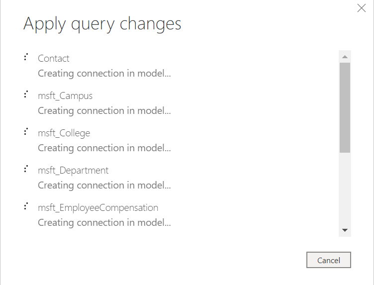

- After the changes are applied, the report canvas within Power BI looks
similar to what is shown in the screenshot, including the tables listed within the **Fields** panel on the
right side of the page.

  > [!div class="mx-imgBorder"]
  > 

  > [!div class="mx-imgBorder"]
  > 

- Select the icon on the left side of the page to open the **Model** view. You will see the tables that you selected. Use the slider in the bottom right to adjust the view size.

  > [!div class="mx-imgBorder"]
  > 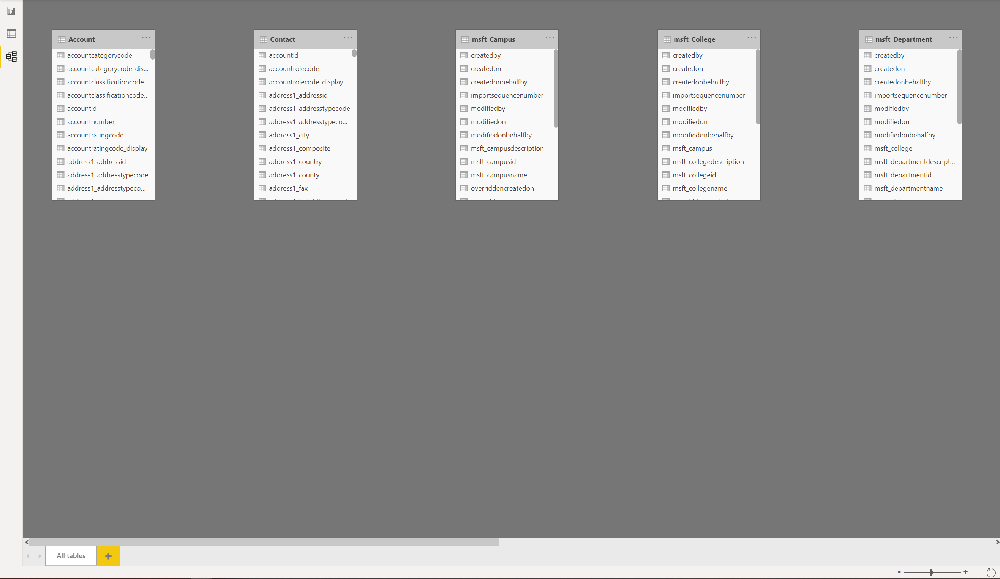

- In the **Home** tab, select  **Manage Relationships** to
open the console, where you will create new relationships between the entities.

  > [!div class="mx-imgBorder"]
  > 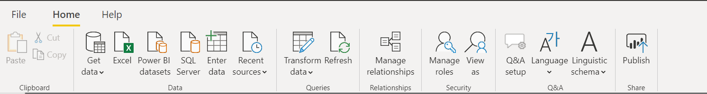

- When creating or editing relationships between entities, select the tables and
the columns to be joined, as well as the **Cardinality** and **Cross-filter** direction for the relationship.

  > [!div class="mx-imgBorder"]
  > 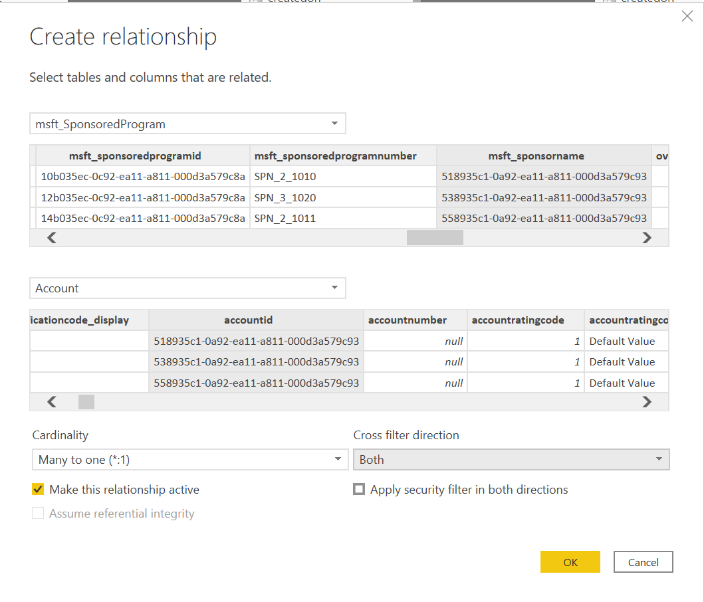

- To use the suggested fields within the Common Data Service that are pertinent to the Power BI template, your relationship mapping between tables should look like this:
 
  > [!div class="mx-imgBorder"]
  > 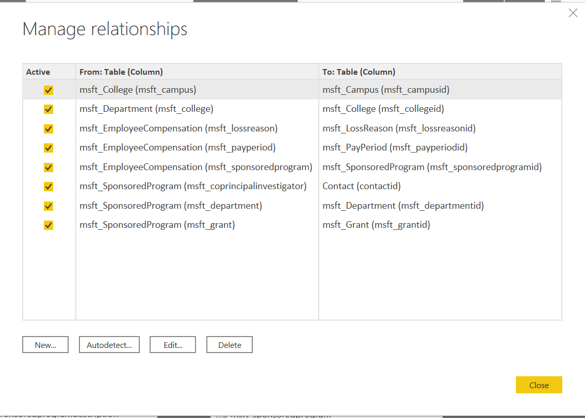

- Here is a screenshot of the Entity Relationship Diagram, within the Model view:

  > [!div class="mx-imgBorder"]
  > 

## Using Power BI template

The Power BI template contains sample data and interactive graphics in a .pbix file format that you can further edit and update in Power BI Desktop. Download the template from [here](https://github.com/microsoft/powerapps-tools/blob/master/Apps/CrisisFinancialImpactTracker/PBITemplate.pbix).

### Open the Power BI template

When you open the Power BI, you are greeted with a Power BI splash screen. You may also be prompted to **Sign in** to the Power BI service using the work or
school account.

When you open the Power BI template, you notice a series of tabs at the bottom of the report:

- **Legal**: Contains Microsoft legal disclaimer.
- **Home**: The **Home** tab at the bottom of the workbook contains sample text which can be utilized and modified according to preference. 
- **Information**: Contains general information.
- **FAQ**: Contains frequently asked questions.
- **Submissions**: Launches the **Submissions Report** page.

- **Sponsors**: Launches the **Impact by Sponsor Report** page.

- **Department**: Launches the **Department** View.

Institutions can add their logos to all pages within the template by inserting
an image to the page and then copying it to the other pages.More information:  [Copy and paste a report visualization.](https://docs.microsoft.com/power-bi/visuals/power-bi-visualization-copy-paste)

## Connect to the Common Data Service

To utilize your own data collected by the Higher Education Crisis Financial Impact Tracker app, you need to update the data connection within the template. More information: [Create a Power BI report using the Common Data Service connector](https://docs.microsoft.com/powerapps/maker/common-data-service/data-platform-powerbi-connector)

To change the data source, select **Transform data** to open the Power Query Editor. Within the Applied Steps of the Query Editor, change the Source for each Entity. Use the Common Data Service environment url. 

## Report issues 

To report an issue with the Higher Education Crisis Financial Impact Tracker app, visit <https://aka.ms/emergency-response-issues>.

## Disclaimer

This report and data are provided "as is", "with all faults", and without warranty of any kind. Microsoft gives no express warranties or guarantees and
expressly disclaims all implied warranties, including merchantability, fitness
for a particular purpose, and non-infringement.
