# Configure master data in the admin app

This article provides information about how you can use the admin app (a model-driven app) to add and manage master data for your solution. These tasks are typically performed by business admins in your organization.

See the overview video about how to configure master data, or follow the steps in this article. Estimated time to complete these steps: **35–40 minutes**

## Demo: Quick overview of how to configure master data 

Watch a quick overview about how to configure master data. 

 

> [!VIDEO https://www.youtube.com/embed/QOJVe6ONH74]

## Step 1: Configure and manage setup data for your organization

Use the admin app to create and manage master setup data for your organization. This data is required for the Higher Education Crisis Financial Impact Tracker app to work.

> [!IMPORTANT]
> Ensure that your IT admin has deployed the solution into your organization and has granted appropriate permissions for business admins to use the admin app. More information: [Deploy the Higher Education Crisis Financial Impact Tracker app](deploy-solution.md)

You must add master setup data to these entities in the following sequence:

1. [App Configs](#app-configs)

2. [Frequently Asked Questions](#frequently-asked-questions)

3. [Campuses](#campuses)

4. [Colleges](#colleges)

5. [Departments](#departments)

6. [Loss Reasons](#loss-reasons)

7. [Pay Periods](#pay-periods)

Master data is managed from the **Administration** area on the left pane in the admin app.

> [!div class="mx-imgBorder"]
> 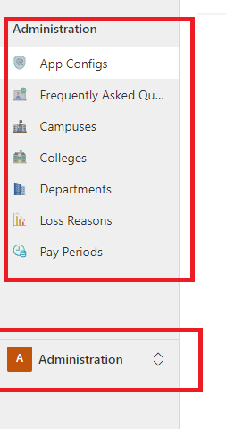

### App Configs

Use the App Configs entity to manage key configurations of the apps. 

To update the App Configs entity record:

1. Sign in to the admin app by using the URL provided by your IT admin.

1. On the left pane, select **Administration** > **App Configs**.

   > [!div class="mx-imgBorder"]
   > 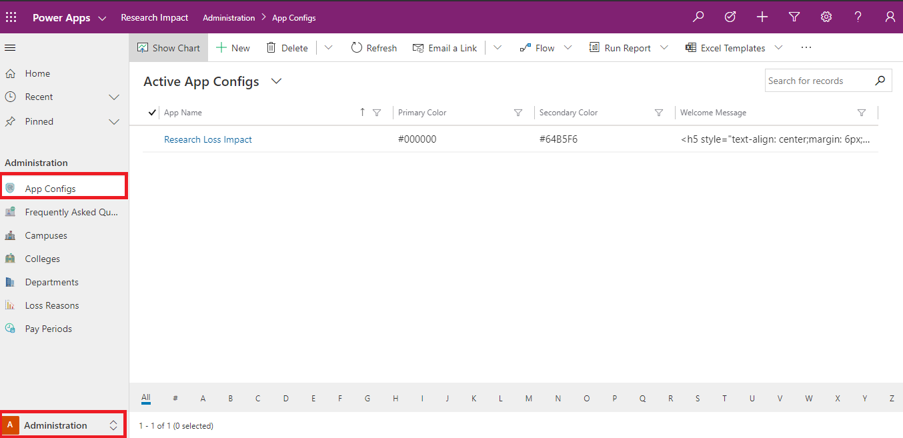

1. Select the record you want to update.
    
    > [!div class="mx-imgBorder"]
    > 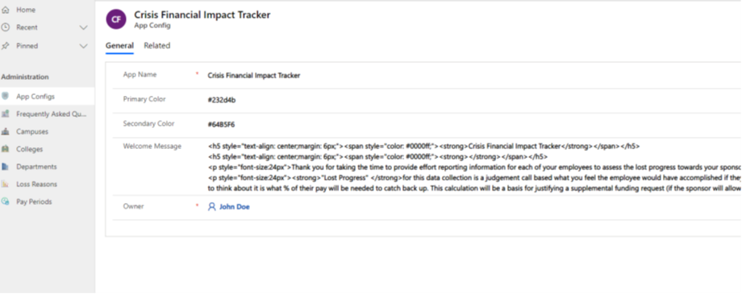

1. Enter or update the fields by using appropriate values.

    | Field | Description|
    |------------|--------------|
    | App Name  | Enter the name of the app. |
    | Primary Color| Enter the primary color for the app.|
    | Secondary Color | Enter the secondary color for the app.|
    | Welcome Message | Enter the HTML-based welcome message that you want to display on the app.|
    | Owner| The owner field automatically defaults to your user. |
    |||

1. Double-click to select the image on the form to update it with a new one.<!--What does "change the record image" mean? If this is all about the app icon, can we say "Double-click the app icon to select and update it.", and then have the alt text be "Change the app icon that appears on the mobile app" or something similar? -->
    > [!div class="mx-imgBorder"]
    > 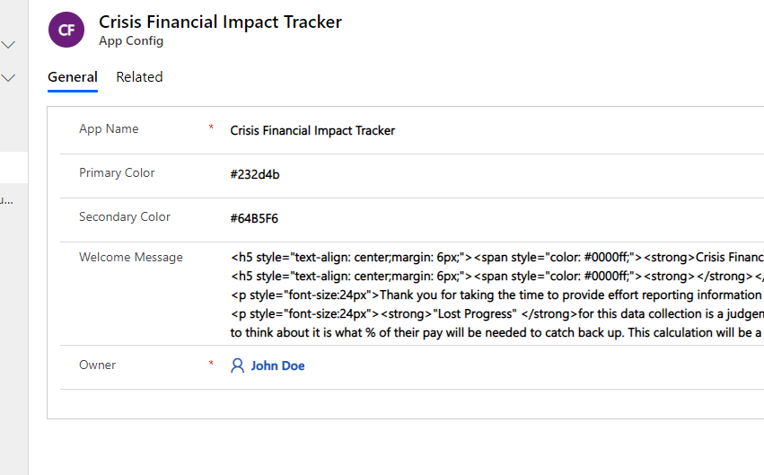

1. Select **Upload Image**, to display a new icon for your app.
    
    > [!div class="mx-imgBorder"]
    > 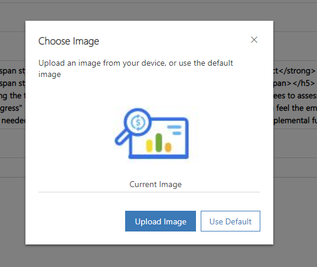

### Frequently Asked Questions 

Use the Frequently Asked Questions entity to manage and maintain a list of answers to questions that your users might have as they create records.<!--Suggested.--> 

To create a new record in Frequently Asked Questions:

1. Sign in to the admin app by using the URL provided by your IT admin.

1. On the left pane, select **Administration** > **Frequently Asked Questions**, and then select **New**.

1. Enter values for the fields as described in the following table.

   | Field    | Description |
   |----------|----------------|
   | Question | Enter a question that app users might commonly ask.|
   | Answer   | Enter an answer to the question that will be helpful for app users.|
   | Owner| The owner field automatically defaults to the user.|
   |||

   > [!div class="mx-imgBorder"]
   > 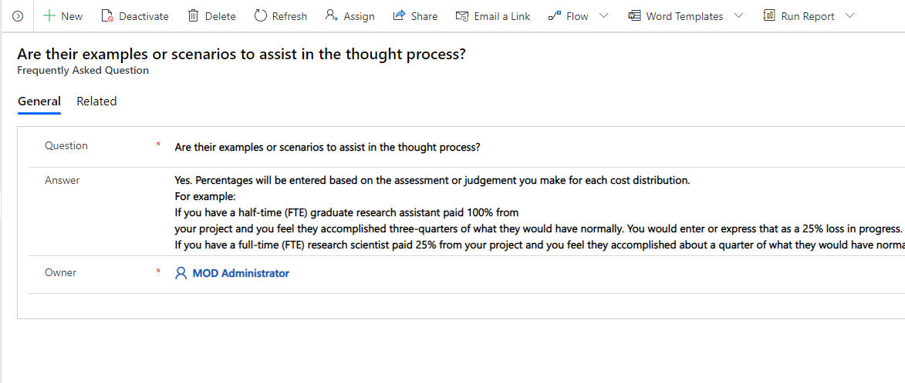

1. Select **Save & Close**. The newly created record will be available in the **Frequently asked questions** list.

To edit the record, select it, update the values as required, and then select **Save & Close**.

### Campuses

Use the Campuses entity to manage and maintain a list of university campuses that will participate in this program. 

To create a record in Campuses:

1. Sign in to the admin app by using the URL provided by your IT admin.

1. On the left pane, select **Administration** > **Campuses**, and then select **New**.

1. Enter the following field values to create a new record.

   | Field  | Description |
   |---------|-----|
   | Campus Name | Enter the name of the campus.|
   | Campus Description | Enter the description of the campus.|
   | Owner| The owner field automatically defaults to your user. |
   |||

   > [!div class="mx-imgBorder"]
   > 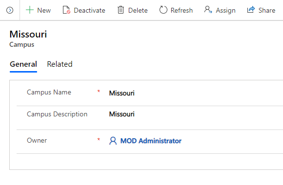

1. Select **Save & Close**. The newly created record will be available in the **Campuses** list.

To edit the record, select it, update the values as required, and then select **Save & Close**.

### Colleges

Use the Colleges entity to manage and maintain a list of the colleges at university campuses that will participate in this program.

To create a record in Colleges:

1. Sign in to the admin app by using the URL provided by your IT admin.

1. On the left pane, select **Administration** > **Colleges**, and then select **New**.

1. Enter the following field values to create a new record.

    | Field  | Description  |
    |------------|-------------|
    | College Name | Enter the name of the college or school. |
    | College Description | Enter the description of the college or school.|
    | Campus | Select a campus this college or school is associated with. This list is populated based on the **Campus** data you created earlier. |
    | Owner | The owner field automatically defaults to your user.|
    |||

    > [!div class="mx-imgBorder"]
    > 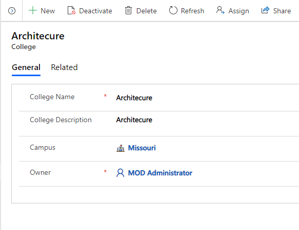

1. Select **Save & Close**. The newly created record will be available in the
    **Colleges** list.

To edit the record, select it, update the values as required, and then select **Save & Close**.

### Departments

Use the Departments entity to manage and maintain a list of the departments for each college that will participate in this program.

To create a record in Departments:

1. Sign in to the admin app by using the URL provided by your IT admin.

1. On the left pane, select **Administration** > **Departments**, and then select **New**.

1. Enter the following field values to create a new record.

    | Field  | Description   |
    |-------------|---------|
    | Department | Enter the name of the department.|
    | Department Description | Enter a description of the department.|
    | College | Select the college that this department is associated with. This list is populated based on the **Colleges** data you created earlier. |
    | Owner  | The owner will automatically default to your user. |
    |||

   > [!div class="mx-imgBorder"]
   > 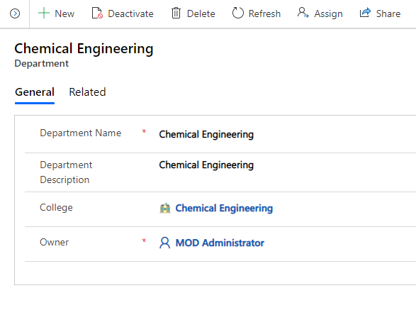

1. Select **Save & Close**. The newly created record will be available in the
    **Departments** list.

To edit the record, select it, update the values as required, and then select **Save & Close**.

### Loss Reasons

Use the Loss Reasons entity to manage and maintain a list of loss reasons associated with the effort impact.

To create a record in Loss Reasons:

1. Sign in to the admin app by using the URL provided by your IT admin.

1. On the left pane, select **Administration** > **Loss Reasons**, and then select **New**.

1. Enter the following field values to create a new record.

   | Field   | Description |
   |-----------|--------------|
   | Loss Reason Code | Enter the code for the loss reason.|
   | Loss Reason Description | Enter the description of the loss reason.|
   | Owner | The owner field automatically defaults to your user. |
   |||

   > [!div class="mx-imgBorder"]
   > 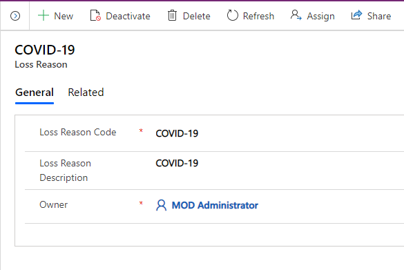

1. Select **Save & Close**. The newly created record will be available in the
    **Loss Reasons** list.

To edit the record, select it, update the values as required, and then select **Save & Close**.

### Pay Periods

Use the Pay Periods entity to manage and maintain a list of reporting
periods associated with the effort impact.

To create a record in Pay Periods:

1. Sign in to the admin app by using the URL provided by your IT admin.

1. On the left pane, select **Administration** > **Pay Period**, and then select **New**.

1. Enter the following field values to create a new record.

   > [!div class="mx-imgBorder"]
   > 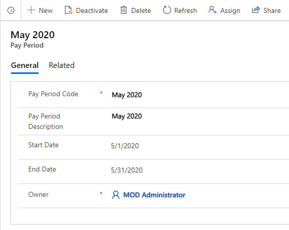

    | Field | Description |
    |-----------|--------------|
    | Pay Period Code | Enter the code for the pay period.|
    | Pay Period Description | Enter a description of the pay period.|
    | Owner  | The owner field automatically defaults to your user. |
    |||

1. Select **Save & Close**. The newly created record will be available in the
    **Pay Periods** list.

To edit the record, select it, update the values as required, and then select **Save & Close**.

## Step 2: Configure and manage master data for your organization

Use the admin app to create and manage master data for your organization. This data is required for the Higher Education Crisis Financial Impact Tracker app to work.

You must add master data to these entities in the following sequence:

1. [Employees](#employees)

2. [Sponsors](#sponsors)

3. [Grants](#grants)

4. [Sponsored Programs](#sponsored-programs)

5. [Employee Compensations](#employee-compensations)

Master data is managed from the **Higher Education Crisis Financial Impact Tracker** area on the left pane in the admin app.

> [!div class="mx-imgBorder"]
> 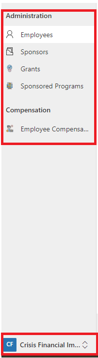

### Employees

Use the Employees entity to manage and maintain the list of employees who are associated with the sponsored program in different roles, such as Principal Investigator, Co-Principal Investigator, and Researcher.

To create a record in Employees:

1. Sign in to the admin app by using the URL provided by your IT admin.

1. On the left pane, select **Higher Education Crisis Financial Impact Tracker** > **Employees**, and then select **New**.

1. Enter the following field values to create a new record.

   | Field  | Description |
   |--------|-----------|
   | Contact Type | Enter the type of contact. |
   | Employee ID  | Enter the employee ID or number for the contact for reference in orders, service cases, or other communications with the contact's organization.|
   | User ID  | Enter the user ID. |
   | Email| Enter the primary email address for the contact. |
   | First Name | Enter the employee's first name, to make sure the contact is addressed correctly in sales calls, emails, and marketing campaigns.|
   | Last Name   | Enter the employee's last name, to make sure the contact is addressed correctly in sales calls, emails, and marketing campaigns.|
   | Middle Name | Enter the employee's middle name or initial, to make sure the contact is addressed correctly.|
   | Employment Class | Enter the classification of the employee. |
   | Department | Enter the department where the employee works.|
   | Annual Base Salary | Enter the annual base salary of the employee.|
   | Annual Tuition Reimbursement | Enter the annual tuition reimbursement of the employee.|
   |||

   > [!NOTE] 
   > The email address of the employee must match the employee email ID of the user accessing the app.

   > [!div class="mx-imgBorder"]
   > 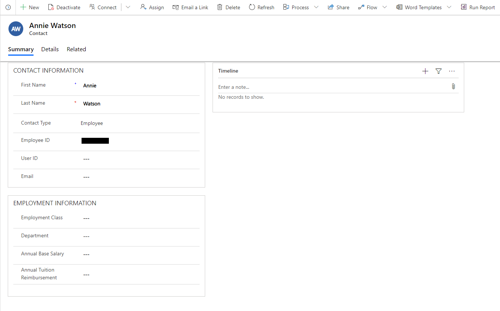

1. Select **Save & Close**. The newly created record will be available in the **Employees** list.

To edit the record, select it, update the values as required, and then select **Save & Close**.

### Sponsors

Use the Sponsors entity to manage and maintain a list of the sponsors that are
associated with the sponsored program.

To create a record in Sponsors:

1. Sign in to the admin app by using the URL provided by your IT admin.

1. On the left pane, select **Higher Education Crisis Financial Impact Tracker** > **Sponsors**, and then select **New**.

1. Enter the following field values to create a new record.

    | Field   | Description |
    |---------|------------|
    | Account Name  | Enter the name of the sponsor.|
    | Phone  | Enter the primary phone number of the sponsor.|
    | Fax   | Enter the fax number of the sponsor. |
    | Website  | Enter the website of the sponsor.|
    | Parent Account | Select the parent account associated with this sponsor.|
    |||

   > [!div class="mx-imgBorder"]
   > 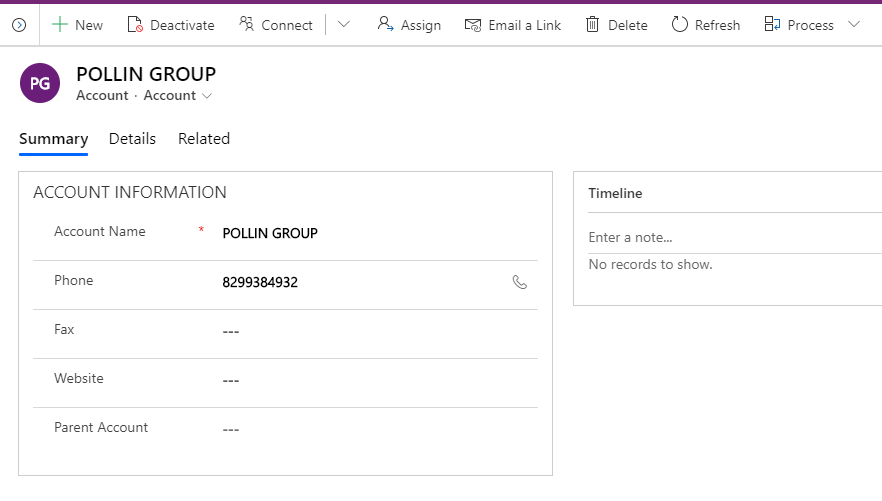

1. Select **Save & Close**. The newly created record will be available in the
    **Sponsors** list.

To edit the record, select it, update the values as required, and then select **Save & Close**.

### Grants

Use the Grants entity to manage and maintain a list of the grants that are associated with the sponsored program.

To create a record in Grants:

1. Sign in to the admin app by using the URL provided by your IT admin.

1. On the left pane, select **Higher Education Crisis Financial Impact Tracker** > **Grants**, and then select **New**.

1. Enter the following values to create a new record.

    | Field  | Description |
    |---------|--------------|
    | Grant Number | Enter the grant number.|
    | Grant Title | Enter the title of the grant.|
    | Grant Description| Enter the description of the grant.|
    | Grant Status | Select the status of the grant.|
    | Principal Investigator | Select the principal investigator.|
    | Start Date | Enter the start date of the grant.|
    | End Date| Enter the end date of the grant|
    | Owner | The owner field automatically defaults to your user. |
    |||

   > [!div class="mx-imgBorder"]
   > 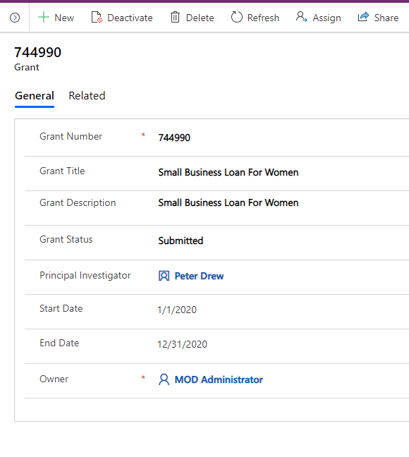

1. Select **Save & Close**. The newly created record will be available in the **Grants** list.

To edit the record, select it, update the values as required, and then select **Save & Close**.

### Sponsored Programs

Use the Sponsored Programs entity to manage and maintain the list of sponsored programs that are associated with the Grants entity.

To create a record in Sponsored Programs:

1. Sign in to the admin app by using the URL provided by your IT admin.

1. On the left pane, select **Higher Education Crisis Financial Impact Tracker** > **Sponsored Program**, and then select **New**.

1. Enter the following values to create a new record.

    | Field  | Description  |
    |-------------|--------------|
    | Sponsored Program Number  | Enter the number of the sponsored program.|
    | Sponsored Program Description | Enter the description of the sponsored program.|
    | Award Amount | Enter of the award amount for the sponsored program.|
    | Available Balance  | Enter the balance for the sponsored program.|
    | Effort Loss Impact Percentage | Enter the percentage of total loss impact.|
    | Effort Loss Impact Amount | Enter the total loss impact amount for the sponsored program.|
    | Grant | Select the grant this sponsored program is associated with.|
    | Department | Select the department of the sponsored program.|
    | Sponsor Name | Select the sponsor name for the sponsored program.|
    | Prime Sponsor Name | Select the prime sponsor name for the sponsored program.|
    | Co-Principal Investigator| Select the co-principal investigator name of the sponsored program. |
    | Owner  | The owner field automatically defaults to your user. |
    |||

    > [!div class="mx-imgBorder"]
    > 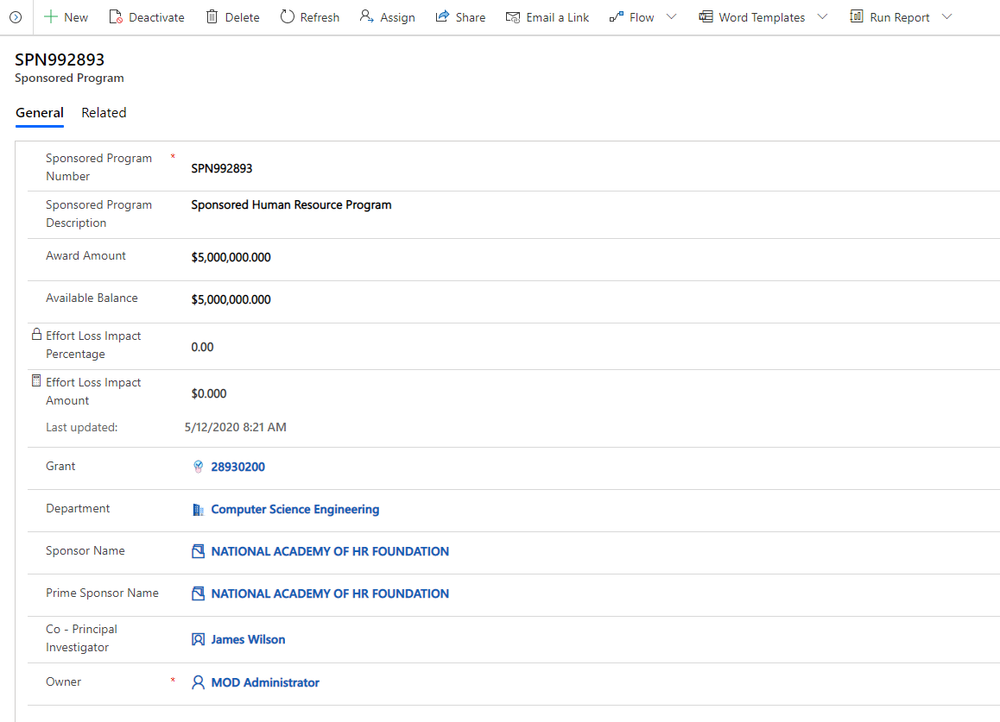

1. Select **Save & Close**. The newly created record will be available in the
    **Sponsored Programs** list.

To edit the record, select it, update the values as required, and then select
**Save & Close**.

### Employee Compensations

Use the Employee Compensation entity to manage and maintain the employee effort amount, effort loss, and loss reason by pay period for each
sponsored program.

To create a record in Employee Compensation:

1. Sign in to the admin app by using the URL provided by your IT admin.

1. On the left pane, select **Higher Education Crisis Financial Impact Tracker** > **Employee Compensation**, and then select **New**.

1. Enter the following values to create a new record.

   | Field     | Description  |
   |-------------|----------------------|
   | Employee  | Select the employee. |
   | Sponsored Program | Select the sponsored program. |
   | FTE    | Enter the full-time equivalent. |
   | Pay Period   | Select the pay period. |
   | Pay Group   | Select the pay group.|
   | Pay Rate    | Enter the pay rate. |
   | Effort Percentage | Enter the effort percentage. |
   | Effort Amount     | Enter the effort amount. |
   | Loss Percentage   | Enter the loss percentage. |
   | Loss Amount  | Enter the loss amount.|
   | Loss Reason  | Select the loss reason. |
   | Owner   | The owner field automatically defaults to your user. |
   |||

   > [!div class="mx-imgBorder"]
   > 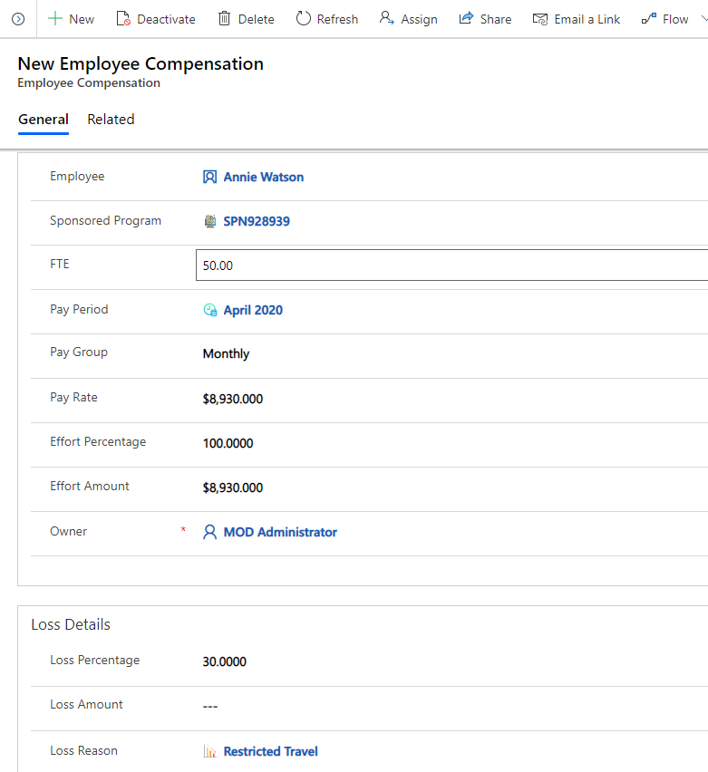

1. Select **Save & Close**. The newly created record will be available in the
    **Sponsored Programs** list.

To edit the record, select it, update the values as required, and then select
**Save & Close.**

## Issues and feedback 

- To report an issue with the Higher Education Crisis Financial Impact Tracker app, visit <https://aka.ms/crisis-financial-impact-tracker-issues>.
- For feedback about Higher Education Crisis Financial Impact Tracker app, visit <https://aka.ms/crisis-financial-impact-tracker-feedback>.

[!INCLUDE[footer-include](../../includes/footer-banner.md)]