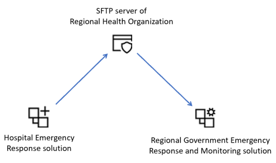

# Transfer data from Hospital to Regional System

Microsoft provides you the following solutions for emergency response:

- The *Hospital Emergency Response solution* enables you to collect data for situational awareness of available beds and supplies, COVID-19 related patients, staffing, and pending discharges at a **hospital level**.

- The *Regional Government Emergency Response and Monitoring solution* enables you to collect data for situational awareness of available beds and supplies, COVID-19 related patients, staffing, and pending discharges at a **regional health organization level**. Each hospital under the regional organization jurisdiction can submit their data by using the regional organization's portal, which is also part of the *Regional Government Emergency Response and Monitoring solution*.

Now, hospitals with the Hospital Emergency Response solution can submit their data to the regional organization by publishing their data, such as information about beds, supplies, equipments, and staff, to a Secure File Transfer Protocol (SFTP) server hosted by their regional medical organization. You can publish data on a set schedule and on-demand to the SFT server. 

Further, if the regional medical organization has the Regional Government Emergency Response and Monitoring solution installed, the hospital data is automatically downloaded from the SFTP server and stored as hospital data in the regional solution. This helps in integrating the hospital and regional emergency response solutions.

> [!div class="mx-imgBorder"] 
> 

## Prerequisites

For the data transfer to work from the Hospital Emergency Response solution, the regional health organization must have an SFTP server configured with a folder for each hospital on the SFTP server where the hospital can publish their data.

This article assumes that the hospital system already has access to a folder on a secure FTP server hosted by their regional medical organization. Make sure you have the credentials to establish a connection to the secure FTP folder as you will require it later.

## Configure your solutions for data transfer

IT admins need to perform some steps to configure the data transfer from Hospital Emergency Response solution to SFTP server and from SFTP server to Regional Government Emergency Response and Monitoring solution.

> [Step 1: Create connections](#step-1-create-connections)

> [Step 2: Enable flows for publishing data to SFTP (Hospital)](#step-2-enable-flows-for-publishing-data-to-sftp-hospital)

> [Step 3: Enable flow for pulling hospital data data from SFTP (Regional)](#step-3-enable-flow-for-pulling-hospital-data-data-from-sftp-regional)

### Step 1: Create connections

Both the hospital and regional systems use Power Automate flows to transfer data between the hospital/regional solutions and SFTP server. In this step, we will create connections for Common Data Service and SFTP to be used by the flows for data transfer.

This step is required for both hospital and regional solutions.

1. Sign in to [Power Apps](https://make.powerapps.com).

1. From the top-right corner, select your hospital or regional environment.

1. From the left navigation pane, expand **Data** and select **Connections**.

1. Select **New Connection**, and then type **Common Data Service** in the search box. 

1. From the search results, select **+** next to **Common Data Service (current environment)** connector to add a connection.

    > [!div class="mx-imgBorder"] 
    > 

1. On the next screen, select **Create**. 

1. Select or specify the credentials to create the connector. On successful authentication, your connection will be created.

1. Select **New Connection**, and then type **SFTP** in the search box.

1. From the search results, select **+** next to **SFTP - SSH** connector to add a connection.

    > [!div class="mx-imgBorder"] 
    > 

1. In the **SFTP - SSH** dialog box, provide the credentials to connect to the folder on the SFTP server. These details would have been already provided to you by your regional health organization as mentioned earlier in the **Prerequisites** section.

1. Select **Create**. Power Apps validates the connection details, and on successful authentication, creates an SFTP connection.

At the end of this step, you should have 2 connections: 1 for Common Data Service and another one for SFTP.

### Step 2: Enable flows for publishing data to SFTP (Hospital)

This step has to be performed by the admins of the Hospital Emergency Response solution.

In this step, we will enable the following flows that will publish reviewed data from the hospital solution to SFTP server on a set schedule and on-demand:
- Publish Bed Census Data
- Publish COVID Data
- Publish Data for All Facilities
- Publish Equipment Needs Data
- Publish Staff Updates
- Publish Supply Item Details

To enable these flows:

1.  Sign into [Power Automate](https://flow.microsoft.com/).

1.  From the left pane, select **Solutions.** From the solution list, select **Hospital Emergency Response Solution** to open the solution.

1.  In the solution, filter on **Flow** to find all the flows.

    > [!div class="mx-imgBorder"] 
    > 

1.  Select a flow name to open the flow definition. For example, select **Publish Bed Census Data**. 

1.  Verify the embedded connections for this flow. These should be the same connections that you created earlier. If required, select **Edit** on the toolbar to authorize/fix the connections for the flow.

1.  Select **Save** to save the changes, and then select **Turn On**.

1.  Repeat steps 4-6 for other flows listed earlier.

### Step 3: Enable flow for pulling hospital data data from SFTP (Regional)

This step has to be performed by the admins of the Regional Government Emergency Response and Monitoring solution.

In this step, we will enable the **Create Record when a File is Created in SFTP Location** flow that will automatically create a record for hospital in the regional solution based on the data uploaded from the hospital system in the SFTP server.

1.  Sign into [Power Automate](https://flow.microsoft.com/).

1.  From the left pane, select **Solutions.** From the solution list, select **Regional Emergency Response Solution** to open the solution.

1.  In the solution, filter on **Flow** to find all the flows.

    > [!div class="mx-imgBorder"] 
    > 

1.  Select a **Create Record when a File is Created in SFTP Location** flow to open the flow definition. 

1.  Verify the embedded connections for this flow. These should be the same connections that you created earlier. If required, select **Edit** on the toolbar to authorize/fix the connections for the flow.

1.  Select **Save** to save the changes, and then select **Turn On**.

## Review and publish data to SFTP

After your IT admin has configured the solution for data transfer from the hospital solution, you can use the **Review and Publish Data** model-driven app to review the data and mark it as completed for publishing to the folder on the SFTP server.

1. Sign in to [Power Apps](https://make.powerapps.com).

1. From the top-right corner, select your hospital environment.

1. Select **Apps** in the left navigation pane, and then select the **Review and Publish Data** app.

1. In the app, all the facilities are listed. Select a facility for which you want to review the data and publish. This will open the facility record.

    > [!div class="mx-imgBorder"] 
    > 

1. 

## Issues and feedback

- To report an issue with the Hospital Emergency Response sample app, visit <https://aka.ms/emergency-response-issues>.

- For feedback about the Hospital Emergency Response sample app, visit <https://aka.ms/emergency-response-feedback>.

### Disclaimer

This app is a sample and may be used with Microsoft Power Platform for dissemination of reference information only. This app is not intended or made available for use as a medical device, clinical support, diagnostic tool, or other technology intended to be used in the diagnosis, cure, mitigation, treatment, or prevention of disease or other conditions, and no license or right is granted by Microsoft to use this app for such purposes. This app is not designed or intended to be a substitute for professional medical advice, diagnosis, treatment, or judgement and should not be used as such. Customer bears the sole risk and responsibility for any use of this app. Microsoft does not warrant that the app or any materials provided in connection therewith will be sufficient for any medical purposes or meet the health or medical requirements of any person. Sample data included in this app are for illustration only and are fictitious. No real association is intended or inferred.
