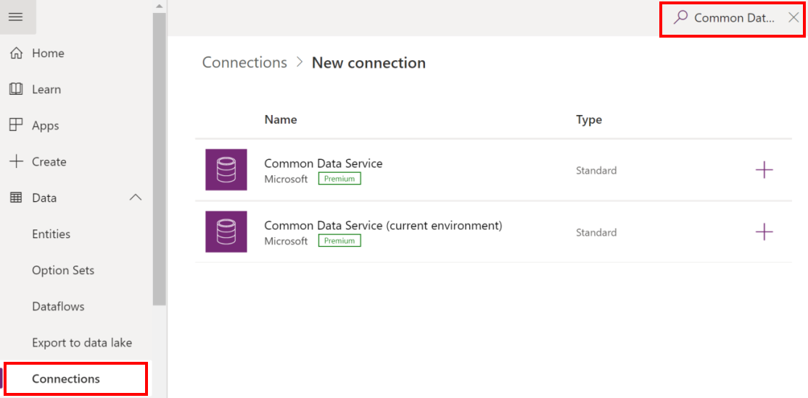

# Transfer data from Hospital to Regional System

Microsoft provides you the following solutions for emergency response:

- The *Hospital Emergency Response solution* enables you to collect data for situational awareness of available beds and supplies, COVID-19 related patients, staffing, and pending discharges at a **hospital level**.

- The *Regional Government Emergency Response and Monitoring solution* enables you to collect data for situational awareness of available beds and supplies, COVID-19 related patients, staffing, and pending discharges at a **regional health organization level** that collects and aggregates data from various hospitals under its jurisdiction.

Hospitals with the Hospital Emergency Response sample solution installed can review and publish data (scheduled and on-demand) for their hospitals, such as information about beds, supplies, equipments, and staff, to a Secure File Transfer Protocol (SFTP) server hosted by their regional medical organization. Further, if the regional medical organization has the Regional Government Emergency Response and Monitoring solution installed, the data can be downloaded from the SFTP server to the app where it can be reviewed before uploading it to the Centers for Disease Control and Prevention (CDC) web site.

> [!div class="mx-imgBorder"] 
> 

## Prerequisites

For the data transfer to work from the Hospital Emergency Response solution, the regional health organization must have an SFTP server, and provide access to a folder per hospital on the SFTP server where the hospital can publish their data.

This article assumes that the hospital system already has access to a folder on a secure FTP server hosted by their regional medical organization. Make sure you have the credentials to establish a connection to the secure FTP folder as you will require it later.

## Configure your solution for data transfer

### Step 1: Create connections

Both the hospital and regional systems use Power Automate flows to transfer data between the hospital/regional solutions and SFTP server. In this step, we will create connections for Common Data Service and SFTP to be used by the flows for data transfer.

This step is required for both hospital and regional solutions.

1. Sign in to [Power Apps](https://make.powerapps.com).

1. From the top-right corner, select your hospital or regional environment.

1. From the left navigation pane, expand **Data** and select **Connections**.

1. Select **New Connection**, and then type **Common Data Service** in the search box. 

1. From the search results, select **+** next to **Common Data Service (current environment)** connector to add a connection.

    > [!div class="mx-imgBorder"] 
    > 

1. On the next screen, select **Create**. 

1. Select or specify the credentials to create the connector. On successful authentication, your connection will be created.

1. Select **New Connection**, and then type **SFTP** in the search box.

1. From the search results, select **+** next to **SFTP - SSH** connector to add a connection.

    > [!div class="mx-imgBorder"] 
    > 

1. In the **SFTP - SSH** dialog box, provide the credentials to connect to the folder on the SFTP server. These details would have been already provided to you by your regional health organization as mentioned earlier in the **Prerequisites** section.

1. Select Create. Power Apps validates the connection details, and on successful authentication, creates an SFTP connection.

At the end of this step, you should have 2 connections: 1 for Common Data Service and another one for SFTP.

### Step 2: Enable flows for transferring data to SFTP (Hospital)

In this step, we will enable the following flows that will transfer reviewed data from the hospital solution to SFTP server:

 You can run these flows at a set schedule or on-demand.

IT admins need to perform some steps to configure the data transfer from Hospital Emergency Response solution to SFTP server and from SFTP server to Regional Government Emergency Response and Monitoring solution.

|Task | Target audience|See|
|--|--|--|
|Download and deploy the sample app and dashboard|IT admin|[Deploy the Hospital Emergency Response app](deploy-configure.md)|
|Use the admin app to add/manage master data|Business admin|[Configure and manage master data for your organization](configure-data-reporting.md#configure-and-manage-master-data-for-your-organization)|
|Use dashboards for insights and decision making|Business admin|[View Common Data Service dashboards](configure-data-reporting.md#view-common-data-service-dashboards)  [View Power BI dashboard](configure-data-reporting.md#view-power-bi-dashboard)|
|Use the mobile app to track data for ventilators, staffing, pending discharges, and COVID-19 related patients|Frontline staff|[Use the Hospital Emergency Response mobile app](use.md)
|Use the admin app to track feedback from mobile app|Business/IT admin|[View and manage app feedback](configure-data-reporting.md#view-and-manage-app-feedback)|

## Issues and feedback

- To report an issue with the Hospital Emergency Response sample app, visit <https://aka.ms/emergency-response-issues>.

- For feedback about the Hospital Emergency Response sample app, visit <https://aka.ms/emergency-response-feedback>.

### Disclaimer

This app is a sample and may be used with Microsoft Power Platform for dissemination of reference information only. This app is not intended or made available for use as a medical device, clinical support, diagnostic tool, or other technology intended to be used in the diagnosis, cure, mitigation, treatment, or prevention of disease or other conditions, and no license or right is granted by Microsoft to use this app for such purposes. This app is not designed or intended to be a substitute for professional medical advice, diagnosis, treatment, or judgement and should not be used as such. Customer bears the sole risk and responsibility for any use of this app. Microsoft does not warrant that the app or any materials provided in connection therewith will be sufficient for any medical purposes or meet the health or medical requirements of any person. Sample data included in this app are for illustration only and are fictitious. No real association is intended or inferred.
