# Transfer data from Hospital to Regional System

Microsoft provides you the following solutions for emergency response:

- The *Hospital Emergency Response solution* enables you to collect data for situational awareness of available beds and supplies, COVID-19 related patients, staffing, and pending discharges at a **hospital level**.

- The *Regional Government Emergency Response and Monitoring solution* enables you to collect data for situational awareness of available beds and supplies, COVID-19 related patients, staffing, and pending discharges at a **regional health organization level**. Each hospital under the regional organization jurisdiction can submit their data by using the regional organization's portal, which is also part of the *Regional Government Emergency Response and Monitoring solution*.

Hospital Emergency Response solution customers can transfer their hospital data to the regional medical organizations that have Regional Government Emergency Response and Monitoring solution.

The out-of-box solution uses the Secure File Transfer Protocol (SFTP) as the data transmission mechanism. Customers can use other ways to transfer data to/from these solutions such as [importing and exporting data as CSV files](../maker/data-platform/data-platform-import-export.md) and [using web services](../developer/data-platform/work-with-data.md) to programmatically interact with data in Microsoft Dataverse, which is the underlying data store for these solutions.

This article provides information about how to use SFTP to do the data transfer.

## How does the data transfer happen?

This is how the data transfer happens:

1. Hospitals can publish their data from the hospital solution, such as information about beds, supplies, equipment, and staff, to a folder in an SFTP server hosted by their regional medical organization. Hospitals can publish data on-demand or can schedule it.

2. The hospital data published in the folder on the SFTP server is automatically downloaded to the regional solution and is used to create respective data records (beds, supplies, equipment, and staff) for the hospital in the regional solution.

## Prerequisites

These are the prerequisites for the data transfer to work successfully.

- **SFTP server**: The regional health organization must have an SFTP server configured with a folder for each hospital on the SFTP server where the hospital can publish their data. The hospital must get the credentials from regional health organization to connect to the folder on the SFTP server. 
For information about creating an SFTP server, see [SFTP on Azure](/samples/azure-samples/sftp-creation-template/sftp-on-azure/)

- **CDC Short Name**: Each **Supply** and **Staffing Type** record must have the **CDC Short Name** value. You can create and manage these records in the **Admin app** of hospital and regional solutions.

- **DOH Number**: Each **Facility** record must have a valid **DOH Number** value. You can create and manage these records in the **Admin app** of hospital and regional solutions.

## Configure your solutions for data transfer

IT admins need to perform some steps to configure the data transfer from Hospital Emergency Response solution to SFTP server and from SFTP server to Regional Government Emergency Response and Monitoring solution.

> - [Step 1: Create connections](#step-1-create-connections)
> - [Step 2: Enable flows for publishing data to SFTP (Hospital)](#step-2-enable-flows-for-publishing-data-to-sftp-hospital)
> - [Step 3: Specify the data publish schedule (Hospital)](#step-3-specify-the-data-publish-schedule-hospital)
> - [Step 4: Enable flow for pulling hospital data from SFTP (Regional)](#step-4-enable-flow-for-pulling-hospital-data-from-sftp-regional)

### Step 1: Create connections

Both the hospital and regional systems use Power Automate flows to transfer data between the hospital/regional solutions and SFTP server. In this step, we will create connections for Dataverse and SFTP to be used by flows for data transfer.

This step is required for both hospital and regional solutions.

> [!IMPORTANT]
> Make sure that you create connections in your Power Apps environment before installing the hospital and regional emergency response solutions or upgrading to the latest version. This will save you a lot of steps later while enabling flows that get installed as part of these solutions. 

1. Sign in to [Power Apps](https://make.powerapps.com).

1. From the top-right corner, select your hospital or regional environment.

1. From the left navigation pane, expand **Data** and select **Connections**.

1. Select **New Connection**, and then type **Common Data Service** in the search box. 

1. From the search results, select **+** next to **Common Data Service** connector to add a connection.

    > [!div class="mx-imgBorder"] 
    > 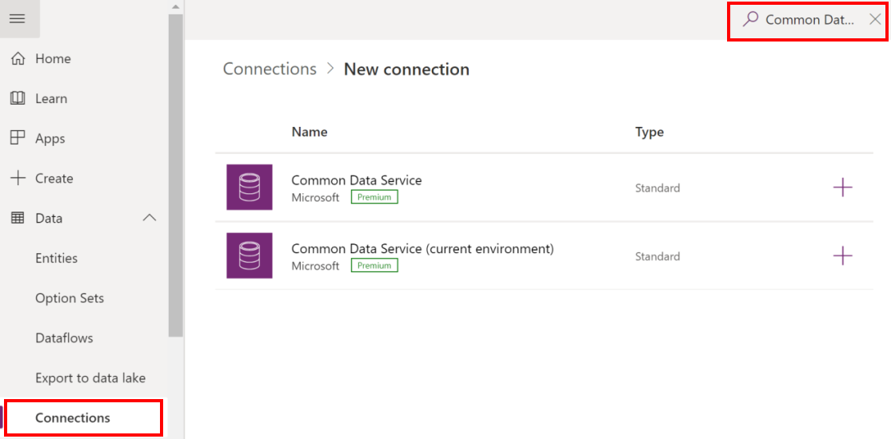

1. On the next screen, select **Create**. Select or specify the credentials to create the connector. On successful authentication, your connection will be created.

1. Select **New Connection**, and then type **Common Data Service** in the search box.

1. From the search results, select **+** next to **Dataverse (current environment)** connector to add a connection.

1. On the next screen, select **Create**. Select or specify the credentials to create the connector. On successful authentication, your connection will be created.

1. Select **New Connection**, and then type **SFTP** in the search box.

1. From the search results, select **+** next to **SFTP - SSH** connector to add a connection.

    > [!div class="mx-imgBorder"] 
    > 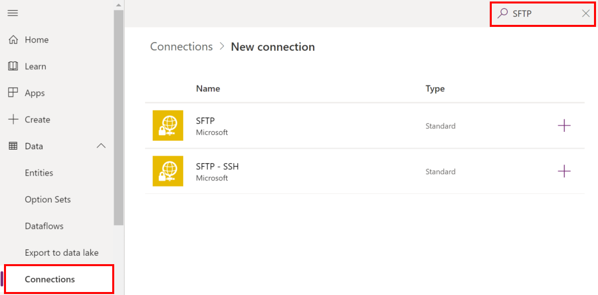

1. In the **SFTP - SSH** dialog box, provide the credentials to connect to the folder on the SFTP server. These details would have been already provided to you by your regional health organization as mentioned earlier in the **Prerequisites** section.

1. Select **Create**. Power Apps validates the connection details, and on successful authentication, creates an SFTP connection.

At the end of this step, you should have three connections: two for Dataverse and one for SFTP.

### Step 2: Enable flows for publishing data to SFTP (Hospital)

This step has to be performed by the admins of the Hospital Emergency Response solution after they have installed the solution.

In this step, we will enable the following flows that will publish reviewed data from the hospital solution to SFTP server on a set schedule and on-demand:
- Publish Bed Census Data
- Publish COVID Data
- Publish Data for All Facilities
- Publish Equipment Needs Data
- Publish Staff Updates
- Publish Supply Item Details
- Update Sync Census
- Update Sync Equipment Needs

To enable these flows:

1.  Sign into [Power Automate](https://flow.microsoft.com/).

1.  From the left pane, select **Solutions.** From the solution list, select **Hospital Emergency Response Solution** to open the solution.

1.  In the solution, filter on **Flow** to find all the flows.

    > [!div class="mx-imgBorder"] 
    > 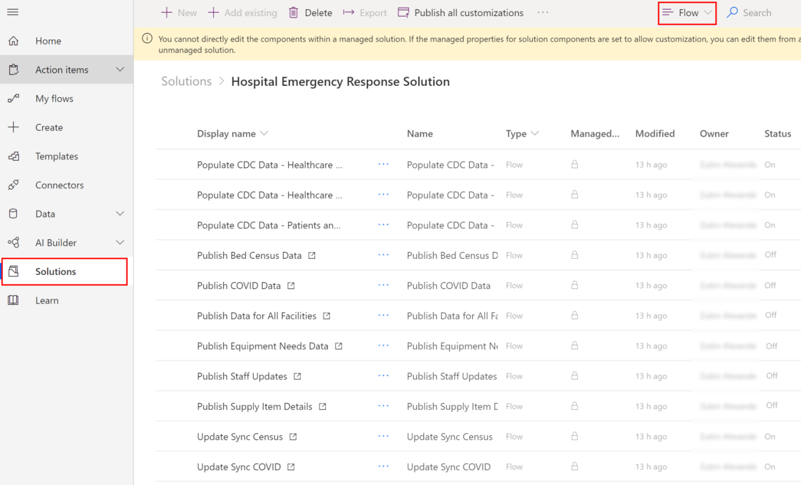

1.  Select a flow name to open the flow definition. For example, select **Publish Bed Census Data**. 

1.  Select **Edit** on the toolbar and verify the embedded connections for this flow. These should be the same connections that you created earlier.

1.  Select **Save** to save the changes, and then select **Turn On**.

1.  Repeat steps 4-6 for other flows listed earlier.

If you face any issues working with flows, try [Troubleshooting a flow](/power-automate/fix-flow-failures).

### Step 3: Specify the data publish schedule (Hospital)

The **Publish Data for All Facilities** flow contains the information about the data publish schedule. You can define the recurrence schedule when the flow will run automatically and publish the data that you have reviewed and marked as ready for publish.  

1.  Sign into [Power Automate](https://flow.microsoft.com/).

1.  From the left pane, select **Solutions.** From the solution list, select **Hospital Emergency Response Solution** to open the solution.

1.  In the solution, search for "Publish Data for". The **Publish Data for All Facilities** flow appears in the search result.

    > [!div class="mx-imgBorder"] 
    > 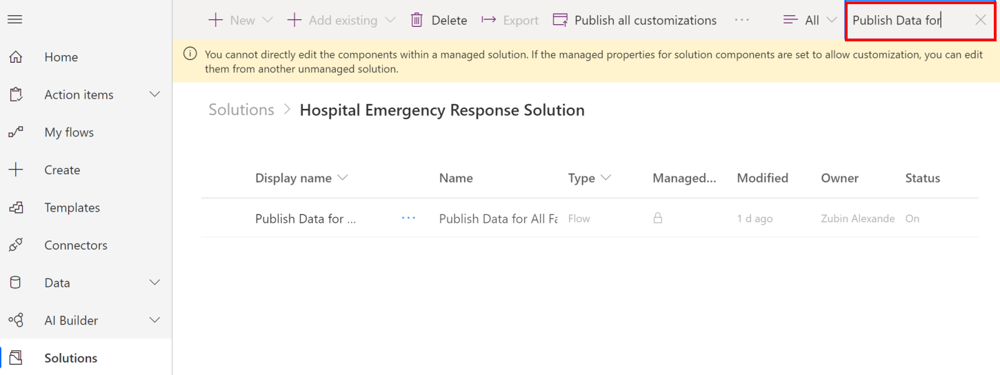

1.  Select the flow name to open the flow definition, and then select **Edit** in the toolbar.

1.  In the flow definition, select **Recurrence** and then select **Edit**.

    > [!div class="mx-imgBorder"] 
    > 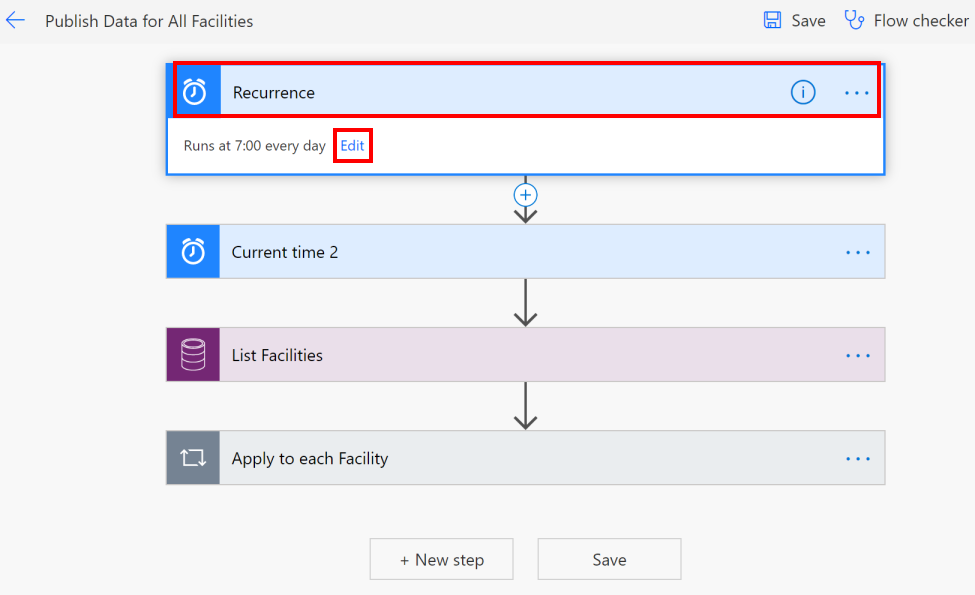

1. Specify the data publish recurrence schedule. 

    > [!div class="mx-imgBorder"] 
    > 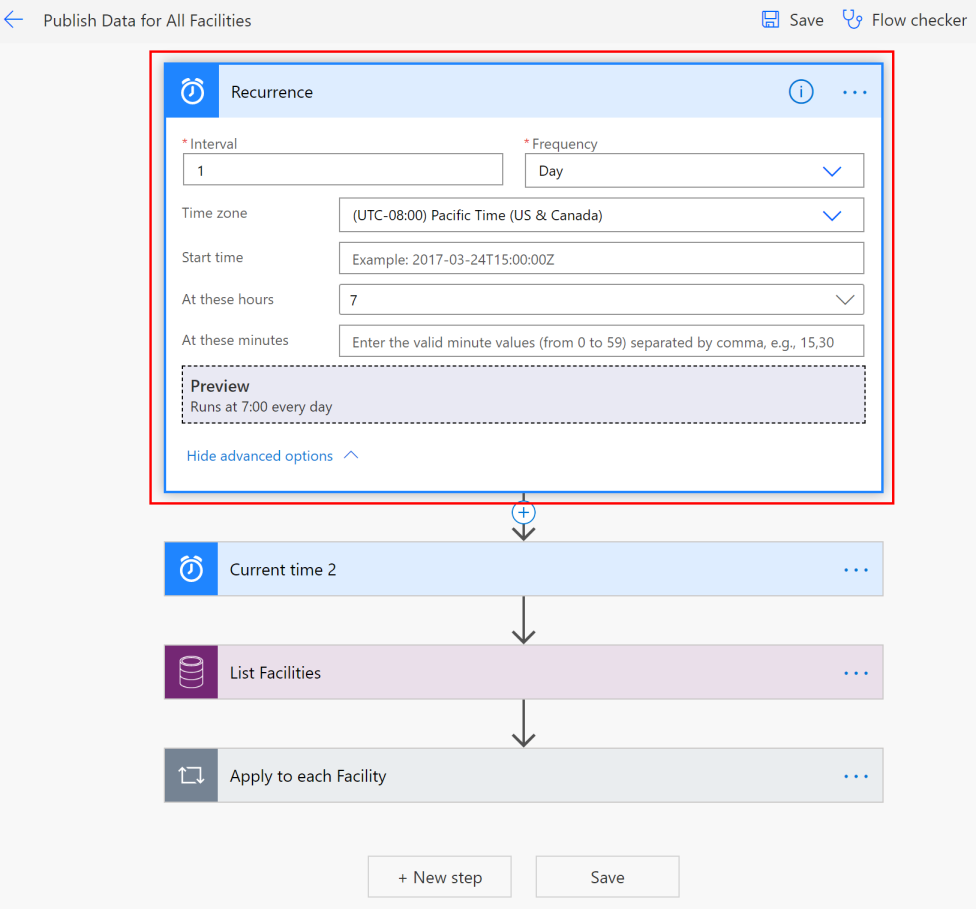

1.  Select **Save** to save your changes.

### Step 4: Enable flow for pulling hospital data from SFTP (Regional)

This step has to be performed by the admins of the Regional Government Emergency Response and Monitoring solution.

In this step, we will enable the **Create Record when a File is Created in SFTP Location** flow that will automatically create a record for hospital in the regional solution based on the data uploaded from the hospital system in the SFTP server.

> [!IMPORTANT]
> For each hospital registering with regional organization to send data, the regional admins will need to do one of the following to ensure data for each hospital is copied from the SFTP server to the regional solution:
>
> - Copy data from all the hospitals to a single folder on the SFTP server to enable the **Create Record when a File is Created in SFTP Location** flow to copy all the data.
>
> - Create a copy of the **Create Record when a File is Created in SFTP Location** flow for each Hospital registering with them to send data, and in each flow instance change the SFTP server folder path as per the hospital. We'll show you how to do this later in this section.

1.  Sign into [Power Automate](https://flow.microsoft.com/).

1.  From the left pane, select **Solutions.** From the solution list, select **Regional Emergency Response Solution** to open the solution.

1.  In the solution, filter on **Flow** to find all the flows.

    > [!div class="mx-imgBorder"] 
    > 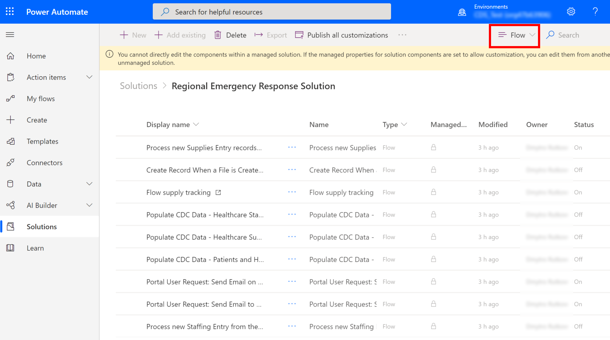

1.  Select the **Create Record when a File is Created in SFTP Location** flow to open the flow definition. 

1.  Verify the embedded connections for this flow. These should be the same connections that you created earlier. 

1.  Select **Save** to save the changes, and then select **Turn On**.

1.  If regional admins are expecting data from multiple hospitals that are stored in different folders on SFTP server, they can create copies of the **Create Record when a File is Created in SFTP Location** flow to create one for each hospital, and update the SFTP folder name accordingly in the copied flow instance. To do this:

    1. Select **Save As** on the toolbar to create a copy of the flow.
    
    1. Rename the flow accordingly and save it. This flow will become available under **My flows**.
    
    1. Select the flow to open it for editing. Select **Edit** on the toolbar.
    
    1. Select **When a file is added or modified**, and select appropriate value in the **Folder** field:
        > [!div class="mx-imgBorder"] 
        > 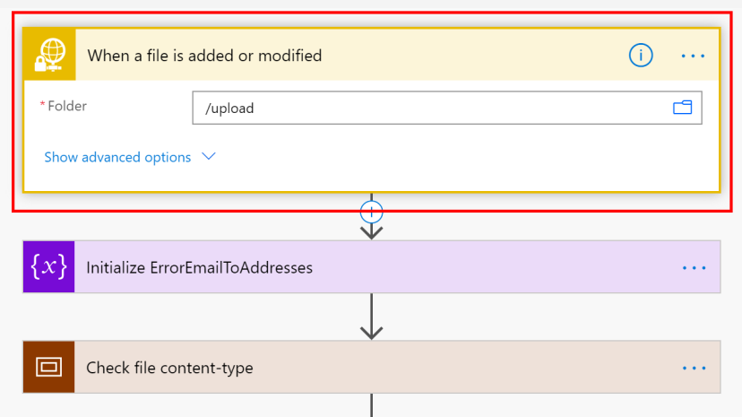

1.  Select **Save** to save the changes, and then select **Turn On**.

## Review and publish data to SFTP

After your IT admin has configured the solution for data transfer from the hospital solution, you can use the **Review and Publish Data** model-driven app to review the data and mark it as completed for publishing to the folder on the SFTP server.

1. Sign in to [Power Apps](https://make.powerapps.com).

1. From the top-right corner, select your hospital environment.

1. Select **Apps** in the left navigation pane, and then select the **Review and Publish Data** app.

1. In the app, all the facilities are listed. Select a facility for which you want to review the data and publish. This will open the facility record.

    > [!div class="mx-imgBorder"] 
    > 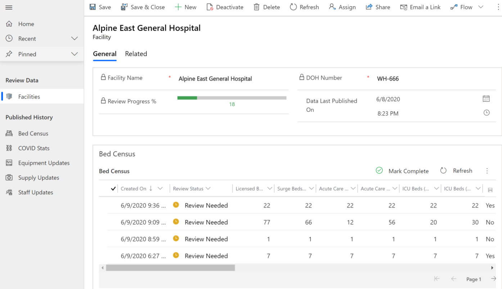

1. Scroll down the page to review the following data for your facility: Bed Census, COVID Stats, Equipment Needs, Supply Tracking, and Staff Updates. If necessary, update the data in grids, and then select the save icon to save your changes.

    > [!div class="mx-imgBorder"] 
    > 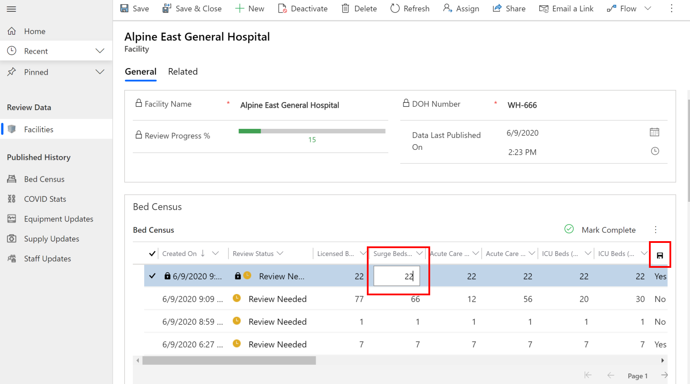

1. Once reviewed, you can select a row of data, and select **Mark Complete**. Select **OK** in the confirmation dialog box to complete the action.

    The record's review status changes to **Completed**.

    > [!div class="mx-imgBorder"] 
    > 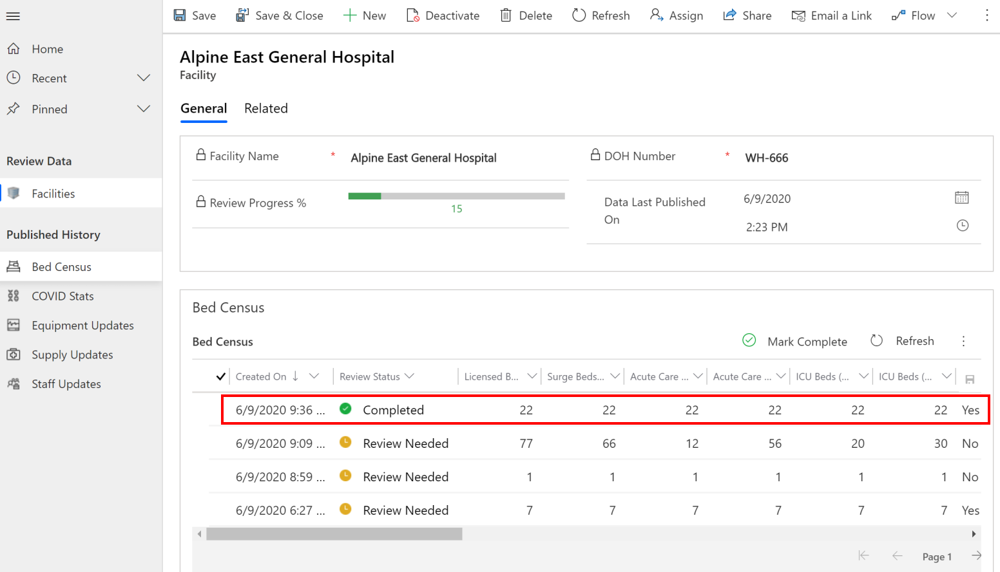

The scheduled flows will pick up the completed items for publishing to the SFTP folder that you configured earlier ([Step 3: Specify the data publish schedule (Hospital)](#step-3-specify-the-data-publish-schedule-hospital)).

### Manually publish data

The scheduled flow publishes data at a certain time, but what if you want to manually or immediately publish the data after reviewing it. 

1.  In the **Review and Publish Data** app, select the record that you want to publish from the **Published History** in the left pane. All the published data for the selected entity are displayed. If you want to view the active records for the entity, use the view selector.

    > [!div class="mx-imgBorder"] 
    > 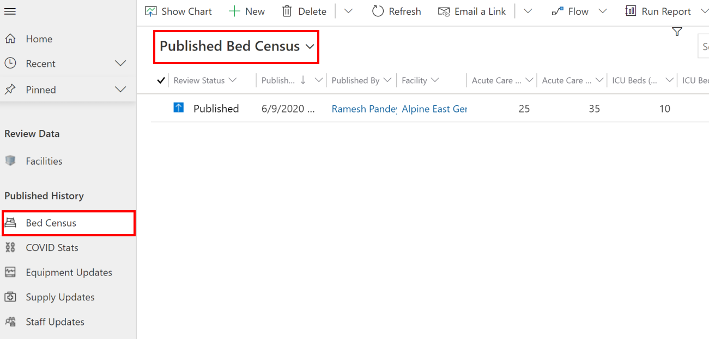

1. In this case, we will publish the data that we reviewed in the previous section. So, select the **Active Bed Census** view, select the row that was marked as completed, and then select **Flow** > **Publish Bed Census Data**.

    > [!div class="mx-imgBorder"] 
    > 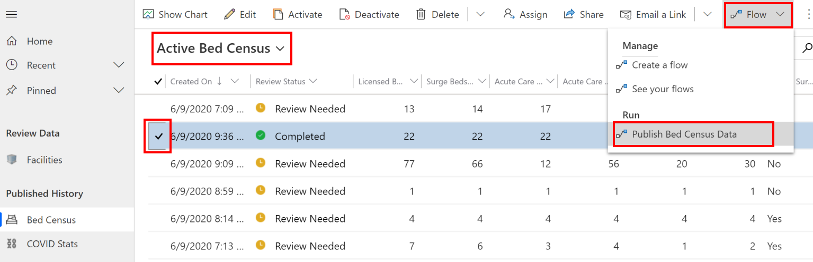

1. On the next screen, review that the connections are valid, and select **Continue**.

    > [!div class="mx-imgBorder"]
    > 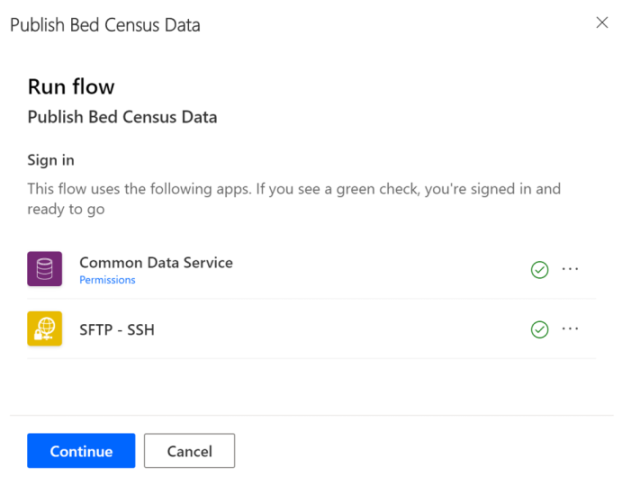

1. On the next screen select **Run flow**. A message appears stating that the flow run started successfully and how you can monitor the progress.

## Issues and feedback

- To report an issue with the Hospital Emergency Response sample app, visit <https://aka.ms/emergency-response-issues>.

- For feedback about the Hospital Emergency Response sample app, visit <https://aka.ms/emergency-response-feedback>.

[!INCLUDE[footer-include](../includes/footer-banner.md)]