# Configure data and view dashboards

This article provides information on how you can use:
- **Admin** app to add and manage master data for your solution and configure the Power BI report URL 
- **Power BI dashboard** to view key insights and metrics
- **Canvas App Label Management** app to extend mobile app labels
- **Download Data for CDC** app to download the CDC data

These tasks are typically performed by business admins in your organization.

## Configure and manage master data for your organization

Use the admin app to create and manage master data for your organization. This data is required for the Hospital Emergency Response app to work.

> [!IMPORTANT]
> Ensure that your IT Admin has deployed the solution in your organization and has granted appropriate permissions for business admins to use the admin app. More information: [Deploy the Hospital Emergency Response app](deploy-configure.md)

You must add master data in these entities in the following sequence:

1. [Systems](#systems-data)

1. [Regions](#regions-data)

1. [Facilities](#facilities-data)

1. [Locations](#locations-data)

1. [Departments](#departments-data)

The master data is managed from the **Locations** area in the left navigation in the admin app:

> [!div class="mx-imgBorder"]
> 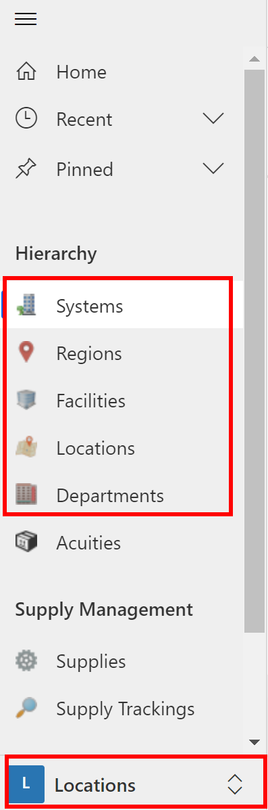

The entities under the **Hierarchy** area are listed in the order you should populate data.

> [!NOTE]
> Acuities data is automatically imported during the fresh installation of the app. More information: [Install the app](deploy-configure.md#step-3-install-the-app)

### Systems data

The **Systems** entity lets you create and manage entries for Hospital Systems. This allows you to manage multiple hospital systems within the same organization.

To create a record:

1. Sign into the admin app (model-driven app) using the URL provided by your IT admin.

1. Select **Systems** in the left pane, and select **New**:  
    > [!div class="mx-imgBorder"]
    > 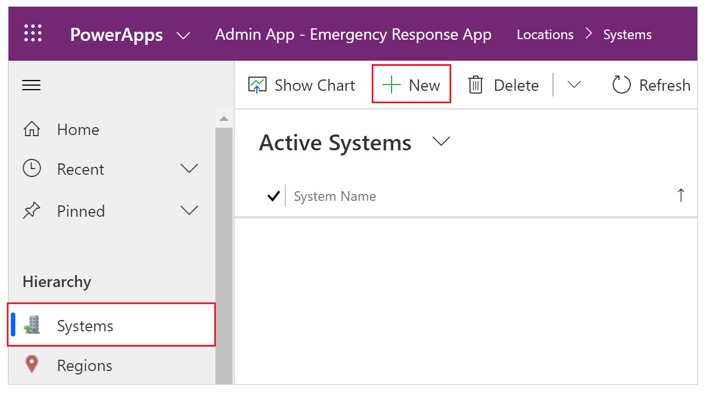

1. In the **New System** page, specify appropriate values:  
   > [!div class="mx-imgBorder"]
   > 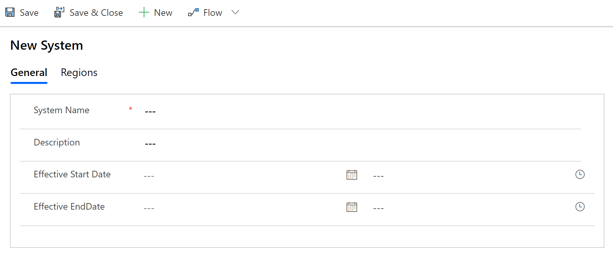

   | **Field**            | **Description**                                    |
   |----------------------|----------------------------------------------------|
   | System Name          | Type a name for your Hospital.                     |
   | Description          | Type an optional description.                      |
   | Effective Start Data | Type start date and time for this hospital system. |
   | Effective End Date   | Type end date and time for this hospital system.   |

1. Select **Save & Close**. The newly created record will be available in the **Systems** list.

To edit the record, select the record, update the values as required, and select **Save & Close**.

### Regions data

The **Regions** entity lets you manage the geographical regions for your hospital systems.

To create a record:

1. Sign into the admin app (model-driven app) using the URL provided by your IT admin.

1. Select **Regions** in the left pane, and select **New**.

1. In the **New Region** page, specify appropriate values:  

    > [!div class="mx-imgBorder"]
    > 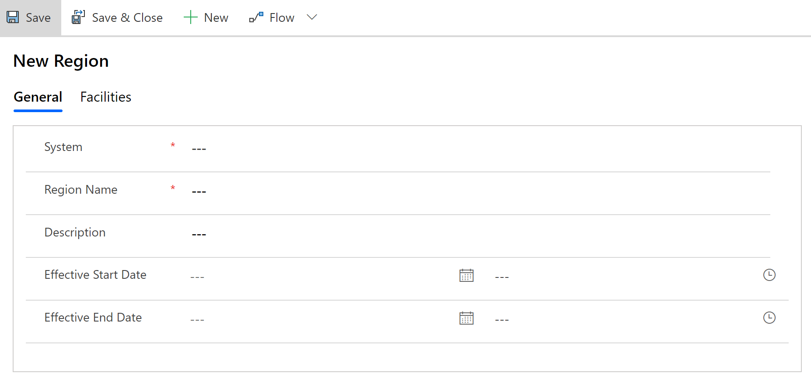

    | **Field**            | **Description**                                                                                          |
    |----------------------|----------------------------------------------------------------------------------------------------------|
    | System               | Select a hospital system. This list is populated based on the **Systems** data you have created earlier. |
    | Region Name          | Type the region name. For example, Seattle.                                                              |
    | Description          | Type an optional description.                                                                            |
    | Effective Start Data | Type start date and time for this region.                                                       |
    | Effective End Date   | Type end date and time for this region.                                                         |

1. Select **Save & Close**. The newly created record will be available in the **Regions** list.

To edit the record, select the record, update the values as required, and select **Save & Close**.

### Facilities data

The **Facilities** entity lets you manage the hospital locations within each region. For example, **Redmond** and **Bellevue** facilities within the
**Seattle** region.

To create a record:

1. Sign into the admin app (model-driven app) using the URL provided by your IT admin.

1. Select **Facilities** in the left pane, and select **New**.

1. In the **New Facility** page, specify appropriate values: 

    > [!div class="mx-imgBorder"] 
    > 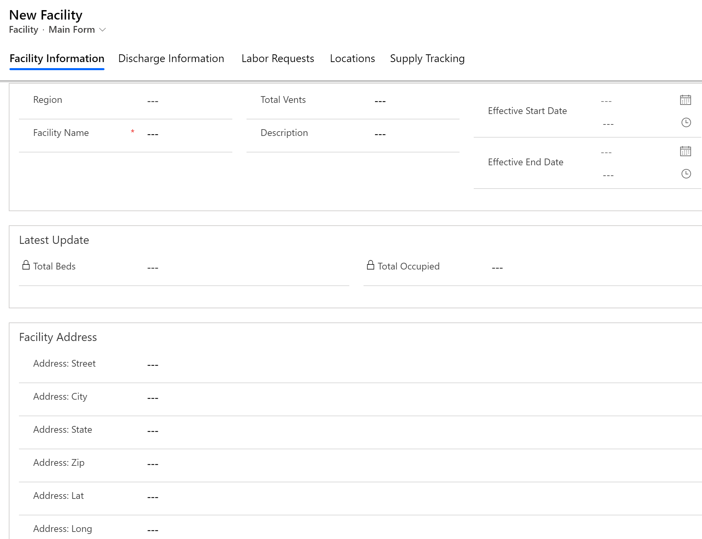

    | **Field**                    | **Description**            |
    |------------------------------|---------------------------------------------------|
    | Region    | Select a region this facility is associated with. This list is populated based on the **Regions** data you have created earlier.          |
    | Facility Name | Type the facility name.                 |
    | Description    | Type an optional description.              |
    | Effective Start Data         | Type start date and time for this facility.|    
    | DOH Number    | Type Department of Health (DOH) number for this facility.     |
    | Follows Droplet Protocol     | Indicates whether the facility follows Droplet Precautions for patients known or suspected to be infected with pathogens transmitted by respiratory droplets, such as in COVID-19 cases. Select **Yes** or **No**. |
    | Effective End Date           | Type end date and time for this facility.       |
    | Does have an Emergency            | Select **Yes**/**No** to confirm if the facility has emergency department.   |
    | Ventilators Total Capacity    | Type the total number of ventilators in the facility.    |
    | Excluded Supplies    | List of supplies not available at this facility.    |    
    | Total Inpatient Bed Capacity in other areas    | Type the total inpatient bed capacity in other areas.    |
    | Acute Care Beds (AIIR Room) Total Capacity     | Type the total number of Acute care beds in AIIR (Airborne Infection Isolation Room).     |
    | ICU Beds (AIIR Room) Total Capacity    | Type the total number of ICU beds in AIIR.    |
    | Total Pediatric Acute Care Beds (AIIR) Capacity    | Type the total pediatric acute care beds in AIIR.    |
    | Total Pediatric ICU Beds (AIIR) Capacity    | Type the total pediatric ICU beds in AIIR.    |
    | Total Outpatient Bed Capacity    | Type the total number of outpatient bed capacity in the facility.    |
    | Total Overflow/Surge/Expansion Bed Capacity           | Type the total number of overflow/surge/expansion beds the facility can have. These beds are those that can be staffed above and beyond licensed bed capacity if patients need to be admitted.                                              |
    | Acute Care Beds (non-AIIR Room) Capacity | Type the total number of Acute care beds in non- AIIR.|
    | ICU Beds (non-AIIR Room) Total Capacity        | Type the total number of ICU beds in non-AIIR.      |   
    | Total Pediatric Acute Care Beds (Non-AIIR) Capacity    | Type the total pediatric acute care beds in non-AIIR.    |
    | Total Pediatric ICU Beds (Non-AIIR Room) Capacity    | Type the total pediatric ICU beds in non-AIIR.    |
    | Total Mortuary Capacity    | Type the total mortuary capacity.|    
    | Facility Address    | Type the Street, City, County, State, Zip code, Latitude, and Longitude for the facility.   |

    

1. Select **Save & Close**. The newly created record will be available in the **Facilities** list.

To edit the record, select the record, update the values as required, and select **Save & Close**.

### Locations data

The **Locations** entity lets you manage specific locations within each hospital facility.

> [!NOTE]
> Before creating a **Locations** record, ensure that you have the acuity data. This is because acuity information is required to create a **Location** record.

To create a record:

1. Sign into the admin app (model-driven app) using the URL provided by your IT admin.

1. Select **Locations** in the left pane, and select **New**.

1. In the **New Location** page, specify appropriate values:  
 
    > [!div class="mx-imgBorder"]
    > 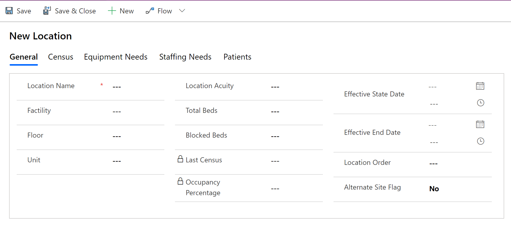

    | **Field**            | **Description**                                                                                      |
    |----------------------|------------------------------------------------------------------------------------------------------|
    | Location Name        | Type the name of the location.                                                                       |
    | Facility             | Select a facility. This list is populated based on the **Facilities** data you have created earlier. |
    | Floor                | Type the floor information for the facility.                                                         |
    | Unit                 | Type the unit information for the facility.                                                           |
    | Occupancy Percentage | Automatically calculated based on last census and total beds values.                                         |
    | Acuity      | Select acuity record associated with this location.                                                                                                     |
    | COVID Location      | Select whether this location is used to treat COVID patients (**Yes** or **No**).                                                                                                      |
    | Total Beds           | Type the total number of beds in the facility.                                                       |
    | Surge Beds           | Type the number of surge beds in the facility. Surge beds are those that can be staffed above and beyond licensed bed capacity if patients need to be admitted.                                                      |
    | Blocked beds         | Type the number of beds blocked in the facility.                                                     |
    | Last Census          | Populates based on the last census record being created.                                             |
    | Effective Start Data | Type start date and time for this location.                                                   |
    | Effective End Date   | Type end date and time for this location.                                                     |
    | Location Order       | Type a number that sorts the location in the location drop-down lists.                               |
    | Alternate Site Flag  | For internal use.                                                                                     |

1. Select **Save & Close**. The newly created record will be available in the **Locations** list.

To edit the record, select the record, update the values as required, and select **Save & Close**.

You can view the associated data for a location, such as **Census**, **COVID Tracking**, **Equipment Needs**, by opening an existing location record and selecting the respective tabs. The associated data is entered by frontline staff using the [mobile apps](use.md).

> [!div class="mx-imgBorder"]
> 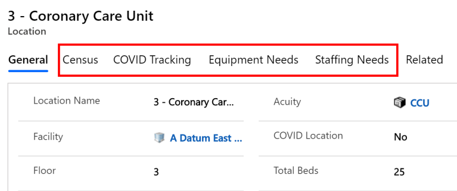

### Departments data

The **Departments** entity lets you manage departments information for a hospital.

To create a record:

1. Sign into the admin app (model-driven app) using the URL provided by your IT admin.

1. Select **Departments** in the left pane, and select **New**.

1. In the **New Department** page, specify appropriate values:

    > [!div class="mx-imgBorder"]
    > 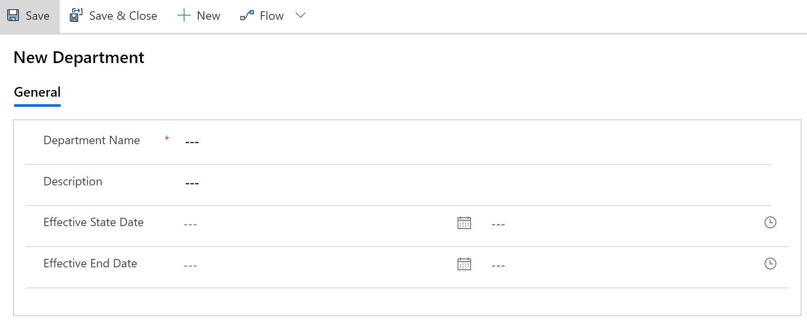

    | **Field**            | **Description**                                    |
    |----------------------|----------------------------------------------------|
    | Department Name      | Type a department name.                            |
    | Description          | Type an optional description.                      |
    | Effective Start Data | Type start date and time for this department. |
    | Effective End Date   | Type end date and time for this department.   |

1. Select **Save & Close**. The newly created record will be available in the **Departments** list.

To edit the record, select the record, update the values as required, and select **Save & Close**.

## Manage tracking level for mobile apps

Frontline workers can track information by *location* or *facility* using the mobile apps (canvas apps). Here is the default tracking level for each mobile app: 

|App  |Default tracking level  |
|--|--|
|COVID tracking|Location|
|Staff|Location|
|Equipment|Location|
|Bed capacity|Facility|
|Supplies|Facility|
|Staffing needs|Facility|
|Discharge tracking|Facility|

As an admin, you can change the default tracking level of mobile apps.

1. Sign into the admin app (model-driven app) using the URL provided by your IT admin.

1. In the left navigation, select the **Administration** area, and then select **Apps**. 

    > [!div class="mx-imgBorder"]
    > 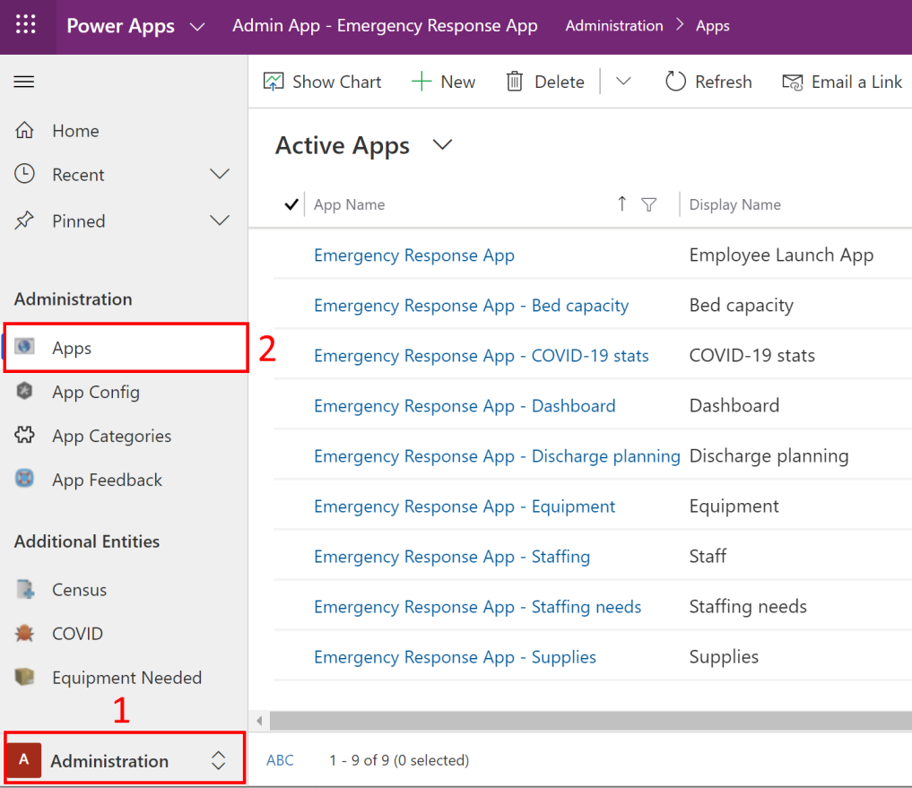

1. Select one of the canvas apps to open the record.

1. In the app record, select an appropriate value in the **Tracking Level** field.

    > [!div class="mx-imgBorder"]
    > 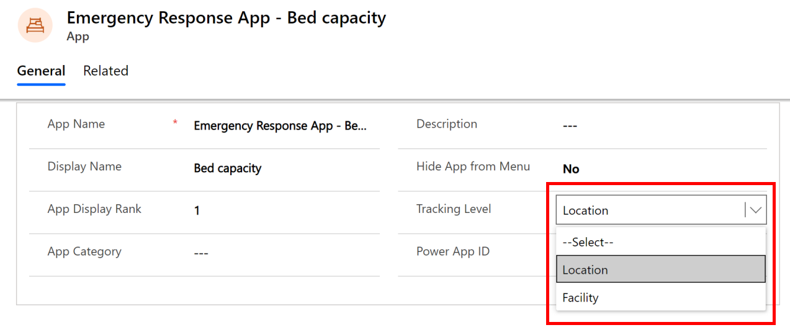

    - If **Location** is selected for an app, records created using the mobile app will contain location and facility information along with other data. Additionally, a **Location** drop-down will be available in the mobile app for users to select a location to track the data.

    - If **Facility** is selected for an app, records created using the mobile app will contain only the facility information along with other data.

    - If you don't select any value for the **Tracking Level** field, the *default* tracking level as explained earlier is applied to the mobile apps.

1. Select **Save** in the lower-right corner to save your changes.

## Configure the Power BI report URL for the Dashboard mobile app

You can set the Power BI report URL for the **Dashboard** mobile app so that frontline workers can view the dashboard in the browser of their mobile app. More information:

> [!NOTE]
> Ensure that you have the Power BI report URL from your IT admin. The Power BI report URL is available after publishing the Power BI dashboard. More information: [Step 10: Publish the Power BI dashboard](deploy-configure.md#step-10-publish-the-power-bi-dashboard)

1.  Sign into the admin app (model-driven app) using the URL provided by your IT admin.

1.  In the left navigation, select the **Administration** area, and then select **Apps**.

1.  Select **Emergency Response App - Dashboard** to open the record.

1.  In the app record, specify the report URL in the **Launch URL** field.

    > [!div class="mx-imgBorder"]
    > 

1.  Save the record.

## View Microsoft Dataverse dashboards

Following dashboards are available by default in the Hospital Emergency Response admin (model-driven) app:

- **Bed Management**

   Shows availability of beds, occupancy percentage and total number of beds across different facilities.

- **Equipment and Supply**

  Shows critical equipment in use and supplies available across different facilities.

- **Staff Management**

  Shows number of requested, assigned, and available staff members across different facilities.

- **COVID Patients**

  Shows number of patients under investigation and found positive with COVID-19 across different facilities.

- **Discharges**

  Shows number of patients anticipated for discharge and actual discharge.

You can also create your own dashboards in addition to the dashboards available by default.

### Manage dashboards

To manage dashboards:

1. Sign into the admin app (model-driven app) using the URL provided by your IT admin.

2. In the left navigation pane, select **Dashboards** from the area picker:

    > [!div class="mx-imgBorder"]
    > 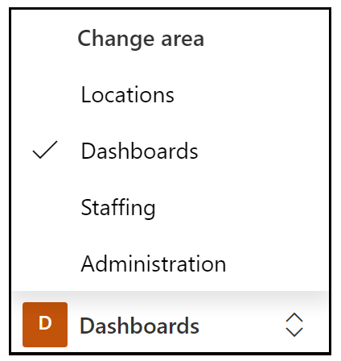

3. Select a dashboard name in the left navigation to view the charts:

    > [!div class="mx-imgBorder"]
    > 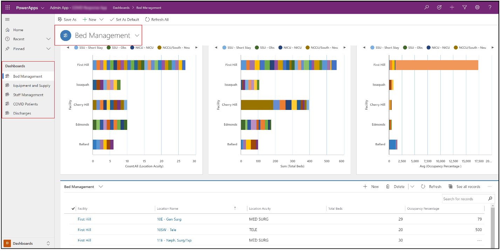

    > [!NOTE]
    > You can filter data at the bottom of the screen and the charts on top are automatically updated with filtered values.

4. Select the **Expand** option to view a chart in full-screen mode:

    > [!div class="mx-imgBorder"]
    > 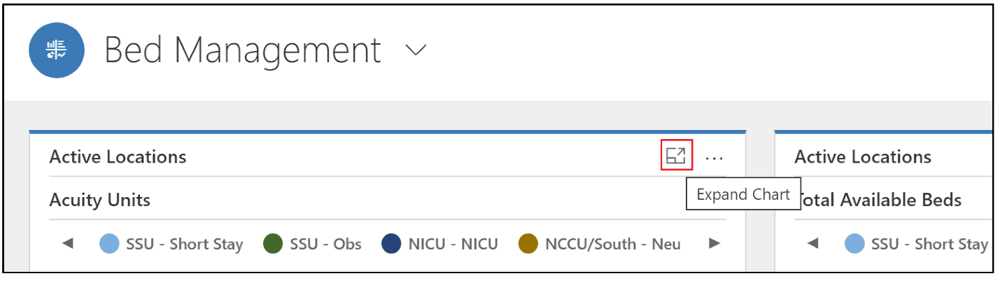

### Additional analysis

- **Drill down**: You can select chart area to drill down further with additional attributes (fields) for an entity:

    > [!div class="mx-imgBorder"]
    > 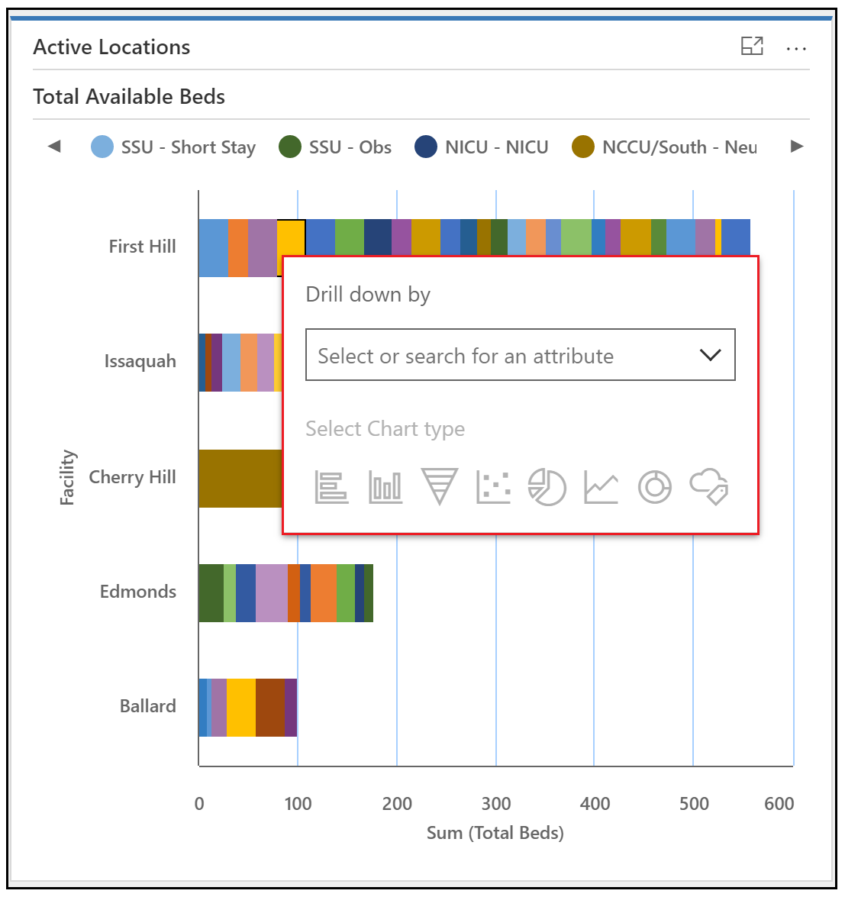

- **Refresh**: You can refresh the dashboards to reflect updated data. You can either refresh all charts on a specific dashboard with **Refresh All**, or a selected chart with **Refresh**:

    > [!div class="mx-imgBorder"]
    > 

- **View records**: Select **More Commands** (**…**) and then **View Records** to view all records associated to a given chart:

    > [!div class="mx-imgBorder"]
    > 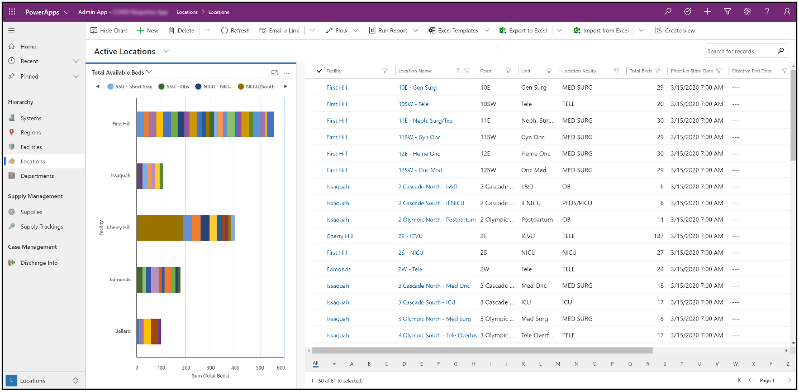

    > [!NOTE] 
    > When you select **View records**, you'll see the view of the entity split between chart and the records. Any change to filters for records on the right-side reflects with automatic updates to the chart on left-side of the screen.

For more information about editing an existing dashboard and updating properties
of charts, read [edit an existing dashboard](../../maker/model-driven-apps/create-edit-dashboards.md#edit-an-existing-dashboard).

### Create new dashboards

You can also create your own dashboards and customize to suite your needs. To create a new dashboard, select **New** and then select **Dynamics 365 Dashboard**:

> [!div class="mx-imgBorder"]
> 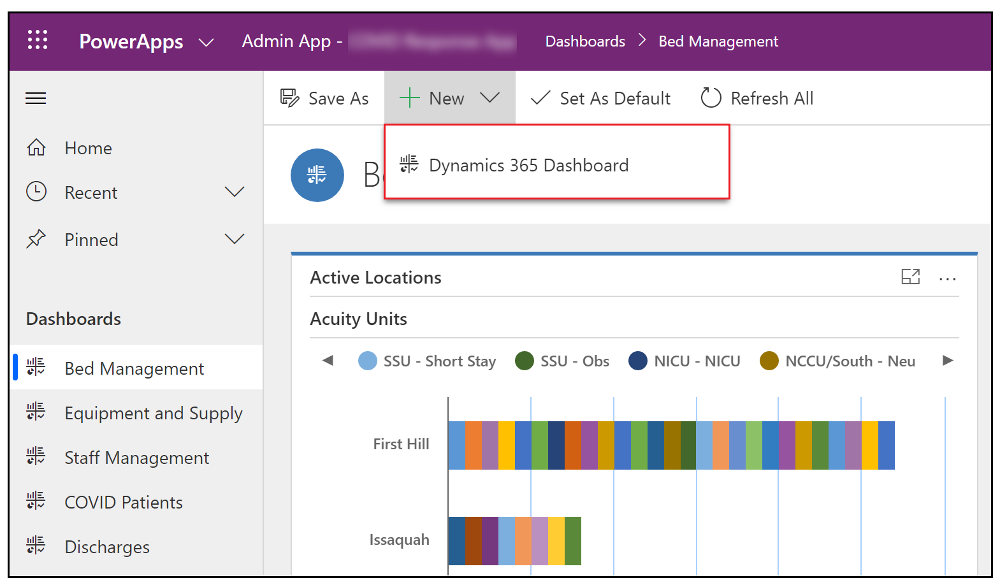

For more information about creating a new dashboard, read [create new dashboard](../../maker/model-driven-apps/create-edit-dashboards.md#create-a-new-dashboard).

## View Power BI dashboard

View the Power BI dashboards for insights and decision making.

### Prerequisites

- Power BI Premium Capacity or Power BI Pro licenses assigned to users accessing the report. 

- Your IT admin must have published the Power BI report and granted you permissions to access it. More information: [Publish the Power BI dashboard](deploy-configure.md#step-10-publish-the-power-bi-dashboard) 

### View the dashboard

Sign in to [Power BI](https://apps.powerbi.com) to access and view the Power BI dashboard.

> [!div class="mx-imgBorder"]
> 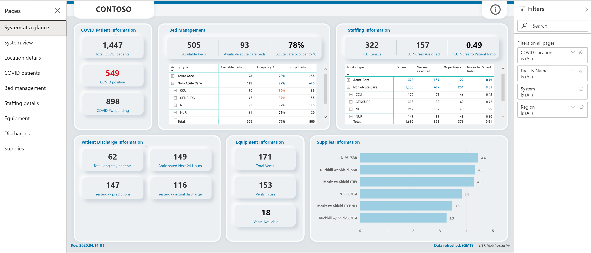

You can use the filters on the right side to filter data for COVID locations, facilities, regions and hospital systems.

> [!NOTE]
> The Power BI dashboard is also optimized to view in the Power BI mobile app. For information about using the Power BI mobile app to view dashboards, see [Explore dashboards and reports in the Power BI mobile apps](/power-bi/consumer/mobile/mobile-apps-quickstart-view-dashboard-report) in Power BI docs.

#### System at a glance page 

The **Systems at a glance page** is the default or the top-level page that provides an overall view.  

The page displays a summarized view of the following: 

- **COVID Patient Information**: Shows total number of COVID patients, number of patients found positive with COVID-19, and number of patients under investigation (PUI).

- **Bed Management**: Shows availability of beds, occupancy percentage, number of surge beds, and total number of beds. You can also use the grid below to view the numbers by acute units.

- **Staffing Information**: Shows number of patients in ICU, nurses assigned, and nurse to patient ratio.  

- **Patient Discharge Information**: Shows the number of total long stay patients, number of patients anticipated for discharge, and actual discharge.

- **Equipment Information**: Shows total number of vents, number of vents in use, and available vents. 

- **Supplies Information**: Shows number of supplies on hand by days.

> [!NOTE]
> - Selecting the title in any of the summarized area takes you to the respective details page for the area. 
> - You can also perform other actions on reports such as filter and sort data, export the report to PDF and PowerPoint, add a spotlight, and so on. For detailed information about report features in Power BI, see [Reports in Power BI](/power-bi/consumer/end-user-reports)
> - The most recent or last updated columns in some of these reports show the date and time when the data was last refreshed. It's also easy to identify the freshness by viewing the color of the date and time values in these columns:
>    - Black: Data is refreshed less than 20 hours ago
>    - Gray: Data is refreshed 20 - 24 hours ago
>    - Red: Data is refreshed more than 24 hours ago 
 
#### System view page

The **System View** page displays charts with the following information for a hospital system:
- Vents in use and vents available
- Availability of beds and acute care beds and occupancy percentage
- Total staff requested, number of patients (census), and nurse to patient ratio
- Supplies on hand over a period of time

> [!div class="mx-imgBorder"]
> 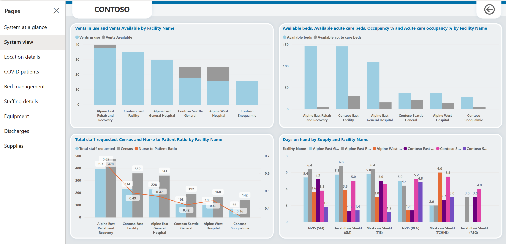

#### Location details page 

From the **System at a glance** page, select **i** on the top-right corner. The **Location details** page displays data by location such as total number of beds, available beds, surge beds, COVID patients, and so on. 

> [!div class="mx-imgBorder"]
> 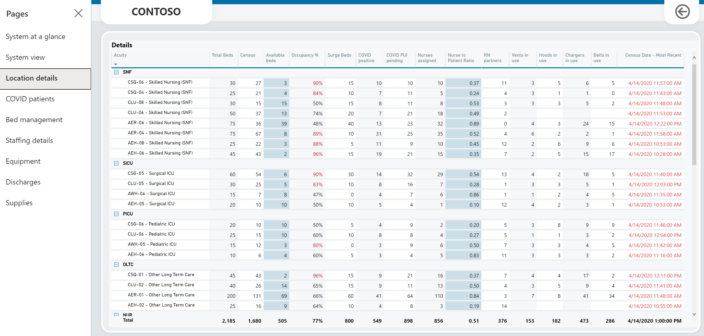 

#### COVID patients page 

The page provides drill-down information about the COVID patients such as patients at each location, patient trend over time that shows peaks and valleys of number of patients under investigation (PUI), and number of patients found positive, and get a sense of where the patients are located within the hospital.

> [!div class="mx-imgBorder"]
> 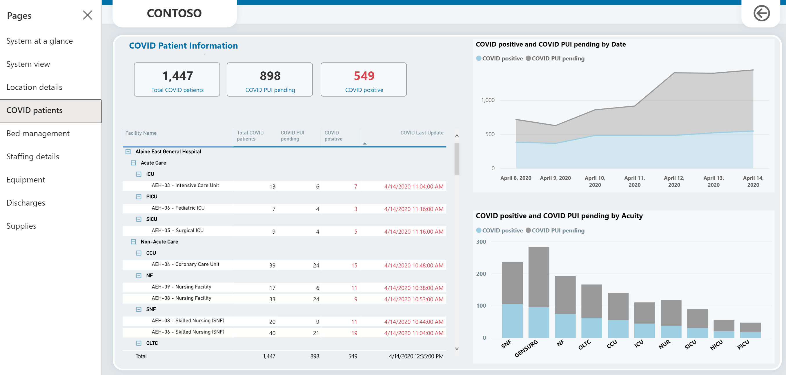

#### Bed management page 

The page provides drill-down information by location such as total available beds, acute care beds available, and occupancy percentage.

> [!div class="mx-imgBorder"]
> 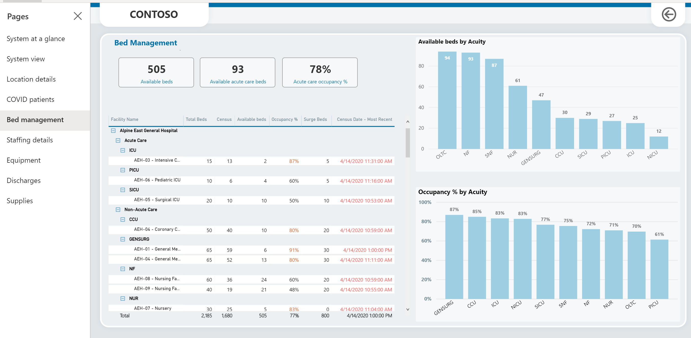

#### Staffing details page  

The page provides details about the staff by location, number of nurses assigned, total number of patients and number of COVID patients. It also displays nurse to patient ratio and ICU nurse to patient ratio over a period of time.

> [!div class="mx-imgBorder"]
> 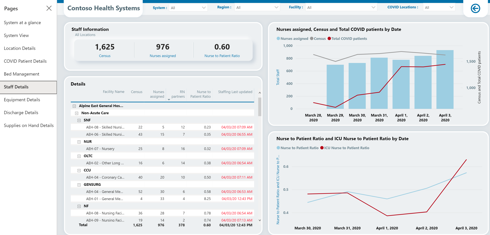

#### Equipment page 

The page provides details about the equipment by location, the total number of vents in use, overlaid by number of COVID patients, and other pieces of equipment, such as belts, chargers, and hoods in use.

> [!div class="mx-imgBorder"]
> 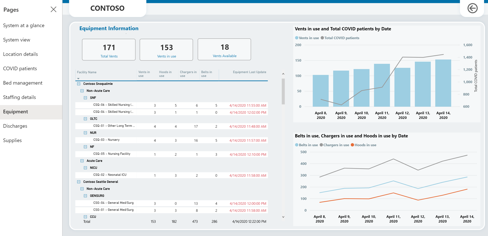

#### Discharges page 

The page provides details about the long-term patients, discharge barriers over a period, and variance in terms of actual and anticipated discharges.

> [!div class="mx-imgBorder"]
> 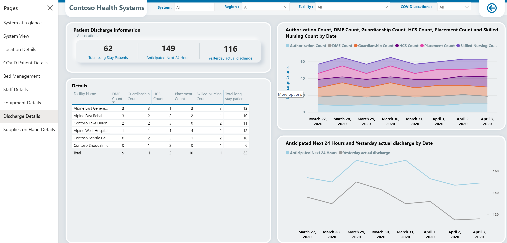

#### Supplies page 

The page provides details about the supplies by location. It also provides a chart about days on hand by supply and facility, and the supply available on hand over a period of time.

> [!div class="mx-imgBorder"]
> 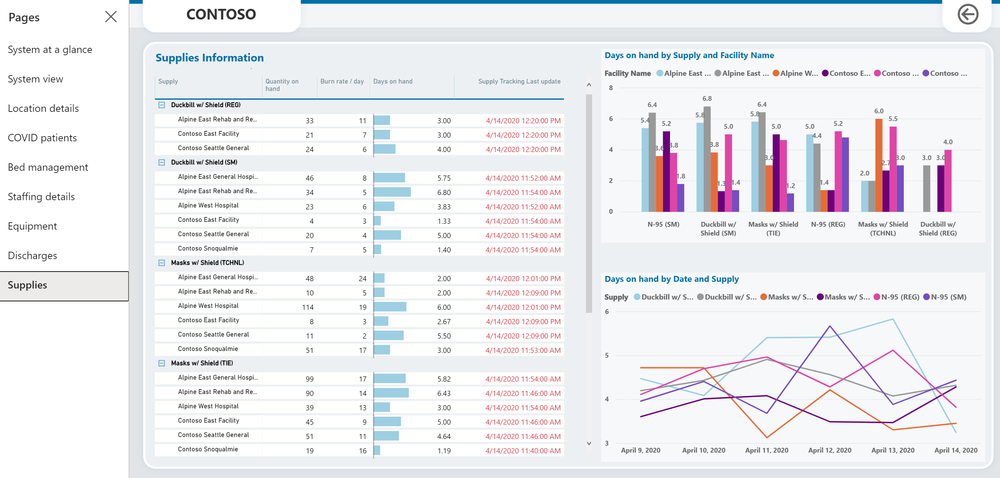

## View and manage app feedback

All the feedback provided by frontline staff using canvas apps on their mobile devices is stored in the **App Feedback** entity, and admins can view and manage this using the **Administration** area on the left navigation pane in the admin app.

To view and manage app feedback:

1. Sign into the admin app (model-driven app) using the URL provided by your IT admin.

2. In the left navigation pane, select **Administration** from the area picker.

3. Select **App Feedback** to view a list of app feedback submitted by users. You can click a record to view details and mark them as reviewed or not.  

    > [!div class="mx-imgBorder"]
    > 

## View the admin app in your language

[!include[cc-lang](includes/cc-lang.md)]

### Enable languages for your environment

Before you can view the admin app in one of the supported languages, the languages must be enabled by the system administrator in your environment. The system administrator can perform a *one-time* configuration step to enable the required languages from one of the languages supported by the admin app.

1. Sign into [Power Platform admin center](https://aka.ms/ppac).

2. In the left pane, select **Environments**, and then select [Your Environment] > **Settings** > **Product** > **Languages**.

    > [!div class="mx-imgBorder"]
    > 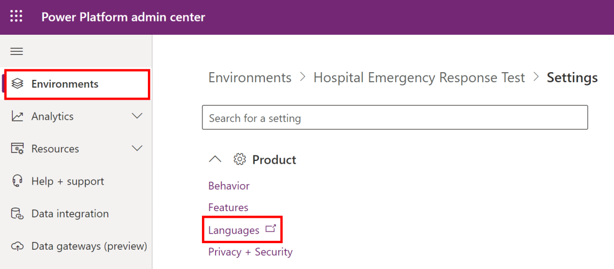

3. On the **Language Settings** page, select the languages you want to enable from one of the supported languages mentioned earlier, and select **Apply** in the lower-right corner. For example, we are enabling the **French** and **German** languages.

    > [!div class="mx-imgBorder"]
    > 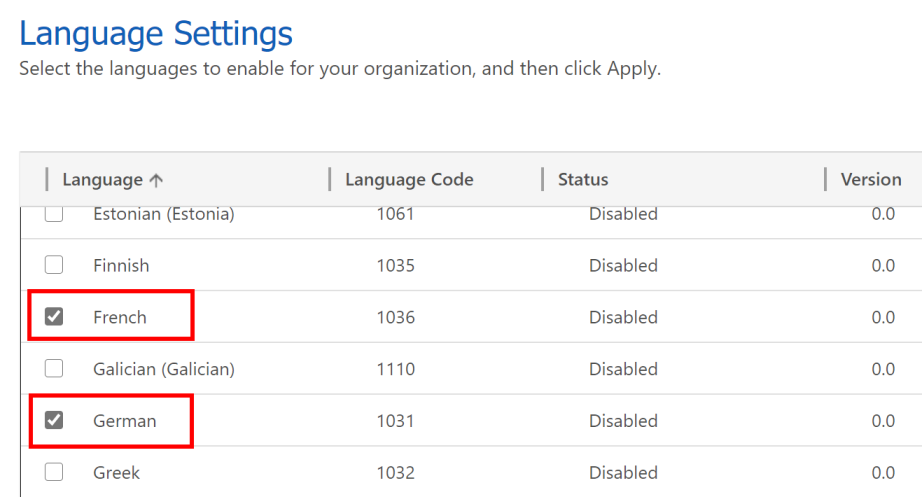

4. On the **Confirm Language Change** dialog box, select **OK**.

    > [!IMPORTANT]
    > Each selected language can take several minutes to enable.

### Set the language of your choice

After the required languages are enabled by your system administrator, each admin user can select the language she/he prefers to see the admin app displayed in.

1. Sign into the admin app (model-driven app) using the URL provided by your IT admin.

2. Select the **Settings** button in the upper-right corner of the screen, and then select **Personalization Settings**.

    > [!div class="mx-imgBorder"]
    > 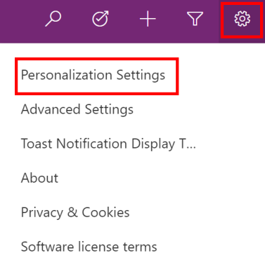

3. On the **Set Personal Options** page, select the **Languages** tab, and then select a language of choice from the **User Interface Language** list. The list shows all the languages enabled by your system administrator for your environment.

    > [!div class="mx-imgBorder"]
    > 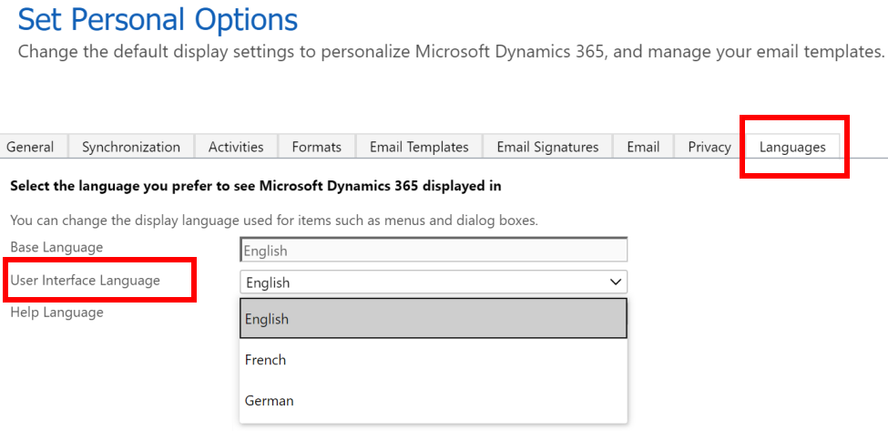

4. Select **OK** in the lower-right corner.

The admin app UI will switch to display in the language you selected.

## Extend mobile app labels

You can extend Hospital Emergency Response mobile app labels with custom text. To do this, you model-driven app named **Canvas App Label Management** to customize the mobile app labels. Add new languages supported by the solution and text for corresponding mobile app labels using the model-driven app. You can create and edit strings across different languages for use in the mobile app.

> [!div class="mx-imgBorder"]
> 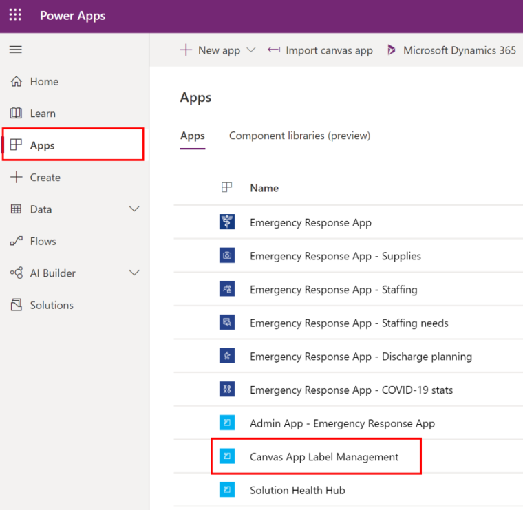

### Add new language record

Create a new language record for labels in mobile app. After you add the language record, you can add custom labels for Hospital Emergency Response mobile app.

1. Sign in to [Power Apps](https://make.powerapps.com).
1. Select **Apps** from the left pane.
1. Select the **Canvas App Label Management** app to open.
1. Select **Canvas App Languages** from the left pane.
1. Select **New**.
1. Enter values for Name, Language Tag and Display Name. For example, 'English' as the name and display name, with 'en' as the language tag.

    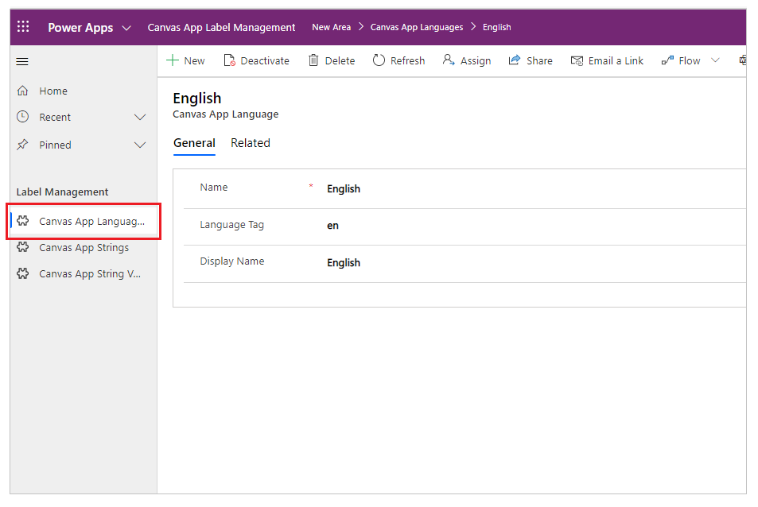

1. Select **Save**.

### Add new string record

1. Select **Canvas App Strings** from the left pane.
1. Select **New**.
1. Enter TextID and Description. For example, *SplashScreenFacilityDropdownLabel* and *Facility selection on splash screen*.

    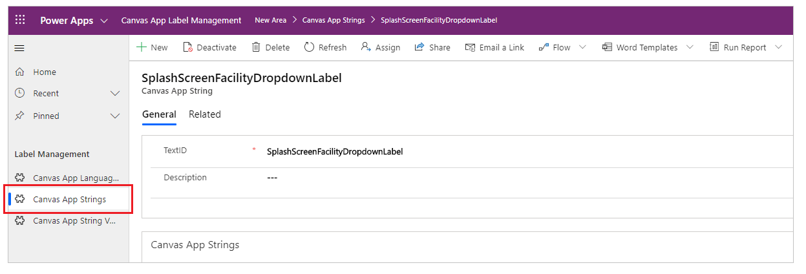

    > [!NOTE]
    > To find TextID in Hospital Emergency Response mobile app, go to [Find TextID of a label](#find-the-textid-value-of-the-label).

1. Select **Save**.

### Add your canvas app label

1. Select **Canvas App String Values** from the left pane.
1. Select **New**.
1. Select TextID, for example *SplashScreenFacilityDropdownLabel*.
1. Enter Default Text, for example *Facility*.
1. Select Language Tag, for example *English*.
1. Enter Override Text, for example *Center*.

    > [!NOTE]
    > **Override Text** is the new label value to be displayed in your Hospital Emergency Response mobile app.

    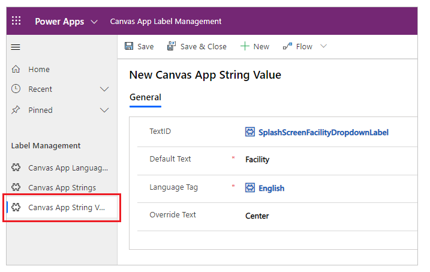

1. Select **Save**.

You can also follow the steps to add your canvas app label using the sub-grid on the **Canvas App Strings** record.

### View your changes

Play the app to view your changes using your mobile device.

To play the app in browser:

1. Sign in to [Power Apps](https://make.powerapps.com).
1. Select **Apps** from the left pane.
1. Select the canvas app to play.

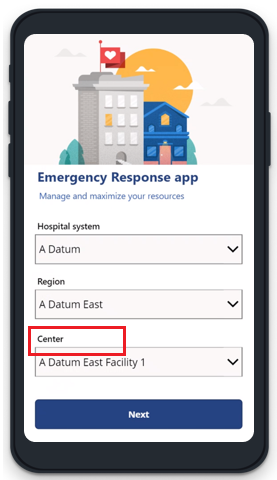

### Find the TextID value of the label

1. Sign in to [Power Apps](https://make.powerapps.com).
1. Select **Apps** from the left pane.
1. Select the canvas app.
1. Select **Edit** from top menu.
1. Select the label that you want to customize text for.
1. From the property list on top left, select the **Text** property.

    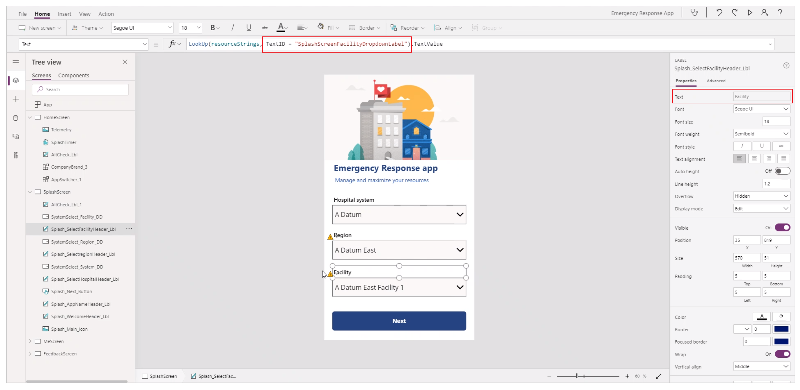

The **Text** property formula bar on top shows the **TextID**. And the **Text** property on the right side property pane shows the **Default Text** value.

### Uninstalling the Canvas App Strings solution

If you uninstall Canvas App Strings solution, the apps will continue to run, even though the entity that the app is looking for doesn't exist.

You can restore canvas apps to previous version that didn't use Canvas App Strings solution in two different ways:

1. Note the current live version of the app before you import the solution. You can restore the app to this version after you uninstall the solution. For more information: [Restore a canvas app to a previous version in Power Apps](../../maker/canvas-apps/restore-an-app.md).

1. Create a new solution and the existing apps. Export the solution as backup. If you uninstall the Canvas App Strings solution, you can import your backup solution with default apps. To learn how to add apps to solution and export, go to [Link an existing canvas app to a solution](../../maker/canvas-apps/add-app-solution.md#link-an-existing-canvas-app-to-a-solution).

### Considerations when extending mobile app labels

- Some TextIDs (labels) can be found in the **OnVisible** property of a screen as a part of a collection.
- HomeScreen, SplashScreen, FeedbackScreen, MeScreen, Buttons and the timestamp for last submitted data share the same TextIDs across apps. Other screens use separate values for TextIDs, even if the Default Text is same across apps; for example *Location*.
- Canvas App Strings solution supports the following languages: German, Spanish, French, Italian, Japanese,  Korean, Polish, Portuguese (Portugal), Portuguese (Brazil), and Turkish.

## Download CDC data

Centers for Disease Control and Prevention (CDC) expects each hospital to report data in a certain format. The **Download Data for CDC** app lets you download the data for your facilities in the CDC format. 

This data is collated from various areas of the hospital solution such as information specified for each facility in the admin app, data reported by healthcare workers [using the mobile app](use.md).

1. Sign in to [Power Apps](https://make.powerapps.com).

1. From the left navigation pane, select **Apps** and then select **Download Data for CDC**.

1. In the app, select one of the facilities to view the CDC data.
 
1. The following CDC data is available for each facility: **Patient Impact And Hospital Capacity**, **Healthcare Supplies**, and **Healthcare Worker Staffings**. Select a row, and then select **Download CSV** to download the data.

    > [!div class="mx-imgBorder"]
    > 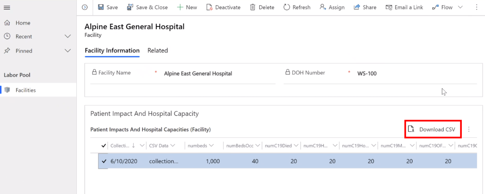

After downloading the data as CSV files from the **Download Data for CDC** app, you can review and upload them to the CDC web site.

## Issues and feedback

- To report an issue with the Hospital Emergency Response sample app, visit <https://aka.ms/emergency-response-issues>.

- For feedback about the Hospital Emergency Response sample app, visit <https://aka.ms/emergency-response-feedback>.

## Next step

[Use the Hospital Emergency Response mobile app](use.md)

[!INCLUDE[footer-include](../../includes/footer-banner.md)]