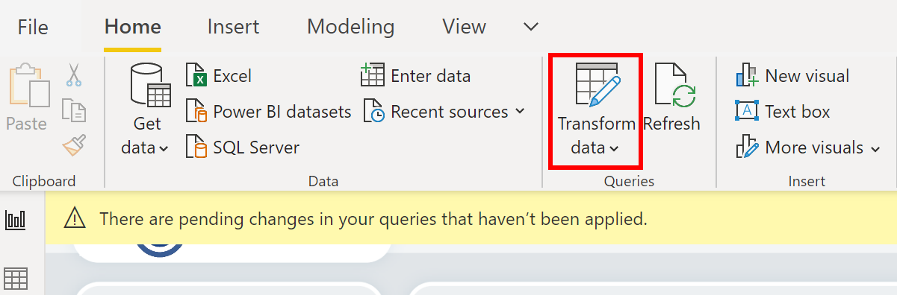
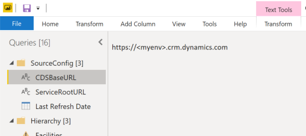
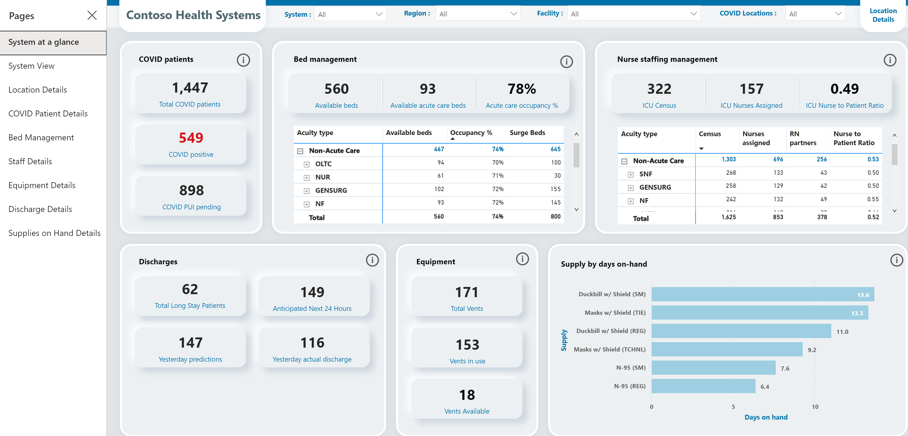

# Deploy and configure the Emergency Response app

The Emergency Response app requires a small amount of setup to adapt to your needs. This article provides step-by-step instructions for hospital IT admins to deploy and configure the application for their organization.

Estimated time to complete these steps: **35–40 minutes**.

## Deploy Emergency Response app

Perform the following steps to deploy the Emergency Response sample app for your organization.

- [Step 1: Sign up for Power Apps and create an environment](#step-1-sign-up-for-power-apps-and-create-an-environment)
- [Step 2: Download the deployment package](#step-2-download-the-deployment-package)
- [Step 3: Import the solution file into your environment](#step-3-import-the-solution-file-into-your-environment)
- [Step 4: Load configuration and master data for your organization](#step-4-load-configuration-and-master-data-for-your-organization)
- [Step 5: Update the mobile app branding](#step-5-update-the-mobile-app-branding)
- [Step 6: Bypass consent for mobile apps](#step-6-bypass-consent-for-mobile-apps)
- [Step 7: Add Azure Application Insights key to mobile apps for telemetry](#step-7-add-azure-application-insights-key-to-mobile-apps-for-telemetry)
- [Step 8: Share canvas apps with users in your organization](#step-8-share-canvas-apps-with-users-in-your-organization)
- [Step 9: Set your mobile app as hero and featured app](#step-9-set-your-mobile-app-as-hero-and-featured-app)
- [Step 10: Share model-driven app with admins in your organization](#step-10-share-model-driven-app-with-admins-in-your-organization)

### Step 1: Sign up for Power Apps and create an environment

If you don't already have Power Apps, sign up for Power Apps and purchase an appropriate license.

More information:

-   [Power Apps Pricing](https://powerapps.microsoft.com/pricing/)
-   [Purchase Power Apps](https://docs.microsoft.com/power-platform/admin/signup-for-powerapps-admin)

After you have purchased Power Apps, create an environment with a Common Data Service database.

1.  Sign in to [Power Platform admin center](https://aka.ms/ppac).

2.  Create a Common Data Service environment with the database. More information: [Create and manage environments](https://docs.microsoft.com/power-platform/admin/create-environment)

3.  Create appropriate users in your environment. More information: [Create users and assign security roles](https://docs.microsoft.com/power-platform/admin/create-users-assign-online-security-roles)

### Step 2: Download the deployment package

Get the latest deployment package (.zip) from <https://aka.ms/emergency-response-solution> that contains the solution file, images, and data files to set up the apps and business logic for the Emergency Response app.

To begin the deployment process, extract the deployment file (.zip) to a location on your computer. The extracted folder will contain the following folders:

| **Folder/File**       | **Description**  |
|-----------------------|------------------|
| **App Icons**         | Contains the default app icons for the mobile apps (canvas apps)|
| **Data Files**        | Contains the master and sample data files (.xlsx) for the solution/app to work. You can import data from these files to start working on the app. More information: see [Step 4: Load configuration and master data for your organization](#step-4-load-configuration-and-master-data-for-your-organization) |
| **Power BI Template** | Contains the Power BI Report template file (.pbit) that you will use to configure reporting for your organization. More Information: [Get insights using Power BI dashboards](#get-insights-using-power-bi-dashboards)|
| **PowerShell**        | Contains scripts that you will use to configure your mobile apps (canvas apps). |
| **Solution File**     | Contains the Common Data Service solution file that creates the apps and metadata required for the Emergency Response app.  |

### Step 3: Import the solution file into your environment

1.  Navigate to the location where you extracted the deployment file (.zip); you will find a **Solution File** folder. We will import the managed solution
    (.zip) file under the **Solution File** folder to our environment.

2.  Sign in to [Power Apps](https://make.powerapps.com).

3.  Select your environment from the top-right corner.

4.  In the left pane, select **Solutions** and then select **Import.**

    > [!div class="mx-imgBorder"] 
    > 

5.  In the **Import Solution** dialog box, select the solution file mentioned in step 1, and then follow the steps in the wizard to import the solution.

After the solution is imported successfully, you will see new apps under **Apps**:

> [!div class="mx-imgBorder"] 
> 

Select the **Admin App** to open the model-driven app that lets you configure the rest of the deployment settings. More information: [What are model-driven apps?](https://docs.microsoft.com/powerapps/maker/model-driven-apps/model-driven-app-overview)

> [!div class="mx-imgBorder"] 
> 

The admin app has a number of entities where you can add and manage data for your hospital system. You can use the area picker in the lower part of the left navigation pane to select a different area.

### Step 4: Load configuration and master data for your organization

All the data required for the Emergency Response app is available under the **Data Files** folder under your extracted deployment folder.

The **Data Files** folder has the following files and folders:

<table style="width:100%">
<tr>
<th>Name</th>
<th>Description</th>
</tr>
<tr>
<td>At the root; following files are available:
<ul>
<li>00 - Acuities Import.xlsx</li>
<li>00 - App Config Import.xlsx</li>
<li>00 - App Import.xlsx</li>
<li>00 - Request Roles Import.xlsx</li>
<li>00 - Supplies Import.xlsx</li>
</ul>
</td>
<td>These are the configuration data files that must be imported to the following entities using the admin app:
<ul>
<li>Acuities</li>
<li>App Config</li>
<li>Apps</li>
<li>Request Roles</li>
<li>Supplies Import</li>
</ul>
<br/>Importing data to these entities will create records for these entities that are required for the Emergency Response app to work.
<br/>
<strong>Caution</strong>: Ensure that you don't update the configuration values in these entities, except for the <strong>Apps</strong> and <strong>App Config</strong> entities as explained later.</td>
</tr>
<tr>
<td><strong>Sample Data</strong> folder</td>
<td><p>The folder contains the sample data files (.xlsx) that you can import to populate the sample data in your application. The files are named to denote the sequence in which the data should be imported into your app. </p>
<p>You must import data for the following entities that contain the master sample data for the Emergency Response app:
<ul>
<li>Systems</li>
<li>Regions</li>
<li>Facilities</li>
<li>Locations</li>
<li>Departments</li>
</ul>
<p>If you want to import your organization data instead of the sample data, you can replace the sample data in these Excel files with your organization data, and then import the data in the app.</p>
<p>You can also manually enter data for these entities. For information about each of these entities and fields in these entities, see <a href="#manually-configure-and-manage-master-data-for-your-organization">Manually configure and manage master data for your organization</a></p></td>
</tr>
<tr>
<td><strong>Data Template File for Master Data</strong> folder</td>
<td><p>The folder contains "empty" data files (.xlsx) for master entities that you can use to populate your organization data, and then import it to the app.</p>
<p>The files are named to denote the sequence in which the data should be imported into your app. It's the same list of entities that is mentioned earlier for the <strong>Sample Data</strong> folder.</p>
<p>You can also manually enter data for these entities. For information about each of these entities and fields in these entities, see <a href="#manually-configure-and-manage-master-data-for-your-organization">Manually configure and manage master data for your organization</a></p>
</td>
</tr>
</table>

#### Step 4.1: How to load data from data files?

To load sample data from one of the data files to an entity:

1.  In the left navigation pane of the admin app, select an entity for which you want to load the data. For example, select **Location** from the area picker and then select **Systems**.

2.  Select **Import from Excel** and select the **01 - Load Systems.xlsx** file from the **Sample Data** folder.

    > [!div class="mx-imgBorder"] 
    > 

3.  Proceed with the import wizard steps to import the data.

4.  After the sample data is imported, you will see the imported record in the entity:

    > [!div class="mx-imgBorder"] 
    > 

Repeat the above steps with other entities.

Alternatively, if you want to enter the master data manually, see [Manually configure and manage master data for your organization](#manually-configure-and-manage-master-data-for-your-organization).

#### Step 4.2: Import mandatory configuration data

Importing the configuration data under the following entities in the admin app is **mandatory** before you move to the next step:

| Area name | Entity name| File name
|-|-|-
| Locations | Acuities | 00 - Acuities Import.xlsx
| Administration | Apps Config | 00 - App Config Import.xlsx
| Administration | Apps | 00 - App Import.xlsx
| Staffing | Request Roles | 00 - Request Roles Import.xlsx
| Locations | Supplies | 00 - Supplies Import.xlsx

Data for other entities can be [manually](#manually-configure-and-manage-master-data-for-your-organization) added later or by using the sample data files explained earlier.

### Step 5: Update the mobile app branding

You can change the icon or color scheme of the mobile apps to match the branding of your organization.

You do this using the **App** and **App Config** entities in the **Administration** area by importing app and app config data from the Excel file available in the **Data Files** folder under the deployment package as explained in the previous step.

> [!div class="mx-imgBorder"] 
> 

1.  Make sure you have imported the configuration data for **Apps** and **App Config** entities from the **App Import.xlsx** and **App Config Import.xlsx** files respectively in the extracted deployment package.

1.  Now, we will copy the app IDs of your canvas apps so that we can populate it in the App records we imported. Sign in to [Power Apps](https://make.powerapps.com).

1.  Select your environment from the top-right corner.

1.  In the left pane, select **Apps**, and then select the ellipsis (…) for a canvas app followed by **Details**.

    > [!div class="mx-imgBorder"] 
    > 

1.  The app ID appears at the bottom of the **Details** pane for the app. Copy the App ID along with its name in the notepad file.

    > [!div class="mx-imgBorder"] 
    > 

1.  Repeat steps 3 and 4 for each canvas app.

1.  Open the Admin App, and in the left navigation pane of the admin app, select **Administration** from the area picker, and then select **Apps**. This will show all the canvas app records you imported from the **App Import.xlsx** file.

    > [!div class="mx-imgBorder"] 
    > 

1.  Open one of the app records by selecting it. Note that the Power App ID field is blank.

    > [!div class="mx-imgBorder"] 
    > 

1.  Copy the app ID from the notepad, where you copied earlier in steps 2-6, to the **Power App ID** field. You can also update the app icon by    double-clicking the app icon and specifying another image. Save the record.

1.  Repeat step 9 for each canvas app record under **Apps** to add the **Power App ID** value.

1.  In the left pane, select **App Config.**

1.  Select the **Emergency Response App** record to open it for editing.

    1.  Double-click the icon to specify a new image as the app icon.

    2.  Update the app names and colors for your app.

    3.  Select **Yes** or **No** in the **Device Sharing Enabled** field to specify whether a **Sign Out** option will be available in the mobile apps or not. Selecting **Yes** will make the **Sign Out** option available.

    > [!div class="mx-imgBorder"] 
    > 

1.  Select **Save** in the lower-right corner to save your changes.

### Step 6: Bypass consent for mobile apps

Before you perform this step, you will need app ID of each mobile app (canvas app).

To get the app ID for your app, in the left navigation pane of the admin app, select **Administration** from the area picker and then select **Apps**. This displays all the mobile apps (canvas apps). Select a mobile app to view its app ID. Copy the app Id for each app to a notepad file.

> [!div class="mx-imgBorder"] 
> 

Next do the following:

1.  Open Notepad, and copy this PowerShell script:

    ```powershell
    # MUST BE A TENANT ADMIN TO RUN THIS
    Install-Module -Name Microsoft.PowerApps.Administration.PowerShell
    Install-Module -Name Microsoft.PowerApps.PowerShell -AllowClobber
    Import-Module -Name Microsoft.PowerApps.Administration.PowerShell
    Import-Module -Name Microsoft.PowerApps.PowerShell
    
    # This call opens prompt to collect credentials 
    # (Azure Active Directory account and password) 
    # used by the commands
    Add-PowerAppsAccount
    
    # Change the App ID for each new app (APPGUIDHERE)
    Set-AdminPowerAppApisToBypassConsent -AppName APPGUIDHERE
    ```

2.  Add as many lines under the `# Change the App ID for each new app` section as the count of your mobile apps, and replace the `APPGUIDHERE` value in each line with the actual app ID for each app.

3.  Save the file as .ps file.

4.  Run PowerShell as an administrator and execute the .ps file you just created.

### Step 7: Add Azure Application Insights key to mobile apps for telemetry

You can use Azure Application Insights to collect detailed telemetry for your mobile apps (canvas apps) to get insights on the app usage. For detailed information about this, see [Log telemetry for your Apps using Azure Application Insights](https://powerapps.microsoft.com/blog/log-telemetry-for-your-apps-using-azure-application-insights/)

### Step 8: Share canvas apps with users in your organization

For your frontline users to use and consume data using the canvas apps in their
mobile devices, the apps must be shared with them. It's easier to use Azure AD
groups to easily share apps with groups of users.

1.  Sign in to [Power Apps](https://make.powerapps.com)

2.  In the left navigation pane, select **Apps** to view a list of all your
    apps.

3.  Select a mobile app (canvas app) and select **Share** in the banner.

    > [!div class="mx-imgBorder"] 
    > 

4.  Specify the Azure AD group or users that you want to share this app with. As the app connects to Common Data Service data, you will also need to provide permissions to the entities. The sharing panel prompts you to manage security for the entities. Assign the **COVID 19 End User** and **Common Data Service User** security roles to the entities used by this app and select **Share**.

    > [!div class="mx-imgBorder"] 
    > 

5.  Repeat steps 3 and 4 for each mobile app.

Detailed information about sharing your apps: [Share a canvas app](https://docs.microsoft.com/powerapps/maker/canvas-apps/share-app)

### Step 9: Set your mobile app as hero and featured app

This step lets you set your mobile app as the hero and featured app within the **Power Apps** mobile app.

Before you perform this step, you will need app ID of each mobile app (canvas app) that you want to set as hero and featured app. For info about getting app ID for a canvas app, see [Step 2.4: Bypass consent for mobile apps](#step-24-bypass-consent-for-mobile-apps)

Next, do the following:

1.  Open Notepad, and copy this PowerShell script:


    ```powershell
    # MUST BE A TENANT ADMIN TO RUN THIS
    Install-Module -Name Microsoft.PowerApps.Administration.PowerShell
    Install-Module -Name Microsoft.PowerApps.PowerShell -AllowClobber
    Import-Module -Name Microsoft.PowerApps.Administration.PowerShell
    Import-Module -Name Microsoft.PowerApps.PowerShell

    # This call opens prompt to collect credentials 
    # (Azure Active Directory account and password) 
    # used by the commands
    Add-PowerAppsAccount

    # Use the "Emergency Response App" App ID
    # To clear a featured app use Clear-AdminPowerAppAsFeatured

    #Change the App ID for each new app (APPGUIDHERE)
    Set-AdminPowerAppAsFeatured -AppName APPGUIDHERE

    # To clear a hero app use Clear-AdminPowerAppAsHero
    # Change the App ID for each new app (APPGUIDHERE)
    Set-AdminPowerAppAsHero -AppName APPGUIDHERE
    ```

2.  Replace the `APPGUIDHERE` value in each line with the actual app ID for the app you want to set as featured and hero respectively.

3.  Save the file as .ps file.

4.  Run PowerShell as an administrator and execute the .ps file you just created.

### Step 10: Share model-driven app with admins in your organization

For your admin users to use the admin app (model-driven app), it must be shared with them. It's easier to use Azure AD groups to easily share apps with a group of admin users.

1. Sign in to [Power Apps](https://make.powerapps.com).

2. In the left navigation pane, select Apps to view a list of all your apps.

3. Select the model-driven app (**Admin App – Emergency Response App**) and select **Share** in the banner.

4. Specify the Azure AD group or admin users that you want to share this app with, assign the **Emergency Response Admin** security role, and select **Share**.


## Manually configure and manage master data for your organization

Admins can use the model-driven app in [Power Apps](https://make.powerapps.com) to create and manage master data for their organization. This data is required for the Emergency Response app to work.

> [!NOTE]
> You can also import your organization data into data files available in the deployment package and then import it to these entities. More information: [Step 2.2: Load configuration and master data for your organization](#step-22-load-configuration-and-master-data-for-your-organization)

You must add master data in these entities and in the following sequence:

1. [Systems](#systems-data)

1. [Regions](#regions-data)

1. [Facilities](#facilities-data)

1. [Locations](#locations-data)

1. [Departments](#departments-data)

The master data is managed from the **Locations** area in the left navigation in the admin app:

> [!div class="mx-imgBorder"]
> 

The entities under the **Hierarchy** area are listed in the order you should populate data.

### Systems data

The **Systems** entity lets you create and manage entries for Hospital Systems. This allows you to manage multiple hospital systems within the same organization.

To create a record:

1. Select **Systems** in the left pane, and select **New**:  
    > [!div class="mx-imgBorder"]
    > 

2. In the **New System** page, specify appropriate values:  
   > [!div class="mx-imgBorder"]
   > 

   | **Field**            | **Description**                                    |
   |----------------------|----------------------------------------------------|
   | System Name          | Type a name for your Hospital.                     |
   | Description          | Type an optional description.                      |
   | Effective Start Data | Type start date and time for this hospital system. |
   | Effective End Date   | Type end date and time for this hospital system.   |

3. Select **Save & Close**. The newly created record will be available in the **Systems** list.

To edit the record, select the record, update the values as required, and select **Save & Close**.

### Regions data

The **Regions** entity lets you manage the geographical regions for your hospital systems.

To create a record:

1. Select **Regions** in the left pane, and select **New**.

2. In the **New Region** page, specify appropriate values:  

    > [!div class="mx-imgBorder"]
    > 

    | **Field**            | **Description**                                                                                          |
    |----------------------|----------------------------------------------------------------------------------------------------------|
    | System               | Select a hospital system. This list is populated based on the **Systems** data you have created earlier. |
    | Region Name          | Type the region name. For example, Seattle.                                                              |
    | Description          | Type an optional description.                                                                            |
    | Effective Start Data | Type start date and time for this hospital system.                                                       |
    | Effective End Date   | Type end date and time for this hospital system.                                                         |

3. Select **Save & Close**. The newly created record will be available in the **Regions** list.

To edit the record, select the record, update the values as required, and select **Save & Close**.

### Facilities data

The **Facilities** entity lets you manage the hospital locations within each region. For example, **Redmond** and **Bellevue** facilities within the
**Seattle** region.

To create a record:

1. Select **Facilities** in the left pane, and select **New**.

2. In the **New Facility** page, specify appropriate values: 

    > [!div class="mx-imgBorder"] 
    > 

    | **Field**            | **Description**                                                                                 |
    |----------------------|-------------------------------------------------------------------------------------------------|
    | Region               | Select a region. This list is populated based on the **Regions** data you have created earlier. |
    | Facility Name        | Type the facility name. For example, Bellevue.                                                  |
    | Description          | Type an optional description.                                                                   |
    | Total Vents          | Type the total number of ventilators available in the facility                                  |
    | Effective Start Data | Type start date and time for this facility.                                                     |
    | Effective End Date   | Type end date and time for this facility.                                                       |

    If required, enter facility address.

3. Select **Save & Close**. The newly created record will be available in the **Facilities** list.

To edit the record, select the record, update the values as required, and select **Save & Close**.

### Locations data

The **Locations** entity lets you manage specific locations within each hospital facility.

> [!NOTE]
> Make sure you have imported the acuity data using the **00 - Acuities Import.xlsx** file as explained in [Step 2.2: Load configuration and master data for your organization](#step-22-load-configuration-and-master-data-for-your-organization).

To create a record:

1. Select **Locations** in the left pane, and select **New**.

2. In the **New Location** page, specify appropriate values:  
 
    > [!div class="mx-imgBorder"]
    > 

    | **Field**            | **Description**                                                                                      |
    |----------------------|------------------------------------------------------------------------------------------------------|
    | Location Name        | Type the name of the location.                                                                       |
    | Facility             | Select a facility. This list is populated based on the **Facilities** data you have created earlier. |
    | Floor                | Type the floor information for the facility.                                                         |
    | Unit                 | Type the unit information for the facility                                                           |
    | Location Acuity      | Select acuity record associated with this location.                                                                                                     |
    | Total Beds           | Type the total number of beds in the facility.                                                       |
    | Blocked beds         | Type the number of beds blocked in the facility.                                                     |
    | Last Census          | Populates based on the last census record being created.                                             |
    | Occupancy Percentage | Automatically calculated based on last census and total beds                                         |
    | Effective Start Data | Type start date and time for this hospital system.                                                   |
    | Effective End Date   | Type end date and time for this hospital system.                                                     |
    | Location Order       | Type a number that sorts the location in the location drop-down lists.                               |
    | Alternate Site Flag  | For internal use                                                                                     |

3. Select **Save & Close**. The newly created record will be available in the **Locations** list.

To edit the record, select the record, update the values as required, and select **Save & Close**.

### Departments data

The **Departments** entity lets you manage departments information for a hospital.

To create a record:

1. Select **Departments** in the left pane, and select **New**.

2. In the **New Department** page, specify appropriate values:    

    > [!div class="mx-imgBorder"]
    > 

    | **Field**            | **Description**                                    |
    |----------------------|----------------------------------------------------|
    | Department Name      | Type a department name.                            |
    | Description          | Type an optional description.                      |
    | Effective Start Data | Type start date and time for this hospital system. |
    | Effective End Date   | Type end date and time for this hospital system.   |

3. Select **Save & Close**. The newly created record will be available in the **Departments** list.

To edit the record, select the record, update the values as required, and select **Save & Close**.

## Get insights using Common Data Service dashboards

Following dashboards are available by default in the Emergency Response model-driven app:

- **Bed Management**

   Shows availability of beds, occupancy percentage and total number of beds across different facilities.

- **Equipment and Supply**

  Shows critical equipment in use and supplies available across different facilities.

- **Staff Management**

  Shows number of requested, assigned, and available staff members across different facilities.

- **COVID Patients**

  Shows number of patients under investigation and found positive with COVID-19 across different facilities.

- **Discharges**

  Shows number of patients anticipated for discharge and actual discharge.

You can also create your own dashboards in addition to the dashboards available by default.

### Manage dashboards

To manage dashboards:

1. Sign into [Power Apps](https://make.powerapps.com) and browse to your admin app.

2. In the left navigation pane, select **Dashboards** from the area picker:

    > [!div class="mx-imgBorder"]
    > 

3. Select a dashboard name in the left navigation to view the charts:

    > [!div class="mx-imgBorder"]
    > 

    > [!NOTE]
    > You can filter data at the bottom of the screen and the charts on top are automatically updated with filtered values.

4. Select the **Expand** option to view a chart in full-screen mode:

    > [!div class="mx-imgBorder"]
    > 

### Additional analysis

- **Drill down**: You can select chart area to drill down further with additional attributes (fields) for an entity:

    > [!div class="mx-imgBorder"]
    > 

- **Refresh**: You can refresh the dashboards to reflect updated data. You can either refresh all charts on a specific dashboard with **Refresh All**, or a selected chart with **Refresh**:

    > [!div class="mx-imgBorder"]
    > 

- **View records**: Select **More Commands** (**…**) and then **View Records** to view all records associated to a given chart:

    > [!div class="mx-imgBorder"]
    > 

    > [!NOTE] 
    > When you select **View records**, you'll see the view of the entity split between chart and the records. Any change to filters for records on the right-side reflects with automatic updates to the chart on left-side of the screen.

For more information about editing an existing dashboard and updating properties
of charts, read [edit an existing dashboard](https://docs.microsoft.com/powerapps/maker/model-driven-apps/create-edit-dashboards#edit-an-existing-dashboard).

### Create new dashboards

You can also create your own dashboards and customize to suite your needs. To create a new dashboard, select **New** and then select **Dynamics 365 Dashboard**:

> [!div class="mx-imgBorder"]
> 

For more information about creating a new dashboard, read [create new dashboard](https://docs.microsoft.com/powerapps/maker/model-driven-apps/create-edit-dashboards#create-a-new-dashboard).

## Get insights using Power BI dashboards

Publish the Power BI dashboard and share it with users in your organization so that they can use the dashboard for insights and decision making.

### Prerequisites

- Power BI Premium Capacity or Power BI Pro licenses assigned to users accessing the report. 

- Create a workspace in Power BI where you publish the report. Sign into Power BI and create a workspace. More information: [Create the new workspaces in Power BI](https://docs.microsoft.com/power-bi/service-create-the-new-workspaces)

- Install Power BI Desktop from the Windows app store: <https://aka.ms/pbidesktop>

   > [!NOTE] 
   > If you have installed Power BI by downloading directly from the Power BI site as an executable in the past, remove it and use the one from the app store. The app store version will be updated automatically as new releases are available.

- After installing Power BI Desktop from app store, run it, sign in using an account that has permission to publish Power BI apps in your organization.

### Publish the Power BI dashboard

1. Navigate to the location where you extracted the deployment package. You will find the **Emergency Response App.pbit** file under the **Power BI Template** folder.

2. Open the **Emergency Response App.pbit** file in Power BI Desktop. When this file opens in Power BI Desktop, you will see a **Refresh** dialog box stating that the data refresh failed. This is because we haven't yet specified the connection details to your Common Data Service environment.

3. Select **Transform Data** to specify connection to your Common Data Service environment.  
    
    > [!div class="mx-imgBorder"]
    > 

4. In the query editor, update the **CDSBaseURL** parameter with the URL of your Common Data Service environment. Right-click **CDSBaseURL**, select **Advanced Editor**, and then specify appropriate value.  

    > [!div class="mx-imgBorder"]
    > 

5. Save your changes. A message displays asking you to apply pending changes to your query. Select **Apply**.

6. You will be prompted to enter credentials to connect to your Common Data Service environment. Select **Organizational account** > **Sign in** to specify your Common Data Service credentials.  

    > [!div class="mx-imgBorder"]
    > 

7. Select **Connect** to establish a connection.

8. On successful connection, you will be prompted to save the file as a .pbix file along with your Common Data Service environment information. Provide a name and save it on your computer.

9. In the **Home** tab, select **Close & Apply**.

10. Select **Refresh** to refresh the data from your Common Data Service environment. Select **Publish** to publish data to your Power BI workspace.  
    
    > [!div class="mx-imgBorder"]
    > 

11. In the **Publish to Power BI** page, select the workspace where you want to publish.

12. The report becomes available in your workspace. Now, we will configure the data refresh for the dataset. Select the dataset in your workspace and select the **Schedule refresh** icon.  
    
    > [!div class="mx-imgBorder"]
    > 

13. On the setting page for your dataset, expand **Data source credentials**, and select **Edit credentials** to ensure the connection details to connect to your data source are correct  

    > [!div class="mx-imgBorder"]
    > 

14. Expand **Scheduled refresh** and specify the required details for refreshing data based on a schedule.

    > [!NOTE] 
    > There are limits to how many times data can refresh. Power BI limits datasets on shared capacity to eight daily refreshes. If the dataset resides on a Premium capacity, you can schedule up to 48 refreshes per day in the dataset settings. More information: [Refresh data](https://docs.microsoft.com/power-bi/refresh-data#data-refresh)

15. Select your workspace name in the left pane, and then select **Create app** in the top-right corner.  

    > [!div class="mx-imgBorder"]
    > 

16. On the app publishing page:

    1. On the **Setup** tab, specify the name and description of your app.

    2. On the **Navigation** tab, specify the location of the dashboard where you will publish it.

    3. On the **Permissions** tab, specify users or group who will be able to view this app. Make sure you select the **Install this app automatically** check box to install this app automatically for end users. More information: [Automatically install apps for end users](https://docs.microsoft.com/power-bi/service-create-distribute-apps#automatically-install-apps-for-end-users)  

        > [!div class="mx-imgBorder"]
        > 

17. Select **Publish app.** For detailed information on publishing apps in Power BI, see [Publish your app](https://docs.microsoft.com/power-bi/service-create-distribute-apps#publish-your-app).

### View the Power BI dashboard

Sign in to [Power BI](https://apps.powerbi.com) to access and view the Power BI dashboard.

> [!div class="mx-imgBorder"]
> 

## View and manage app feedback

All the feedback provided by frontline staff using canvas apps on their mobile devices is stored in the **App Feedback** entity, and admins can view and manage this using the **Administration** area on the left navigation pane in Power Apps.

To view and manage app feedback:

1. Sign into [Power Apps](https://make.powerapps.com) and browse to your admin app.

2. In the left navigation pane, select **Administration** from the area picker.

3. Select **App Feedback** to view a list of app feedback submitted by users. You can click a record to view details and mark them as reviewed or not.  

    > [!div class="mx-imgBorder"]
    > 

## Issues and feedback

- To report an issue with the Emergency Response sample solution, visit <https://aka.ms/emergency-response-issues>.

- For feedback about the Emergency Response sample solution, visit <https://aka.ms/emergency-response-feedback>.

## Next step

[Use Emergency Response app](use.md)
