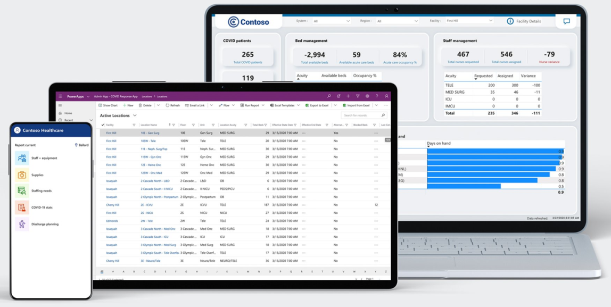

# Hospital Emergency Response - Power Platform sample solution

The Hospital Emergency Response sample solution provides a set of capabilities for healthcare organizations to collect data for situational awareness of available beds and supplies, COVID-19 related patients, staffing, and pending discharges. The solution also provides dashboards that summarize key data and insights for you to make informed decisions resulting in efficient deployment and usage of resources.

> [!div class="mx-imgBorder"] 
> 

The main components of the Hospital Emergency Response solution are:

- **Mobile app for frontline staff**: Frontline staff, such as nurses and medical practitioners, can use the mobile app to quickly view and enter information as required.
- **Web app for Hospital admins**: Hospital admins can use this app to add and manage system data required for the solution to work.
- **Dashboards for healthcare decision makers**: Use dashboards to quickly view important data and metrics that will help you in efficient decision making.

[!include[cc-lang](includes/cc-lang.md)]

## Demo: Quick overview

Watch a quick overview of the Hospital Emergency Response solution.

 

> [!VIDEO https://www.youtube.com/embed/Dg-i3F9G01I]

## Licensing requirements

- Power Apps license.
- Power BI License if you'll be using the Power BI dashboard available as part of this solution.

Contact your local Microsoft account representative for questions related to licensing.

See also: [Licensing overview for Power Platform](/power-platform/admin/pricing-billing-skus)

## Start here

|Task | Target audience|See|
|--|--|--|
|Download and deploy the sample app and dashboard|IT admin|[Deploy the Hospital Emergency Response app](deploy-configure.md)|
|Use the admin app to add/manage master data|Business admin|[Configure and manage master data for your organization](configure-data-reporting.md#configure-and-manage-master-data-for-your-organization)|
|Use dashboards for insights and decision making|Business admin|[View Microsoft Dataverse dashboards](configure-data-reporting.md#view-microsoft-dataverse-dashboards)  [View Power BI dashboard](configure-data-reporting.md#view-power-bi-dashboard)|
|Use the mobile app to track data for ventilators, staffing, pending discharges, and COVID-19 related patients|Frontline staff|[Use the Hospital Emergency Response mobile app](use.md)
|Use the admin app to track feedback from mobile app|Business/IT admin|[View and manage app feedback](configure-data-reporting.md#view-and-manage-app-feedback)|

## Issues and feedback

- To report an issue with the Hospital Emergency Response sample app, visit <https://aka.ms/emergency-response-issues>.

- For feedback about the Hospital Emergency Response sample app, visit <https://aka.ms/emergency-response-feedback>.

### Disclaimer

This app is a sample and may be used with Microsoft Power Platform for dissemination of reference information only. This app is not intended or made available for use as a medical device, clinical support, diagnostic tool, or other technology intended to be used in the diagnosis, cure, mitigation, treatment, or prevention of disease or other conditions, and no license or right is granted by Microsoft to use this app for such purposes. This app is not designed or intended to be a substitute for professional medical advice, diagnosis, treatment, or judgement and should not be used as such. Customer bears the sole risk and responsibility for any use of this app. Microsoft does not warrant that the app or any materials provided in connection therewith will be sufficient for any medical purposes or meet the health or medical requirements of any person. Sample data included in this app are for illustration only and are fictitious. No real association is intended or inferred.

[!INCLUDE[footer-include](../../includes/footer-banner.md)]