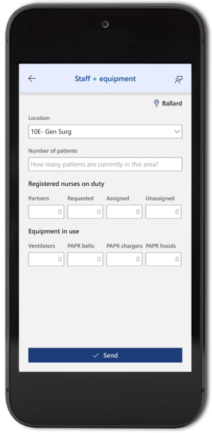

# Use the Emergency Response app

Hospital leaders and staff are challenged to meet an increase in number of
patients while managing supply chain during emergency. With addition of
emergency patients, patients seeking medical help can become challenging to
manage. Emergency Response sample solution helps healthcare organization  collect data for situational awareness of available resources. You can use the sample solution to track statistics for COVID-19 related patients, ventilators, staffing and pending discharges.

## Prerequisites

To get started with the app, you need to download the Power Apps Mobile on your
device using the device's app store.

- **Download** the [**Power Apps Mobile**](https://powerapps.microsoft.com/downloads)
- For **Apple** devices with iOS such as iPhone and iPad, use [**App store**](https://aka.ms/powerappsios)
- For **Android** devices, use [**Google Play**](https://aka.ms/powerappsandroid)

After you install the Power Apps Mobile, open the app from your device and
sign in with your company's Azure Active Directory account. You can view all
apps shared to you by your organization once you sign in. For more information, see [Power Apps mobile device sign
in](https://docs.microsoft.com/powerapps/user/run-app-client#open-power-apps-and-sign-in).

## App Launcher

The Emergency Response mobile app has a modular structure with different apps as applicable to your role. Open the Emergency Response mobile app from the Power Apps Mobile, select your **Hospital system**, **Region, Facility**, and select **Next** to get started.

> [!NOTE]
> When you launch the Emergency Response mobile app launcher or any of
its components for the *first time*, you will be asked for your consent to allow the app to read your *Office 365 Users* profile and your *Location*. You must select **Allow** before you can start using the selected app. For more information, see [give consent](https://docs.microsoft.com/powerapps/user/run-app-client#give-consent).

## App components

The Emergency Response sample solution app consists of multiple apps for enhanced user experience. Depending on your role, you may see one or more apps in the **App Launcher** for Emergency Response mobile app.

- **Staff + equipment**
      Collect status of the RNs and critical equipment by location in that
    facility.

- **Supplies**
      Track key supplies to track, manage, and forecast inventory more
    effectively. ​

- **Staffing needs**
      Collect requests for personnel by department, role, and urgency.

- **COVID-19 stats**
      Collect status on how many patients are under investigation for COVID-19 and
    how many tested positive.

- **Discharge planning**
      Collect status and projections on ​patient discharges.

## Staff + equipment

Submit location-specific inventory for Registered nurses, patients, and
equipment. The area list consists of all locations specific to the facility
chosen on the **App Launcher**. Select location from the available options to
update other fields.

After you select an area, enter the required values for the fields to
save the records in the solution database. You don't have to enter values for
each field on the screen. Enter a number for the field that you need to save in the solution database.

For example, if you need to add number of registered nurses requested as 3,
enter 3 in the **Registered nurses on duty - Requested** field and select
**Send**. If you also need to update ventilators in use as 6, enter 3 in **Registered nurses on duty - Requested** field, then enter 6 in **Vents** under **Equipment in use**, and select **Send**.

Select **Back** from top-left if you want to go back to the **App Launcher**
without submitting any change. **Send** button submits values you entered.

### Fields and description

| **Option name**               | **Description**                                                                                   |
|-------------------------------|---------------------------------------------------------------------------------------------------|
| Location                      | The name and type of the room, ward, or any other specialty location within the selected facility. |
| Number of patients            | Current total number of patients at the selected location.                                        |
| **Registered nurses on duty** |                                                                                                   |
| *Partners*                    | Number of Registered Nurse partners present at the selected location.                             |
| *Requested*                   | Number of Registered Nurses requested for the selected location.                                  |
| *Assigned*                    | Number of Registered Nurses assigned to the selected location.                                    |
| *Unassigned*                  | Number of Registered Nurses not assigned to any task at the selected location.                    |
| **Equipment in use**          |                                                                                                   |
| *Vents*                       | Number of Ventilators in use at the selected location.                                            |
| *PAPR hoods*                  | Number of Powered Air-Purifying Respirator hoods in use at the selected location.                 |
| *PAPR belts*                  | Number of Powered Air-Purifying Respirator belts in use at the selected location.                 |
| *PAPR chargers*               | Number of Powered Air-Purifying Respirator chargers in use at the selected location.              |

## Supplies

View the supplies inventory with the **Supplies** app. You can update the supply
component quantities in the entire facility inventory and the daily burn rate
from this app.

> [!NOTE]
> Enter values in both fields - **In stock** and **Used past 24 hr** before you select send.

Select **Back** in the top-left if you want to go back to the **App Launcher**
without submitting any change. **Send** button submits values you entered.

### Fields and description

The supplies app items list may be different depending on your organization
requirements. Refer to your organization resources for descriptions of supply
names.

IT Administrators can add or update the supplies app items list using the
model-driven app for Power Apps. For more information, see [configuration guide](deploy-configure.md).

**Note:** The supply inventory item values must be in number format.

## Staffing needs

Collects labor pool requests the selected facility. Before you can submit the
labor pool request for a facility, ensure fields marked as *required* are
filled.

Select **Back** from top-left if you want to go back to the **App Launcher**
without submitting any change. **Send** button submits values you entered.

### Fields and description

| **Field name**           | **Description**                                                                            |
|--------------------------|--------------------------------------------------------------------------------------------|
| Department               | Name of the department requesting the labor request. This field is *required*.             |
| Department location                 | Location of the department.                                                                |
| Request type             | Type of the request for labor such as Clinical and Non-clinical. This field is *required.* |
| Role needed              | Role of the requested labor such as sitter or a registered nurse.                          |
| Needed now or next shift | Select a shift for the requested labor, current shift, or an upcoming shift.                |
| Quantity | Quantity required in number format.                |
| Details                  | Describe additional details or comments for the labor pool request.                        |

## COVID-19 stats

Submit COVID-19 specific details using the **COVID-19 stats** app. You can
update the location-specific number of patients under investigation and patients found positive.

You can also add another location using the **+ Add another location** button to
send stats for more than one location.

Select **Back** from top-left if you want to go back to the **App Launcher**
without submitting any change. **Send** button submits values you entered.

### Fields and description

| **Field name**  | **Description**                                                                                    |
|-----------------|----------------------------------------------------------------------------------------------------|
| Location        | The name and type of the room, ward, or any other specialty location within the selected facility.  |
| PUIs            | Number of patients under investigation.                                                            |
| Positive        | Number of patients positive with COVID-19.                                                         |

## Discharge planning

Submit discharge information and patient status with total number using
the **Discharge planning** app. You can update the discharge details for last 24 hours, current discharge barriers, and the break-up for the barriers.

Select **Back** from top-left if you want to go back to the **App Launcher**
without submitting any change. **Send** button submits values you entered.

### Fields and description

| **Field name**            | **Description**                                                    |
|---------------------------|--------------------------------------------------------------------|
| Authorization             | Number of patients in the authorization process.                   |
| Durable medical equipment | Number of patients using the Durable Medical Equipment.            |
| Guardianship              | Number of patients under guardianship.                             |
| Home + Community Services | Number of patients using Home or Community services.               |
| Placement                 | Number of placements needed.                                       |
| Skilled Nursing Facility  | Number of skilled nursing facilities.                              |
| **Discharges**            |                                                                    |
| Past 24 h                 | Number of patients expected to be discharged in last 24 hours.  |
| Likely next 24 h          | Number of patients discharged in last 24 hours.                    |
## Other options

This section explains other actions you can do with the Emergency Response
mobile app components.

### End shift - sign out

You can sign out from the app using the profile icon on the upper-left side of
the screen.  

> [!NOTE]
> *Sign-out* may not be available if your IT administrator has disabled
device sharing.

### Give feedback

You can send feedback with the **App feedback** option from any Emergency
Response mobile app component. When you select **App feedback**, you have
options to share a praise, an idea or report an issue with the app.

### Switch facility

Switch facility anytime by selecting the facility name on the top-right side of the screen. After you select the location name, you're taken to the **App
Launcher** screen where you can select a different hospital, region, or facility.

### See also

[Crisis communication sample template](../..//maker/canvas-apps/sample-crisis-communication-app.md)
