# Use the Hospital Emergency Response mobile app

Hospital staff are challenged to meet an increase in number of
patients while managing supply chain during emergency. By using the Hospital Emergency Response mobile app, frontline workers can quickly view and add data for ventilators, staffing, pending discharges, and COVID-19 related patients.

## Prerequisites

To get started with the mobile app, you need to download the Power Apps Mobile on your
device using the device's app store.

- **Download** the [**Power Apps Mobile**](https://powerapps.microsoft.com/downloads)
    - For **Apple** devices with iOS such as iPhone and iPad, use [**App store**](https://aka.ms/powerappsios)
    - For **Android** devices, use [**Google Play**](https://aka.ms/powerappsandroid)
- Ensure your organization has deployed and configured the Hospital Emergency Response mobile app as explained in [Deploy and configure the app](deploy-configure.md).

After you install the Power Apps Mobile, open the app from your device and
sign in with your company's Azure Active Directory account. You can view all
apps shared to you by your organization once you sign in. For more information, see [Power Apps mobile device sign
in](/powerapps/user/run-app-client#open-power-apps-and-sign-in).

## Demo: Use the Hospital Emergency Response mobile app

Watch how to use the Hospital Emergency Response mobile app.

 

> [!VIDEO https://www.youtube.com/embed/H1u6SYt3UsQ]

## Hospital Emergency Response mobile app

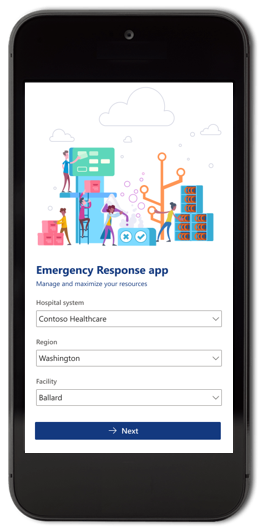

The Hospital Emergency Response mobile app has a modular structure with different apps as applicable to your role. Open the Hospital Emergency Response mobile app from the Power Apps Mobile app, select your **Hospital system**, **Region, Facility**, and select **Next** to get started.

> [!NOTE]
> When you launch the Hospital Emergency Response mobile app or any of
its components for the *first time*, you will be asked for your consent to allow the app to read your *Office 365 Users* profile and your *Location*. You must select **Allow** before you can start using the selected app. For more information, see [give consent](/powerapps/user/run-app-client#give-consent).

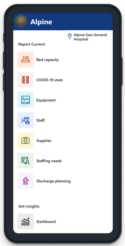

The Hospital Emergency Response sample solution app consists of multiple apps for enhanced user experience. Depending on your role, you may see one or more components in the **Hospital Emergency Response mobile app**.

## Hospital operations

Use the hospital operations apps to collect hospital and facility-specific data for hospital management.

- [COVID-19 stats](#covid-19-stats)
      Collect status on how many patients are under investigation for COVID-19 and how many tested positive.

- [Equipment](#equipment)
      Track equipment information such as ventilators, NIPPV, and PAPR.

- [Staff](#staff)
      Collect number of patients and RN status information such as partners, assigned, requested, and unassigned.

- [Supplies](#supplies)
      Track key supplies to track, manage, and forecast inventory more
    effectively. ​

- [Staffing needs](#staffing-needs)
      Collect requests for personnel by department, role, and urgency.

- [Discharge planning](#discharge-planning)
      Collect status and projections on ​patient discharges.

> [!NOTE]
> By default, you can track information in the following apps at a *location* level: **COVID-19 stats**, **Equipment**, and **Staff**. In rest of the apps, you can track information at the *facility* level by default. Your admin can change the default tracking level, if required. More information: [Manage tracking level for mobile apps](configure-data-reporting.md#manage-tracking-level-for-mobile-apps)

### COVID-19 stats

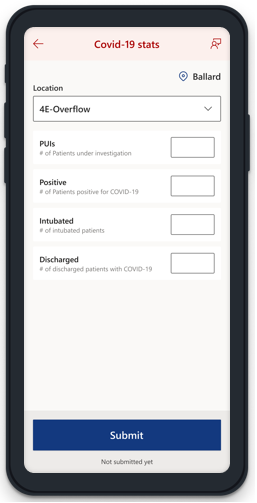

Submit COVID-19 specific details using the **COVID-19 stats** app. You can
update the location-specific patient details such as PUIs, positives, intubated,  and discharged patients.

Select **Back** from top-left if you want to go back to the **Hospital Emergency Response app** without submitting any change. **Submit** button submits values you entered.

After you submit the data, you can go back to the **COVID-19 stats** app to create another record using the **Track another** button. Select **Home** to go back to **Hospital Emergency Response app**.

#### Fields and description

| **Field name**  | **Description**                                                                                    |
|-----------------|----------------------------------------------------------------------------------------------------|
| Location        | The name and type of the room, ward, or any other specialty location within the selected facility.  |
| PUIs            | Number of patients under investigation.                                                            |
| Positive        | Number of patients positive with COVID-19.                                                         |
| Intubated        | Number of patients intubated.                                                         |
| Discharged        | Number of COVID-19 patients discharged.                                                         |

### Equipment

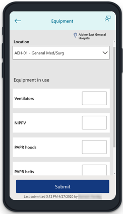

Submit location-specific equipment details using the **Equipment** app. You can update the amount of in-use equipment such as ventilators, NIPPV, and PAPR.

Select **Back** from top-left if you want to go back to the **Hospital Emergency Response app** without submitting any change. **Submit** button submits values you entered.

After you submit the data, you can go back to the **Equipment** app to create another record using the **Track another** button. Select **Home** to go back to **Hospital Emergency Response app**.

#### Fields and description

| **Field name**  | **Description**                                                                                    |
|-----------------|----------------------------------------------------------------------------------------------------|
| Location        | The name and type of the room, ward, or any other specialty location within the selected facility.  |
| Ventilators            | Number of ventilators in use.                                                            |
| NIPPV        | Number of Noninvasive Positive-Pressure Ventilators in use.                                                         |
| PAPR hoods        | Number of Powered Air-Purifying Respirator (PAPR) hoods in use.                                                         |
| PAPR belts        | Number of PAPR belts in use.                                                         |
| PAPR chargers        | Number of PAPR chargers in use.                                                         |

### Staff

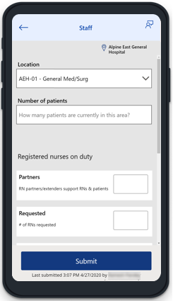

Submit location-specific inventory for Registered nurses, patients, and
equipment. You don't have to enter values for each field on the screen. Enter a number for the field that you need to save in the solution database.

For example, if you need to add number of registered nurses requested as 3,
enter 3 in the **Registered nurses on duty - Requested** field and select
**Submit**. If you also need to update **Registered nurses on duty - Assigned** in use as 6, enter 3 in **Registered nurses on duty - Requested** field, then enter 6 in **Registered nurses on duty - Assigned**, and then select **Submit**.

Select **Back** from top-left if you want to go back to the **Hospital Emergency Response app** without submitting any change. **Submit** button submits values you entered.

After you submit the data, you can go back to the **Staff** app to create another record using the **Track another** button. Select **Home** to go back to **Hospital Emergency Response app**.

#### Fields and description

| **Option name**               | **Description**                                                                                   |
|-------------------------------|---------------------------------------------------------------------------------------------------|
| Location                      | The name and type of the room, ward, or any other specialty location within the selected facility. |
| Number of patients            | Current total number of patients at the selected location.                                        |
| **Registered nurses on duty** |                                                                                                   |
| *Partners*   RN partners/extenders support RNs & patients                   | Number of Registered Nurse partners present at the selected location.                             |
| *Requested*   # of RNs requested                  | Number of Registered Nurses requested for the selected location.                                  |
| *Assigned*   # of RNs with an assignment                   | Number of Registered Nurses assigned to the selected location.                                    |
| *Unassigned*   # of RNs unassigned to any task                  | Number of Registered Nurses not assigned to any task at the selected location.                    |

### Supplies

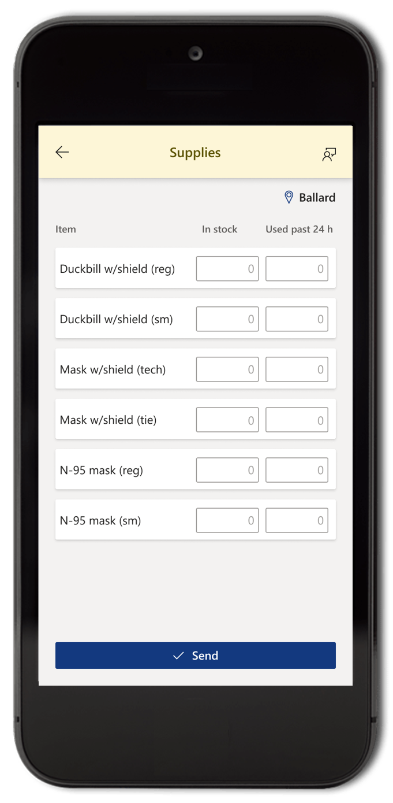

Collect the supplies inventory with the **Supplies** app. You can update the supply
component quantities in the entire facility inventory and the daily burn rate
from this app.

> [!NOTE]
> Enter values in both fields, **In stock** and **Used past 24 hr**, before you select **Submit**.

Select **Back** in the top-left if you want to go back to the **Hospital Emergency Response app** without submitting any change. **Submit** button submits values you entered. Select **Home** to go back to **Hospital Emergency Response app** after you submit.

#### Fields and description

The supplies app items list may be different depending on your organization
requirements. Refer to your organization resources for descriptions of supply
names.

IT Administrators can add or update the supplies app items list using the
model-driven app for Power Apps. For more information, see [configuration guide](deploy-configure.md).

> [!NOTE]
> The supply inventory item values must be in number format.

### Staffing needs

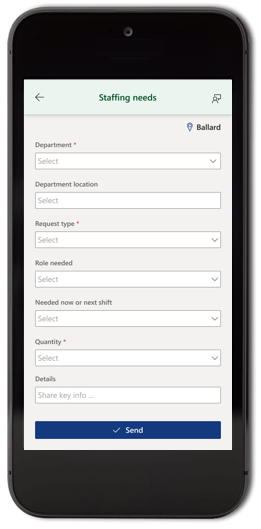

Collects labor pool requests for the selected facility. Before you can submit the
labor pool request for a facility, ensure fields marked as *required* (*) are
filled.

Select **Back** from top-left if you want to go back to the **Hospital Emergency Response app** without submitting any change. **Submit** button submits values you entered. Select **Home** to go back to **Hospital Emergency Response app** after you submit.

#### Fields and description

| **Field name**           | **Description**                                                                            |
|--------------------------|--------------------------------------------------------------------------------------------|
| Department               | Name of the department requesting the labor request. This field is *required*.             |
| Department location      | Location of the department.                                                                |
| Request type             | Type of the request for labor such as Clinical and Non-clinical. This field is *required.* |
| Role needed              | Role of the requested labor such as sitter or a registered nurse.                          |
| Needed now or next shift | Select a shift for the requested labor, current shift, or an upcoming shift.                |
| How many                 | How many resources needed, in number format.                |
| Details                  | Describe additional details or comments for the labor pool request.                        |

### Discharge planning

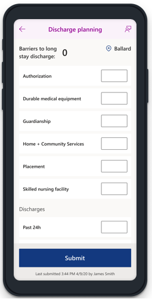

Submit discharge information and patient status with total number using
the **Discharge planning** app. You can update the discharge details for last 24 hours, current discharge barriers, and the break-up for the barriers. 

Select **Back** from top-left if you want to go back to the **Hospital Emergency Response app** without submitting any change. **Submit** button submits values you entered. Select **Home** to go back to **Hospital Emergency Response app** after you submit.

**Barriers to long stay discharge** automatically updates with total number of patients you enter on the form across all barriers.

### Fields and description

| **Field name**            | **Description**                                                    |
|---------------------------|--------------------------------------------------------------------|
| Authorization             | Number of patients in the authorization process.                   |
| Durable medical equipment | Number of patients using the Durable Medical Equipment.            |
| Guardianship              | Number of patients under guardianship.                             |
| Home + Community Services | Number of patients using Home or Community services.               |
| Placement                 | Number of placements needed.                                       |
| Skilled nursing facility  | Number of skilled nursing facilities.                              |
| **Discharges**            |                                                                    |
| Past 24 h                 | Number of patients expected to be discharged in last 24 hours.  |
| Likely next 24 h          | Number of patients discharged in last 24 hours.                    |

## Insights

View the Power BI dashboards for insights and decision making using the **Dashboard** app. Selecting this option will open the Power BI dashboard in your mobile device browser.

For detailed info about the dashboard, see [View Power BI dashboard](configure-data-reporting.md#view-power-bi-dashboard).

Select **Back** from top-left if you want to go back to the **Hospital Emergency Response app** without submitting any change.

## Government reporting

Use the government reporting apps to collect hospital and facility-specific data for CDC reporting.

- [COVID-19 patient impact](#covid-19-patient-impact---cdc-reporting)
      Collect COVID-19 patient details such as hospitalized, on ventilator, or awaiting beds in emergency department.

- [Healthcare worker staffing](#healthcare-worker-staffing---cdc-reporting)
      Collect shortage data for staff such as physicians, RNs, pharmacists, therapists, or other personnel.

- [Bed capacity](#bed-capacity---cdc-reporting)
      Collect bed information such as ICU, Acute Care, and surge capacity.

- [Supply planning](#supply-planning---cdc-reporting)
      Collect supplies data such as masks, shields, gloves, gowns, PAPRs.

### COVID-19 patient impact - CDC reporting

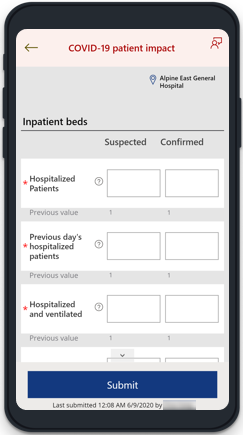

Use the **COVID-19 patient impact** app to submit COVID-19 suspected and confirmed patient information such as hospitalized patients, onset numbers, emergency department, and overflow information. After you submit the data using this app, model-driven app can be used to download and save data for governmental reporting, such as upload to the CDC web site.

Select **Back** from top-left if you want to go back to the **Hospital Emergency Response app** without submitting any change. **Submit** button submits values you entered. Select **Home** to go back to **Hospital Emergency Response app** after you submit.

#### Fields and description

COVID-19 stats include details for both COVID-19 *suspected* and COVID-19 *confirmed* patients.

##### Inpatient beds

Submit inpatient bed information:

| **Option name**                                                   | **Description**                                                    |
|-------------------------------------------------------------------|--------------------------------------------------------------------|
| Hospitalized patients | Total number of patients hospitalized currently. |
| Previous day’s hospitalized patients | Number of new patients admitted to the hospital. |
| Hospitalized and ventilated | Patients currently hospitalized using mechanical ventilators. |
| Hospital onset | Total number of patients with onset of suspected or confirmed COVID-19 (after 14 or more days) for a condition other than COVID-19.
| Previous day’s hospital onset | Number of patients with onset of suspected or confirmed COVID-19 on the previous day; and the previous day is 14 or more days since admission.

##### Emergency department / Overflow location

Only available if the facility is enabled for emergency department or overflow location.

| **Option name**                                                   | **Description**                                                    |
|-------------------------------------------------------------------|--------------------------------------------------------------------|
| Awaiting inpatient bed | Number of patients awaiting an inpatient bed. |
| Awaiting inpatient bed ventilated | Number of patients on a mechanical ventilator awaiting inpatient bed. |

##### All locations

| **Option name**                                                   | **Description**                                                    |
|-------------------------------------------------------------------|--------------------------------------------------------------------|
| Deaths. | Previous day's mortality number for patients suspected or confirmed with COVID-19 (includes hospital, emergency department, and all overflow locations). |

### Healthcare worker staffing - CDC reporting

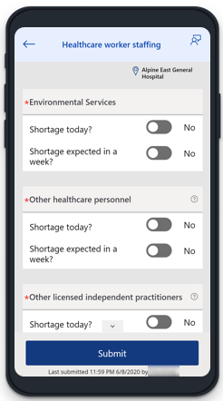

Collect shortage information for staffing such as physicians, RNs, licensed practitioners, pharmacists, or therapists using the **Healthcare worker staffing** app. After you submit the data using this app, model-driven app can be used to download and save data for governmental reporting, such as upload to the CDC web site.

Select **Back** from top-left if you want to go back to the **Hospital Emergency Response app** without submitting any change. **Submit** button submits values you entered. Select **Home** to go back to **Hospital Emergency Response app** after you submit.

#### Fields and description

The **Healthcare worker staffing** app fields may be different depending on your organization requirements. Refer to your organization resources for descriptions of staffing requirements.

IT Administrators can add or update the **Healthcare worker staffing** app items list using the model-driven app for Power Apps. For more information, see [configuration guide](deploy-configure.md).

### Bed capacity - CDC reporting

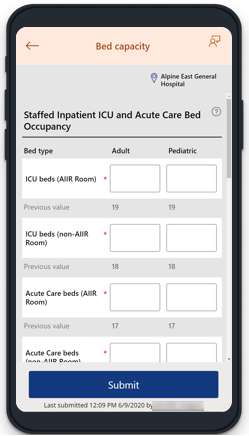

Collect bed information such as ICU/AIIR availability, occupancy in other areas, or inpatient staffing/surge capacity using the **Bed capacity** app. After you submit the data using this app, model-driven app can be used to download and save data for governmental reporting, such as upload to the CDC web site.

Select **Back** from top-left if you want to go back to the **Hospital Emergency Response app** without submitting any change. **Submit** button submits values you entered. Select **Home** to go back to **Hospital Emergency Response app** after you submit.

#### Fields and description

##### Staffed Inpatient ICU and Acute Care Bed Occupancy

Occupancy for staffed adult and pediatric inpatient beds that are in the ICU or Acute care locations.

| **Option name**                                               | **Description**                                                                       |
|---------------------------------------------------------------|---------------------------------------------------------------------------------------|
| ICU beds (AIIR Room) | Number of Intensive Care Unit (ICU) beds in Airborne Infection Isolation Rooms occupied currently. |
| ICU beds (non-AIIR Room) | Number of ICU beds in non-AIIR rooms occupied currently.
| Acute Care beds (AIIR Room) | Number of Acute Care beds (AIIR Room) occupied currently. |
| Acute Care beds (non-AIIR Room) | Number of Acute Care beds (non-AIIR Room) occupied currently.

> [!NOTE]
> Pediatric occupancy options are disabled if the capacity isn't set to at least 1 at the selected facility.

##### Staffed Inpatient Bed Occupancy in other areas

Occupancy of staffed inpatient beds in areas other than ICU and Acute Care.

| **Option name**                                               | **Description**                                                                       |
|---------------------------------------------------------------|---------------------------------------------------------------------------------------|
| Neonatal ICU beds | Neonatal ICU beds occupied currently.
| Beds in Overflow/Surge/Expansion areas | Number of beds in Overflow/Surge/Expansion areas occupied currently. |
| Beds in other inpatient areas (CCU/L&D etc) | Number of beds in other inpatient areas occupied currently. |
| Decedent accommodations | Number of decedent accommodations occupied currently.   **Note**: Only visible if the *Total Mortuary Capacity* for the selected facility is at least 1. |

##### Inpatient Beds Staffing and Surge Capacity

Select whether your facility is staffed for its inpatient bed capacity, and if your facility can surge beyond your staffed inpatient bed capacity. If not, select the appropriate reasons.

| **Option name**                                               | **Description**                                                                       |
|---------------------------------------------------------------|---------------------------------------------------------------------------------------|
| Is your facility staffed to its full licensed bed capacity?    | Yes/No. If the answer is No, can select one or more reasons from the following options:   - Staff   - Space   - PPE   - Equipment   - Low Patient Volume  |
| Are you able to surge beyond your licensed beds?              | Yes/No. If the answer is No, can select one or more reasons from the following options:   - Staff   - Space   - PPE   - Equipment   - Low Patient Volume  |

### Supply planning - CDC reporting

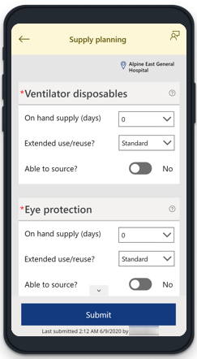

Collect the supplies inventory with the **Supply planning** app. You can update the supply component quantities in the entire facility inventory, burn rate, extended use/reuse methods and ability to source inventory. After you submit the data using this app, model-driven app can be used to download and save data for governmental reporting, such as upload to the CDC web site.

Select **Back** from top-left if you want to go back to the **Hospital Emergency Response app** without submitting any change. **Submit** button submits values you entered. Select **Home** to go back to **Hospital Emergency Response app** after you submit.

#### Fields and description

The supplies app items list may be different depending on your organization
requirements. Refer to your organization resources for descriptions of supply
names.

IT Administrators can add or update the supplies app items list using the
model-driven app for Power Apps. For more information, see [configuration guide](deploy-configure.md).

##### Supply considerations

- For calculation of on hand supply, we recommend using the [Personal Protective Equipment (PPE) Burn Rate Calculator](https://www.cdc.gov/coronavirus/2019-ncov/hcp/ppe-strategy/burn-calculator.html).
- More information about conservation strategy available at [Conservation Strategies for Personal Protective Equipment](https://www.doh.wa.gov/Portals/1/Documents/1600/coronavirus/ConservationStrat-PPE.pdf).
- **Extended use**: Wearing for repeated close contact encounters with several patients without removing between patients.
- **Reuse**: Using same PPE for multiple encounters with patients but removing it (*doffing*) after each encounter.
- **Ventilator Disposables use/reuse**: When considering definitions for extended use or reusing ventilator supplies, refer to the [Scarce Resource Management and Crisis Standards of Care Overview](https://nwhrn.org/wp-content/uploads/2018/10/Scarce_Resource_Management_and_Crisis_Standards_of_Care_Overview_and_Materials-2020-04-10.pdf) document.
    <table>
      <tr>
        <th>WA Health</th>
        <th>Scarce Resource Mgmt and Crisis Standards of Care Overview</th>
      </tr>
      <tr>
        <td><i>Standard</i></td>
        <td>Conventional</td>
      </tr>
        <tr>
        <td><i>Conservation</i></td>
        <td>Contingency</td>
      </tr>
        <tr>
        <td><i>Extreme</i></td>
        <td>Crisis</td>
      </tr>
    </table>
- **Ventilator supplies (disposables)**: When considering definitions for *ventilator supplies (disposable)*, refer to [CDC NHSN](https://www.cdc.gov/nhsn/) website.

## Other options

This section explains other actions you can do with the Hospital Emergency Response
mobile app components.

### End shift - sign out

You can sign out from the app using the profile icon on the upper-left side of
the screen.  

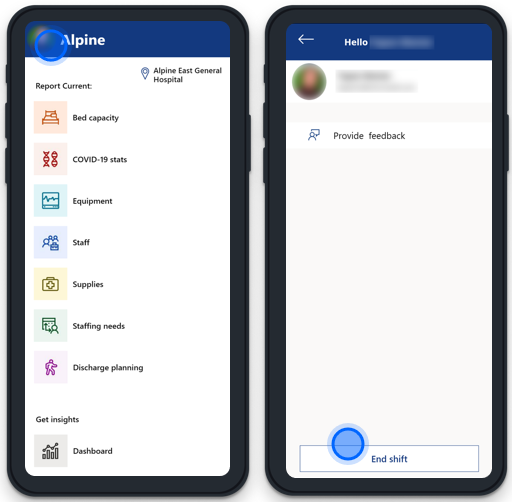

Select the **End shift** button to end your session and sign out.

> [!NOTE]
> *End shift* may not be available if your IT administrator has disabled
device sharing.

### App feedback

You can share your feedback with the **App feedback** option from any Hospital Emergency Response mobile app component. To share your feedback, select your profile from top-left and then select the **Submit feedback** button:

When you select **App feedback**, you have
options to share a praise, an idea or report an issue with the app.

### Switch facility

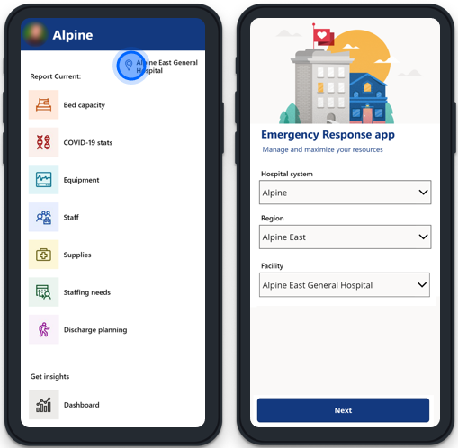

Switch facility anytime by selecting the facility name on the top-right side of the screen. After you select the location name, you're taken to the **Hospital Emergency Response app** screen where you can select a different hospital, region, or facility.

## View the mobile app in your language

[!include[cc-lang](includes/cc-lang.md)]

You can view the Hospital Emergency Response mobile app in one of the supported languages on your mobile device by setting the default language of your mobile device (Apple or Android) to a supported language. See the help documentation for your respective mobile device on how to change the default language for your device.

If you're using the mobile apps on a browser on your computer, select the default language of your browser to a supported language for the Hospital Emergency Response mobile app. For more information, go to [Use Microsoft Edge in another language](https://support.microsoft.com/help/4532129).

## Issues and feedback

- To report an issue with the Hospital Emergency Response mobile app, visit <https://aka.ms/emergency-response-issues>.

- For feedback about the Hospital Emergency Response mobile app, visit <https://aka.ms/emergency-response-feedback>.

[!INCLUDE[footer-include](../../includes/footer-banner.md)]