# Use the admin app and dashboard

This article is meant for business admins in regional medical organizations to use the admin app (model-driven app) to perform the following activities:

-   Add and manage master data in entities required for the solution

-   Create and manage portal users (contacts). These users are typically the admins from parent medical organizations that manage one or more hospital systems.

- View approve, and decline portal user requests.

- View Power BI dashboards in their tenant.

## Prerequisites

-   Ensure you have the appropriate security role and access to the admin app (model-driven app). Contact your IT Admin if you are unable to access or use the admin app.

-   Ensure you have access to the sample data. The sample data is available in the deployment package under the **SampleData** folder.

## Add and manage master data

When you sign into the admin (model-driven) app, you will see the entities in the left pane where you need to populate the master data. Select the entity in the left navigation pane to view or manage the data.

> [!div class="mx-imgBorder"] 
> 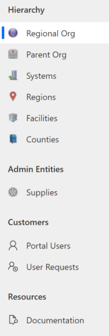

-   **Hierarchy area**: Data for entities in this area can be added either by importing data from the sample data files or manually. The entities under the **Hierarchy** area are listed in the order you should populate data. Also, parent org admins (hospital admins) can view and manage data under the following entities for their hospital from the portal: **Systems**, **Regions**, and **Facilities**.

-   **Admin Entities area**: Data in the **Supplies** entity is added by importing data from the sample data file. You can also manually add and manage supplies data later.

-   **Customers area**: You use **Portal Users** to [manage portal users](#manage-portal-users) and **User Requests** to [manage portal user requests](#manage-portal-user-requests).

-   **Resources area**: Select **Documentation** to view this document.

There are two ways in which you can add master data to entities in the app:

-  Import data using the sample data files.

-  Manually configure and manage the data.

### Import data using sample files

The sample data files are available in the deployment package (.zip). When you extract the .zip file, the sample data files are available under the **SampleData** folder.

Under the **SampleData** folder, the files are named to denote the sequence in which data should be imported into your app. Otherwise, data import will fail.

-   0_Supplies.xlsx

-   1_Counties.xlsx

-   2_Regional Organization.xlsx

-   3_Parent Organizations.xlsx

-   4_Systems.xlsx

-   5_Regions.xlsx

-   6_Facilities.xlsx

> [!NOTE]
> We provide name and FIPS code for all the counties in the Washington state as sample data that you can import. You should import the **Counties** data using the sample data file into your system before proceeding with importing or managing data in any other entities.
> 
> To obtain data about counties in other states, visit <https://www.census.gov/geographies/reference-files/2018/demo/popest/2018-fips.html>

#### How to load data from data files

To load sample data from the Excel file to an entity: 

1.  In the left navigation pane of the admin app, select select an entity. For example, select **Parent Org**. 

2.  Select **Import from Excel** to select the data file. 

       > [!div class="mx-imgBorder"] 
       > 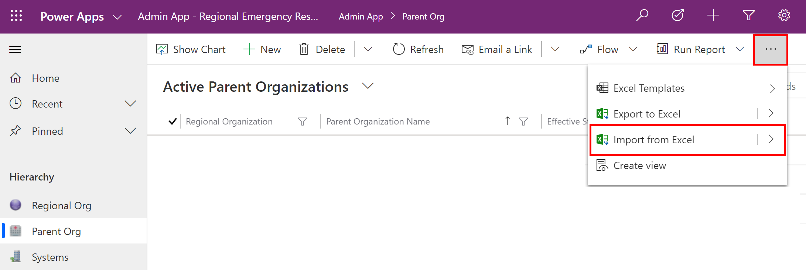

3.  Browse to the **SampleData** folder and select the **3_Parent Organizations.xlsx** file and proceed with the wizard steps to import the data.  

4.  After the sample data is imported, you will see the imported records in the entity:

       > [!div class="mx-imgBorder"] 
       > 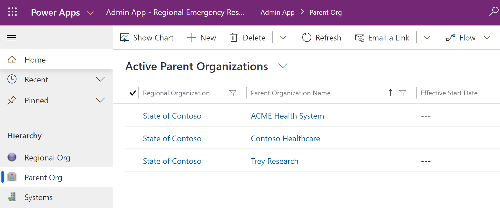

### Manually configure and manage master data for your organization

Admins can use the model-driven app in [Power Apps](https://make.powerapps.com) to create and manage master data for their organization. This data is required for the Emergency Response Solution to work.

To start, you must add master data in the following entities:

-   [Supplies](#supplies-and-counties-data)

-   [Counties](#supplies-and-counties-data)

-   [Regional Org](#regional-org-data)

-   [Parent Org](#parent-org-data)

-   [Hospital systems](#systems-data) managed by each parent org

-   [Regions](#regions-data)) for each hospital system

-   [Facilities](#facilities-data)) within each region of a hospital system

Sign into the admin app using the URL provided by your IT admin to add and manage data.

#### Supplies and Counties data

Use the sample data files (**0_Supplies.xlsx** and **1_Counties.xlsx**) in the deployment package to import data for **Supplies** and **Counties** entity.

#### Regional Org data

This is the regional network organization that will deploy the solution and manage data from various parent organizations.

To create a record:

1.  Select **Regional Org** in the left pane and select **New**.

    > [!div class="mx-imgBorder"] 
    > 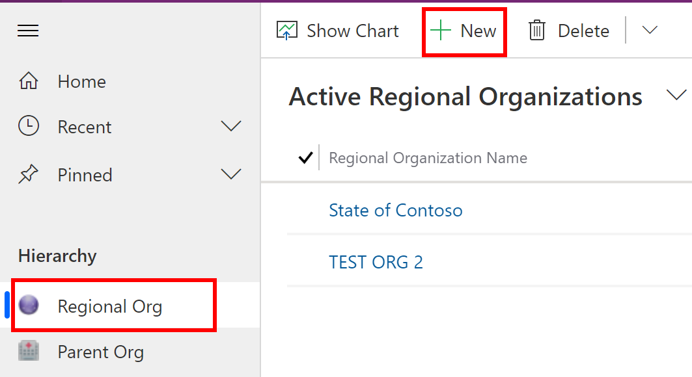

2.  In the **New Regional Organization** page, specify the organization name:

    > [!div class="mx-imgBorder"] 
    > 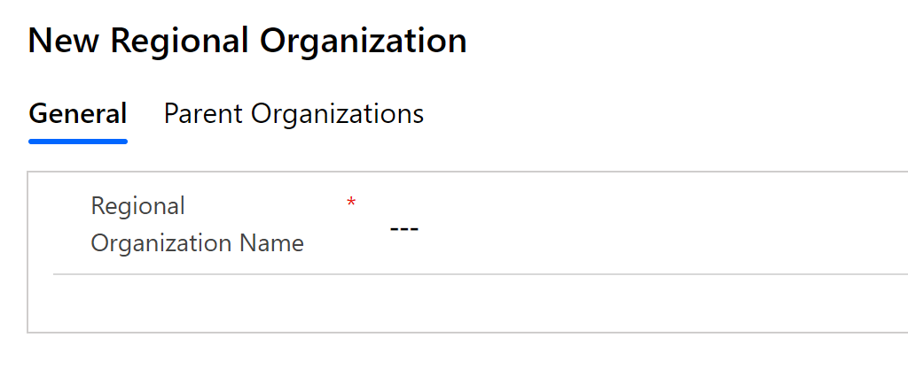

3.  Select **Save & Close.** The newly created record will be available in the **Regional Org** list.

To edit the record, select the record, update the values as required, and select **Save & Close.**

#### Parent Org data

The **Parent Org** entity stores the parent organization that will be using the portals set up by regional org to view and manage data related to parent organization’s hospital systems.

To create a record:

1.  Select **Parent Org** in the left pane and select **New**.

2.  In the **New Parent Organization** page, specify appropriate values:

     > [!div class="mx-imgBorder"] 
     > 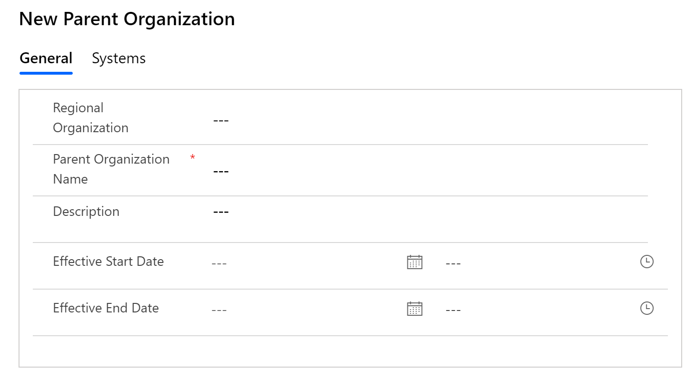

    | **Field**                |**Description** |
    |--------------------------|------------------------------------------------------|
    | Regional Organization    | Select a regional org. This list is populated based on the **Regional Org** data you have created earlier. |
    | Parent Organization Name | Specify the parent organization name.      |
    | Description              | Type an optional description.        |
    | Effective Start Data     | Type start date and time for this parent organization.    |
    | Effective End Date       | Type end date and time for this parent organization.         |

3.  Select **Save & Close.** The newly created record will be available in the **Parent Org** list.

To edit the record, select the record, update the values as required, and select **Save & Close.**

#### Systems data

The **Systems** entity lets you create and manage entries for Hospital Systems. This allows you to manage multiple hospital systems within the same parent organization.

To create a record:

1.  Select **Systems** in the left pane and select **New**.

2.  In the **New System** page, specify appropriate values:

    > [!div class="mx-imgBorder"] 
    > 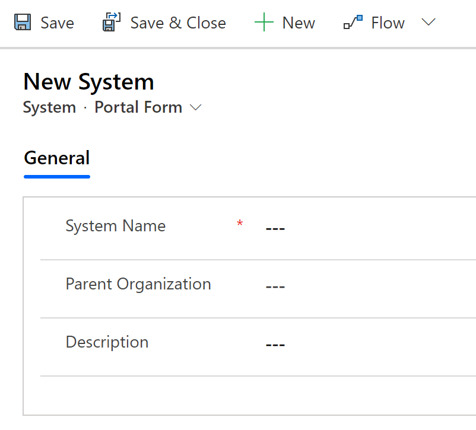

    | **Field**           | **Description**        |
    |---------------------|---------------------------------------|
    | System Name         | Type a name for your Hospital.    |
    | Parent Organization | Select a parent org to associate to. This list is populated based on the **Parent Org** data you have created earlier. |
    | Description         | Type an optional description.    |

3.  Select **Save & Close.** The newly created record will be available in the **Systems** list.

To edit the record, select the record, update the values as required, and select **Save & Close.**

#### Regions data

The **Regions** entity lets you manage the geographical regions for your hospital systems.

To create a record:

1.  Select **Regions** in the left pane and select **New**.

2.  In the **New Region** page, specify appropriate values:

    > [!div class="mx-imgBorder"] 
    > 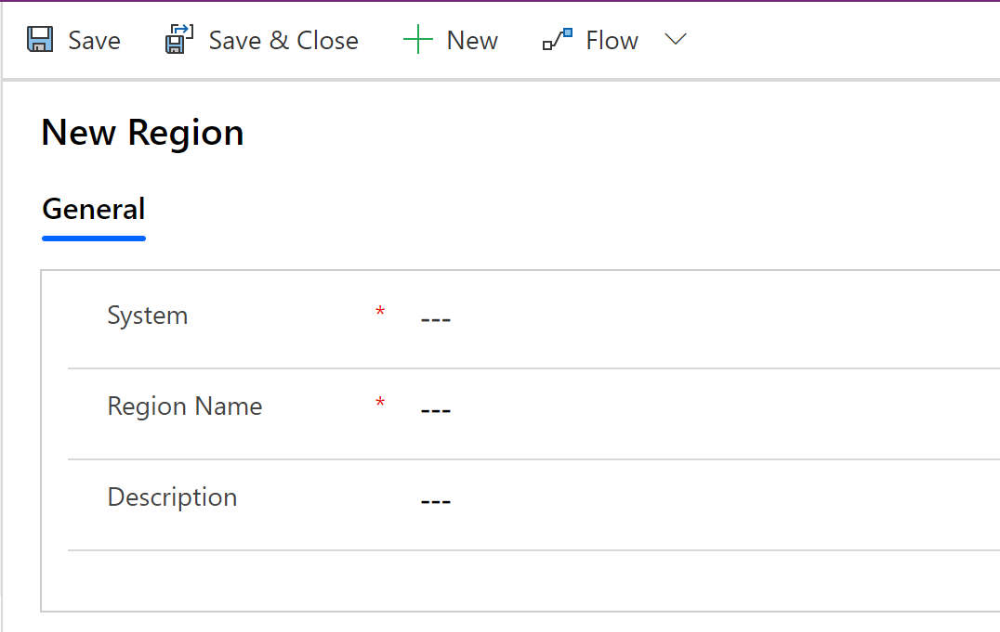

    | **Field**   | **Description**                                  |
    |-------------|---------------------------|
    | System      | Select a hospital system this region is associated with. This list is populated based on the **Systems** data you have created earlier. |
    | Region Name | Type the region name. For example, Seattle.  |
    | Description | Type an optional description. 

3.  Select **Save & Close.** The newly created record will be available in the **Regions** list.

To edit the record, select the record, update the values as required, and select **Save & Close.**

#### Facilities data

The **Facilities** entity lets you manage the hospital locations within each region. For example, **Redmond** and **Bellevue** facilities within the **Seattle** region.

To create a record:

1.  Select **Facilities** in the left pane and select **New.**

2.  In the **New Facility** page, specify appropriate values:

    > [!div class="mx-imgBorder"] 
    > 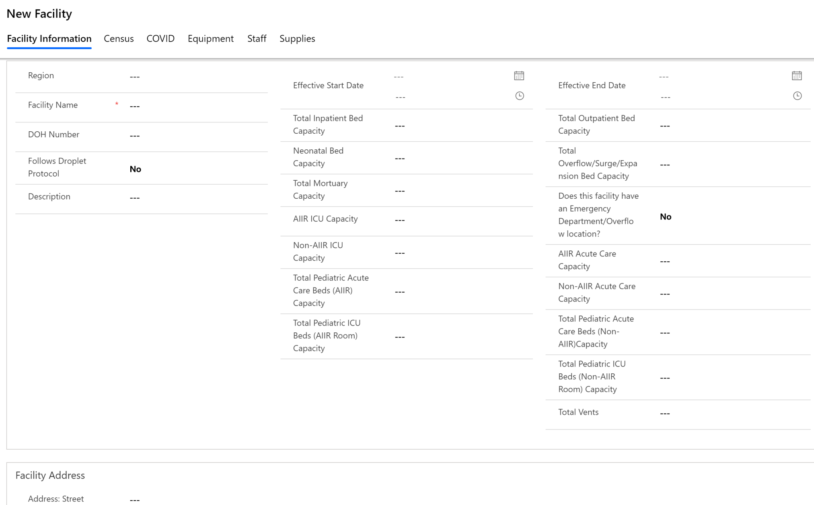

    | **Field**                    | **Description**            |
    |------------------------------|---------------------------------------------------|
    | Region    | Select a region this facility is associated with. This list is populated based on the **Regions** data you have created earlier.          |
    | Facility Name | Type the facility name.                 |
    | DOH Number    | Type Department of Health (DOH) number for this facility.     |
    | Follows Droplet Protocol     | Indicates whether the facility follows Droplet Precautions for patients known or suspected to be infected with pathogens transmitted by respiratory droplets, such as in COVID-19 cases. Select **Yes** or **No**. |
    | Description    | Type an optional description.              |
    | Effective Start Data         | Type start date and time for this facility.    |
    | Total Inpatient Bed Capacity    | Type the total inpatient bed capacity.    |
    | Neonatal Bed Capacity    | Type the total neonatal bed capacity.    |
    | Total Mortuary Capacity    | Type the total mortuary capacity.   **Note**: When set to at least 1, causes field *Number of decedent accommodations currently in use* to be available for the facility's **Bed capacity** form in the [portal](./portals-user.md#bed-capacity).    |
    | AIIR ICU Capacity            | Type the total number of ICU beds in AIIR (Airborne Infection Isolation Room).       |
    | Non-AIIR ICU Capacity        | Type the total number of ICU beds in non-AIIR.      |
    | Total Pediatric Acute Care Beds (AIIR) Capacity    | Type the total pediatric acute care beds in AIIR.    |
    | Total Pediatric ICU Beds (AIIR) Capacity    | Type the total pediatric ICU beds in AIIR.    |
    | Effective End Date           | Type end date and time for this facility.       |
    | Total Outpatient Bed Capacity       | Type the total number of outpatient bed capacity in the facility.   |
    | Total Outflow/Surge/Expansion Bed Capacity           | Type the total number of outflow/surge/expansion beds the facility can have. These beds are those that can be staffed above and beyond licensed bed capacity if patients need to be admitted.                                              |
    | Does this facility have an Emergency Department/Overflow location?           | Select **Yes**/**No** to confirm if the facility has emergency department or overflow location(s).   |
    | AIIR Acute Care Capacity     | Type the total number of Acute care beds in AIIR .     |
    | Non-AIIR Acute Care Capacity | Type the total number of Acute care beds in non- AIIR (Airborne Infection Isolation Room).|
    | Total Pediatric Acute Care Beds (Non-AIIR) Capacity    | Type the total pediatric acute care beds in non-AIIR.    |
    | Total Pediatric ICU Beds (Non-AIIR) Capacity    | Type the total pediatric ICU beds in non-AIIR.    |
    | Total Vents    | Type the total number of ventilators in the facility.    |
    | Facility Address    | Type the Street, City, County, State, Zip code, Latitude, and Longitude for the facility.   |

3.  Select **Save & Close.** The newly created record will be available in the **Facilities** list.

To edit the record, select the record, update the values as required, and select **Save & Close.**

You can also view and manage the associated **Census**, **COVID**, **Equipment**, **Staffing**, and **Supplies** data entered by the parent organizations for a facility by opening a facility record, and using the respective tabs in the record.

> [!div class="mx-imgBorder"] 
> 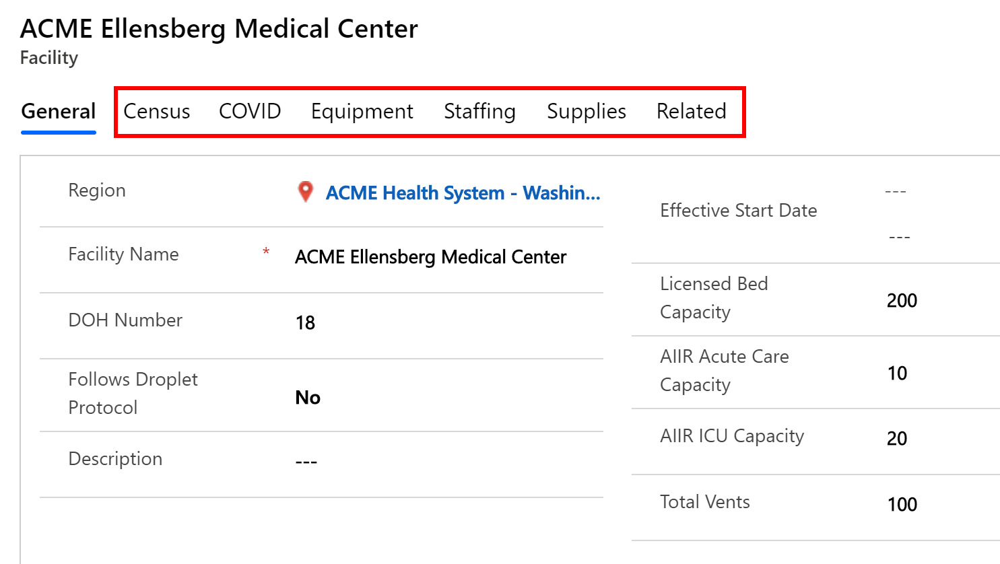

## Manage portal users

Use the **Portal Users** entity to add and manage portal users. These portal users are the admins from the various parent organizations who report their hospital systems data to regional organizations and also manage other admins, healthcare workers, or report viewers using the portals.

### Create a portal user

1.  Sign into the admin app using the URL provided by your IT admin.

2.  In the left pane, select **Portal Users**. You see a list of portal users, if they are already added by other admins in your org. Selecting a user will open the details about the user.

3.  Select **New** to create a new portal user. On the **New Contact** page, specify appropriate values

    > [!div class="mx-imgBorder"] 
    > 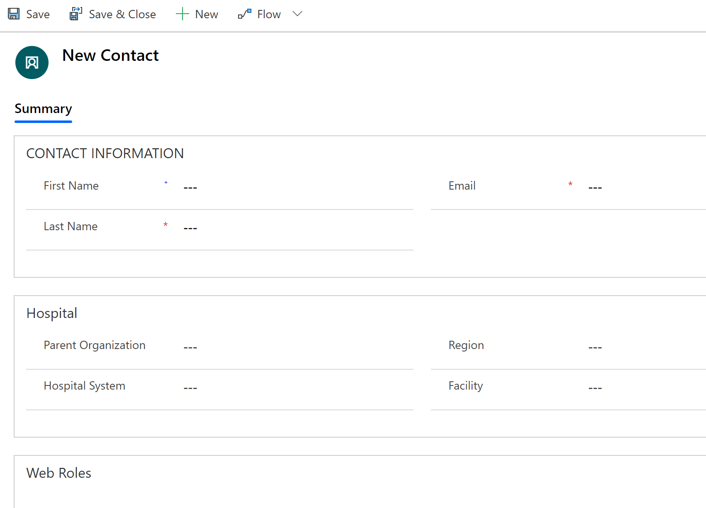

    | **Field**           | **Description**  |
    |---------------------|-------------------|
    | First Name          | First name of the user.                           |
    | Last Name           | Last name of the user  |
    | Email     | Email of the user where the invitation will be sent.    |
    | Parent Organization | Select a parent organization that this portal user will be associated with. This ensures that the user has access only to the hospital systems data under the selected parent org. If you don’t specify a parent org for the user, she/she will have access to data for all the parent orgs under the regional org. |
    | Hospital System     | Select a hospital that this portal user will be associated with. |
    | Region  | Select a region that this portal user will be associated with.  |
    | Facility            | Select a facility that this portal user will be associated with. |

4.  Save the record. On saving the record, the **Web Roles** area becomes available. Select **Add Existing Web Role.**

5.  In the lookup records page, press enter to displays the existing web roles.

    > [!div class="mx-imgBorder"] 
    > 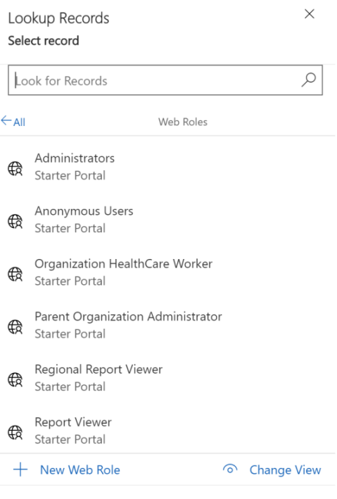

6. Select roles as per the portal access you need to provide to the user. To give access to all the features in the portal, select all the four roles: **Organization HealthCare Worker**, **Parent Organization Administrator**, **Regional Report Viewer**, and **Report Viewer**.

    For information about each of these roles, see the [User roles](portals-admin-reporting.md#user-roles) section in the portal administration topic.

    To grant a role, select the role, and select **Add**.

7. Save the portal user record.

Depending on the roles(s) you granted to the user, she/he will view respective areas in the portal. More information: [Portal for admins and report viewers](portals-admin-reporting.md) and [Portal for healthcare workers](portals-user.md)

An email will be sent automatically to the newly created user with an invitation code to join portals. The portal user can redeem the invitation to sign in and start using the portal. More information: [Get started with the portal](./portals-admin-reporting.md#getting-started-with-the-portal)

## Manage portal user requests

You can view, approve, and decline portal user requests using the **User Requests** option.

Use the appropriate view to view a list of approved, declined, inactive, and pending user requests.

> [!div class="mx-imgBorder"] 
> 

### Approve or decline user request

To approve or decline user requests:

1.  Sign into the admin app using the URL provided by your IT admin.

2.  In the left pane, select **User Requests**, and then select **Pending Portal User Requests** view. You see a list of portal user requests pending for approval.

3.  Double-click a user request to open it.

4.  On the user request form:

    1. Select the appropriate roles for the user in the **Choose roles for the user** area. To grant or deny a role, select **Yes** or **No** respectively for each role.

    1. From the **Request State** list, select **Approve** or **Decline**.

    1. Select the save icon in the lower-right corner.

        > [!div class="mx-imgBorder"] 
        > 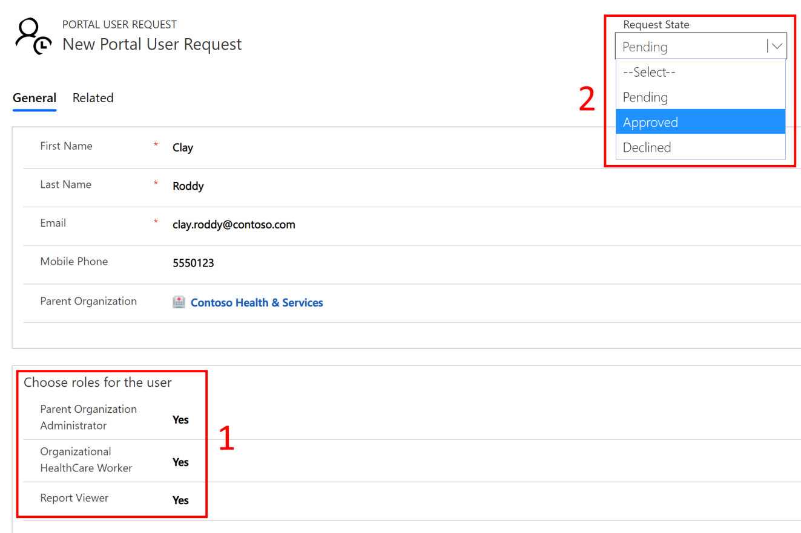

Based on the approval or decline, the following happens:

- If you *approve* the access request, the user record is created with selected roles and the user receives an email with invitation code. The user can redeem the invitation code to sign in to the portal. More information: [Redeem invitation](portals-admin-reporting.md#redeem-invitation)

- If you *decline* the access request, the user record isn't created, and the user receives an email stating that the request is declined.

## View the Power BI dashboard

Business admins in the regional organization can view the Power BI dashboard in their Power BI tenant if the regional IT admin published the report as an app and granted access to business admins. More information: [Step 5: Configure and publish Power BI dashboard](deploy.md#step-5-configure-and-publish-power-bi-dashboard) 

To view the Power BI dashboard:

1. Sign into [Power BI](https://app.powerbi.com).

2. The workspace where the app was published will be available for you to access the dashboard.

3. The Power BI dashboard that is available to you in your Power BI tenant is the same as the one available to users of the portal. The **primary difference** is that as a business admin of a regional organization, you can view data for all the parent organizations that report data to the regional organization, whereas users viewing the dashboard embedded in portal can only view data for their parent organization and associated hospital systems.

For detailed information presented in the Power BI dashboard, see [Get insights](./portals-admin-reporting.md#get-insights) in the portal topic.

## Issues and feedback

- To report an issue with the Regional Government Emergency Response and Monitoring solution, visit <https://aka.ms/rer-issues>.

- For feedback about the Regional Government Emergency Response and Monitoring solution, visit <https://aka.ms/rer-feedback>.

[!INCLUDE[footer-include](../../includes/footer-banner.md)]