# Deploy the Regional Government Emergency Response and Monitoring solution

Regional organization IT admins can use this article to deploy the Regional Government Emergency Response and Monitoring solution. At the end of this deployment process, you will have the following:

- An admin app (model-driven app) that lets you configure and view master data for parent organizations and their hospital systems, add and manage admin users from parent organizations so that they can use the portal to report data for their hospital systems.

- A web portal that enables individual parent organizations to add and manage data related to their users, hospital systems, regions, facilities, patients, supplies, and staff.

- A Power BI dashboard that your regional admins can access in your Power BI tenant to view key data and insights for all the parent organizations that report data to your regional organization. The same dashboard is embedded in the portal for parent organization admins to view key data and insights just for their parent organizations and hospital systems.

Perform the following steps to deploy the Regional Government Emergency Response and Monitoring solution for your organization.

Estimated time to complete these steps: 35–40 minutes.

> [!IMPORTANT]
> If you have an existing installation of this solution, follow the steps here instead to upgrade to the latest version: [Upgrade the solution](upgrade.md)

## Service URLs for US Government customers

There is a different set of URLs to access Power Apps US Government environments and Power BI US Government tenants than the commercial version. The commercial version of the service URLs is used throughout this article. If you are a US Government organization, use the respective US Government URL for your deployment as mentioned here:

| **Commercial version URL**                | **US Government version URL**  |
|-------------------------------------------|--------------------------------|
| [https://make.powerapps.com](https://make.powerapps.com)                | [https://make.gov.powerapps.us](https://make.gov.powerapps.us) (GCC)  [https://make.high.powerapps.us](https://make.high.powerapps.us) (GCC High)                |
| [https://admin.powerplatform.microsoft.com](https://admin.powerplatform.microsoft.com) | [https://gcc.admin.powerplatform.microsoft.us](https://gcc.admin.powerplatform.microsoft.us) (GCC)  [https://high.admin.powerplatform.microsoft.us](https://high.admin.powerplatform.microsoft.us) (GCC High) |
| [https://app.powerbi.com/](https://app.powerbi.com/)                  | [https://app.powerbigov.us](https://app.powerbigov.us) (GCC)  [https://app.high.powerbigov.us](https://app.high.powerbigov.us) (GCC High)                 |

For detailed information about the US Government plans for Power Apps and Power BI, see:

- [Power Apps for US Government](/power-platform/admin/powerapps-us-government)
- [Power BI for US Government](/power-bi/service-govus-overview)

## Step 1: Download the deployment package

> [!IMPORTANT]
> If you are a commercial version user, you can use the AppSource option instead of using the deployment package to install the app and Power BI dashboard. You still need to download the deployment package to use the [sample data](configure.md#add-and-manage-master-data).

Download the latest deployment package (.zip) from <https://aka.ms/rer-solution>.

Before extracting the .zip file, ensure that you unblock it.

1.	Right-click the .zip file, select **Properties**.

2.	In the properties dialog box, select **Unblock**, and then select **Apply** followed by **OK**.

    > [!div class="mx-imgBorder"] 
    > 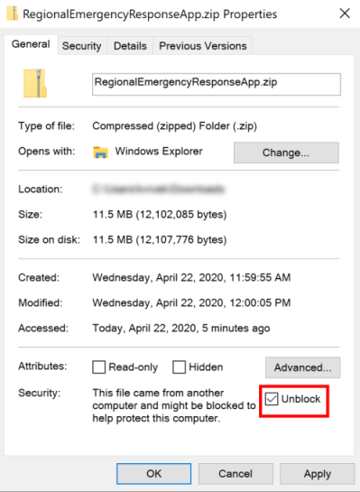

On extracting the .zip file, you will see the following in the extracted folder:

|**Folder**  |**Description**  |
|---------|---------|
|**Package**     |  The folder contains the Package Deployer tool and the package that you will import later to set up the solution in your environment.       |
|**Power BI Template**     | Contains the Power BI Report template file (.pbit) that you will use to configure reporting. More information: [Step 5: Configure and publish Power BI dashboard](#step-5-configure-and-publish-power-bi-dashboard)        |
|**SampleData**     |   Contains the sample master data files (.xlsx) that you can use to import sample data. More information: [Import data using sample files](configure.md#import-data-using-sample-files)      |

## Step 2: Sign up for Power Apps and create an environment

If you don't already have Power Apps, sign up for Power Apps and purchase an appropriate license.
More information:

- [Power Apps Pricing](https://powerapps.microsoft.com/pricing/)

- [Purchase Power Apps](/power-platform/admin/signup-for-powerapps-admin)

After you have purchased Power Apps, create an environment with a Microsoft Dataverse database.

1.  Sign in to [Power Platform admin center](https://aka.ms/ppac).

2.  Create a Dataverse environment with the database. More information: [Create and manage environments](/power-platform/admin/create-environment)

    > [!IMPORTANT] 
    > While creating the database, if you select a security group for the database, the apps can be shared only with users that are members of the security group.

3.	Create appropriate users in your environment. More information: [Create users and assign security roles](/power-platform/admin/create-users-assign-online-security-roles)

After you have created your environment, you can access it using the following URL: https://[myenv].crm.dynamics.com, where [myenv] is the name of your environment. Make a note of this environment URL.

## Step 3: Create a Power Apps portal in your environment

1.  Sign into [Power Apps](https://make.powerapps.com).

2.  Ensure that your newly created environment is selected in the top-right corner.

3.  In the left pane, select **Apps**, and then select **New app** \> **Portal**.

    > [!div class="mx-imgBorder"] 
    > 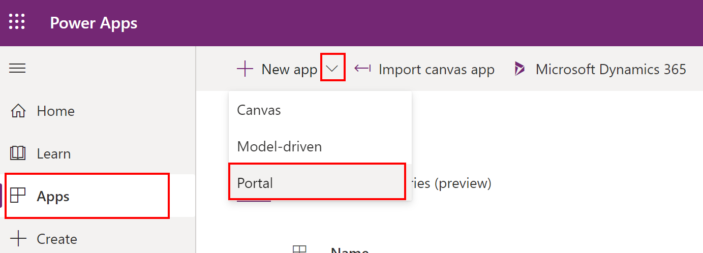

4.	In the **Portal from blank** page, specify appropriate values, and then select **Create**.

    > [!div class="mx-imgBorder"] 
    > 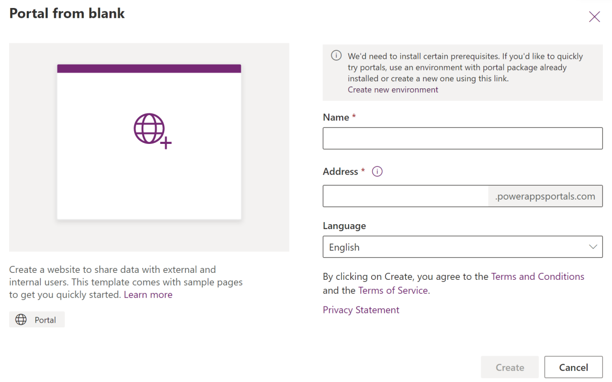

Power Apps will start provisioning the portal for you, and the progress message will be displayed at the upper-right corner of the page.

> [!NOTE]
> It might take a while to provision your portal.

After the portal is provisioned, it will appear in your **Apps** list in Power Apps. You can select the ellipsis (…) for your portal record and select **Browse** to view the starter portal.

> [!div class="mx-imgBorder"] 
> 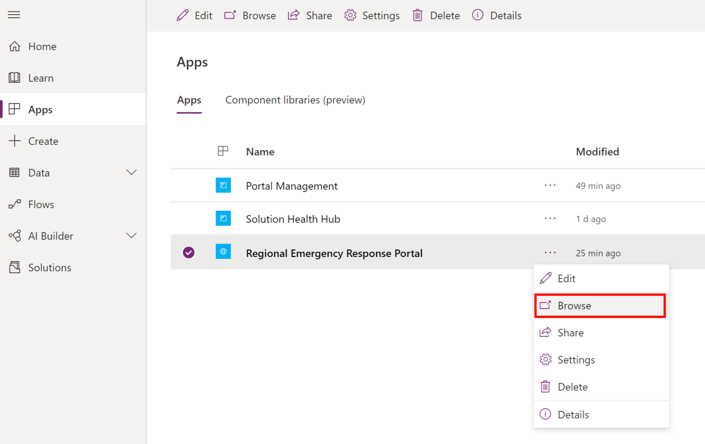

  > [!IMPORTANT]
  > Wait for the portal to be provisioned before proceeding to the next step.

## Step 4: Install the app

After your portal is provisioned, install the Regional Government Emergency Response and Monitoring app to configure the portal your created earlier and install the admin app (model-driven app).

You can install the app by using one of the following 3 options:

- Microsoft AppSource (for Power Apps US Govt customers only). See [Option A: Install the app from Microsoft AppSource (US Govt customers)](#option-a-install-the-app-from-microsoft-appsource-us-govt-customers)

- Microsoft AppSource (for Power Apps commercial version customers). See [Option B: Install the app from Microsoft AppSource](#option-b-install-the-app-from-microsoft-appsource)

- Deployment package that you downloaded earlier. See [Option C: Install the app from the deployment package](#option-c-install-the-app-from-the-deployment-package)

### Option A: Install the app from Microsoft AppSource (US Govt customers)

1.  Sign in to Power Platform admin center. Use the appropriate URL to sign in:
    - **GCC**: [https://gcc.admin.powerplatform.microsoft.us](https://gcc.admin.powerplatform.microsoft.us)
    - **GCC High**: [https://high.admin.powerplatform.microsoft.us](https://high.admin.powerplatform.microsoft.us).

2.  In the left pane, select **Environments**, and then select the name of the environment you created earlier.

3. In the environment details page, select **Dynamics 365 apps** under **Resources**.

    > [!div class="mx-imgBorder"] 
    > 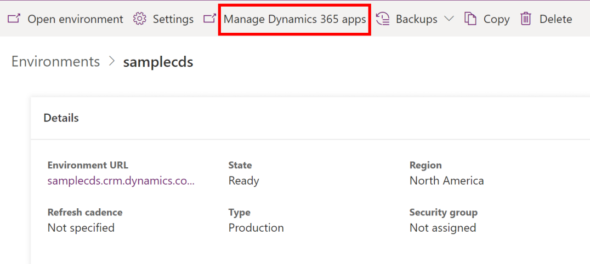

3.  On the Dynamics 365 apps page, select **Install app**. Next select **Regional Govt Emergency Response and Monitoring** in the right pane, and select **Next**.

    > [!div class="mx-imgBorder"] 
    > 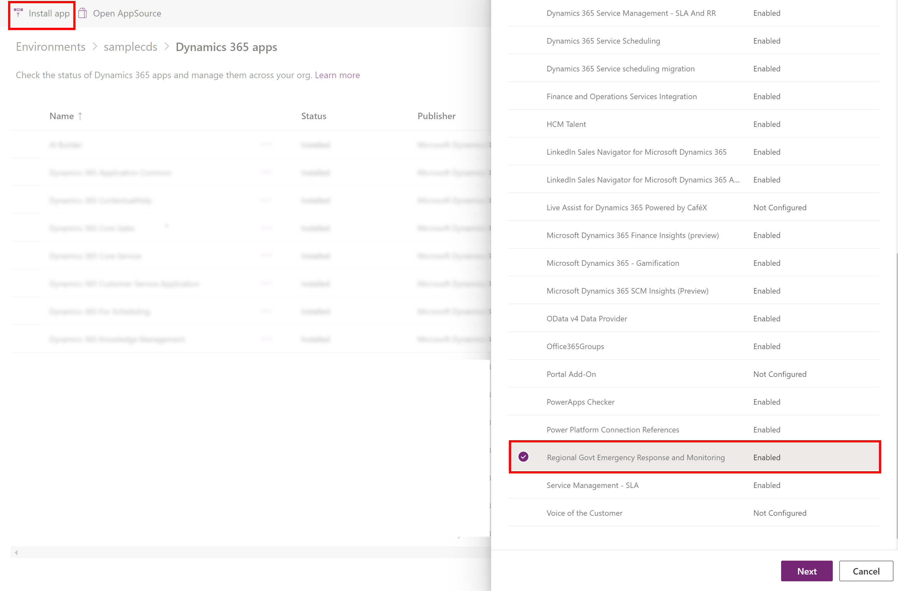

4.  On the next page, agree to the terms, and select **Install**.

5.  The installation will start, and you can monitor the progress of your app installation on the Dynamics 365 apps page.

    > [!div class="mx-imgBorder"] 
    > 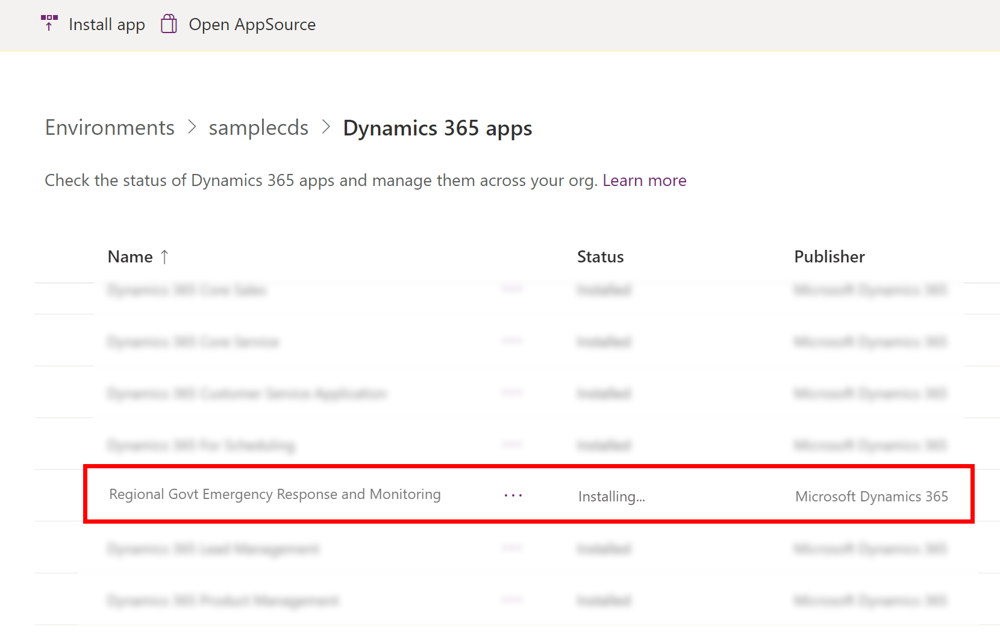

    > [!IMPORTANT]
    > It might take a while for the app to install.

6.  After the app is installed, navigate to [Power Apps](https://make.powerapps.com), and select your environment from the top-right corner. You will find a new admin app in your **Apps** list.

    > [!div class="mx-imgBorder"] 
    > 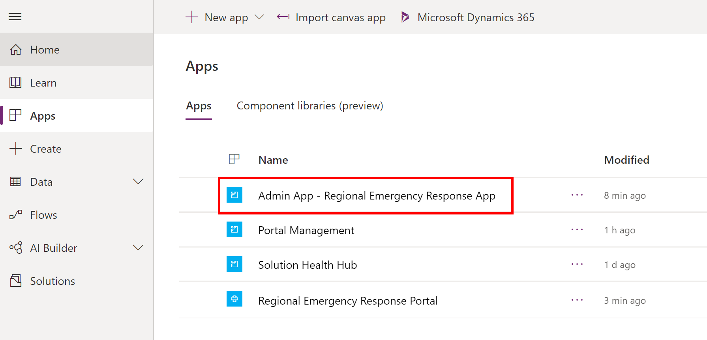

### Option B: Install the app from Microsoft AppSource

1.  Navigate to [AppSource](https://appsource.microsoft.com/), and search for "Regional Govt Emergency Response". Alternatively, navigate directly to the app on AppSource using this link: <https://appsource.microsoft.com/product/dynamics-365/mscrm.pprersapp>

2.  On the Regional Govt Emergency Response and Monitoring page, select **Get It Now**.

    > [!div class="mx-imgBorder"] 
    > 

3.  You are prompted to review the AppSource agreement terms. The dialog also shows the account that is being used to sign in. Select **Continue**. You might be prompted to verify your credentials.

4.  On the next page, select your environment where you want to install the app. Select the legal terms and privacy statements check boxes, and select **Agree**.

    > [!div class="mx-imgBorder"] 
    > 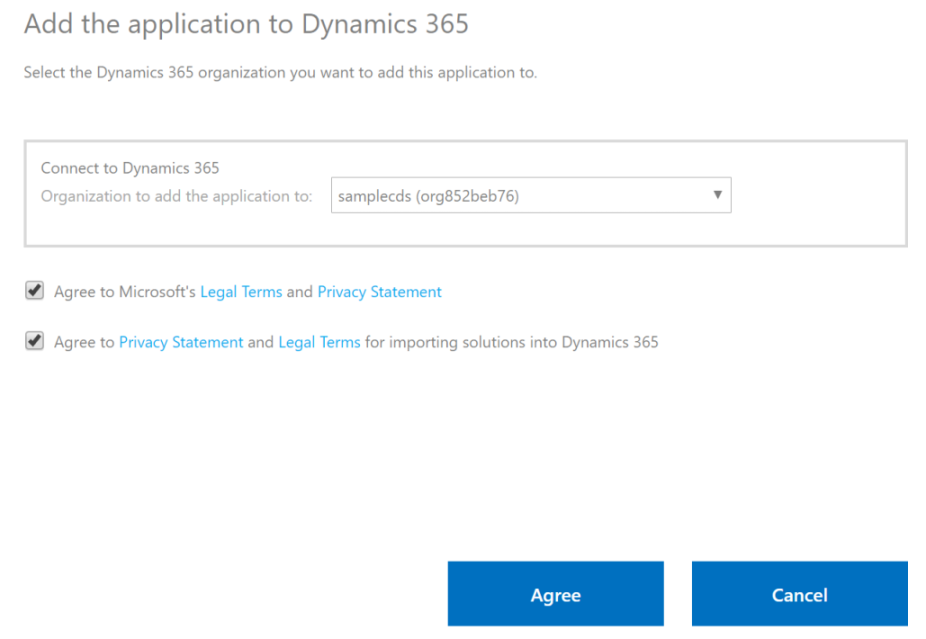

5.  You'll be taken to Power Platform admin center where you can monitor the progress of your app installation.

    > [!div class="mx-imgBorder"] 
    > 

    > [!IMPORTANT]
    > It might take a while for the app to install.

6. After the app is installed, navigate to [Power Apps](https://make.powerapps.com), and select your environment from the top-right corner. You will find a new admin app in your **Apps** list.

    > [!div class="mx-imgBorder"] 
    > 

### Option C: Install the app from the deployment package

1.  Navigate to the location where you extracted the [deployment package](#step-1-download-the-deployment-package) (.zip); you'll find a **Package** folder. Under the **Package** folder, run the **PackageDeployer.exe** file to run the tool to deploy the package.

2.  On the next screen, select **Continue**.

3.  You’ll be prompted to connect to your environment. Select **Office 365** as the **Deployment Type**, select **Show Advanced**, and then type your credentials to connect to your environment.

    > [!div class="mx-imgBorder"] 
    > 

4.  Select **Login** to continue.

5.  If you have access to more than one Dataverse environment, the next screen will prompt you to select the environment where you want to install the package. Select an environment and select **Login**.

    > [!div class="mx-imgBorder"] 
    > 

6.  On the next screen, select **Next.**

7.  The next screen displays you the environment name where the package will be installed. Review the information and select **Next**.

8.  The next screen validates if a starter portal is available on your environment. Select **Next** to continue with the installation.

    > [!div class="mx-imgBorder"] 
    > 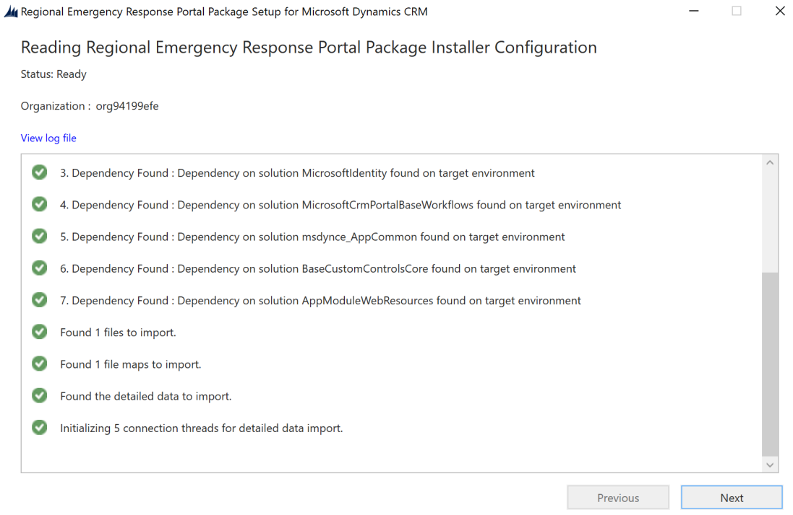

9.	The next screen displays the installation status of the package. Please note that it might take a while for the package installation to complete.

10. After the installation is complete, select **Next**.

11.  On the next screen, select **Finish** to complete and close the setup.

12. After the app is installed, navigate to [Power Apps](https://make.powerapps.com), and select your environment from the top-right corner. You will find a new admin app in your **Apps** list.

    > [!div class="mx-imgBorder"] 
    > 

## Step 5: Configure and publish Power BI dashboard

In this step, we will configure and publish the Power BI dashboard so that it can be embedded in the portal. At the end of this step, you will have a report URL that will be used to embed the report in portal.

You can publish the Power BI dashboard using either of the following options: using the template app from the AppSource or using the .pbit file available in the deployment package.

### Option A: Publish using the template app from AppSource (Preferred Option)

Detailed information about using the template app from the AppSource is available here: [Connect to the Regional Emergency Response Dashboard](/power-bi/connect-data/service-connect-to-regional-emergency-response)

### Option B: Publish using the .pbit file in the deployment package

This section provides information on how you can use the **Regional Emergency Response App.pbit** file available in the deployment package to publish the dashboard.

#### Prerequisites

-   You must be a Global Admin and must have Power BI Pro license to configure and publish report.

-   Create a workspace in Power BI where you will publish the report. Sign into Power BI and create a workspace. More information: [Create the new workspaces in Power BI](/power-bi/service-create-the-new-workspaces)

-   Install Power BI Desktop from the Microsoft Store: <https://aka.ms/pbidesktop>

    > [!NOTE]
    > If you have installed Power BI Desktop by downloading directly from the Download Center page as an executable in the past, remove it and use the one from the Microsoft Store. The Microsoft Store version will be updated automatically as new releases are available.
    >
    > If you can’t install from Microsoft Store, install the latest non-Microsoft Store version from the [Download Center page](https://www.microsoft.com/download/details.aspx?id=58494).

#### The process

1.  Run Power BI Desktop, and sign in using your account.

2.  Navigate to the location where you extracted the [deployment package](#step-1-download-the-deployment-package) (.zip). Under the Power BI Template folder, you will find the **Regional Emergency Response App.pbit**.

3.  Open the **Regional Emergency Response App.pbit** file in Power BI Desktop. You'll will be prompted to type the following value: **CDS_base_solution_URL**. Type the URL of your Dataverse environment instance. For example: https://*[myenv]*.crm.dynamics.com, where *[myenv]* is the name of your environment. Select **Load.**

    > [!div class="mx-imgBorder"] 
    > 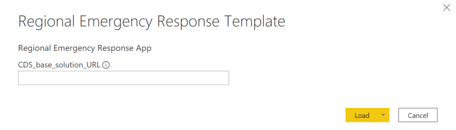

4.  You will be prompted to enter credentials to connect to your Dataverse environment. Select **Organizational account** \> **Sign in** to specify your Dataverse credentials.

    > [!div class="mx-imgBorder"] 
    > 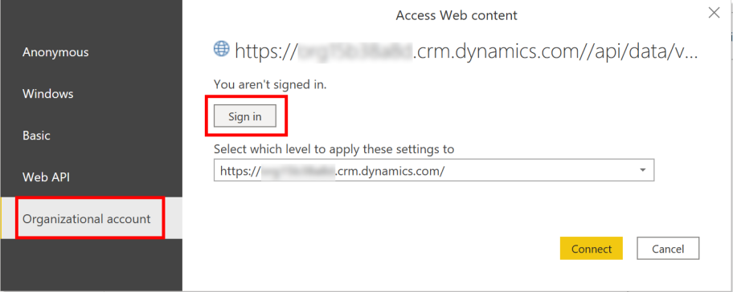

5.  After signing in, select **Connect** to connect to your data in Dataverse.

6.  On successful connection, Power BI report will be displayed. You'll be prompted to apply pending changes to your query; select **Apply changes**.

    > [!NOTE]
    > The report is blank because you haven't yet added data in the system.

7.  Select **Publish** to publish data to your Power BI workspace. You'll be prompted to save your changes; select **Save**.

     > [!div class="mx-imgBorder"] 
     > 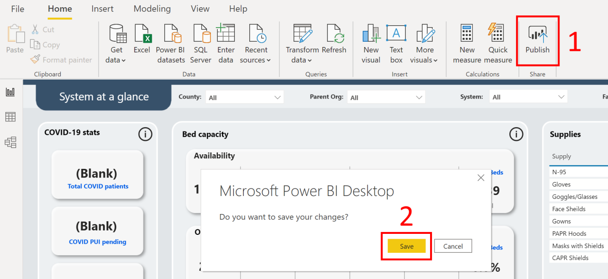

8.  You'll be prompted to save the file as a .pbix file along with your Dataverse environment information. Provide a name and save it on your computer.

9.  After saving the .pbix file, you'll be prompted to publish the report. In the **Publish to Power BI** page, select the workspace where you want to publish, and then click **Select**.

    > [!div class="mx-imgBorder"] 
    > 

10.  The report becomes available in your workspace. Now, we will configure the data refresh settings for the dataset. Under the **Datasets** tab of your workspace, select the **Schedule refresh** icon for the dataset of your report you just published.

      > [!div class="mx-imgBorder"] 
      > 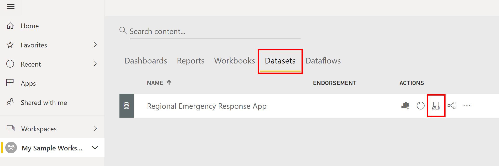

11.  The first time you try to set the data refresh setting, you'll see the **Settings** page with a message stating that your credentials aren't valid. Under **Data source credentials**, select **Edit credentials** to specify your credentials.

      > [!div class="mx-imgBorder"] 
      > 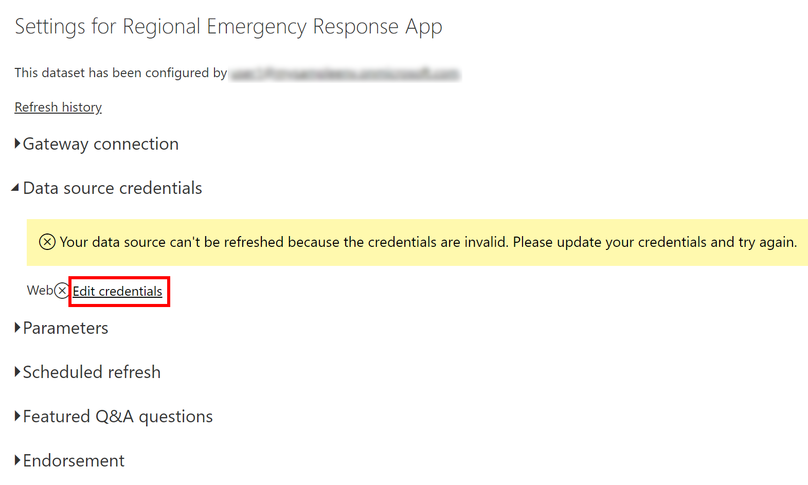

12.  In the next screen:

      1.  Select **Authentication** method as **OAuth2**.

      2.  Select **Privacy level setting for this data source** as
          **Organizational**.

      3.  Select **Sign in**.

13.  You'll be prompted to specify your credentials and sign in. Upon successful sign in, you'll return to the **Settings** page.

14.  In the **Settings** page, expand **Scheduled refresh** and specify the required details for refreshing data based on a schedule. Select **Apply**.

      > [!div class="mx-imgBorder"] 
      > 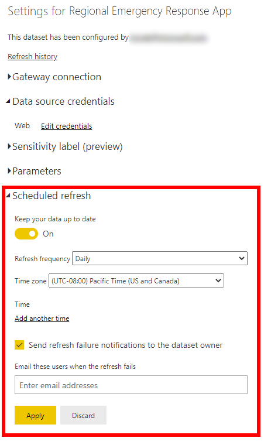

      > [!NOTE]
      > - There are limits to how many times data can refresh. Power BI limits datasets on shared capacity to eight daily refreshes. If the dataset resides on a Premium capacity, you can schedule up to 48 refreshes per day in the dataset settings. More information: [Refresh data](/power-bi/refresh-data#data-refresh)
      >- We recommend setting the data to refresh every 30 mins.

15.  Next, go back to your workspace, select the **Reports** tab, and then select the report to open it in browser.

        > [!div class="mx-imgBorder"] 
        > 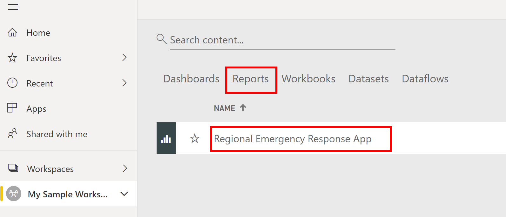

16.  The URL will be in the following format:
    https://app.powerbi.com/groups/3d6db5d0-22c7-4674-b957-0605c021511d/reports/bf9cd5a1-c176-4786-9c4e-684a79678575/ReportSection?redirectedFromSignup=1 
    Copy the Power BI report URL to a Notepad as you will need it in the next section to embed it in the portal.

17. If you want this Power BI report to be available to other users within your Power BI tenant, consider publishing the report as an app. Select your workspace name in the left pane, and then select **Create app** in the top-right corner.  

18. On the app publishing page:

    1. On the **Setup** tab, specify the name and description of your app.

    2. On the **Navigation** tab, specify the location where you will publish it.

    3. On the **Permissions** tab, specify users or group who will be able to view this app. Make sure you select the **Install this app automatically** check box to install this app automatically for end users. More information: [Automatically install apps for end users](/power-bi/service-create-distribute-apps#automatically-install-apps-for-end-users)  

        > [!div class="mx-imgBorder"]
        > 

18. Select **Publish app.** For detailed information on publishing apps in Power BI, see [Publish your app](/power-bi/service-create-distribute-apps#publish-your-app).

## Step 6: Embed Power BI report in portal

In this step, we will embed the Power BI report (published in the previous step) to your portal.

### Prerequisites

- You must have Global Admin role to perform this step.

- Before you can embed a Power BI report in Power Apps portal, **Power BI visualization** and **Power BI embedded service** must be enabled for your portal using the [Power Apps Portals admin center](../../maker/portals/admin/admin-overview.md).

  > [!div class="mx-imgBorder"] 
  > 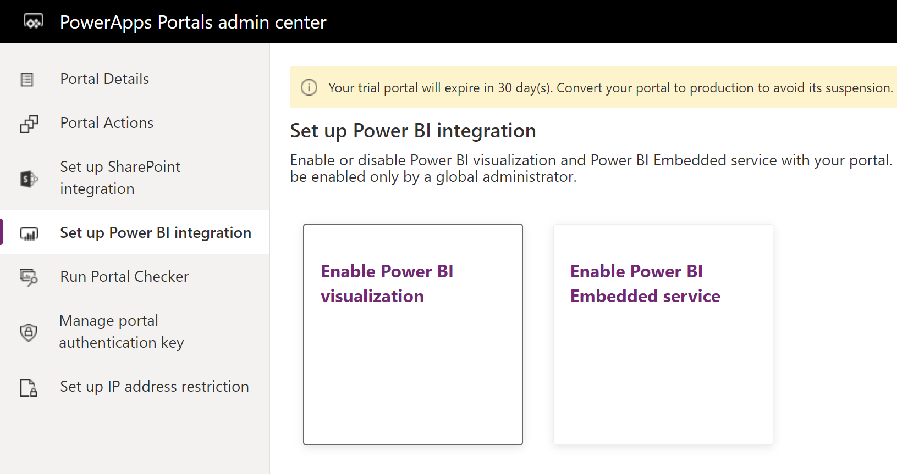

For step-by-step instructions, see the following in Power Apps portals docs:

-   [Enable Power BI visualization](../../maker/portals/admin/set-up-power-bi-integration.md#enable-power-bi-visualization)

-   [Enable Power BI embedded service](../../maker/portals/admin/set-up-power-bi-integration.md#enable-power-bi-embedded-service)

### The process

Now that you have enabled both Power BI visualization and Power BI Embedded service, we will now add the report URL to embed in your portal. Make sure you have your Power BI report URL handy from the previous step.

1.  Sign into [Power Apps](https://make.powerapps.com).

2.  In the left pane, select **Apps**, and select the **Portal Management** app to open it.

    > [!div class="mx-imgBorder"] 
    > 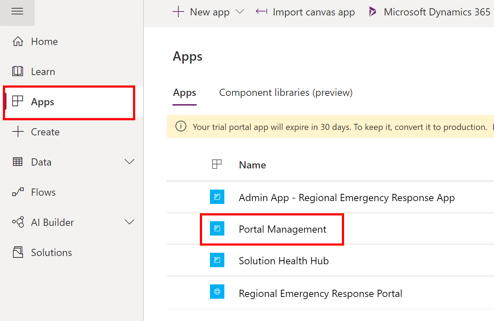

3.  In the left pane, select **Site Settings**, select **New**:

    > [!div class="mx-imgBorder"] 
    > 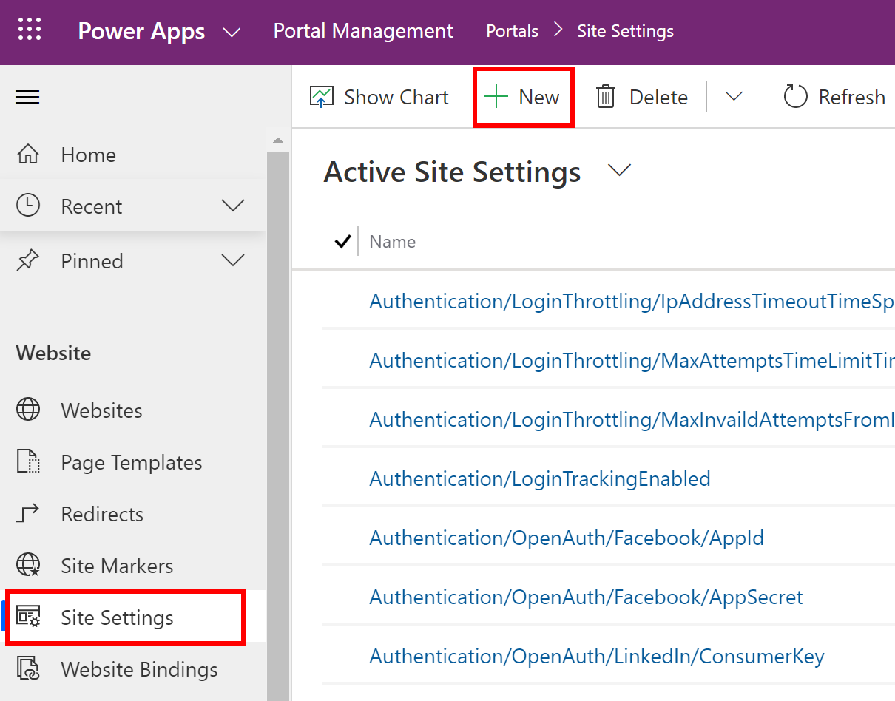

4.  On the **New Site Setting** page, specify the following values:

    1.  **Name**: PowerBI Path

    2.  **Website**: Select **Starter Portal**

    3.  **Value**: Copy the Power BI report URL from the previous step.

        > [!div class="mx-imgBorder"] 
        > 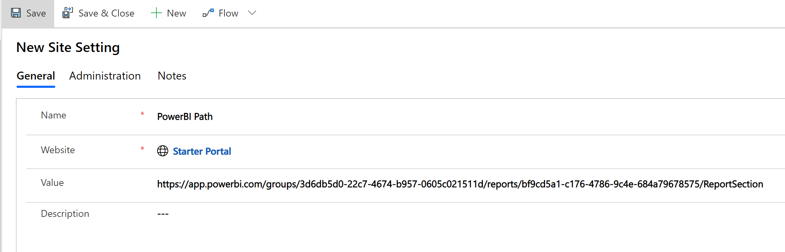

5.  Select **Save & Close** to save the record.

### Restart the portal

Now, we will restart the portal for the changes to take effect.

1.  Sign into [Power Apps](https://make.powerapps.com).

2.  In the left pane, select **Apps**, select the ellipsis (…) menu for your portal, and select **Settings**.

    > [!div class="mx-imgBorder"] 
    > 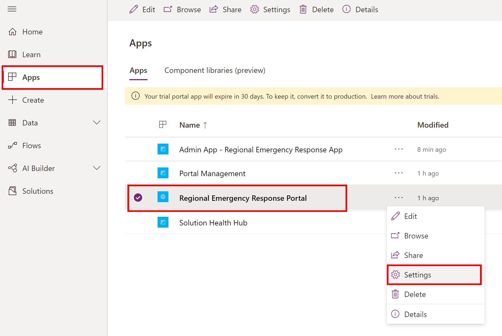

3.  In the **Portal settings** pane, select **Administration**.

    > [!div class="mx-imgBorder"] 
    > 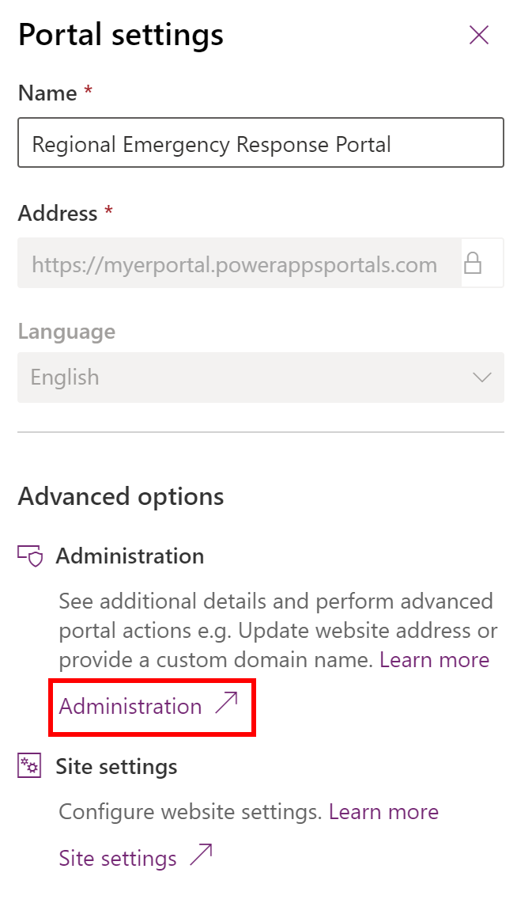

4.  In the Power Apps Portals admin center, select **Portal Actions** \> **Restart**.

    > [!div class="mx-imgBorder"] 
    > 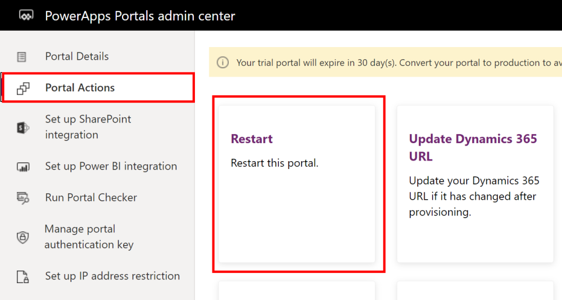

5.  Select **Restart** in the confirmation message to restart the portal.

  > [!NOTE]
  > Optionally, you can also set up a vanity URL for your portal by using a custom domain name. A custom domain can help your customers find your support resources more easily and enhance your brand. For detailed information to do so, see [Add a custom domain](../../maker/portals/admin/add-custom-domain.md) in portals docs.

## Step 7: Add a custom title and logo for your portal

You can add a custom logo and title to your portal to align with your organization brand.

> [!NOTE]
> For the custom logo image, the recommended color is white transparent with an icon frame size of 40x40px and an icon size of 24x24px with 8px padding in the SVG format. If you are using the PNG/JPG format for the logo, use an icon frame size of 80x80px and icon size of 48x48px with 16px padding.

### The process

1.  Sign into [Power Apps](https://make.powerapps.com).

2.  Open the **Portal Management** app from your apps list.

3.  In the left pane, select **Site Settings,** and select **New.**

4.  On the **New Site Setting** page, specify the following values:

    1.  **Name**: SiteTitle

    2.  **Website**: Select **Starter Portal**

    3.  **Value**: String that you want to appear in the top-left corner of your portal.

        > [!div class="mx-imgBorder"] 
        > 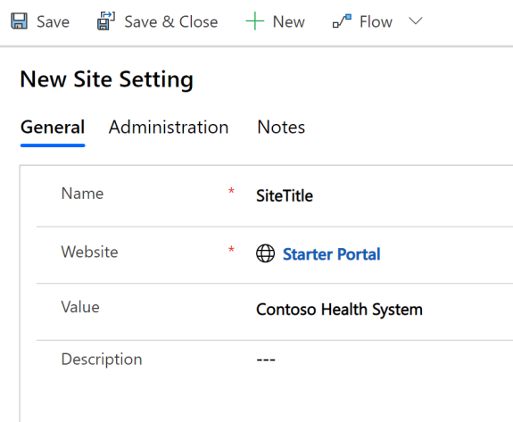
        
5.  Select **Save** to save the site setting record.

6.  Select **New** to create another site setting record.

7.  On the **New Site Setting** page, specify the following values:

    1.  **Name**: SiteLogoPath

    2.  **Website**: Select **Starter Portal**

    3.  **Value**: Name of your logo image file. For example, specifying mylogo.png will make the portal look for this file at the root of the portal. We will later upload the logo file to our portal.

        > [!div class="mx-imgBorder"] 
        > 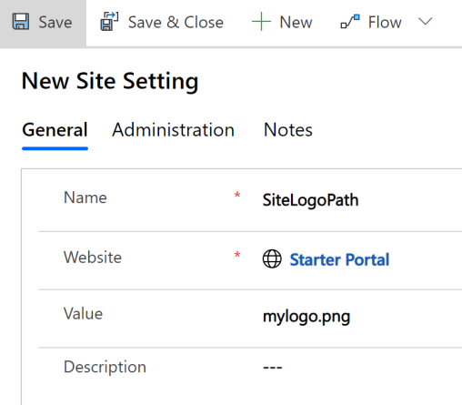       

8.  Select **Save & Close** to save this record and close the page.

9.  Now, we will upload the logo image file. In the left pane, select **Web Files**, and select **New**.

10. On the **New Web File** screen, specify the following values:

    1.  **Name**: mylogo.png

    2.  **Website**: Select **Starter Portal**

    3.  **Parent Page:** Select **Choose Facility**

    4.  **Partial URL:** mylogo.png

        > [!IMPORTANT]
        > Ensure that this value matches the value you specified earlier for the **SiteLogoPath** site setting.

    5.  **Publishing State**: Select **Published**

        > [!div class="mx-imgBorder"] 
        > 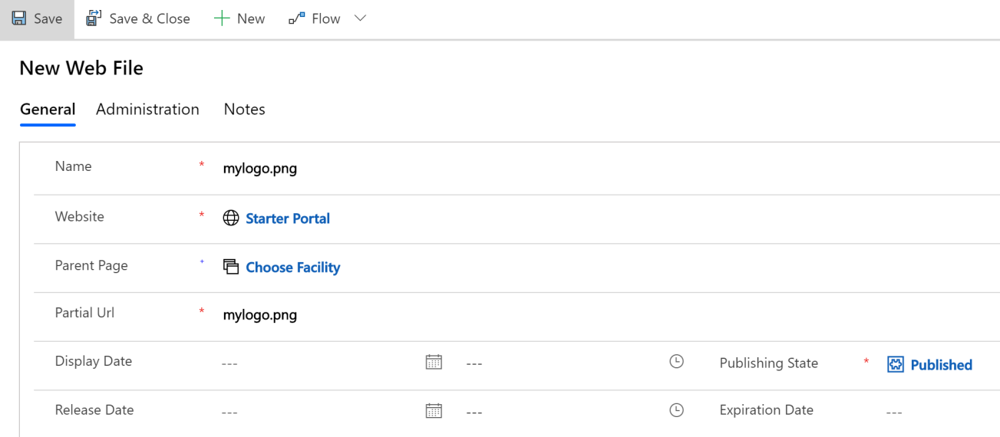

11.  Select **Save** to save the record.

12.  Select the **Notes** tab, and then select **+** followed by **Note.**

      > [!div class="mx-imgBorder"] 
      > 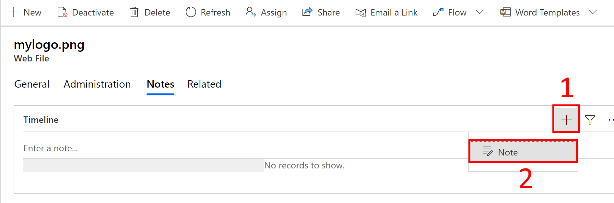

13.  In the **Title** field, enter mylogo.png. Select the attachment icon to select the logo image file from your computer.

      > [!div class="mx-imgBorder"] 
      > 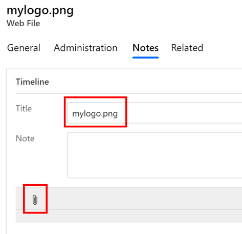

14.  Select the appropriate logo image from your computer (in the .PNG format).
    The selected image appears in the page.

15.  Select **Add note**.

16.  Select Save in the lower-right corner of the page to save the record.

You are done. It might take a while for the latest title and logo to appear on your portal. Refresh your portal in next 5-10 mins to see your latest title and logo.

## Step 8: Add a custom About page in your portal

You can add a custom About page in your portal to add/present information or resources for your users.

1.  Sign into [Power Apps](https://make.powerapps.com).

2.  In the left pane, select **Apps**, select the ellipsis (…) menu for your portal, and select **Edit**. This will open the portal configuration page.

3.  Select **New page** \> **Fixed layouts** \> **About Us Page Template.**

    > [!div class="mx-imgBorder"] 
    > 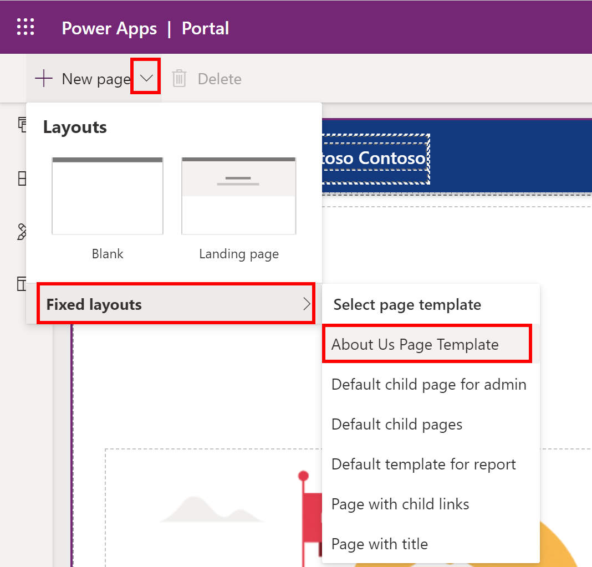
    

4.  On the new webpage, make sure you use **about** in the **Partial URL** field in the right pane. You can use a name of your choice in the **Name** field; we are using **About Contoso**.

    > [!div class="mx-imgBorder"] 
    > 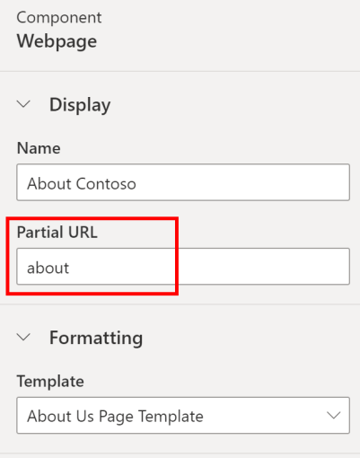    

5.  Click the left pane to edit the contents. You can either use the default editor or select the **\</\>** in the bottom-right corner to open the HTML editor.

    > [!div class="mx-imgBorder"] 
    > 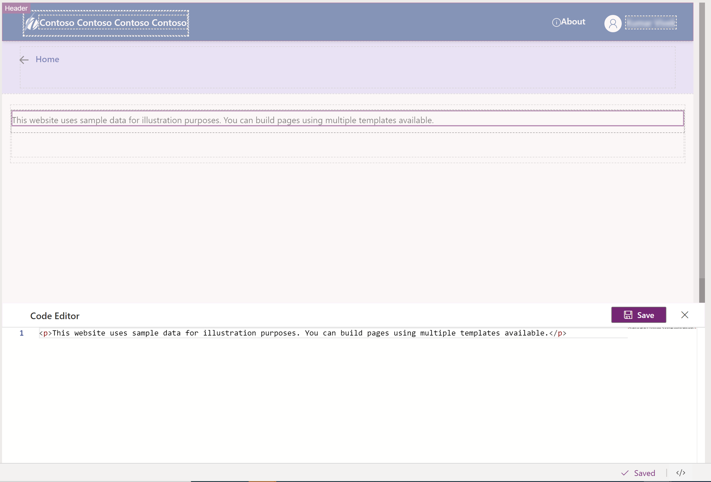    

6.  After making the required changes to the About page, save it, and select **Sync Configuration** on the top-right corner.

The newly created About page can be accessed by your portal users by using the **About** link in the header of the portal.

## Step 9: Set up server-side synchronization of emails

Server-side synchronization enables you to sync emails in Dataverse with Microsoft Exchange Online, Microsoft Exchange Server (on-premises), and POP3 email server for web-hosted email like Gmail or Outlook.com.

> [!div class="mx-imgBorder"] 
> 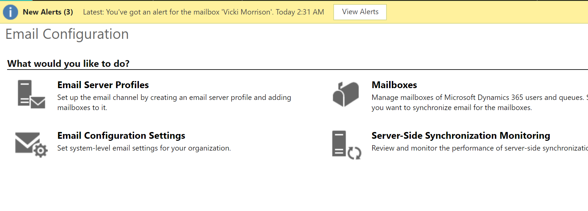

For detailed steps on setting server-side sync; see the following resources:

-   [Set up server-side sync](/power-platform/admin/set-up-server-side-synchronization-of-email-appointments-contacts-and-tasks)

-   [Connect to Exchange Online](/power-platform/admin/connect-exchange-online)

-   [Connect to Exchange Server (on-premises)](/power-platform/admin/connect-exchange-server-on-premises)

    > [!WARNING]
    > Make sure this user is not configured for server-side sync on any other Dataverse or Dynamics 365 environment. If you have a server-side sync set in another environment, enabling the server-side sync here will disable it in the previously used environment.

## Step 10: Fix the processes for the app

In this step, we will be fixing the following processes:

- Send Invitation

- Send Password Reset To Contact

- Assign Web Roles to New Users

### Step 10.1: Fix the Send Invitation process

In this step, we will fix the **Send Invitation** process to specify the email address from which the portal invitation will be sent out to individual hospital admins and the invitation URL sent out in the invitation email.

1.  Sign into [Power Apps](https://make.powerapps.com).

2.  Select the settings gear on the top-right corner, and then select **Advanced Settings.**

3.  On the Settings page, select the drop-down arrow next to **Settings** and select **Processes**.

    > [!div class="mx-imgBorder"] 
    > 
    

4.  On the **Processes** page, search for “Send Invitation”, and select the **Send Invitation** process to open it.

5.  In the process definition page:

    1.  Select **Deactivate** from the command bar to deactivate the process. Confirm to deactivate.

    2.  Under the steps area, select **Set Properties** for the **Create Email** step:

        > [!div class="mx-imgBorder"] 
        > 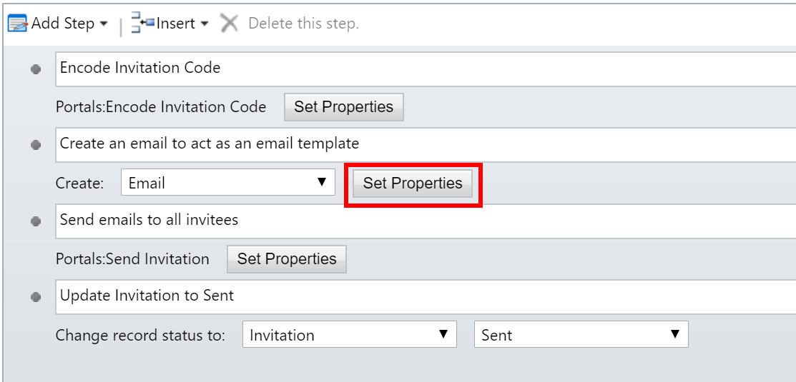

6.  In the **Create Email** step definition page:

    1.  Select the email ID in the **From** field that will be used to send the portal invitation links. The user account specified here must have the server-side synchronization enabled for the email to be sent out.

        > [!TIP]
        >  You might want to set up an account in your environment with the server-side synchronization enabled and an email address like no-reply\@[*customerdomain*].com to send portal invitation emails.

    2.  Update the “https://**regionaldev**.powerappsportals.com” string in the email body with the actual URL of your portal. Also, ensure you don’t change the **Encode Invitation Code** content highlighted in yellow.

        You can make other changes as required in the email body to align with your organization branding.

    3.  Select **Save and Close** to save your changes.

        > [!div class="mx-imgBorder"] 
        > 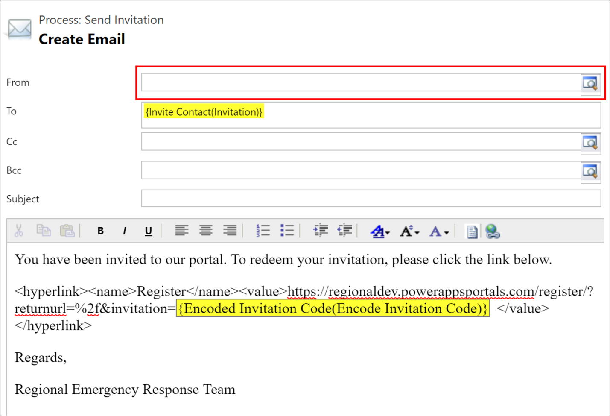
        

3.  You will return to the process definition page. Save the changes and **Activate** the process.

    > [!div class="mx-imgBorder"] 
    > 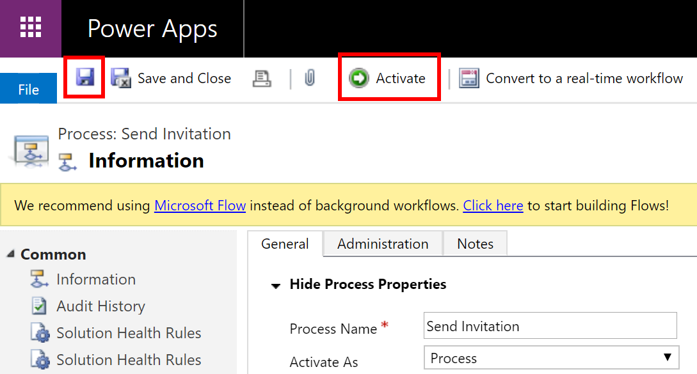    

### Step 10.2: Fix the Send Password Reset To Contact process

In this step, we will fix the **Send Password Reset To Contact** process to specify the email address from which the portal password reset email will be sent to the portal user when she/he requests to reset the password using the **Forgot password** link in the portal.

1.  Sign into [Power Apps](https://make.powerapps.com).

2.  Select the settings gear on the top-right corner, and then select **Advanced Settings.**

3.  On the Settings page, select the drop-down arrow next to **Settings** and select **Processes**.

    > [!div class="mx-imgBorder"] 
    > 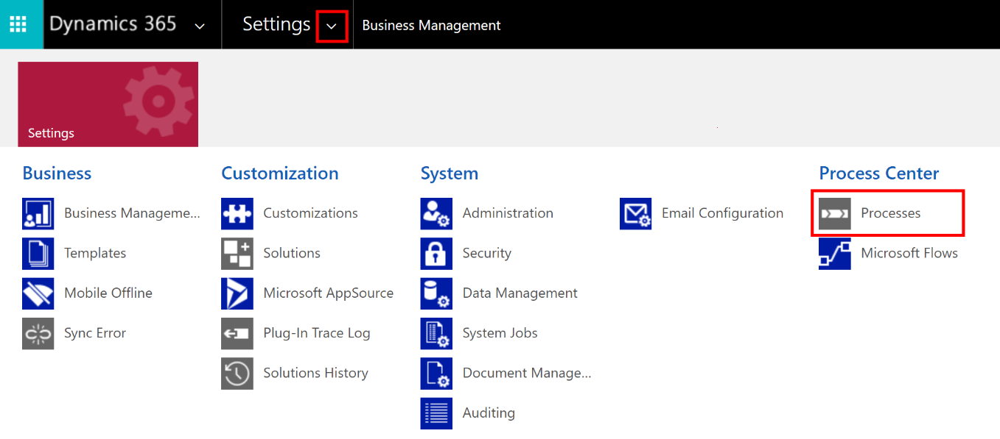
   

4.  On the **Processes** page, search for “Send Password Reset To Contact”, and select the **Send Password Reset To Contact** process in the search result to open it.

5.  In the process definition page:

    1.  Select **Deactivate** from the command bar to deactivate the process.
        Confirm to deactivate.

    2.  Under the steps area, select **Set Properties** for the **Send Email**
        step:

        > [!div class="mx-imgBorder"] 
        > 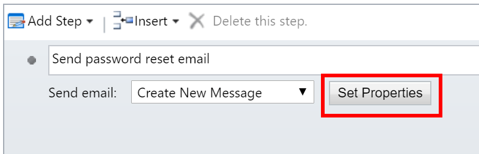
       

6.  In the **Send Email** step definition page, remove the dynamic value (highlighted in yellow) in the **From** field.

    > [!div class="mx-imgBorder"] 
    > 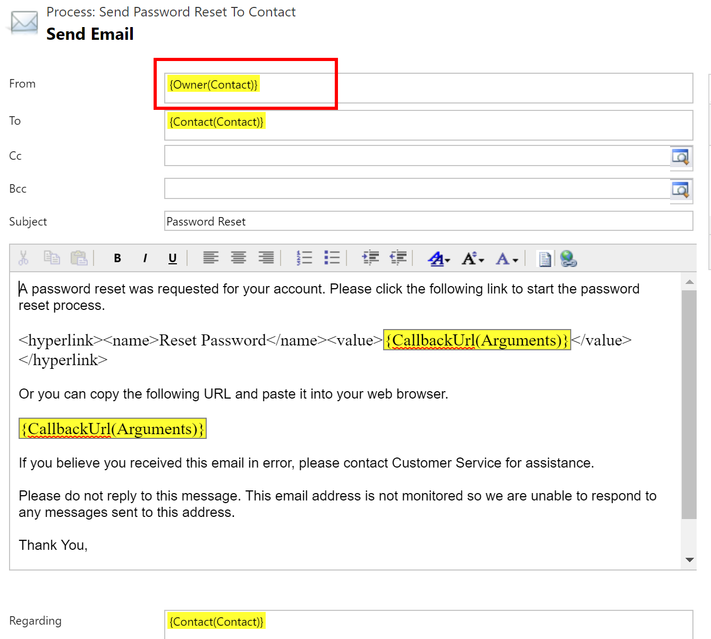
    

7.  Select the email ID in the **From** field that will be used to send the portal invitation links. The user account specified here must have the server-side synchronization enabled for the email to be sent out.

    > [!TIP]
    > You might want to set up an account in your environment with the server-side synchronization enabled and an email address like no-reply\@[*customerdomain*].com to send password reset emails.
    > Make sure you don’t update the dynamic values highlighted in yellow. Optionally, you can update the email body content as required per your organization in the email body.

    > [!div class="mx-imgBorder"] 
    > 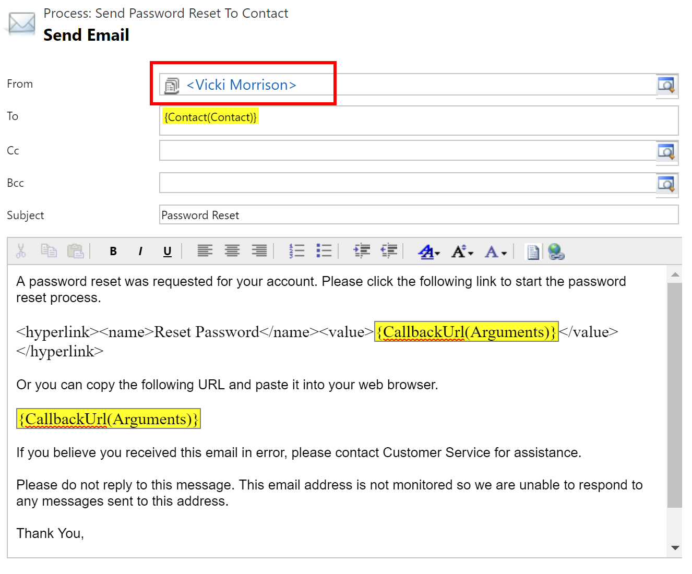
    

8.  Select **Save and Close** to save your changes.

9.  You will return to the process definition page. Save the changes and **Activate** the process.

    > [!div class="mx-imgBorder"] 
    > 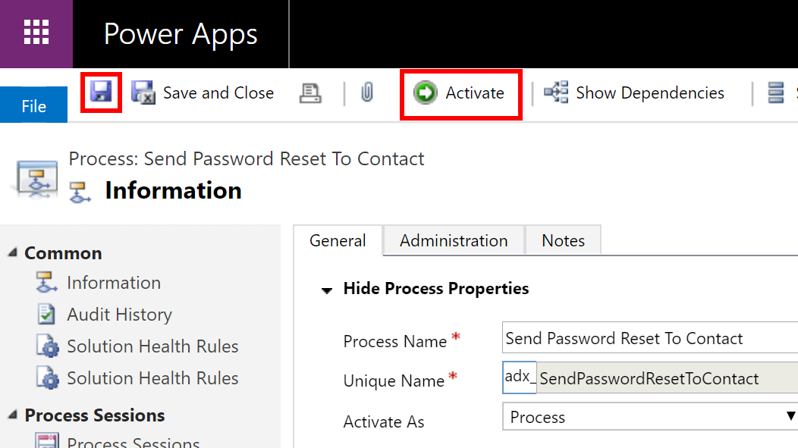    

### Step 10.3: Verify Assign Web Roles to New Users process is enabled

1.  Sign into [Power Apps](https://make.powerapps.com).

2.  Select the settings gear on the top-right corner, and then select **Advanced Settings.**

3.  On the Settings page, select the drop-down arrow next to **Settings** and select **Processes**.

    > [!div class="mx-imgBorder"] 
    > 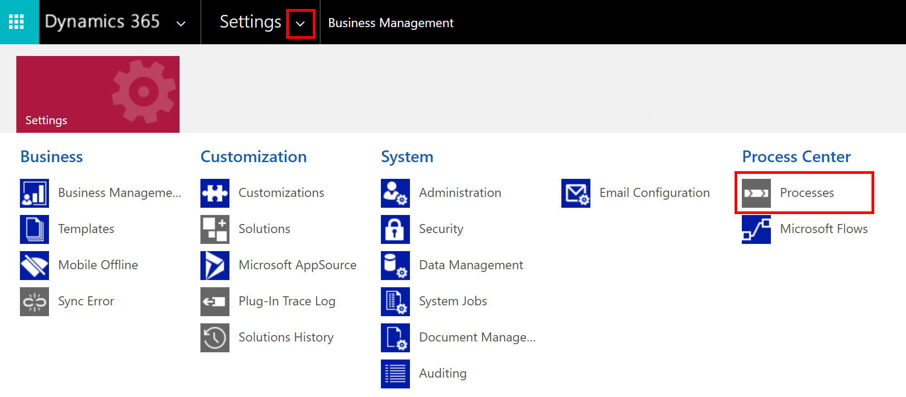    

4.  On the **Processes** page, search for “Assign Web”, and ensure that the **Assign Web Roles to New Users** process is enabled.

    > [!div class="mx-imgBorder"] 
    > 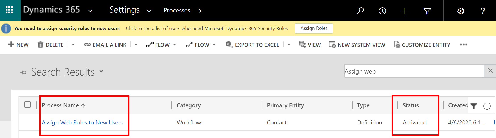    

5.  If it’s not enabled, select the process name to open the record, and then select **Activate**. Confirm to activate the process.

## Step 11: Fix the flows for the app

In this step, we will fix the flows that are required by the app. You can view all the flows used by the app using the following steps:

1.  Sign into [Power Automate](https://flow.microsoft.com/).

2.  In the left pane, select **Solutions.** From the solution list, select **Regional Emergency Response Solution** to open the solution.

    > [!div class="mx-imgBorder"] 
    > 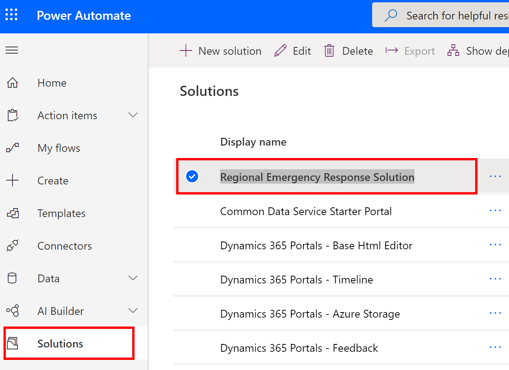

3.  In the solution, filter on **Flow** to find all the flows.

    > [!div class="mx-imgBorder"] 
    > 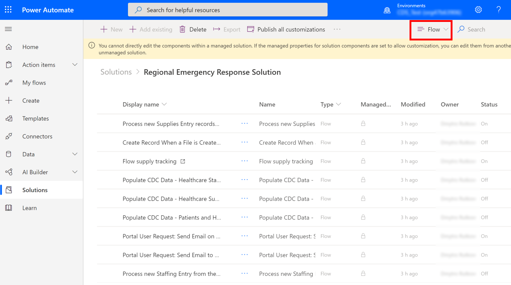

There are two sets of flows:

- First set of flows help with sending emails:
    - Portal User Request: Send Email on Decline Request
    - Portal User Request: Send Email to Admins on Request Creation
    
    For these flows, we have to authorize the connection and then specify a user account to send emails, and then enable the flow.

- Second set of flows help complete a task:
    - Process new Supplies Entry records
    - Flow supply tracking
    - Populate CDC Data - Healthcare Staff
    - Populate CDC Data - Healthcare Supply
    - Populate CDC Data - Patients and Hospitals Capacities
    - Process new Staffing Entry for the Portal 

    For these flows, we have to authorize the connection and then enable the flow.

### Step 11.1: Fix the flows for sending emails

In this step, we are going to do the following:

|Flow name|Changes|
|--|--|
|**Portal User Request: Send Email on Decline Request**|Update the connection to connect to Dataverse and then specify a user account to send emails.|
|**Portal User Request: Send Email to Admins on Request Creation**|Update the connection to connect to Dataverse and then specify a user account to send emails. Additionally, update the portal URL in the email body as per your Portal URL.| 

1.  Sign into [Power Automate](https://flow.microsoft.com/).

2.  In the left pane, select **Solutions.** From the solution list, select **Regional Emergency Response Solution** to open the solution.

    > [!div class="mx-imgBorder"] 
    > 

3.  In the solution, filter on **Flow** to find the flows. 

    > [!div class="mx-imgBorder"] 
    > 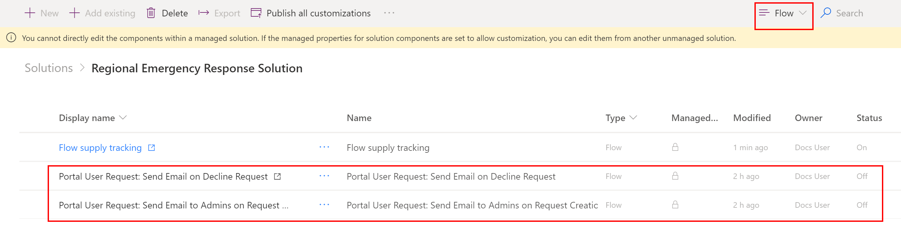

4.  Select the **Portal User Request: Send Email on Decline Request** name to open the flow definition. Select **Edit** on the toolbar.

5.  Specify the connection to connect to Dataverse by selecting **Connections** and then either using the existing connection or using a new credential by selecting **Add new connection**.  

    > [!div class="mx-imgBorder"] 
    > 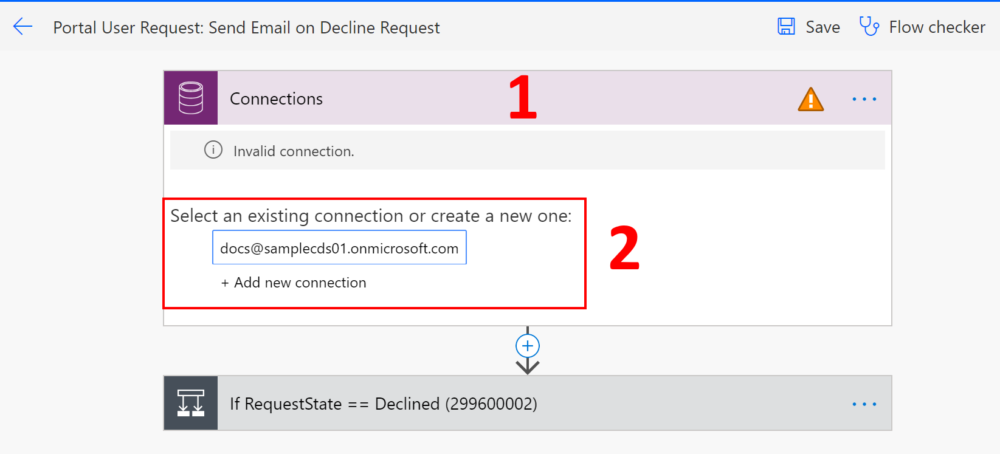

6.  After fixing the connection to connect to Dataverse, select **IfRequestState ==**, and specify the user account that has a mailbox enabled account to send emails.

    > [!div class="mx-imgBorder"] 
    > 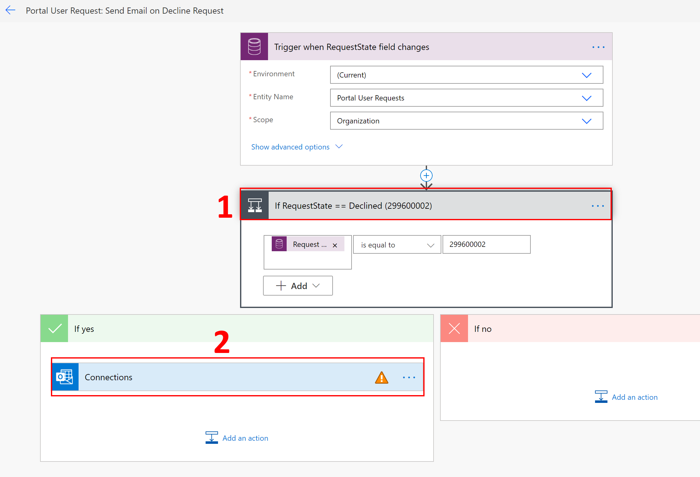

7. Select **Save** to save the changes, and then select **Turn On**.

8.  Next, go to the flows list, and select the **Portal User Request: Send Email to Admins on Request Creation** name to open the flow definition. Select **Edit** on the command bar.

9.  Fix the connection to connect to Dataverse by selecting **Connections** and then either using the existing connection or using a new credential by selecting **Add new connection**.

10. After fixing the connection to connect to Dataverse:
     1. Select **IfRequestState ==**
     2. Select **Connections** to specify the connection to connect to Dataverse 
     3. Select **Connections** to specify the user account credentials that has a mailbox enabled account to send emails

    > [!div class="mx-imgBorder"] 
    > 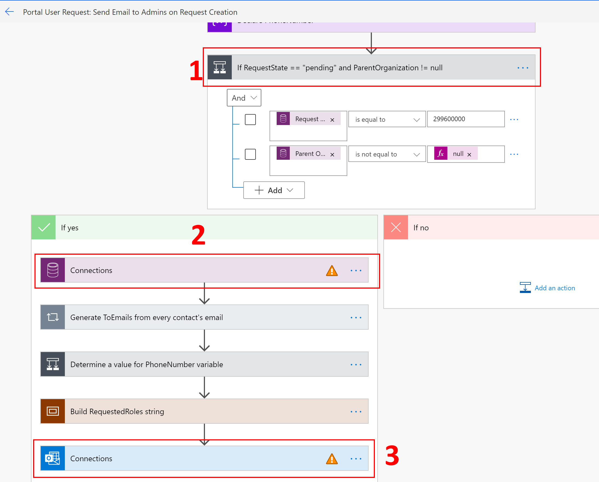

11. In **Send an email**, ensure that you fix the URL as per your portal URL. For example, in this case, change rer6 to your URL value.

    > [!div class="mx-imgBorder"] 
    > 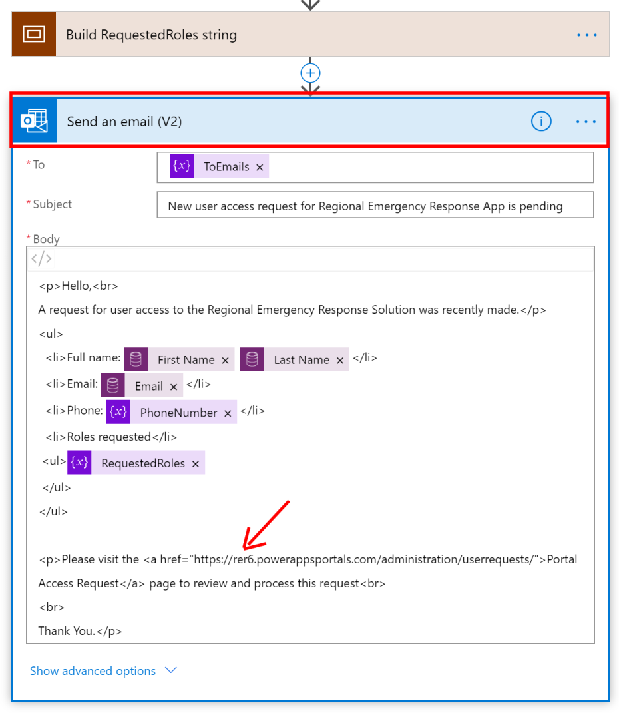

12. Select **Save** to save the changes, and then select **Turn On**.

### Step 11.2: Fix the flows for performing specific tasks

In this step, we will authorize the connection information for the flows that help perform specific tasks, and then enable them.

1.  Sign into [Power Automate](https://flow.microsoft.com/).

2.  In the left pane, select **Solutions.** From the solution list, select **Regional Emergency Response Solution** to open the solution.

3.  In the solution, filter on **Flow** to find the **Flow supply tracking** record.

4.  Select the flow name to open the flow definition. In the flow definition, select **Edit** on the toolbar.

5.  Specify the connection to connect to Dataverse by selecting **Connections** and then either using the existing connection or using a new credential by selecting **Add new connection**.  

    > [!div class="mx-imgBorder"] 
    > 

6. Select **Save** to save the changes, and then select **Turn On**.

7. Perform steps 4-6 with each of the following flows to authorize the connection, and then enable the flow:

    - Process new Supplies Entry records
    - Populate CDC Data - Healthcare Staff
    - Populate CDC Data - Healthcare Supply
    - Populate CDC Data - Patients and Hospitals Capacities
    - Process new Staffing Entry for the Portal

## Step 12: Share admin app with other admin users

For your business admin users to use the admin app (model-driven app) to enter and manage data, it must be shared with them. It's easier to use Azure AD groups to easily share apps with a group of admin users.

> [!IMPORTANT]
> Make sure the user or group you plan to share the app with already have access to your environment. Typically, you would have already added users or group while setting up your environment. Alternatively, you can follow the steps here to add users to your environment and provide appropriate access before sharing app with them: [Create users and assign security roles](/power-platform/admin/create-users-assign-online-security-roles).

1.  Sign into [Power Apps](https://make.powerapps.com).

2.  In the left navigation pane, select **Apps**, select the model-driven app (**Admin App – Regional Emergency Response App**) and select **Share** in the banner.

    > [!div class="mx-imgBorder"] 
    > 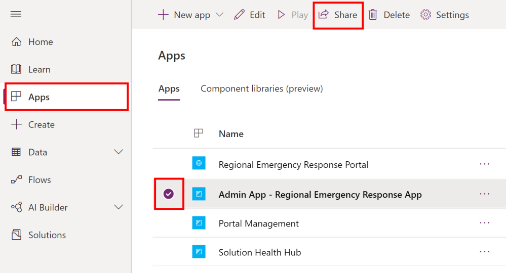

3.  Specify the Azure AD group or admin users that you want to share this app with, assign the **Regional Emergency Response Admin** security role, and select **Share**.

    > [!div class="mx-imgBorder"] 
    > 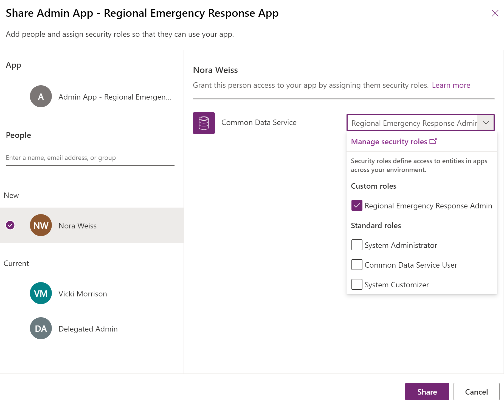

## Next steps

The deployment steps are complete now. Business admins can refer to the [configuration](configure.md) topic to perform the following steps:

-  Configure and manage the master data

-  Create portal users to invite admin users from individual hospitals so that they can use portals to add and manage data and users.

- View Power BI dashboard in your tenant.

## Issues and feedback

- To report an issue with the Regional Government Emergency Response and Monitoring solution, visit <https://aka.ms/rer-issues>.

- For feedback about the Regional Government Emergency Response and Monitoring solution, visit <https://aka.ms/rer-feedback>.

[!INCLUDE[footer-include](../../includes/footer-banner.md)]