# Administer the Regional Government Emergency Response and Monitoring portal

Hospital staff are challenged to meet an increase in number of patients while managing supply chain during emergency. By using the Regional Government Emergency Response and Monitoring
portal, administrators can quickly view and update data related to **Users**, **Systems**, **Regions**, and **Facilities**. Stakeholders can view the published insights through dashboards for current status of the health care system and take actions.

## Portal at a glance

Browse to the Power Apps portal to add, edit or delete **Users**, **Systems**, **Regions**, and **Facilities**. The following section walks you through what you can
access, submit, or update as the administrator of the portal.

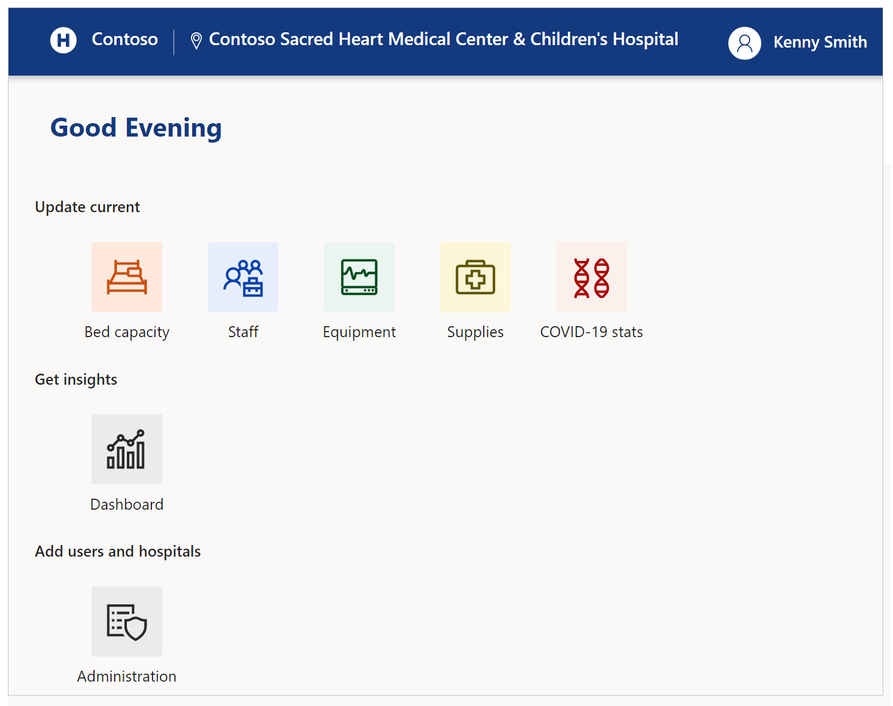

You can use latest mobile devices and web browsers when using Regional Government Emergency Response and Monitoring portal except Apple iPad.

[!include[cc-getting-started](includes/cc-getting-started.md)]

> [!NOTE] 
> Administrators must select **Hospital System, Region** and **Facility** and select **Next** to view the administrative and dashboard settings. When using the portal only for administrative actions such as user management or dashboard reviews, you can select any location. However, if you want to use user components such as **Staff** or **Equipment**, ensure you have selected the correct location.

[!include[cc-manage-user-profile](includes/cc-manage-user-profile.md)]

## Administrative Tasks

You can view all administrative options available to you after selecting **Administration** on home screen:

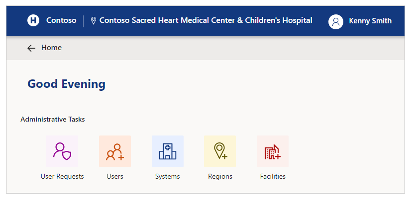

### Administrative tasks and description

| **Option name** | **Description**                                                                                               |
|-----------------|---------------------------------------------------------------------------------------------------------------|
| [User Requests](#user-requests) | View, approve, or decline portal user requests.
| [Users](#users)       | Create, edit, or deactivate portal users.                                                         |
| [Systems](#systems)      | Create, edit, or delete systems. |
| [Regions](#regions)      | Create or delete regions.                              |
| [Facilities](#facilities)    | Create, edit, or delete facilities.                        |
| [CDC Data Feed](#cdc-data-feed) | View, edit or download the Centers for Disease Control and Prevention (CDC) data feed so that you can upload the data to the CDC web site.

### User Requests

You can view, approve, and decline portal user requests using the **User Requests** administrative task option.

When you select **User Requests**, you can see all existing portal user requests submitted pending review:

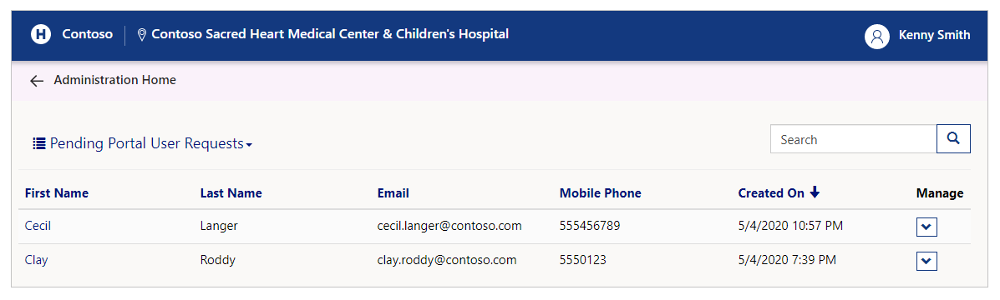

You can choose to change the view and see approved or declined requests:

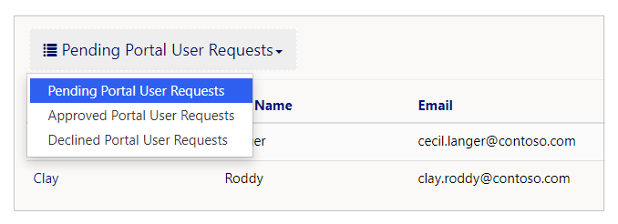

#### Process pending requests

To process pending portal user requests, select **View details** for a pending request from the **Pending Portal User Requests** view:

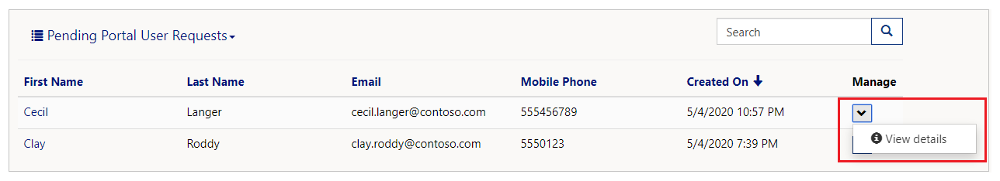

From the details view, you can check user contact information, roles and you can approve or decline the request. The roles selected on the form are the requested roles. You can add or remove roles using the checkbox before you approve or decline the request:

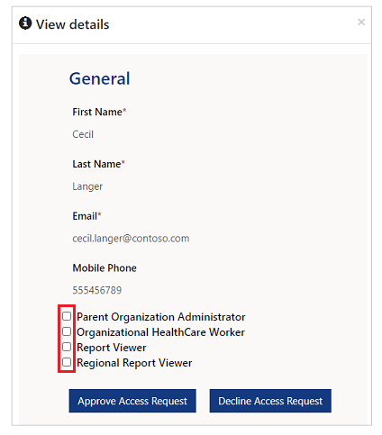

For more information about the roles, go to [User Roles](#user-roles).

Select **Approve Access Request** to approve or **Decline Access Request** to decline the request.

When you decline a request, you must provide a reason:

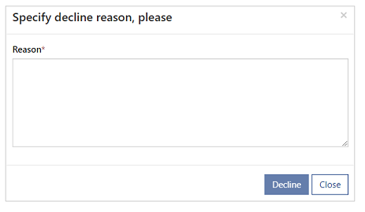

#### Request approval or decline emails

Depending on whether you approve a user request, or decline, the requestor receives an email with request process result. For approved requests, the email includes an invitation code that can be redeemed by the user when signing in for the first time. For declined requests the email includes decline reason entered while declining the request.

### Review approved requests

To view approved portal user requests, select **View details** for an approved request from the **Approved Portal User Requests** view:

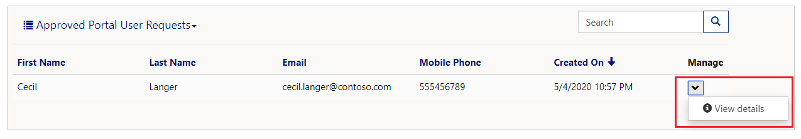

Select **Decline Access Request** to decline an existing approved request:

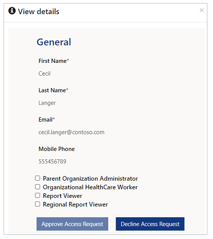

### Review declined requests

To view approved portal user requests, select **View details** for an approved request from the **Approved Portal User Requests** view:

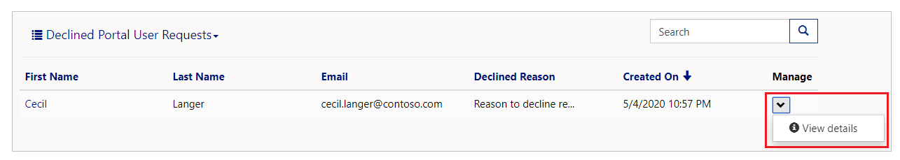

You can also view the mandatory **Declined Reason** for each request as the comment provided when the request was declined earlier.

Select **Approve Access Request** to approve an existing declined request:

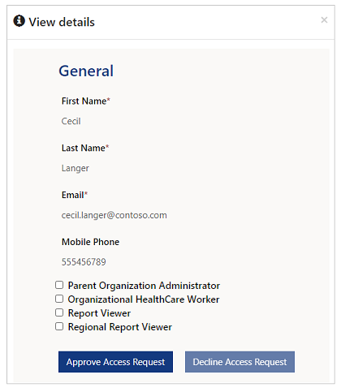

### Users

Go to **Users** to create new users that can administer the portal, view the dashboards, or use the portal as the healthcare worker:

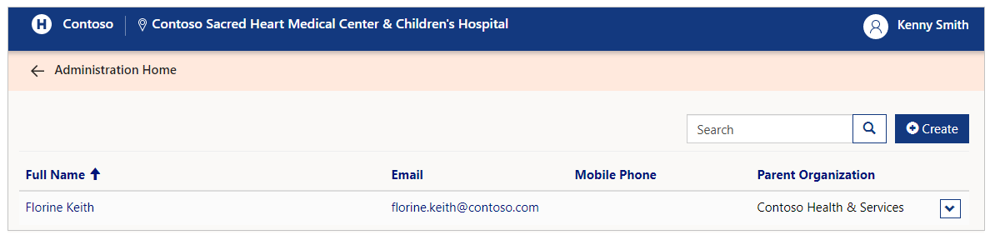

There are two views available, **All Active Users** and **My Active Users**. The **All Active Users** view shows all active users for the selected parent organization. The **My Active Users** view shows all active users for the selected parent organization that are created or approved by the currently logged in Parent Organization Administrator.

You can also [view user details](#view-user-details), [change user role](#change-role-for-a-user) and [deactivate user](#deactivate-a-user) from **Users**.

#### Search user details

Enter text in the search box to view filtered results for searched users. Wildcard (**\***) search is enabled and you can search for the following fields:

- Full Name

- Email

- Mobile Phone

- Parent Organization

You can use wildcard search and partial terms to view results, including phone numbers.

For example, if you want to search for a user with **Full Name** as **Delores Vasquez**, you can use following sample strings in search:

- Del\*

- \*Del

- Del\*va

To search for **Mobile Phone**, you can use similar text with wildcard replacing characters with numbers.

#### Create User

To create users, select **Create User** button when in **Users** form. And then, enter the new user details in the form:

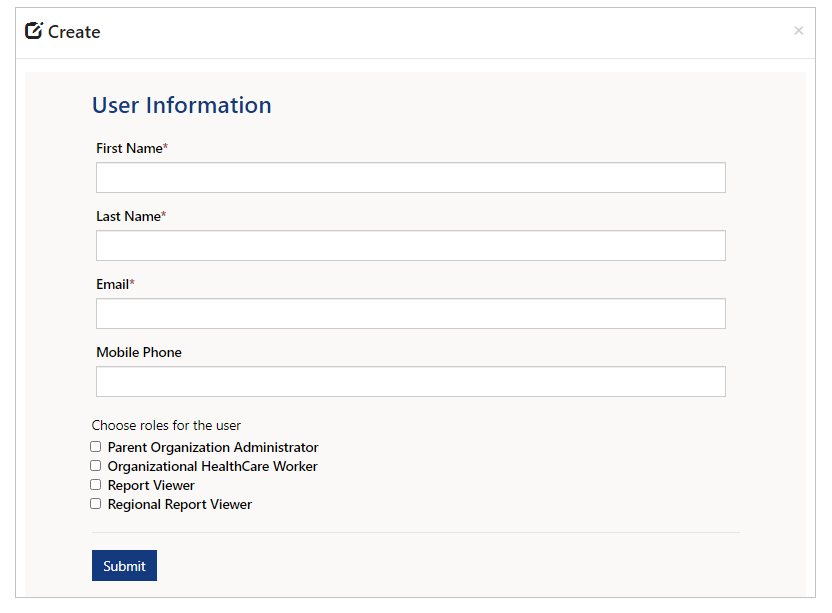

Enter **First Name**, **Last Name**, **Email**, and **Mobile Phone** and then select a role for the user.

##### User roles

The role of the user defines components that show up on the portal:

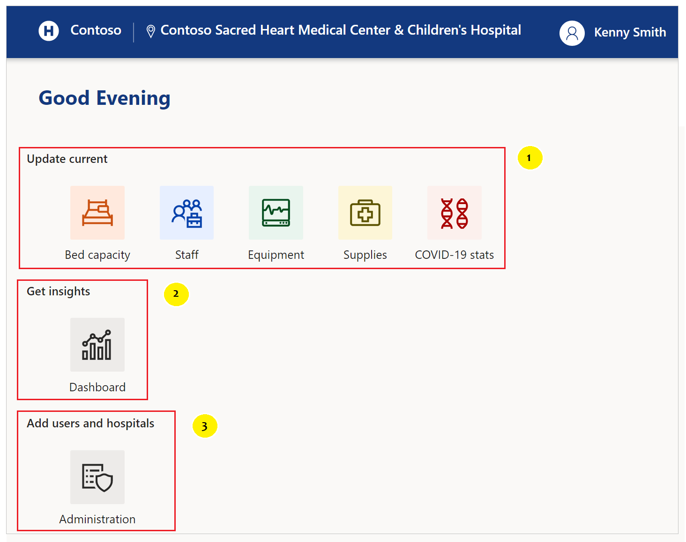

The highlighted components are visible to the users with the following roles assigned:

1. [Organizational HealthCare Worker](#organizational-healthcare-worker)
2. [Report Viewer](#report-viewer) and [Regional Report Viewer](#regional-report-viewer)
3. [Parent Organization Administrator](#parent-organization-administrator)

Here are the details of what the member of each role can do:

##### Organizational HealthCare Worker

A Healthcare Worker is an employee of a hospital system such as a registered nurse. Healthcare worker works within one or more facilities. The healthcare worker collects data across the following areas:

- Bed capacity

- Staff

- Equipment

- Supplies

- COVID-19 stats

##### Report Viewer

The Report Viewer role is for the users who can view the dashboards available on this portal. Members of Report Viewer role can view the following dashboards:

- System at a glance

- COVID-19 patient details

- Bed capacity details

- Equipment details

- Supplies details

##### Parent Organization Administrator

A Parent Organization Administrator can create users who can access the organization details using this portal.

Members of Parent Organization Administrator role can:

- Create new users and add them to the **Organizational HealthCare Worker, Report Viewer**, or the **Parent Organization Administrator** roles.

- Change metadata for the organization with:

    - Create, edit, or delete **System**

    - Create or delete **Region**

    - Create, edit, or delete **Facility**

> [!TIP]
> Select all 3 roles to allow a user to access all components.

##### Regional Report Viewer

The Regional Report Viewer role is for the users who can view the [dashboards](#get-insights) available for the entire region. Typically, Regional Report Viewer role users don't have a parent organization associated with them.

> [!NOTE]
> Using the portal, you can request a user with Regional Report Viewer role to be created. However, user request approvals for this role can only be done by regional admins using the admin model-driven app. More information: [Manage portal user requests](configure.md#manage-portal-user-requests).

Members of Regional Report Viewer role can view the following dashboards for the entire region:

- System at a glance

- COVID-19 patient details

- Bed capacity details

- Equipment details

- Supplies details

#### View user details

You can view user details by selecting the drop-down for the user and then selecting **View details**:

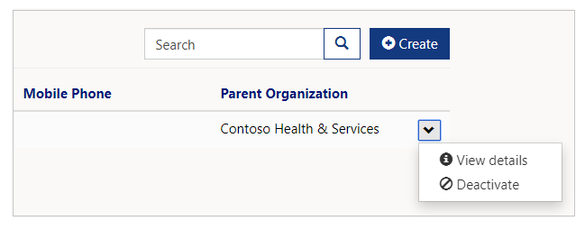

##### Change role for a user

You can add or remove user roles from the user details:

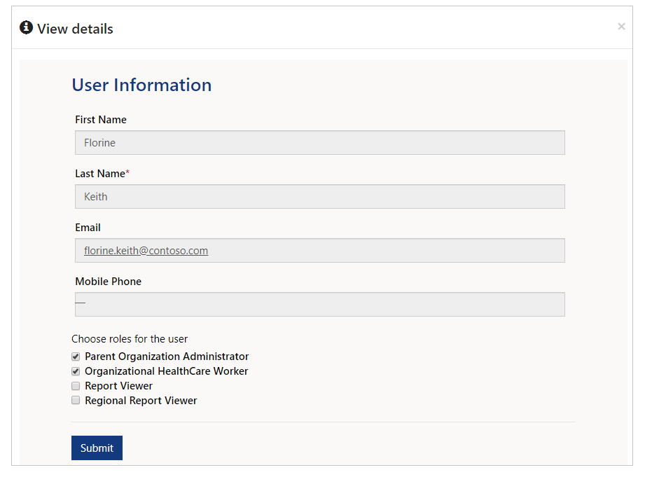

#### Deactivate a user

Select **Deactivate** from the user drop-down to deactivate a user account:

Deactivated user is no longer shown in the list of users on **Users** view.

### Systems

You can add, update, or delete a **System** using the **System** form. When you select **System**, you can see all existing **Hospital Systems**:

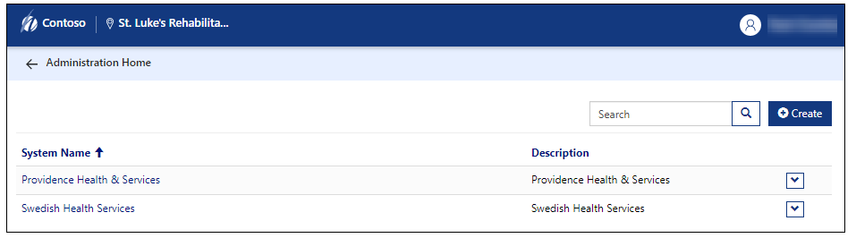

#### Search existing systems

Enter text in search box to search for system and filter the list of systems on the form. You can use wildcard search (**\***) combined with text characters for
**System Name** and **Description** fields.

#### View System Details

To view details of a system, select the drop-down menu for a system and then select **View Details**:

System Details page shows **Parent Organization, System Name**, **Description**, and **Regions** within the system:

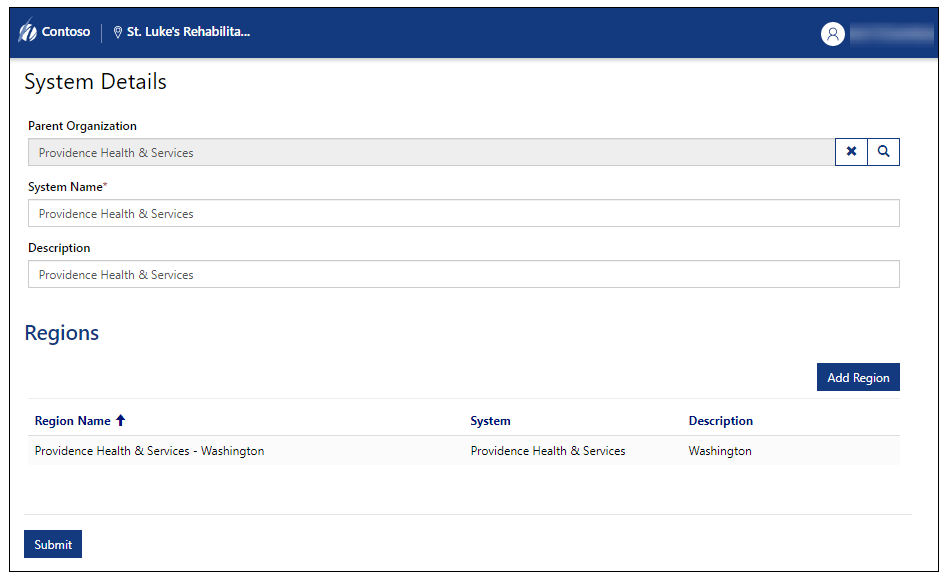

You can update a system’s **System Name** and the **Description** fields in the respective text boxes.

##### Add Region

Use the **Add Region** button to add a region to the current system. When you select **Add Region**, you can add region details such as **Region Name** and
**Description**:

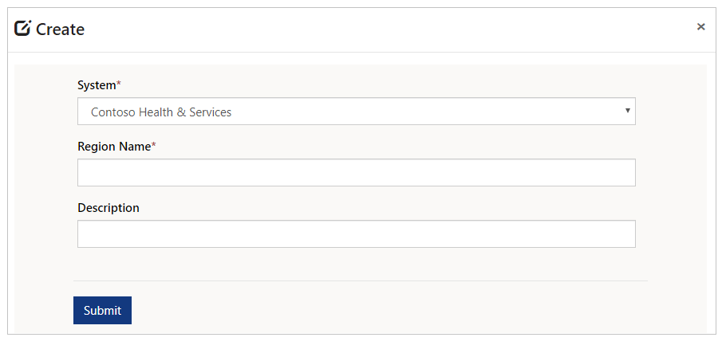

You can change **System** in the drop-down before you add a region. However, prefer to add a region to a system by first viewing the system that you want to add region to. This is because once you select **Submit**, if the system you selected is different from the details page you have open, you can’t see the region listed in the region section.

#### Create system

To create a system, select **Create**, enter *System Name* and *Description*:

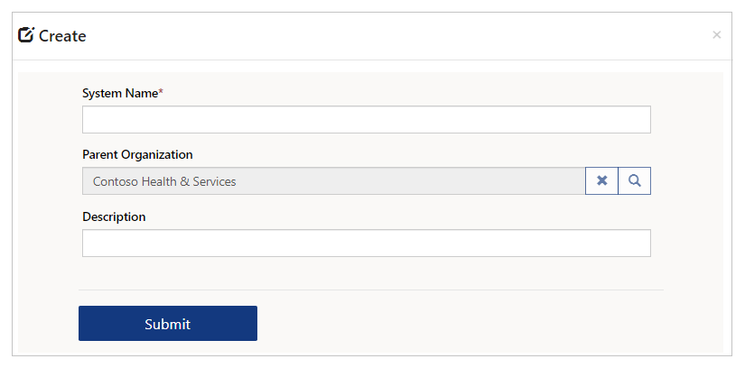

#### Delete System

To delete a system, select the drop-down menu and then select **Delete** option:

Select **Delete** to delete a system record. You're prompted confirming deletion before the system gets deleted:

### Regions

You can add or delete a **Region** using the **Add Region** form. When you select **Add Region**, you can see all existing **Hospital Systems**:

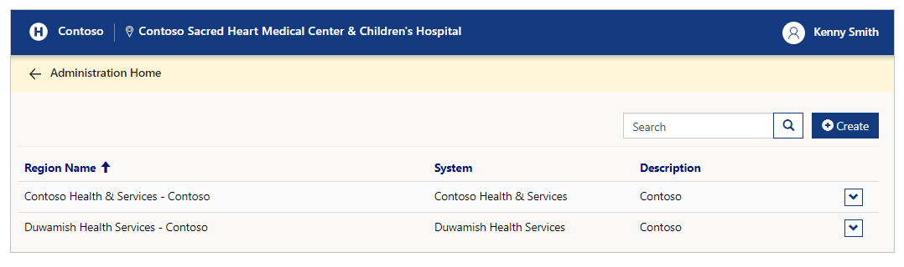

#### Search existing regions

Enter text in search box to search for region and filter the list of regions on the form. You can use wildcard search (**\***) combined with text characters for **Region Name, System**, and **Description** fields.

#### Create Region

To create a region, select the **Create** button, select a **System**, and then enter **Region Name** and **Description:**

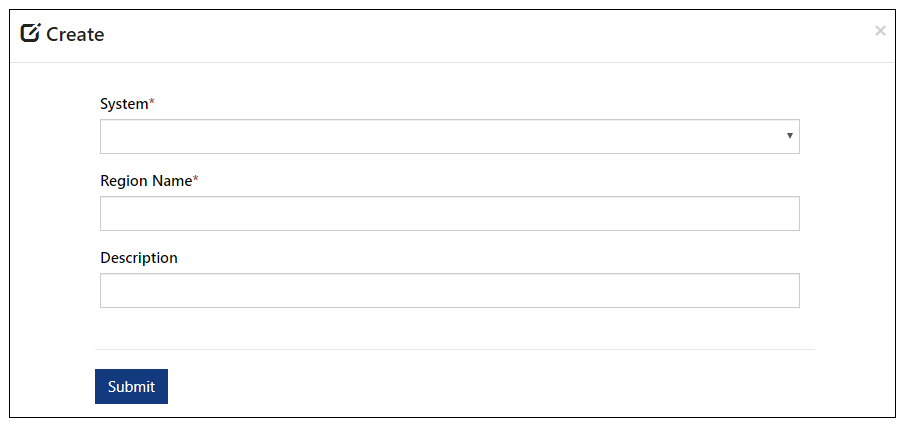

#### Delete Region

To delete a region, select the drop-down menu and then select **Delete** option:

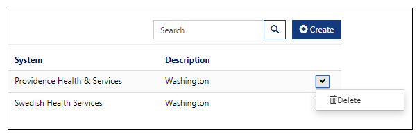

You're prompted confirming deletion before the region gets deleted:

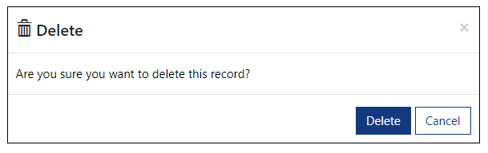

### Facilities

You can add or delete a **Facility** using the **Facilities** form. When you select **Facilities**, you can see all existing **Facilities** with region,
county, and other details:

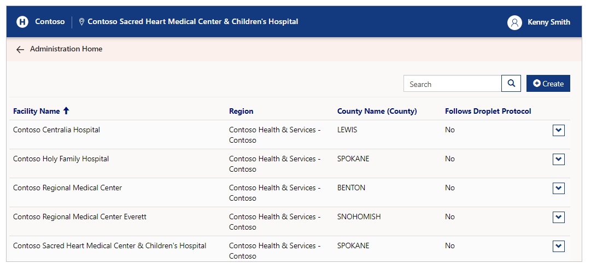

#### Search existing facilities

Enter text in search box to search for system and filter the list of facilities on the form. You can use wildcard search (**\***) combined with text characters for **Facility Name**, **Region**, and **County Name** fields.

#### Create Facility

To create a facility, select the **Create** button:

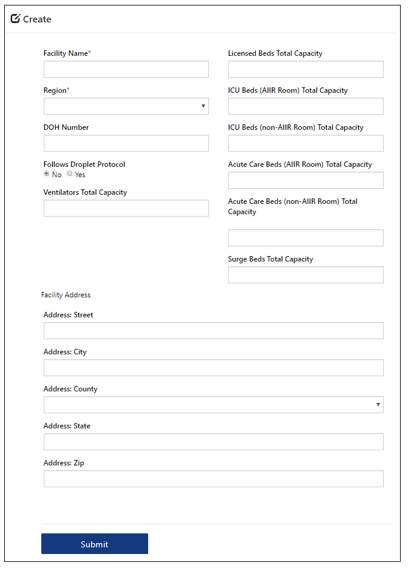

##### Options and description

| **Option name**                                | **Description**                                                                                                                                                                                            |
|------------------------------------------------|------------------------------------------------------------------------------------------------------------------------------------------------------------------------------------------------------------|
| Facility Name                                  | Name of the facility.                                                                                                                                                                                      |
| Region                                         | Select a region this facility is associated with.                                                                                                                                                          |
| Total Inpatient Bed Capacity | Total inpatient bed capacity at this facility. |
| Neonatal Bed Capacity | Total neonatal bed capacity at this facility. |
| ICU Beds (AIIR Room) Total Capacity            | Number of total ICU beds in AIIR (Airborne Infect Isolation Room).                                                                                                                                         |
| ICU Beds (non-AIIR Room) Total Capacity            | Number of total ICU beds in non-AIIR (Non-Airborne Infect Isolation Room).                                                                                                                                         |
| Acute Care Beds (AIIR Room) Total Capacity     | Total Acute Care beds (AIIR) capacity, in number format.                                                                                                                                                   |
| Acute Care Beds (non-AIIR Room) Total Capacity     | Total Acute Care beds (non-AIIR) capacity, in number format.                                                                                                                                                   |
| Total Mortuary Capacity | Total mortuary capacity for the facility.  **Note**: When set to at least 1, causes field *Number of decedent accommodations currently in use* to be available for the facility's **Bed capacity** [form](portals-user.md#bed-capacity).
| Supplies List | Select [Supplies List](#supplies-list-for-a-facility) to choose items from the available supplies available at the facility. |
| DOH Number                                     | The Department of Health number for this facility.                                                                                                                                                         |
| Follows Droplet Protocol                       | Select **Yes**/**No**. Relates to the facility following Droplet Precautions for patients known or suspected to be infected with pathogens transmitted by respiratory droplets, such as in COVID-19 cases. |
| Total Outpatient Bed Capacity | Total outpatient bed capacity at this facility. |
| Total Overflow/Surge/Expansion Bed Capacity | Total overflow, surge, or expansion bed capacity at this facility. |
| Total Pediatric ICU Beds (AIIR Room) Capacity | Total pediatric ICU beds (AIIR) at this facility. |
| Total Pediatric ICU Beds (Non-AIIR Room) Capacity | Total pediatric ICU beds (non-AIIR) at this facility. |
| Total Pediatric Acute Care Beds (Non-AIIR) Capacity | Total pediatric Acute Care beds (non-AIIR) at this facility. |
| Total Pediatric Acute Care Beds (AIIR) Capacity | Total pediatric Acute Care beds (AIIR) at this facility. |
| Does this facility have an Emergency Department/Overflow location? | Select **Yes**/**No** to confirm if the facility has emergency department or overflow location(s). | 
| Ventilators Total Capacity                     | Total ventilator capacity, in number format.                                                                                                                                                               |
| Facility Address                               | Street, City, County, State, and Zip code for the facility location.                                                                                                                                        |

##### Supplies list for a facility

When you select **Supplies List**, you can select individual supply and **Save** the list to associate the available supplies for the facility:

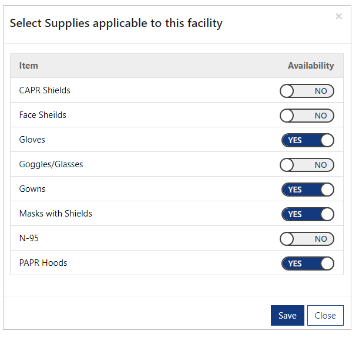

#### Delete Facility

To delete a facility, select the drop-down menu and then select **Delete**
option:

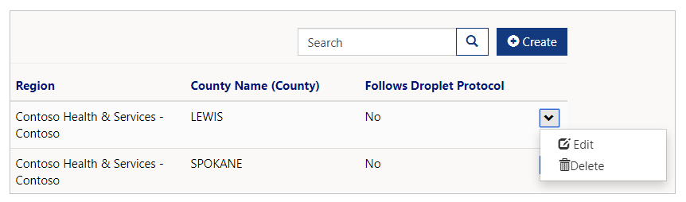

You're prompted confirming deletion before the facility gets deleted:

#### Edit Facility

To delete a facility, select the drop-down menu and then select **Edit** option:

Update the fields and select **Submit** to save the changes.

### CDC Data Feed

Parent Organization Administrators can use **CDC Data Feed** to view, edit and download the data feed for upload to the Centers for Disease Control and Prevention (CDC) web site.

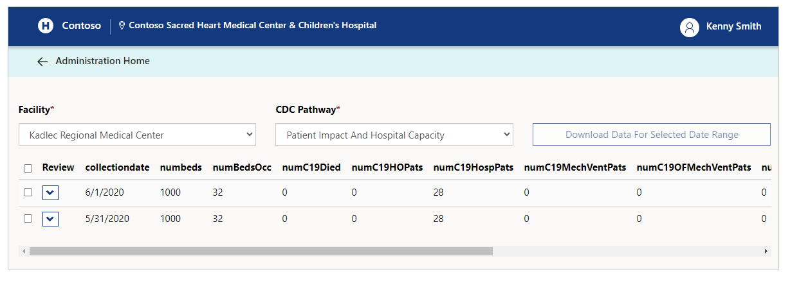

The CDC data feed is shown for each facility separately. After you select a facility, you have the option to select one from the three available **CDC Pathways**.

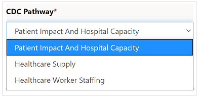

#### CDC Pathway

CDC requires data to be uploaded in a three specific formats, shown as the **CDC Pathway**. Each pathway includes data for the respective category as explained in the following table:

| CDC Pathway | Description |
| - | - |
| **Patient Impact And Hospital Capacity** | Includes Bed Capacity, Equipment and COVID-19 statistics.
| **Healthcare Supply** | Includes Supplies inventory statistics.
| **Healthcare Worker Staffing** | Includes Staffing statistics.

#### Edit CDC Data Feed

Select the drop-down option for the feed, and then select **Edit** to update the selected feed statistics.

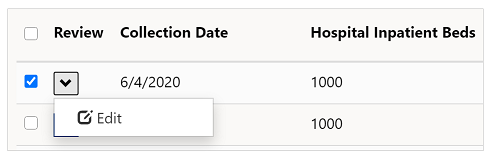

After updating the feed statistics, select **Submit** to save the changes.

#### Download CDC Data Feed

When ready to download the CDC Data Feed for uploading to CDC web site, select the appropriate data feeds, and then select **Download Data For Selected Date Range**.

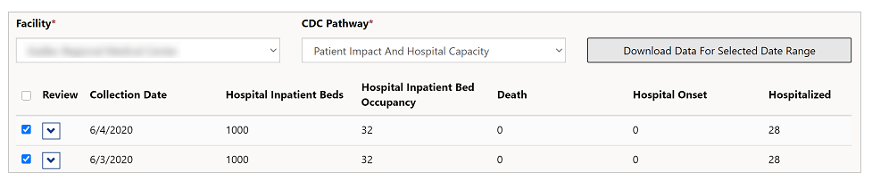

The CDC Data Feed is downloaded in CSV format to your Downloads folder. You can now upload the downloaded files to the CDC web site.

## Get Insights

If you're a member of **Report Viewer**, or **Regional Report Viewer** roles, you’ll see option to view **Dashboards**:

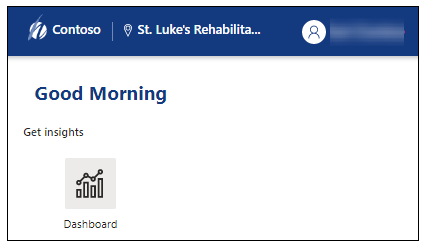

### Dashboards overview

Dashboards are available for the following insights:

- [System at a glance](#system-at-a-glance)

- [COVID-19 patient details](#covid-19-patient-details)

- [Bed capacity details](#bed-capacity-details)

- [Equipment details](#equipment-details)

- [Supplies details](#equipment-details)

- [Data health scorecard](#data-health-scorecard)

#### Working with reports in Power BI

Before you begin review of available dashboards, get familiar with general report viewing concepts and guidelines:

- Selecting the information icon (i) in any of the summarized area takes you to the respective details page for the area.

- You can also do other actions on reports such as filter and sort data, export the report to PDF and PowerPoint, add a spotlight, and so on. For detailed information about report features in Power BI, see [Reports in Power BI](/power-bi/consumer/end-user-reports).

- The most recent or last updated columns in some of these reports show the date and time when the data was last refreshed. It's also easy to identify the freshness by viewing the color of the date and time values in these columns:

- **Black:** Data is refreshed less than 20 hours ago

- **Gray:** Data is refreshed 20 - 24 hours ago

- **Red:** Data is refreshed more than 24 hours ago

### System at a glance

View entire **Hospital System** related statistics in one view with **System at a glance** dashboard:

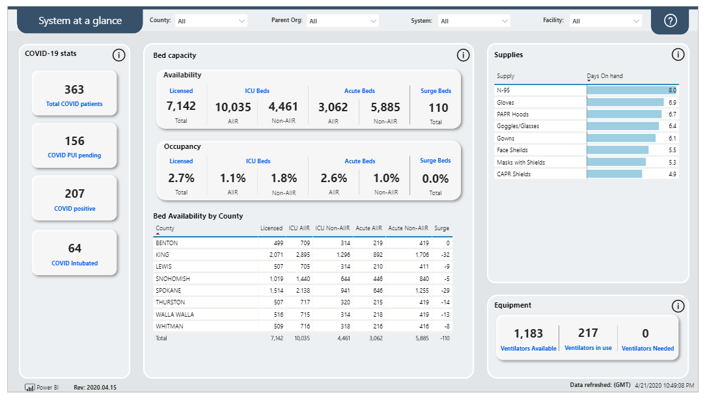

The dashboard displays summary for the following:

- **COVID-19 stats**: View COVID-19 patient summary in numbers with total patients, patients under investigation, positive and intubated patients.

- **Bed capacity**: View the summary data with **Availability** and **Occupancy** for licensed, ICU, Acute, and Surge categories.

- **Beds Availability by County**: View bed availability with total number of beds, ICU/Acute/Surge bed availability and total of all bed availability across all counties.

- **Supplies**: View supply information with days-on-hand for each separately.

- **Equipment**: View ventilators and equipment summary numbers with availability, in-use and needed.

### COVID-19 patient details

View COVID-19 related patient details such as summary of COVID PUIs, positives, intubations. The dashboard also shows details on a per-county basis at bottom.

You can also view counties in map and the counties are color coded for segregation. A graph on the bottom right in dashboard shows COVID-19 positives and PUIs with timelines explaining the recent and past trends:

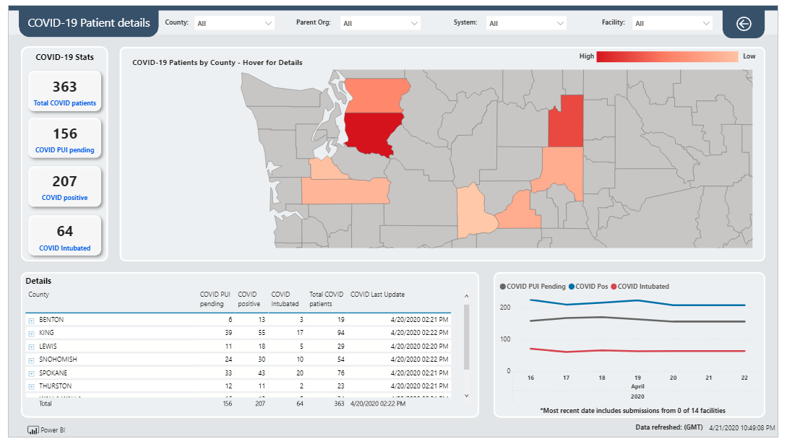

#### Map

Hover over a county inside the map to see the county-specific COVID-19 PUIs, positives, and intubation numbers:

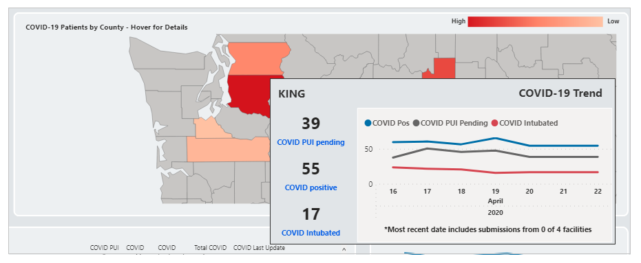

Similarly, you can hover over the timeline chart to view date-specific numbers in tooltip as you move across dates.

### Bed capacity details

View bed-related insights such as bed availability with licensed, acute, AIIR/non-AAIR, surge, and ICU numbers. You can also view the details in tabular format at bottom with per-county bed data and in percentage format. The map is color coded for counties with lighter color for lower numbers and increasing in darkness as the number increases. The chart on bottom right shows occupancy differences based on dates for trend analysis:

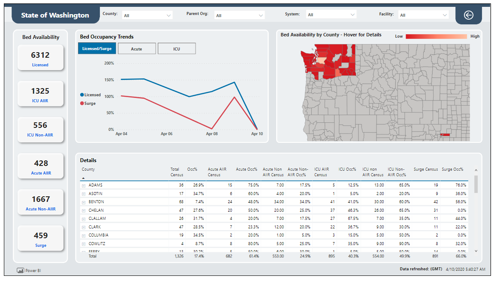

#### Map

When you hover over map area and point to a county, you can see the county-related information:

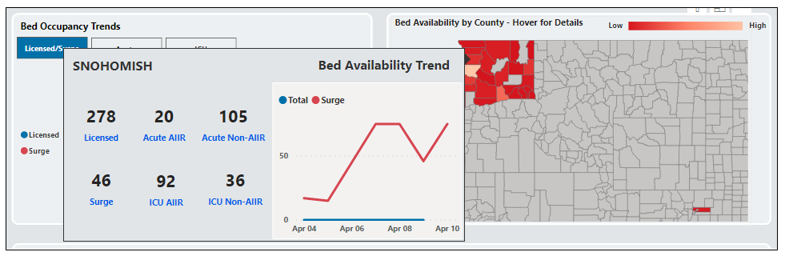

Similarly, you can hover over the timeline chart to view date-specific numbers in tooltip as you move across dates.

### Equipment details

View equipment details on a per-county basis such as ventilators availability and consumption with **Equipment details** dashboard:

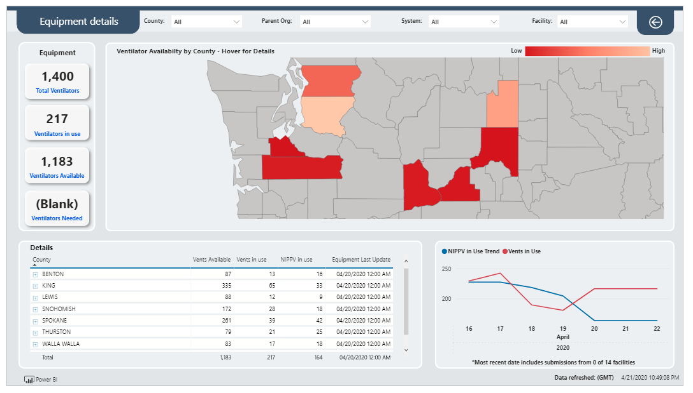

You can see the total amount of equipment availability on top left and detailed table on bottom left. The map shows county-specific equipment data with lighter
color with lesser and darker color with higher requirement numbers.

The timeline chart on bottom right shows equipment insights for trend analysis across dates.

#### Map

When you hover over map area and point to a county, you can see the county-related information:

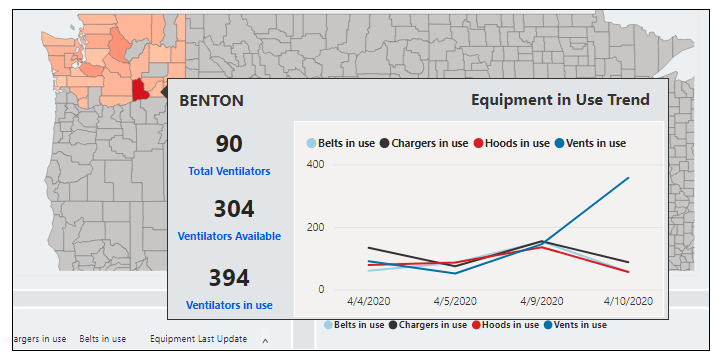

Similarly, you can hover over the timeline chart to view date-specific numbers in tooltip as you move across dates.

### Supply details

View supply details on a per-county basis such as ventilators availability and consumption with **Supply details** dashboard:

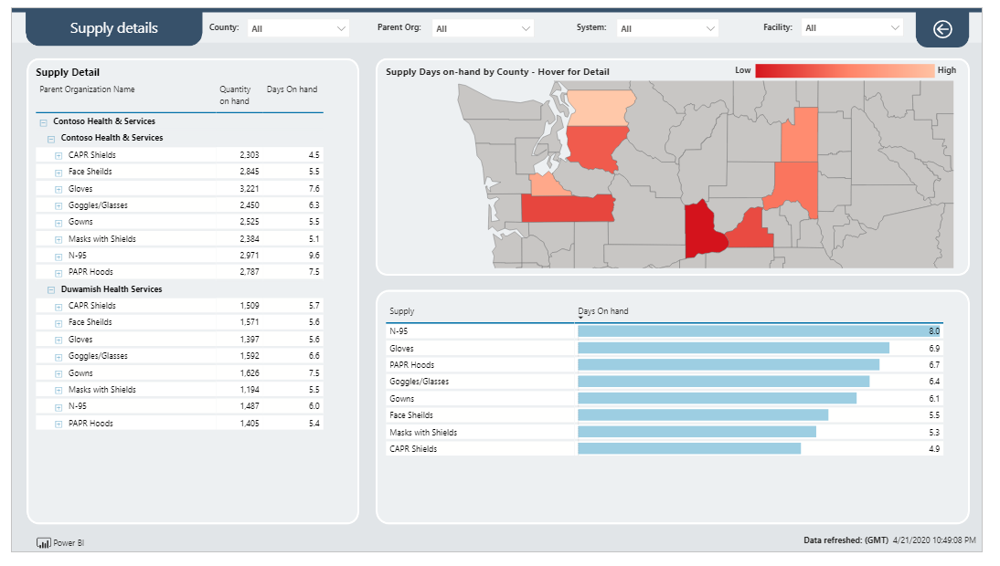

You can see the supply details on the left based on **Health System,** map on the right and chart format supply break-up at the bottom.

#### Map

When you hover over map area and point to a county, you can see the county-related information:

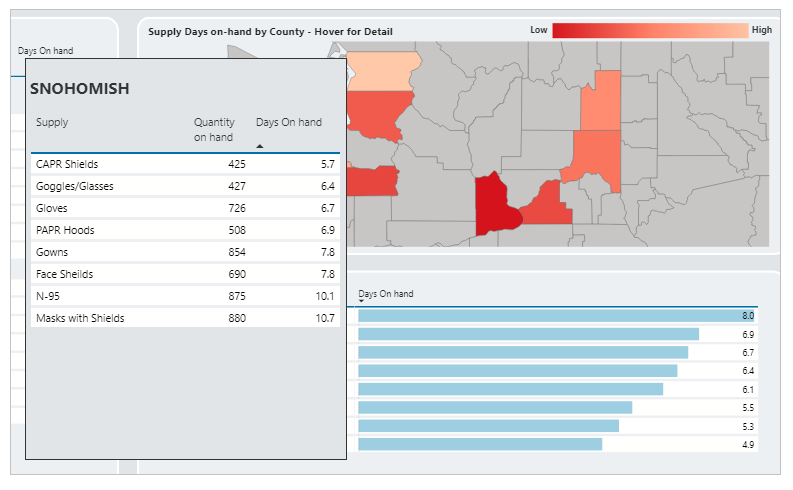

Similarly, you can hover over the timeline chart to view date-specific numbers in tooltip as you move across dates.

### Data health scorecard

View data hygiene for a selected facility using the **Data health scorecard** dashboard. Select a facility from the list of available facilities and then select **Click here to continue** to view the dashboard:

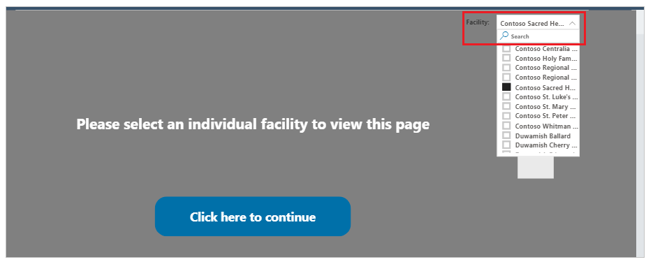

The dashboard shows data update ranking, data update in percentage and daily status across all components. A date-wise chart shows data completion of the selected facility in comparison to the average of all facilities for a given data set. The facility-wise data completeness information is also available in tabular format with listing all facilities for last one week:

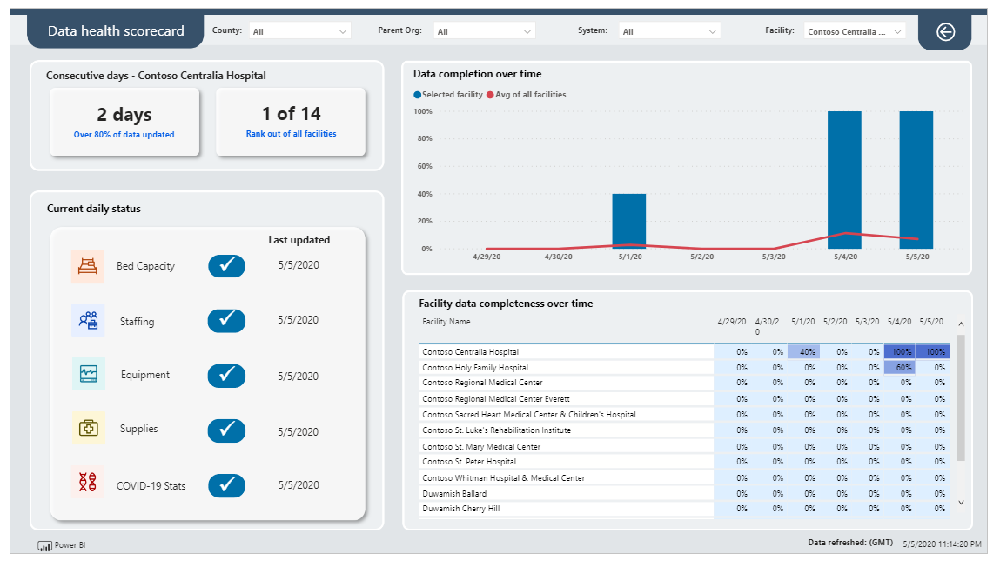

## General portal options

[!include[cc-general-options](includes/cc-general-options.md)]

## Issues and feedback

- To report an issue with the Regional Government Emergency Response and Monitoring solution, visit <https://aka.ms/rer-issues>.

- For feedback about the Regional Government Emergency Response and Monitoring solution, visit <https://aka.ms/rer-feedback>.

[!INCLUDE[footer-include](../../includes/footer-banner.md)]