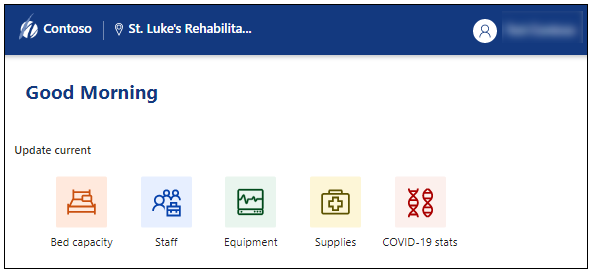
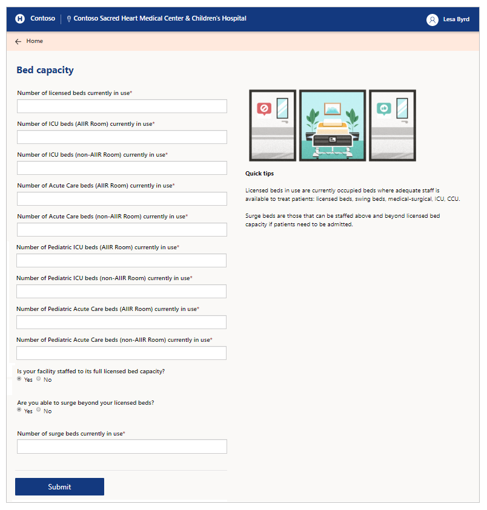
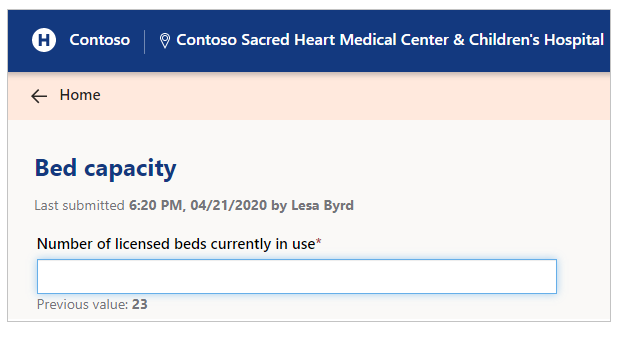
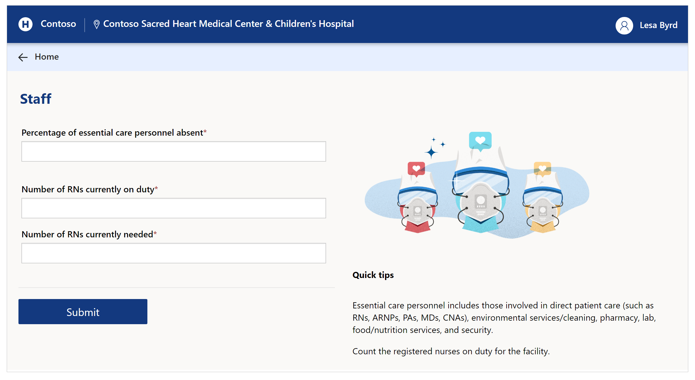
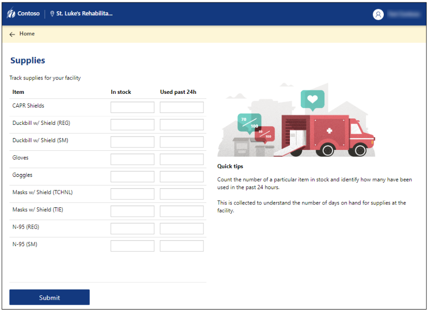
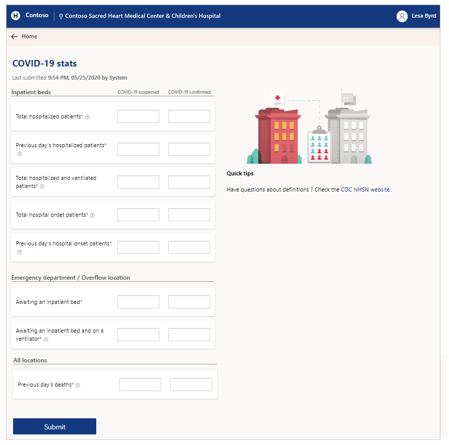

# Use the Regional Government Emergency Response and Monitoring portal

Hospital staff are challenged to meet an increase in number of patients while managing supply chain during emergency. By using the Regional Government Emergency Response and Monitoring portal, health care workers can quickly view and add data for ventilators, staffing, pending discharges, and COVID-19 related patients.

## Portal at a glance

Browse to the Power Apps portal to work with staffing, equipment, supplies, patient, and other areas. The following section walks you through what you can access, submit, or update as the health care user of the portal.

You can use latest mobile devices and web browsers when using Regional Government Emergency Response and Monitoring portal except Apple iPad.

[!include[cc-getting-started](includes/cc-getting-started.md)]

[!include[cc-manage-user-profile](includes/cc-manage-user-profile.md)]

## Portal components

The Regional Government Emergency Response and Monitoring portal consists of the following components:

- **Bed capacity**  
  Collect details about bed licenses, capacity, acuteness, staffed beds, and surge data.

- **Staff**  
  Collect status of the RNs by location in that facility.

- **Equipment**  
  Collect equipment details such as ventilators and NIPPV devices.

- **Supplies**  
  Collect key supplies to track, manage, and forecast inventory more effectively. ​

- **COVID-19 stats**  
  Collect status on how many patients are under investigation for COVID-19 and how many tested positive.

## Bed capacity

Select **Bed capacity** to update patient information, beds, and staffing capacity for the selected location:

### Options and description

#### Staffed Inpatient ICU and Acute Care Bed Occupancy

Occupancy for staffed adult and pediatric inpatient beds that are in the ICU or Acute care locations. 

| **Option name**                                               | **Description**                                                                       |
|---------------------------------------------------------------|---------------------------------------------------------------------------------------|
| ICU beds (AIIR Room) currently occupied | Number of Intensive Care Unit (ICU) beds in Airborne Infection Isolation Rooms occupied currently. |
| ICU beds (non-AIIR Room) currently occupied | Number of ICU beds in non-AIIR rooms occupied currently.
| Acute Care beds (AIIR Room) currently occupied | Number of Acute Care beds (AIIR Room) occupied currently. |
| Acure Care beds (non-AIIR Room) currently occupied | Number of Acure Care beds (non-AIIR Room) occupied currently.

> [!NOTE]
> Pediatric occupancy options are disabled if the capacity isn't set to at least 1 at the selected facility.

#### Staffed Inpatient Bed Occupancy in other areas

Occupancy of staffed inpatient beds in areas other than ICU and Acute Care.

| **Option name**                                               | **Description**                                                                       |
|---------------------------------------------------------------|---------------------------------------------------------------------------------------|
| Neonatal ICU beds currently occupied | Neonatal ICU beds occupied currently.
| Number of beds in Overflow/Surge/Expansion areas currently occupied | Number of beds in Overflow/Surge/Expansion areas occupied currently. |
| Number of beds in other inpatient areas currently occupied | Number of beds in other inpatient areas occupied currently. |
| Number of decedent accommodations currently occupied | Number of decedent accommodations occupied currently.   **Note**: Only visible if the *Total Mortuary Capacity* for the selected facility is at least 1. |

#### Inpatient Beds Staffing and Surge Capacity

Select whether your facility is staffed for its inpatient bed capacity, and if your facility can surge beyond your staffed inpatient bed capacity. If not, select the appropriate reasons.

| **Option name**                                               | **Description**                                                                       |
|---------------------------------------------------------------|---------------------------------------------------------------------------------------|
| Is your facility staffed to its full licensed bed capacity?    | Yes/No. If the answer is No, can select one or more reasons from the following:   - Staff   - Space   - PPE   - Equipment   - Low Patient Volume  |
| Are you able to surge beyond your licensed beds?              | Yes/No. If the answer is No, can select one or more reasons from the following:   - Staff   - Space   - PPE   - Equipment   - Low Patient Volume  |

### Previous submissions

When you open **Bed capacity**, or any other components such as **Staff**, **Equipment**, **Supplies**, or **COVID-19 stats**, you can see last submission date, time, and the submitter.

When you select individual field, you can also see the previous value submitted for the field:

## Staff

Submit staff-specific details **Staff update** form:

### Options and description

The staff options depend on your organization requirements. Refer to your organization resources for descriptions of staff options. Add the details of groups not listed on the form using the last question on this form.

## Equipment

Submit the equipment details such as ventilators and NIPPV devices:

### Options and description

| **Option name** | **Description**                 |
|-----------------|---------------------------------|
| Mechanical Ventilators     | Number of ventilators in use.   |
| NIPPV (Non-Invasive Positive Pressure Ventilation)          | Number of NIPPV (Non-Invasive Positive Pressure Ventilation) devices in use. |

## Supplies

Submit the supplies inventory details such as on-hand supply, usage method (extended use or reuse), and the ability to source the supplies:

### Options and description

The supplies options depend on your organization requirements. Refer to your organization resources for descriptions of supply
names.

> [!NOTE]
> The supply inventory item values must be in number format. The supply number is for **individual component**. For example, N-95 masks are counted by each individual mask instead of counting the number of boxes containing masks.

#### Supply considerations

- For calculation of on hand supply, we recommend using the [Personal Protective Equipment (PPE) Burn Rate Calculator](https://www.cdc.gov/coronavirus/2019-ncov/hcp/ppe-strategy/burn-calculator.html).
- More information about conservation strategy available at [Conservation Strategies for Personal Protective Equipment](https://www.doh.wa.gov/Portals/1/Documents/1600/coronavirus/ConservationStrat-PPE.pdf).
- **Extended use**: Wearing for repeated close contact encounters with several patients without removing between patients.
- **Reuse**: Using same PPE for multiple encounters with patients but removing it (*doffing*) after each encounter.
- **Ventilator Disposables use/reuse**: When considering definitions for extended use or reusing ventilator supplies, please refer to the [Scarce Resource Management and Crisis Standards of Care Overview](https://nwhrn.org/wp-content/uploads/2018/10/Scarce_Resource_Management_and_Crisis_Standards_of_Care_Overview_and_Materials-2020-04-10.pdf) document.
    <table>
      <tr>
        <th>WA Health</th>
        <th>Scarce Resource Mgmt and Crisis Standards of Care Overview</th>
      </tr>
      <tr>
        <td><i>Standard</i></td>
        <td>Conventional</td>
      </tr>
        <tr>
        <td><i>Conservation</i></td>
        <td>Contingency</td>
      </tr>
        <tr>
        <td><i>Extreme</i></td>
        <td>Crisis</td>
      </tr>
    </table>
- **Ventilator supplies (disposables)**: When considering definitions for *ventilator supplies (disposable)*, please refer to [CDC NHSN](https://www.cdc.gov/nhsn/) website.

## COVID-19 stats

Submit COVID-19 specific details using the **COVID-19 stats** form:

### Options and description

COVID-19 stats include details for both COVID-19 *suspected* and COVID-19 *confirmed* patients.

#### Inpatient beds

Submit inpatient bed information:

| **Option name**                                                   | **Description**                                                    |
|-------------------------------------------------------------------|--------------------------------------------------------------------|
| Total hospitalized patients | Total number of patients hospitalized currently. |
| Previous day’s hospitalized patients | Number of new patients admitted to the hospital. |
| Total hospitalized and ventilated patients | Patients currently hospitalized using mechanical ventilators. |
| Total hospital onset patients | Total number of patients with onset of suspected or confirmed COVID-19 (after 14 or more days) for a condition other than COVID-19.
| Previous day’s hospital onset patients | Number of patients with onset of suspected or confirmed COVID-19 on the previous day; and the previous day is 14 or more days since admission.

#### Emergency department / Overflow location

Only available if the facility is enabled for emergency department or overflow location.

| **Option name**                                                   | **Description**                                                    |
|-------------------------------------------------------------------|--------------------------------------------------------------------|
| Awaiting an inpatient bed | Number of patients awaiting an inpatient bed. |
| Awaiting an inpatient bed and on a ventilator | Number of patients on a mechanical ventilator awaiting inpatient bed. |

#### All locations

| **Option name**                                                   | **Description**                                                    |
|-------------------------------------------------------------------|--------------------------------------------------------------------|
| Previous day’s deaths. | Previous day's mortality number for patients suspected or confirmed with COVID-19 (includes hospital, emergency department, and all overflow locations). |

## General portal options

[!include[cc-general-options](includes/cc-general-options.md)]

## Issues and feedback

- To report an issue with the Regional Government Emergency Response and Monitoring solution, visit <https://aka.ms/rer-issues>.

- For feedback about the Regional Government Emergency Response and Monitoring solution, visit <https://aka.ms/rer-feedback>.

[!INCLUDE[footer-include](../../includes/footer-banner.md)]