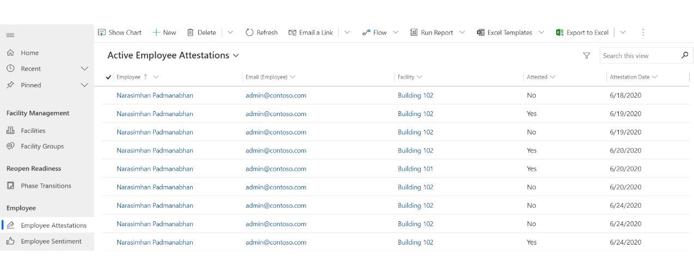

# Version History

| Version | Release Date | Comments                 |
|---------|--------------|--------------------------|
| 0.1     | 19-06-2020   | Initial draft for review |
| 0.2     | 26-06-2020   | Updates                  |

# Prerequisites

The following prerequisites apply to this guide:   

1.  The environment has all the Return to Workplace components in place with the
    Model Driven App, Canvas Apps and Power BI Dashboards. 

2.  Business Admin has completed all required setup (configurations and master
    date)

3.  Execution of how to steps require users have the required security role(s)
    in place. 

>   Contact your IT Admin if you are unable to access or use the admin app.

1.  The sample data is in the package and needs to be installed on the
    environment. 

# Overview

This document provides Facility Managers in organizations a guide on how to use
the Model Driven App to manage reopening and readiness of facilities. This will
help organizations ensure that they can provide a safe working environment for
employees to return to, using this Return to Workplace solution.

Processes that Facility Manger can support that are covered in this document
include:

-   Manage and monitor facilities

-   Manage transitions of a facility’s phases

-   Monitor employee attestations

-   Monitor employee sentiments

# Model app at a glance

The left-hand side menu lists all the components available in the ‘Facility’
Area.

# Model app components

For facility management one area called ‘Facility’ is available with the
following components.

## Facility

### Facility Management

-   Facilities  
    Lists the facilities (e.g. buildings, plants, etc.) that require monitoring
    of reopening.

-   Facility Groups  
    Provides a flexible way to group facilities. For example, by campus or
    geographical region

    -   Areas  
        Areas are subcomponents of a facility. This item is used to distinguish
        capacity of these subcomponents over the various phases.

## Reopen Readiness

-   Phase Transitions  
    A Phase transition models a request to transition to a new phase. When the
    transition is approved, the facility will be updated with the proposed phase

-   Readiness Factors  
    Readiness Factors are basically yes/no type questions regarding reopening a
    building. They are linked per Reopening Phase to a checklist on a facility.

-   Measurements  
    The actual values for a Metric. This allows to track parameters over time.
    For a single Metric, measurements can be entered per facility.

## Employee 

-   Employee Sentiment  
    Keeps track of general employee wellbeing. This is self-reported
    information, but it is a valuable parameter when tracked consistently over
    time and with bigger groups. This data will typically be enter through
    employee’s use of the Return to Workplace solution’s canvas app.

-   Employee Attestation

    Keeps track of employee health assessments/attestations based upon a series
    of questions presented to and answered by the employee. This data will
    typically be enter through employee’s use of the Return to Workplace
    solution’s canvas app.

# Getting started with the model app

## General

In this section key concepts and actions to be taken by the facility manager
will be explained. It assumes all data is setup correctly and will demonstrate
daily use.

-   Manage and monitor facilities

## Manage and monitor facilities 

### Create a Facility 

Facility types are defined as the types of facilities we support in the
solution. By default, two are provided as an example, you can define more by
following the following steps:

1.  Select **Facilities** in the left pane and select **+New**.

1.  In the **New Facility** screen, select the **Details** tab and then specify
    appropriate values:

| **Field**              | **Description**                                |
|------------------------|------------------------------------------------|
| Facility Number        | A number for the new Facility                  |
| Name                   | A name for the new Facility                    |
| Description            | A description of the new Facility              |
| Facility Type          | Field to link the appropriate Facility Type    |
| Facility Group         | Field to link to an appropriate Facility Group |
| Reopen Phase           | Field to link to an appropriate Reopen Phase   |
| Address Street 1       | Text box for address street 1 data             |
| Address Street 2       | Text box for address street 2 data             |
| Address Postal Code    | Text box for address’ postal code data         |
| Address City           | Text box for address’ City data                |
| Address State/Province | Text box for address’ State/Province data      |
| Address Country        | Text box for address’ Country data             |

1.  Select **Save & Close**. The newly created record will be available in the
    **Active Facility Types** list.

To edit the record, select the newly created record, update the values as
required, and select **Save & Close**.

### Monitor Facility

Facility Manager can monitor and assesses the current status of their facilities
by reviewing a selected facility’s associated dashboard, details, Checklist, and
Transitions. Top access each of these areas the following steps can be followed.

1.  Select the Facility from left pane to see the list of active facilities

2.  Select a desired facility to access the Facility data

>   The default display is the General tab for each facility shows the facility
>   manager dashboard. The dashboard shows COVID-19 data based on the address
>   details of the Facility, checklist completion for the current phase,
>   employee attestation and employee sentiment. (please refer to the PowerBI
>   Dashboard guide for more information.)

3. Select the **Details** tab for the selected facility

1.  Select the **Checklist** tab for the selected facility to see checklist
    items and their completion status

1.  Select the **Transitions** tab for the selected facility to see any related
    transition requests and their status

    

### Updating the checklist

Facility managers can manage their building associated checklist form the
Checklist tab of the facility. This tab contains a canvas app displaying the
checks in the checklist for the current facility/phase combination. The App
provides an easy way for users to find checks by category and then update
individual checks, where applicable. The following are the steps you can follow
to locate and update checks.

1.  Select the **Facilities** from left pane to see the list of active
    facilities

2.  Select a desired facility to access the Facility data

3.  Select the **Checklist** tab for the selected facility to see checklist
    items and their completion status

1.  Select the category from the **Categories** droplist that you want to search
    within to locate the checks you want to review and/or update.

    

2.  To mark a **Check** complete you simply mark the checkbox as checked

3.  Should you need to add comments in the provided text box just enter your
    test and select **Save** that appears next to your text entered.

    

## Moving a facility to a new phase

When a Facility manager asserts that a facility should be moved to a new phase,
the manager can apply for a transition. Only the facility the manager can create
a new transition record that indicates the new phase and his rationale to do so.
A reviewer must Accept or Reject this transition. Either way the Transition
record is closed and stored as a historical track record. When the transition is
accepted, the proposed phase is applied to the facility.

The new phase will come with its own set of metrics, goals, and checklist. These
will be made available on the facility by a background process. So there will be
a small delay between accepting a transition and the actual changes on the
facility record.

A reviewer, for instance a facility manager supervising many facility managers
in a facility group, can find the backlog of to be considered phase transitions
in the Phase Transitions sub area. For example, the list can be filtered on
Facility Group or by Reviewer to find that phase transitions that require his or
hers attention.

### Create Transition Request

Below are the steps to create a transition request (**Reopen Transitions**):

1.  Select **Facilities** in the left pane and select an active facility.

2.  Select the **Transitions** tab from the selected facility. If there are any
    existing/previous transition requests established they will appear in the
    sub-grid displayed.

3.  Select the **+New Reopen Phase Transition** button

>   A screenshot of a cell phone Description automatically generated

1.  In the New Transition screen enter the appropriate details:

    

| **Field**             | **Description**                                                                                                             |
|-----------------------|-----------------------------------------------------------------------------------------------------------------------------|
| Proposed Reopen Phase | Field to select the desired next Reopen Phase to transition to                                                              |
| Summary               | Field allowing summary information regarding any supporting information to support moving to the next/targeted Reopen Phase |
| Reviewer              | Lookup and select an appropriate resource to review and approve the new Transition                                          |

2.  Select **Save & Close**. The newly created record will be available in the
    **Transitions** tab sub-grid for the facility.

To edit the record, select the newly created record, update the values as
required, and select **Save & Close**.

### Approve Transition

1.  Select **Phase Transitions** in the left pane

2.  If not already selected g=choose the **Reopen Transitions** view

>   A screenshot of a cell phone Description automatically generated

1.  As a Reviewer you need to locate those Transitions with your name identified
    on the **Reviewer** column.

2.  Select/Open the **Transition** record

3.  Complete any analysis you require prior to selecting an Approved or Rejected
    value in the **Review Status** filed select the appropriate.

4.  For Approvals, select the **Approved** status value and enter in any
    associated comments in the **Review Comments** field.

    

5.  Select the Save & Close button. Transition **Review Status** updated and
    appropriate back end process triggered to move the facility to the targeted
    Reopen Phase.

### Reject Transitions

A reviewer must Accept or Reject transitions. The following are the steps to
review and take approve/reetc action on that request.

1.  Select **Phase Transitions** in the left pane

2.  If not already selected choose the **Reopen Transitions** view

1.  As a Reviewer you need to locate those Transitions with your name identified
    on the **Reviewer** column.

2.  Select/Open the **Transition** record

3.  Complete any analysis you require prior to selecting an Approved or Rejected
    value in the **Review Status** filed select the appropriate.

4.  For rejections, select the **Rejected** status value and enter in any
    associated comments in the **Review Comments** field.

    

5.  Select the Save & Close button. Transition **Review Status** updated to
    Rejected and appropriate no updates are processed to move the facility to
    the requested Reopen Phase. Facility remains in current phase and status.

## Monitor employee attestations

Facility managers can monitor whether or not their organization’s employees are
feeling healthy enough to be eligible to return to their facility. They are able
to track employee self-attestations of their health based upon a series of
questions presented to and answered by the employees. This data will typically
be entered through employee’s use of the Return to Workplace solution’s canvas
app and available at a summary level in the Model App’s **Employee
Attestations** sub-area.

## Monitor employee sentiments

Keeps track of general employee sentiment on how they are feeling about the
prospect of returning to their workplace facility. This information is
self-reported information, but it is a valuable parameter when tracked
consistently over time and with bigger groups. This data will typically be enter
through employee’s use of the Return to Workplace solution’s canvas app and can
be viewed by Facility Managers at a summary level in the Model App’s **Employee
Sentiment** sub-area.

*Disclaimer*

*Customer bears the sole risk and responsibility for any use of this app.*

*Sample data included in this app are for illustration only and are fictitious.
No real association is intended or inferred.*
