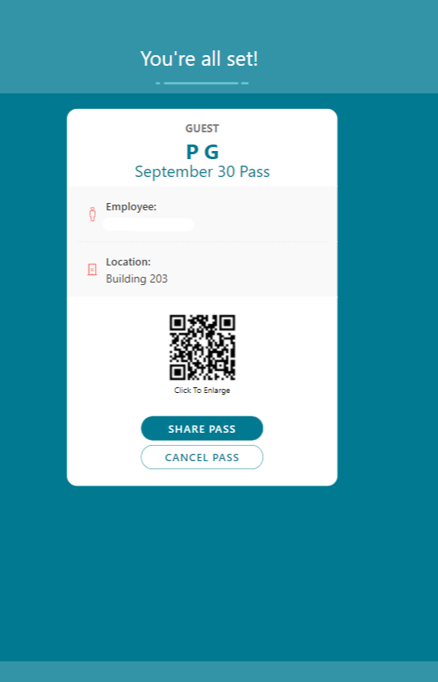
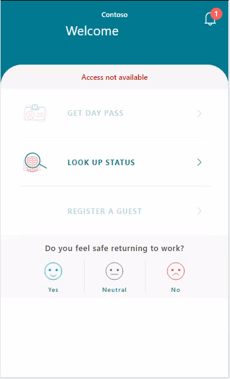

# Use the Employee Return to the Workplace app

This article provides step-by-step instructions about how to use the Employee Return to the Workplace app. You can check in, answer questions to determine whether you're eligible to enter a facility, and say how you feel about returning to the workplace.

## Prerequisites

- Open [Power Apps](https://make.powerapps.com) in a web browser or download [Power Apps Mobile](https://powerapps.microsoft.com/downloads):

  - For Apple devices with iOS, such as iPhone and iPad, use the [App Store](https://aka.ms/powerappsios).

  - For Android devices, use [Google Play](https://aka.ms/powerappsandroid).

- Ensure that your organization has deployed and configured the Employee Return to the Workplace app, as described in [Deploy the solution](deploy.md).

## Getting started with the app

Open the app from your device and sign in with your company's Azure Active Directory account. You can view all apps shared with you by your organization after you sign in. More information: [Power Apps mobile device sign in](https://docs.microsoft.com/powerapps/user/run-app-client#open-power-apps-and-sign-in), [Power Apps web browser sign in](https://docs.microsoft.com/powerapps/user/run-app-browser)

When you successfully sign in and open the **Return to the Workplace** app, you can get a day pass, lookup facility status, or answer the employee sentiment question.

> [!div class="mx-imgBorder"]
> 

## See the reopen status of a facility

You can find all available facilities and see the reopen status for them. Select **Look Up Status** to look for facilities and view details such as whether the facility is open and what phase of reopening it's in.

> [!div class="mx-imgBorder"]
> 

When you select a facility from the facility list, the current status of the facility and associated details are displayed. You can also book a space directly from the **LOOK UP STATUS** screen. When a facility isn't available, the **BOOK A SPACE** button is disabled. Select **<** to return back to the previous screen.

> [!div class="mx-imgBorder"]
> 

## Check in to a facility

After you complete the steps to select a particular facility that's open to employees returning to work, you can complete a health survey that determines whether you're eligible to check in to that facility. 

If you're eligible, you'll be given a pass to your selected building for that day. 

**To check in to a facility**

1. Select **GET DAY PASS**.

2. Select an available facility from the facility list or select from the **Saved** facility shortcut if applicable. In the Recent  section, you'll find the facilities you most recently used. The **Saved facilities** and the **Recent facilities** section show the available facilities based on their phase and the earlier bookings. When a facility isn't available, the two sections get disable when a booking isn't available.

3. Select **BOOK A SPACE** to continue with the check-in process.

   > [!div class="mx-imgBorder"]
   > 

4. Select an available area within that facility. Select **See All Available** option to show the available areas. Select **Save as default for future check ins** to save the area to reuse on future check ins. Select **NEXT** to continue with the check-in process.

   > [!div class="mx-imgBorder"]
   > 
   
    > [!NOTE]
    > When a facility doesn't have any available areas to reserve, the area booking screen is skipped for the user. The pass is generated only for that facility and not the area.

5. Select time window for arrival at the facility. Select **NEXT** to continue with the check-in process.

   > [!div class="mx-imgBorder"]
   > 

   > [!NOTE]
   > On a facility you can indicate a time window in which people can check in, it is possible to select 30 minutes, 1 hour or none. When the time window is not filled or none, this screen will be skipped.

6. Accept the terms and agreements.

    > [!div class="mx-imgBorder"]
    > 

7. Review the list of symptom check statements. Select **I AGREE**  if you agree with the statements, and **I DISAGREE** if you don't.

   > [!div class="mx-imgBorder"]
   > 

### Employee pass

If your responses to the symptom check statements show that you're healthy, you'll receive a pass to enter the selected facility. The pass is valid until the end of the day. When you create a pass for a facility where you already created a pass for earlier that day, the pass earlier that day will be canceled automatically. 

> [!NOTE]
> An administrator can disable the use of QR codes in the solution settings. This applies to both employee and guest passes.

If the administrator enabled QR codes in the solution settings, a QR code will be displayed on the pass (default). You can select the QR code to expand for easy scanning.

> [!div class="mx-imgBorder"]
> 

To cancel your pass, select the **CANCEL PASS** button. Select **YES, CANCEL** to proceed with canceling the pass or **NO** to keep the pass.

> [!div class="mx-imgBorder"]
> 

If your responses show you aren't healthy, you'll not receive a pass and provided with contact information for the company health and safety department if you need.

> [!div class="mx-imgBorder"]
> 

> [!NOTE]
> Currently negative attestations are also stored in the solution settings. You can turn off this option if you don't want to store them.

## Create a guest pass

After an employee creates a pass, **REGISTER A GUEST** option becomes available. If the employee does not have a valid pass, the **REGISTER A  GUEST** option is disabled. An employee can create multiple guest passes.

> [!NOTE]
> In the solution settings an administrator can disable the **REGISTER A GUEST** option. This removes the option from the screen as well.

To create a guest pass:

1. Create a pass for yourself as described in the above section.
1. Select **REGISTER A GUEST**
1. If a user has registered a guest before, recent five guest names are displayed. Select one of the recent guests or enter new guest details. To register a new guest, enter the details in the fields:

   |Field|Description|
   |------|----------|
   |Guest First Name| Enter the first name of the guest.|
   |Guest Last Name| Enter the last name of the guest.|
   |Company| Enter the company name of the guest.|
   |Email Address|Enter the email address of the guest.|
   |Phone Number|Enter the phone number of the guest.|

1. Select **NEXT** after you entered all the details in the required fields.
1. The **Review Disclosure and Instructions** screen show information about privacy discloses, health requirements, and instructions for the guests. Both fields can be expanded with the **+** icon. Select **NEXT** to continue, to see the generated guest pass with details.
1. Select **X** icon to return back to the home page.

You can also access guest passes from the home screen by selecting the **PASS** icon on top of the screen. Both the employee and guest passes can be seen on the screen. You can also share  the guest passes by selecting the **SHARE PASS** button available on the guest pass.

### Email guest pass

When a guest pass is created, you can share the pass with the guest through email by selecting the **SHARE PASS** button available on the guest pass. This sends the guest an email with the host name, facility, date, and hour of the reservation with QR code. 

> [!div class="mx-imgBorder"]
> 

> [!NOTE]
> In the solution settings, you can turn off sending email option if you don't want to email guest passes.

## Share sentiment

You can say how you're feeling about returning to the workplace. On the home page, select one of the options to answer the question **Do you feel safe returning to work?**

> [!div class="mx-imgBorder"]
> 

 This option will reset itself after you reopen the app.

> [!div class="mx-imgBorder"]
> 

> [!NOTE]
> In the solution settings, you can turn this feature off if you don't want to use this.

## Facility access not available

Sometimes the case manager can inform you about the facility that the access is no longer available for you. You'll see a banner appearing on the home screen, which indicates the **Facility access is not available**. A message is shown with further instructions when you select the banner. 

> [!div class="mx-imgBorder"]
> 

## Feedback about the solution

To provide feedback about the Return to the Workplace solution, visit <https://aka.ms/rtw-community>.
