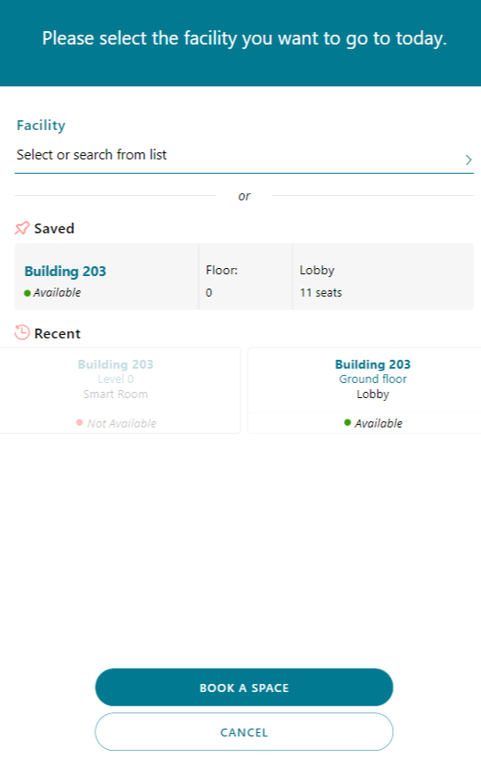
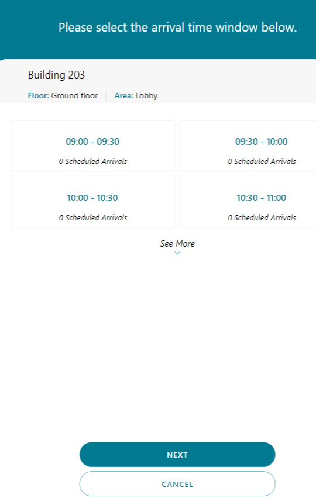
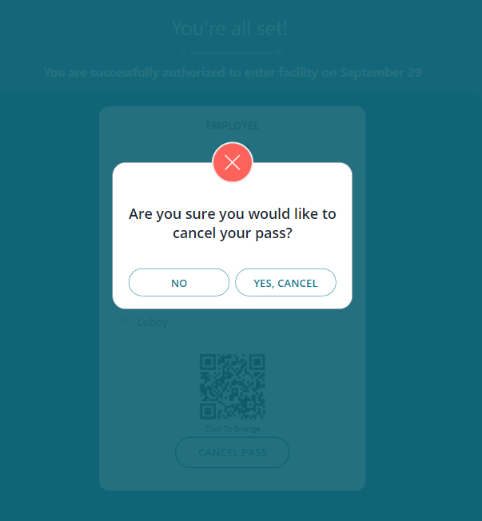

# Use the Employee Return to the Workplace app

This article provides step-by-step instructions about how to use the Employee Return to the Workplace app. You can check in, answer questions to determine whether you're eligible to enter a facility, and say how you feel about returning to the workplace.

## Prerequisites

- Open [Power Apps](https://make.powerapps.com) in a web browser or download [Power Apps Mobile](https://powerapps.microsoft.com/downloads):

  - For Apple devices with iOS, such as iPhone and iPad, use the [App Store](https://aka.ms/powerappsios).

  - For Android devices, use [Google Play](https://aka.ms/powerappsandroid).

- Ensure that your organization has deployed and configured the Employee Return to the Workplace app, as described in [Deploy the solution](deploy.md).

## Getting started with the app

Open the app from your device and sign in with your company's Azure Active Directory account. You can view all apps shared with you by your organization after you sign in. More information: [Power Apps mobile device sign in](https://docs.microsoft.com/powerapps/user/run-app-client#open-power-apps-and-sign-in), [Power Apps web browser sign in](https://docs.microsoft.com/powerapps/user/run-app-browser)

When you successfully sign in and open the **Return to the Workplace** app, you can get a day pass, look up facility status, or answer the employee sentiment question.

> [!div class="mx-imgBorder"]
> 

## See the reopen status of a facility

You can find all available facilities and see the reopen status for them. Select **Look Up Status** to look for facilities and view details such as whether the facility is open and what phase of reopening it's in.

> [!div class="mx-imgBorder"]
> 

When you select a facility from the facility list, the current status of the facility and associated details are displayed. Select **<** to return to the previous screen.

> [!div class="mx-imgBorder"]
> 

## Check in to a facility

After you complete the steps to select a particular facility that's open to employees returning to work, you can complete a health survey that determines whether you're eligible to check in to that facility. 

If you're eligible, you'll be given a pass to your selected building for that day. 

**To check in to a facility**

1. Select **GET DAY PASS**.

2. Select an available facility from the facility list or use the saved facility and area shortcut if applicable.

3. Select **BOOK A SPACE** to continue with the check-in process.

   > [!div class="mx-imgBorder"]
   > 

4. Select an available area within that facility. Select **See All Available** option to show the available areas. Select **Save as default for future check ins** to save the area to reuse on future check ins. Select **NEXT** to continue with the check-in process.

   > [!div class="mx-imgBorder"]
   > 
   
> [!NOTE]
> When a facility doesn't have any areas, this screen will be skipped for an user. The pass will then only be for that facility.

5. Select time window for arrival at the facility. Select **NEXT** to continue with the check-in process.

   > [!div class="mx-imgBorder"]
   > 

> [!NOTE]
> On a facility you can indicate a time window in which people can check in, it is possible to select 30 minutes, 1 hour or none. When the time window is not filled or none, this screen will be skipped.

6. Accept the terms and agreements.

    > [!div class="mx-imgBorder"]
    > 

7. Review the list of symptom check statements. Select **I AGREE**  if you agree with the statements, and **CANCEL** if you don't.

   > [!div class="mx-imgBorder"]
   > 

### Employee pass

If your responses to the symptom check statements show that you're healthy, you'll receive a pass to enter the selected facility. The pass is valid until the end of the day. When you create a pass for a facility were you already created a pass for earlier that day, the pass earlier that day will be cancelled automatically. 

> [!div class="mx-imgBorder"]
> 

To cancel your pass, select the **CANCEL PASS** button. Select **YES, CANCEL** to proceed with canceling the pass or **NO** to keep the pass.

> [!div class="mx-imgBorder"]
> 

If your responses show you aren't healthy, you'll not receive a pass and provided with contact information for the company health and safety department if you need.

> [!div class="mx-imgBorder"]
> 

> [!NOTE]
> Current negative attestations are also stored, in the solution settings you can turn this feature off if you are not allowed to store them.

## Share sentiment

You can say how you're feeling about returning to the workplace. On the home page, select one of the options to answer the question **Do you feel safe returning to work?**

> [!div class="mx-imgBorder"]
> 

 This option will reset itself after you reopen the app.

> [!div class="mx-imgBorder"]
> 

> [!NOTE]
> In the solution settings you can turn this feature off if you don't want to use this.

## Feedback about the solution

To provide feedback about the Return to the Workplace solution, visit <https://aka.ms/rtw-community>.
