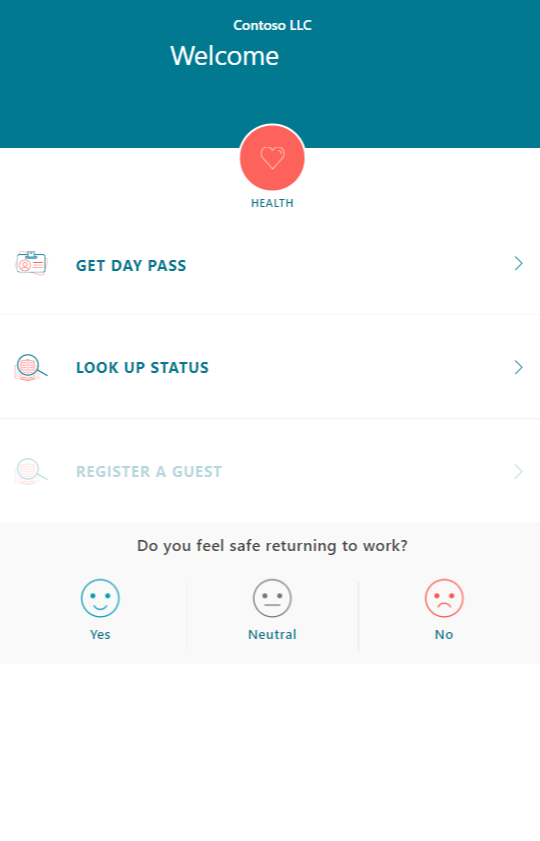
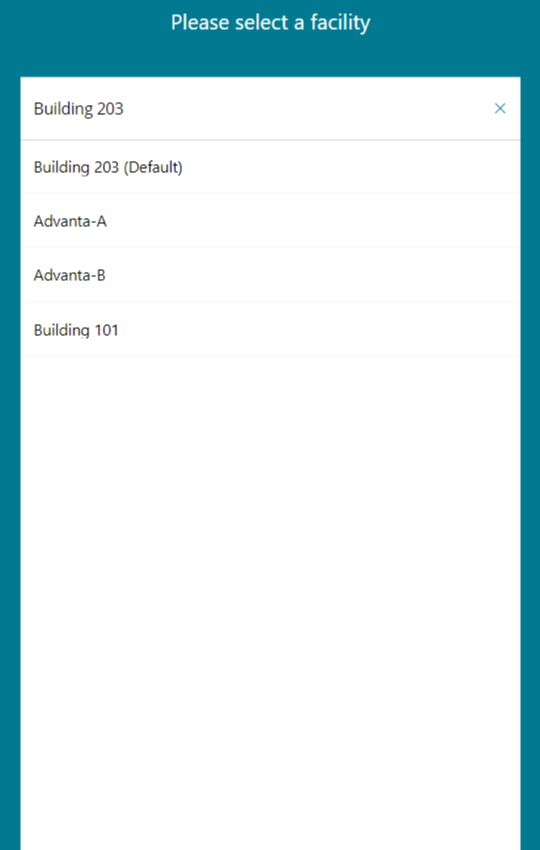
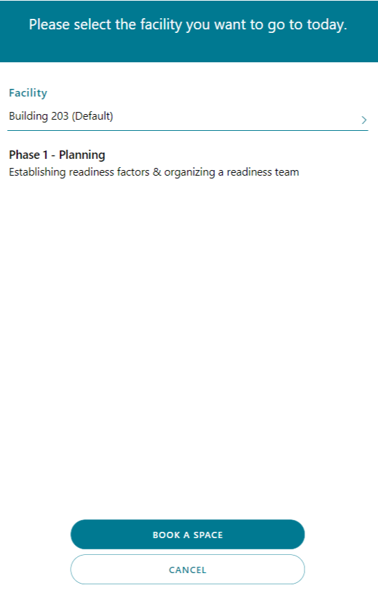
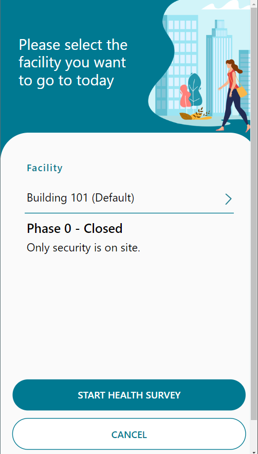
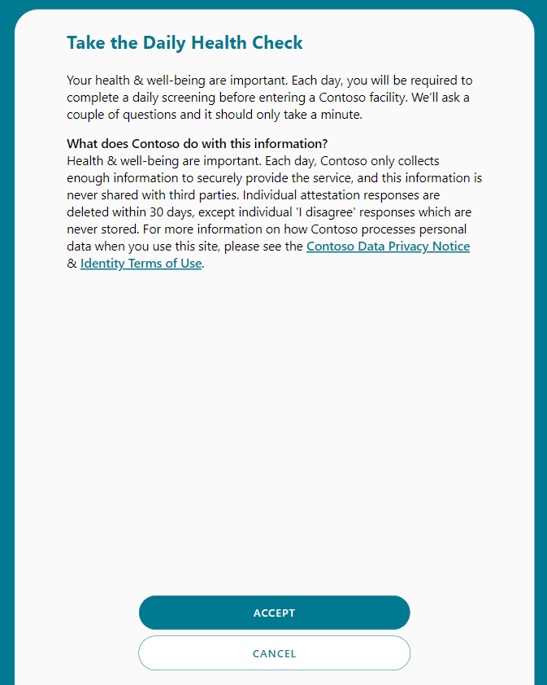
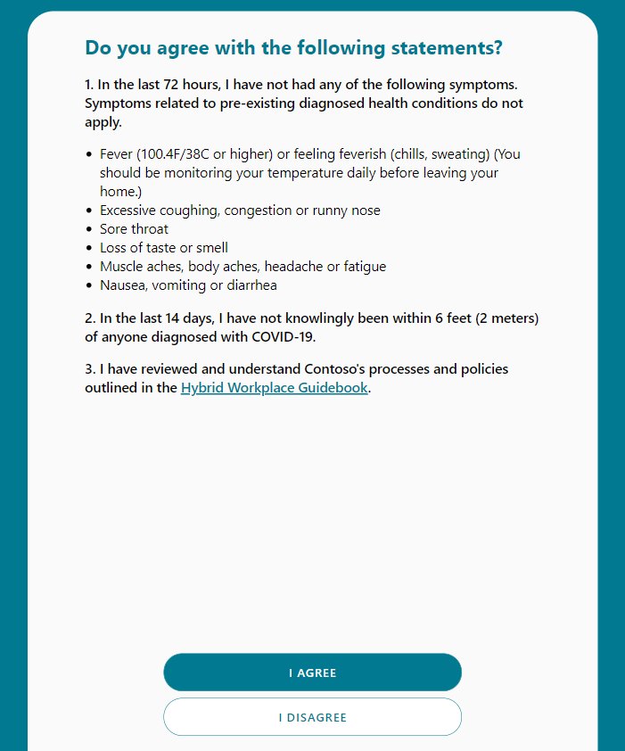
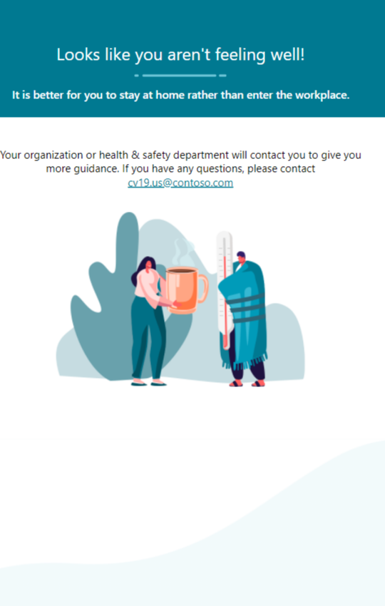
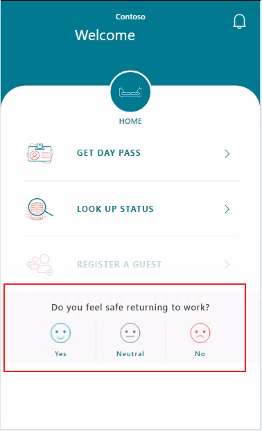
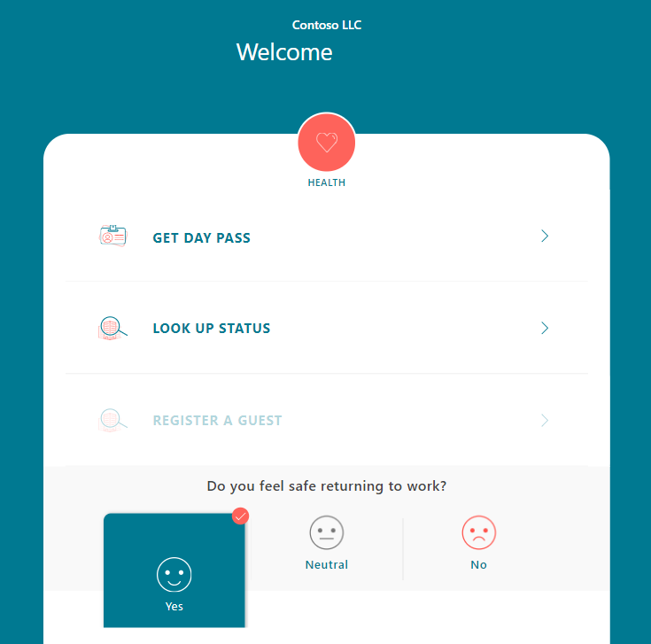

# Use the Employee Return to the Workplace app

This article provides step-by-step instructions about how to use the Employee Return to the Workplace app. You can check in, answer questions to determine whether you're eligible to enter a facility, and say how you feel about returning to the workplace.

## Prerequisites

- Download [Power Apps Mobile](https://powerapps.microsoft.com/downloads):

  - For Apple devices with iOS, such as iPhone and iPad, use the [App Store](https://aka.ms/powerappsios).

  - For Android devices, use [Google Play](https://aka.ms/powerappsandroid).

- Ensure that your organization has deployed and configured the Employee Return to the Workplace app, as described in [Deploy the solution](deploy.md).

## Getting started with the app

Open the app from your device and sign in with your company's Azure Active Directory account. You can view all apps shared with you by your organization after you sign in. More information: [Power Apps mobile device sign in](https://docs.microsoft.com/powerapps/user/run-app-client#open-power-apps-and-sign-in)

When you successfully sign in and open the **Return to the Workplace** app from your mobile device, you can get a day pass, look up facility status, or answer the employee sentiment question.

> [!div class="mx-imgBorder"]
> 

## See the reopen status of a facility

You can find all available facilities and see the reopen status for them. Select **Look Up Status** to look for facilities and view details such as whether the facility is open and what phase of reopening it's in.

When you select a facility from the facility list, the current status of the facility and associated details are displayed. Select **<** to return to the home screen.

> [!div class="mx-imgBorder"]
> 

> [!div class="mx-imgBorder"]
> 

## Check in to a facility

After you complete the steps to select a particular facility that's open to employees returning to work, you can complete a health survey that determines whether you're eligible to check in to that facility. 

If you're eligible, you'll be given a pass to your selected building for that day. 

**To check in to a facility**

1. Select **GET DAY PASS**.

2. Select an available facility from the facility list.

3. Select **Start Health Survey** to complete the check-in process.

   > [!div class="mx-imgBorder"]
   > 

4. Accept the terms and agreements.

    > [!div class="mx-imgBorder"]
    > 

5. Review the **Symptom Check** statements. Select **I Agree**  if you agree with the statements, and **I Disagree** if you don't.

   > [!div class="mx-imgBorder"]
   > 

### Employee pass

If your responses to the symptom check statements show that you're healthy, you'll receive a pass to enter the selected facility. The pass expires in 24 hours. 

> [!div class="mx-imgBorder"]
> 

If your responses show you aren't healthy, you won't receive a pass and you'll be given contact information for the company health and safety department to use if you need.

> [!div class="mx-imgBorder"]
> 

## Share sentiment

You can say how you're feeling about returning to the workplace. On the home page, select one of the options to answer the question **Do you feel safe returning to work?**

> [!div class="mx-imgBorder"]
> 

 This option will reset itself after you reopen the app.

> [!div class="mx-imgBorder"]
> 

