# Prerequisites

The following prerequisites apply to this guide:

-   To get started with the mobile app, you need to download the Power Apps
    Mobile on your device using the device's app store.

    -   Download the [Power Apps
        Mobile](https://powerapps.microsoft.com/downloads)

        -   For **Apple** devices with iOS such as iPhone and iPad, use [App
            store](https://aka.ms/powerappsios)

        -   For **Android** devices, use [Google
            Play](https://aka.ms/powerappsandroid)

    -   Ensure your organization has deployed and configured the Return to Workplace
        mobile app as explained in [Deploy and configure the
        app](https://docs.microsoft.com/en-us/powerapps/sample-apps/emergency-response/deploy-configure).

-   For the following steps you need to have the right security roles in place.

    Contact your IT Administrator if you are unable to access.

-   The sample data is in the package and needs to be installed on the
    environment.

# Overview

This guide provides employees a guide on how they can use the Employee App. An employee will check in and provide for example sentiment. In this
document we will cover the following steps:

-   [Getting started with the App](#Getting-started-with-the-App)

-   [See the reopen status of a facility](#See-the-reopen-status-of-a-facility)

-   [Check in to a facility](#Check-in-to-a-facility)

-   [Share sentiment](#Share-sentiment)

# Getting started with the App

Open the app from your device and sign in with your company's Azure Active
Directory account. You can view all apps shared to you by your organization once
you sign in. For more information, see [Power Apps mobile device sign
in](https://docs.microsoft.com/en-us/powerapps/user/run-app-client#open-power-apps-and-sign-in).

When you successfully login and launch the **Return to Workplace** app from your mobile
device you will have an option to check into a facility, look up a facility, or
answer the employee sentiment question:

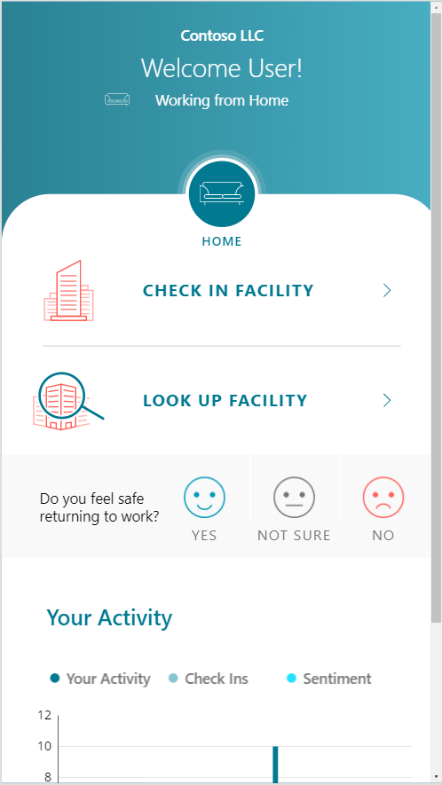

# See the reopen status of a Facility

You can a reopen status of a facility, here you will find for all the facilities
to status and the guidance around.

Select **Look up Facility** to look up facilities and view details such
as whether the facility is open and what phase of reopening it is in.

Select a Facility from the droplist and the current facility status and
associated details are displayed

Select <b>Cancel</b> to return to the home screen

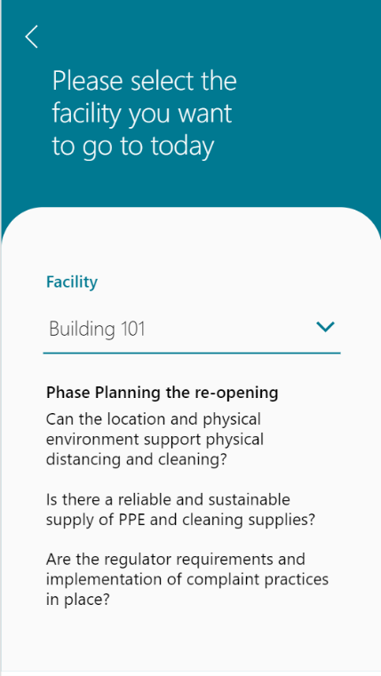

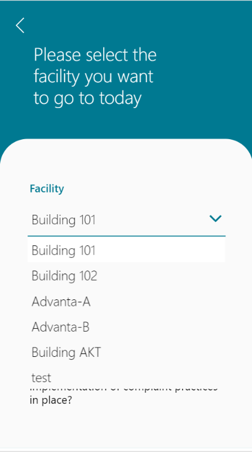

# Check in to a Facility

An Employee is able to complete the steps required to select a particular
facility that is “open” to employees returning to work. The employee is able to
find a facility and then complete a health survey that determines if they are
eligible to check into the facility they have selected. If eligible the employee
will be provided with a pass to their selected building for that day

Select Check in Facility

Select an available facility form the Facility droplist

Select Start Health Survey to be the questionnaire required to complete
a check in attempt.

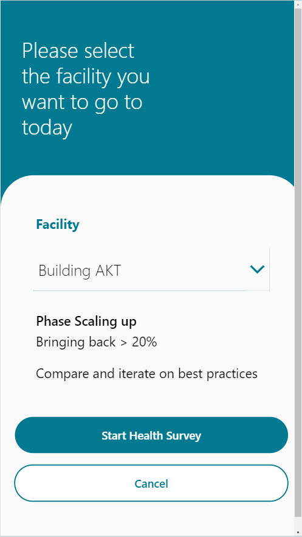

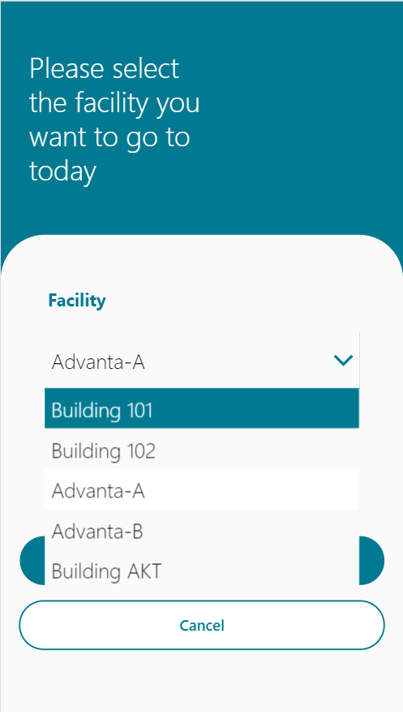

## Symptom Check 1

Review the Symptom Check 1 question. Select “Yes” is you are currently
experiencing any of the listed symptoms and “No” if you are not.

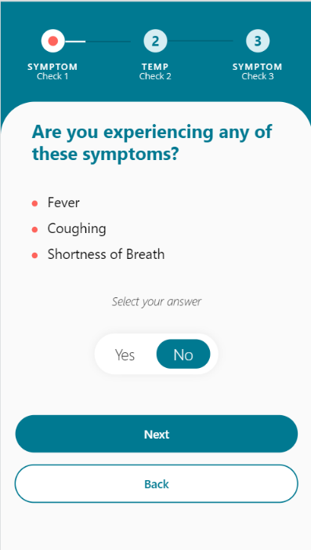

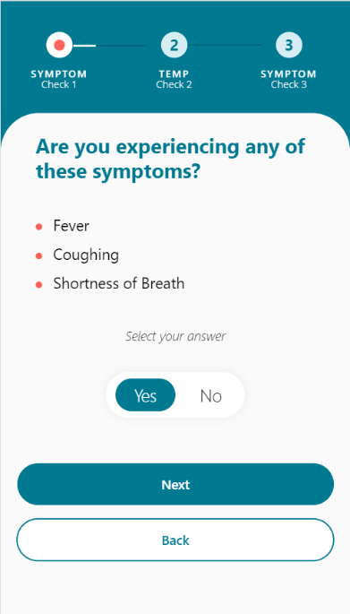

Select the Next button to continue to the next survey stage (Temp Check
2)

## Temperature Check

Select “Yes” if your temperature is over the given number and select
“No” if it is not. Press the **Next** button to continue to the next survey
stage (Symptom Check 3)

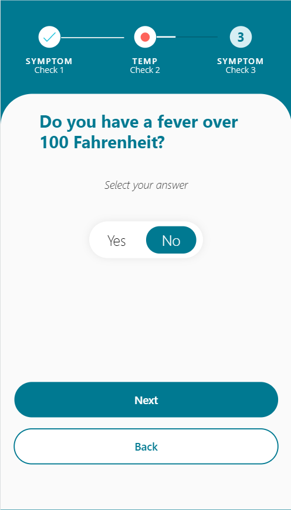

## Symptom Check 2

Review the Symptom Check 2 question. Select “Yes” is you are currently
experiencing any of the listed symptoms and “No” if you are not.

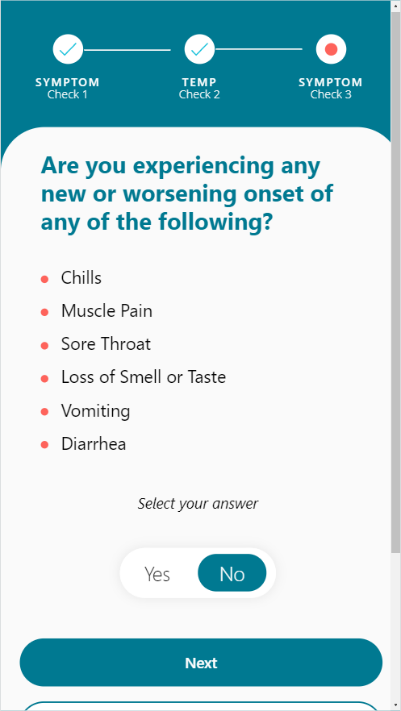

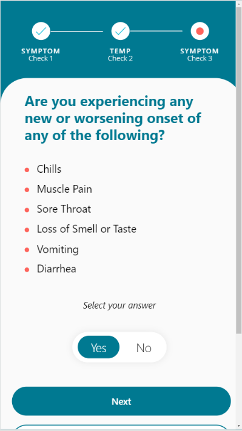

Press **Next** to submit questionnaire responses.

## Employee Pass

If your responses to the questionnaire shows you are healthy, you will receive a
pass to enter the selected facility. This pass expires in 24 hours. If not, you
will not receive a pass and will be given the contact information for the
company health and safety department if needed.

# Share Sentiment

This section covers the Share Sentiment feature where employees can share how
they are feeling about returning to work.

On the home page there is a question that asks “Do you feel safe returning to
work?” You can select a response from three options: Yes, Not sure, and No.

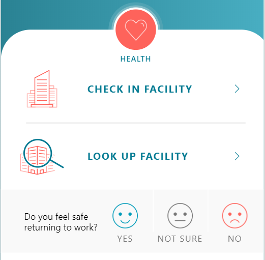

