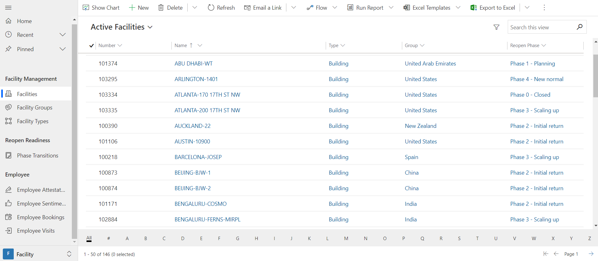
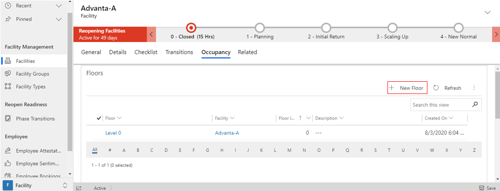
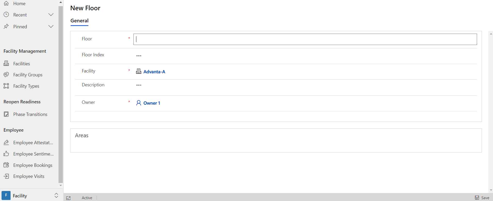
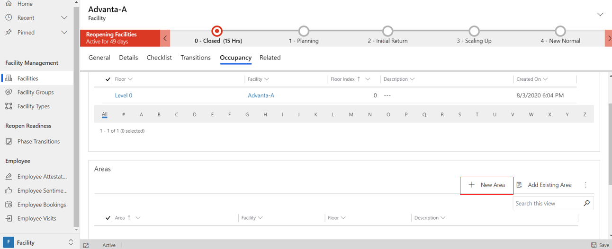
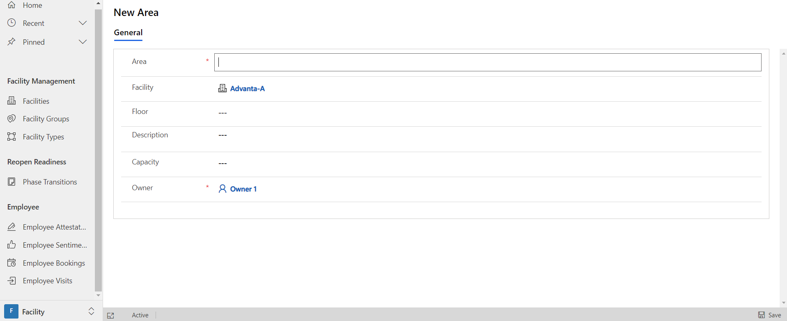
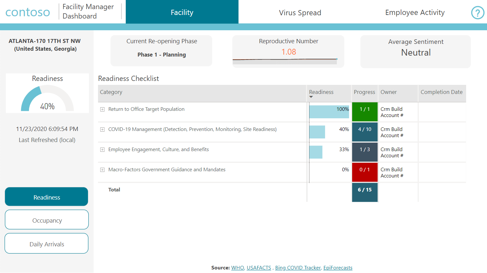
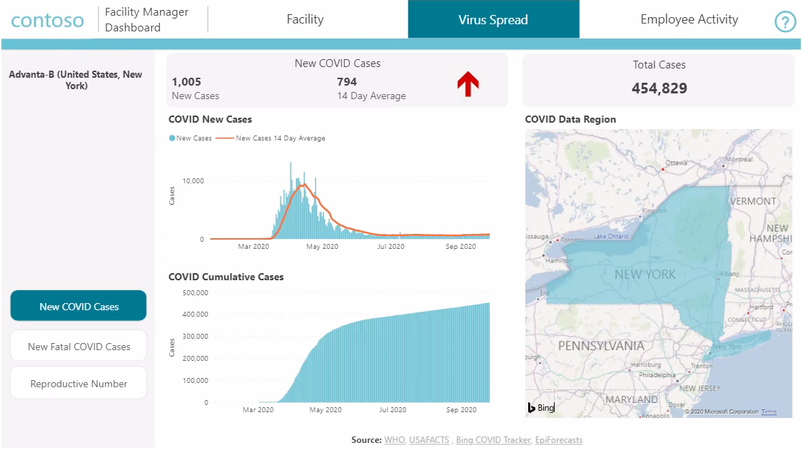
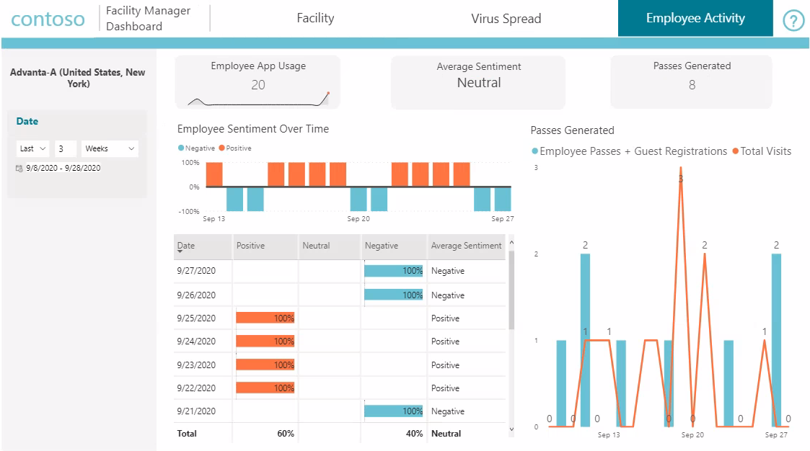
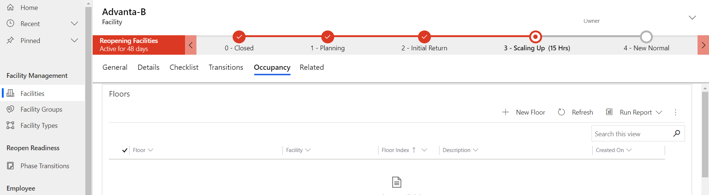
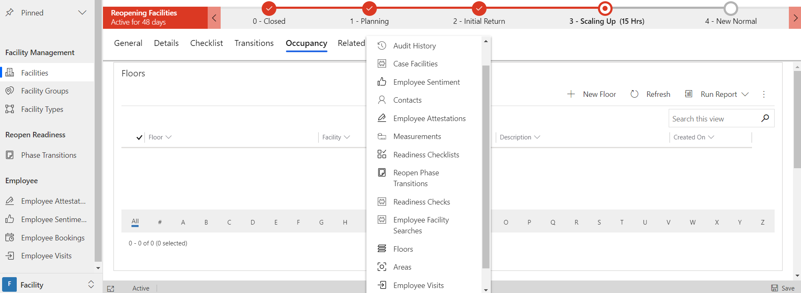

# Use the Facility Safety Management app

The Facility Safety Management app provides step-by-step instructions to facility managers in the organization to manage the reopening and readiness of their facilities. 

This helps the organizations ensure that they can provide a safe working environment for employees by using the Return to the Workplace solution.

## App at a glance

The Return to the Workplace solution supports an organization's goal to return to normal and reopen its facilities to its employees as safely and quickly as possible. As a facility manager, you can use the Facility Safety Management app to manage and support your organization's journey through its specific reopening plan for your facility and its associated phases and goals.

To facilitate the execution of your organization's reopening plan and the reopen phases that have been configured, you lead the required assessments of facility readiness and review its status. More information about reopen phases: [Configure the solution](configure.md)

The assessments are done by performing checks from the facility's readiness checklist. When the facility is considered to be ready based on the results of these checks, you move the facility to the next reopen phase by initiating a phase transition request. The phase transition request is then processed by the organization's assigned reviewer for approval. This implements a "four-eyes" principle, while the checklist allows for a consistent discussion about readiness throughout the company. After the reviewer approves the phase transition request, the facility is moved to the next phase, where a new checklist is created and managed.  

The left pane lists all the components available in the **Facility Management** area.

> [!div class="mx-imgBorder"]
> 

## App components

The Facility Safety Management app has the following components:
<!--markdownlint-disable MD036-->
**Facility Management**

- **Facilities**: List of the facilities (for example, buildings and plants) that require monitoring to reopen.

- **Facility Groups**: A flexible way to group facilities&mdash;for example, by campus or geographical region.

- **Facility Types**: Type of facility&mdash;for example, building, datacenter, or parking space.

**Reopen Readiness**

- **Phase Transitions** - A phase transition is used to create a request to transition to a new phase. When the transition is approved, the facility will be updated with the proposed phase and its associated checklist based upon the phase's configured readiness factors.

**Employee**

- **Employee Sentiment** -  Keeps track of general employee well-being. This is self-reported information, but it's a valuable parameter when tracked consistently over time and with bigger groups. This data is typically entered by employees with the Employee Return to the Workplace app.

- **Employee Attestation** - Keeps track of employee health assessments or attestations based on a series of questions answered by the employee. Employee attestation data is typically entered by employees with the Employee Return to the Workplace app.

- **Employee Bookings** - Keeps track of the employee's area, start (arrival) time, and end (departure) time. Employee bookings are linked to the employees' attestation record and are updated with actual employee visits.

- **Employee Visits** - Keeps track of visits to the facility. Employee visits are linked to an employee and a booking record. 

## Manage facilities 

This section covers how to manage facilities. In addition to creating a facility, you can create floors for that facility that you can associate with areas, to define maximum capacity at a more granular level. You can also assign a facility to a user.

**To create a new facility**

1. On the left pane, select **Facilities**, and then select **New**.

   > [!div class="mx-imgBorder"]
   > 

2. Enter appropriate values in the fields.
 
   > [!div class="mx-imgBorder"]
   > 

   | **Field**              | **Description**                                |
   |------------------------|------------------------------------------------|
   | Facility Number        | Enter a number for the new facility.                  |
   | Name                   | Enter a name for the new facility.                    |
   | Description            | Enter a description for the new facility.              |
   | Entry Window Interval  | Select the window interval for entry from 30 through 60 minutes, or none.|
   | Facility Type          | Select the facility type.   |
   | Facility Group         | Select a group for the facility. |
   | Reopen Phase           | Select the reopen phase.  |
   | Address Street 1       | Enter the first line of the street address.            |
   | Address Street 2       | Enter the second line of the street address.             |
   | Address Postal Code    | Enter the postal code.         |
   | Address City           | Enter the city.               |
   | Address State/Province | Enter the state or province.      |
   | Address Country        | Enter a country.        |

3. Select **Save & Close**.
 
The newly created record is available in the **Active Facility Types** view.

**To create a floor for a facility**

1. On the left pane, select **Facilities**, and then select the facility where you want to add a floor.

2. On the **Occupancy** tab, select **New Floor**.

   > [!div class="mx-imgBorder"]
   > 

3. Enter appropriate values in the fields.

   > [!div class="mx-imgBorder"]
   > 

   | **Field**       | **Description**   |
   |--------------|------------------------------------------------|
   | Floor        | Name for the floor.    |
   | Floor Index  | Number established for the floor. |
   | Facility     | Select the facility name. |

4. Select **Save & Close**.

### Create an area for a facility

Once a floor is created, the **area** option is available to be linked to it.

1. On the left pane, select **Facilities**, and then select the facility where you want to add an area.

2. On the **Occupancy** tab, select **New Area**.

   > [!div class="mx-imgBorder"]
   > 

3. Enter appropriate values in the fields.

   > [!div class="mx-imgBorder"]
   > 

   | **Field**       | **Description**  |
   |--------------|--------------------|
   | Area        | Name for the area. |
   | Facility  | By default the newly created facility  is assigned or you can enter a different facility name. |
   | Floor     | By default, the newly created floor is assigned or you can enter a different floor name. |
   | Capacity    | Number of people allowed in an area.  |

4. Select **Save & Close**. 

To edit the record, select it, update the values, and then select **Save & Close**.

**To assign a facility to a user**

1. Switch to the **Active Facilities** view.

   > [!div class="mx-imgBorder"]
   > 

2. Select a facility, select **Assign**, and then select a **User** to assign the facility to.

   > [!div class="mx-imgBorder"]
   > 

## Monitor a facility

You can monitor and assess the current status of a facility by reviewing its associated dashboard, details, checklist, and transitions.

### Accessing the facility manager dashboard for your facility

1. On the left pane, select **Facility**. The default view, **My Facilities**, shows only your facilities. When switching the views, you can see all the active or inactive facilities. 

2. Select the facility record for which you want to access data. The **General** tab shows the facility manager dashboard, which provides information about facility usage, guides the reopening process, and analyzes occupancy at a facility. The report has three main tabs: **Facility**, **Virus Spread**, and **Employee Activity**.

   - **Facility** tab

     **Readiness** shows the status of the readiness checks needed for a facility's safe reopening. Checks are separated into categories (for example, **Employee Experience** and **Communications**), which can be expanded to show the progress of individual actions. The reproductive number is the average number of people to whom COVID-19 might be transmitted by an infected individual.

     **Occupancy** provides metrics regarding the facility capacity and usage, such as:
      - The facility's total capacity, and its current capacity based on the reopen phase.
      - The number of bookings and visits for the most recent day, and daily average for the last seven days.
      - Two charts&mdash;which can be filtered by date range, floor, or area&mdash;that show:
          - Number of bookings and the current capacity.
          - Average daily occupancy, shown as a black bar. Capacity is represented by the green zone. Floors and areas with black bars in the red zone are over capacity. Occupancy can be viewed at the floor or area level. Hover over the information symbol (🛈) next to the chart to see detailed instructions.

     **Daily Arrivals** shows booking information to assist in controlling facility traffic, such as:
        - Capacity and visit metrics, busiest weekday, and the arrival time window for the last seven days.
        - Two charts, which can be filtered by date range, that display the number of bookings by arrival window and by weekday.

     > [!div class="mx-imgBorder"]
     > 

   - **Virus Spread** tab

      This tab shows data from public health sources by country (by state in the United States):

      - **New COVID-19 Cases** shows the number of cases for the last reporting day, 14-day average, daily trend, and the total number of cases.

      - **Fatal COVID Cases** shows information for COVID-19 cases with fatalities.

      - **Reproductive Number** is the average number of people to whom COVID-19 might be transmitted by an infected individual.  Data for the United States is at the state level.

      > [!div class="mx-imgBorder"]
      > 

   - **Employee Activity** tab

     This tab summarizes the employee engagement and Employee Return to the Workplace app usage over a period. The following metrics are shown:

      - Employee App Usage, which shows the number of times the Employee Return to Workplace app has been used to obtain a pass

      - Average employee sentiment

      - Number of passes generated

      - Two charts, one of which displays employee sentiment by date and the other, passes generated versus the number of visits by date, along with the trend over time.

      > [!div class="mx-imgBorder"]
      > 

### Exploring the facility

You can see all the details of a facility by opening the facility record. To explore details of the facility:

- Select the **Details** tab for the facility.
   > [!div class="mx-imgBorder"]
   > 

 - Select the **Checklist** tab to see the checklist items and their completion status.

   > [!div class="mx-imgBorder"]
   >  

    > [!NOTE]
    > Checklist items are configured as part of the global process for managing reopen phases and their associated readiness factors. Therefore, new checks are added as readiness factors on a reopen phase and not on the facility.

  - Select the **Transitions** tab to see any related transition requests and their status.

     > [!div class="mx-imgBorder"]
     > 

- Select the **Occupancy** tab to see any floors and areas, or add them to the facility.

     > [!div class="mx-imgBorder"]
     > 

- Select the **Related** tab to see any related actions.

   > [!div class="mx-imgBorder"]
   > 

### Updating the checklist

The **Checklist** tab contains an editable grid displaying the checklist for the current facility or phase combination. The editable grid provides an easy way to find checklist items by category and then update the individual items, where applicable. 

1. On the left pane, select **Facilities**.

2. Select the facility for which you want to find and update checklist items.

3. Select the **Checklist** tab.

   > [!div class="mx-imgBorder"]
   > 

4. Select **Category**, and then select the category you want to search in.

   > [!div class="mx-imgBorder"]
   > 

5. Select the drop-down, and then select **Yes** to confirm that the check has been completed. 

6. Add the date in the **Completion date** column, and then select **Save** to update the checklist.

    > [!div class="mx-imgBorder"]
    > 

## Move a facility to a new phase

When you believe a facility should be moved to a new phase, you can apply for a transition. Only a facility manager can create this new transition record, which indicates the facility is ready to move to a new phase. After a new transition is created and saved, it appears in the subgrid on the **Transitions** tab of the facility record with a status of **Submitted**. A reviewer is assigned to the request. As soon as the reviewer is assigned, they can start acting on the reopen phase transition request by accepting or rejecting it. On approval or rejection of the transition record, it's processed, and when it's complete, the request is considered to be closed and is stored as a historical record.

When the process is complete, the transition record appears in the subgrid as either **Accepted** (approved request) or **Rejected** (rejected request). If the transition request is accepted, the phase that was proposed in the transition record is applied to the facility record's reopen phase field. This update triggers the background process that updates the business process flow stage, aligning the reopen phase and the current business process flow stage.

Additionally, the background process creates a new checklist for the facility, along with a new set of metrics and goals. The new checklist that's created is based on the readiness factors that were previously set up and configured by the facility manager for the selected reopen phase. The new checklist can then be accessed from the **Checklist** tab of the facility record.  

> [!NOTE]
> During the execution of the background processes, there might be a delay before you can see these updates. You might need to select the refresh button to see the updates on the screen.

A reviewer&mdash;for instance, a facility manager supervising many facility managers in a facility group&mdash;can find the backlog in **Phase transitions**. The list can be filtered by facility group or reviewer to find the phase transitions that require attention.

> [!NOTE]
> Transitions from one phase to another can't be completed without an approved transition. Therefore, we highly recommend that organizations ensure that someone has been given the responsibility to monitor the transitions and ensure they have the appropriate assigned reviewer.

> [!div class="mx-imgBorder"]
> 

### Creating a transition request

1. On the left pane, select **Facilities**, and then select a facility record from the **Active facilities** list.

2. Select the **Transitions** tab. If any existing or previous transition requests were established, they'll appear in the subgrid.

3. Select **New Reopen Phase Transition**.

   > [!div class="mx-imgBorder"]
   > 

4. Enter appropriate values in the fields.

   > [!div class="mx-imgBorder"]
   > 

   | **Field**    | **Description**    |
   |-----------------------|---------------|
   | Proposed Reopen Phase | Select the next reopen phase you want to transition to.|
   | Summary | Enter the summary information about moving to the next or targeted reopen phase. |
   | Reviewer | Select appropriate resources to review and approve the new transition. By default, this only shows facility managers, but by changing the view you can select other users. |

5. Select **Save & Close**. The newly created record is available on the **Transitions** tab for the facility.

To edit the record, select it, update the values, and then select **Save & Close**. After the phase transition is approved or rejected, the record can't be updated.

### Approving or rejecting a transition

1. On the left pane, select **Phase Transitions**.

   > [!div class="mx-imgBorder"]
   > 

2. Filter the transitions by name on the **Reviewer** column.

3. Select the **Transition** record. Complete any analysis required, and then select **Approved** or **Rejected** in the **Review Status** field.

   - For an approval, select **Approved**, enter any comments in the **Review Comments** field, and then select **Save & Close**.

     > [!div class="mx-imgBorder"]
     > 

   - For a rejection, select **Rejected**, enter any comments in the **Review Comments** field, and then select **Save & Close**.

     > [!div class="mx-imgBorder"]
     > 

The review status for the transition is updated, and appropriate back-end processes are triggered to move the facility to the targeted reopen phase.

### Creating transition records via the business process flow

For ease of use, you can also use the business process flow to create new transition records. There are two cases:

- Moving forward

   Given that the facility isn't in the final phase, you can select the circle of the current stage and then select **Next Stage**. The business process flow won't move instantly, but in the background, a new transition record is created and you'll go to that record. The record is prepopulated with the next phase and is ready for approval.

- Moving backward

   Given that the facility isn't in the first phase, you can select the circle of the current stage and then select the back arrow (**<**) to move back. Or you can select the circle of any previous stage, and then select **Set Active**. The business process flow changes immediately. In the background, a phase transition record is created and approved automatically. This in turn triggers the background process that updates the facility with the checklist, metrics, and goals corresponding to the selected phase. Wait for some time for the changes to happen; you can continue to perform other tasks in the meantime.

## Monitor employee attestations

You can monitor whether your organization's employees are feeling healthy enough to be eligible to return to your facility. You can track employee self-attestations of their health based on a series of questions that the employees answer. This data is typically entered by the employee by using the Employee Return to the Workplace app. You can view the summary of the responses in the **Employee Attestations** area of the Facility Safety Management app.

> [!div class="mx-imgBorder"]
> 

## Monitor employee sentiments

This area of the Facility Safety Management app keeps track of general employee sentiment about the prospect of returning to their workplace. This information is self-reported, but it's a valuable parameter when tracked consistently over time and with larger groups. This data is typically entered by the employee by using the Employee Return to the Workplace app. You can view the summary of the responses in the **Employee Attestations** area of the Facility Safety Management app.

> [!div class="mx-imgBorder"]

## Give feedback about the solution

To provide feedback about the Return to the Workplace solution, visit <https://aka.ms/rtw-community>.
