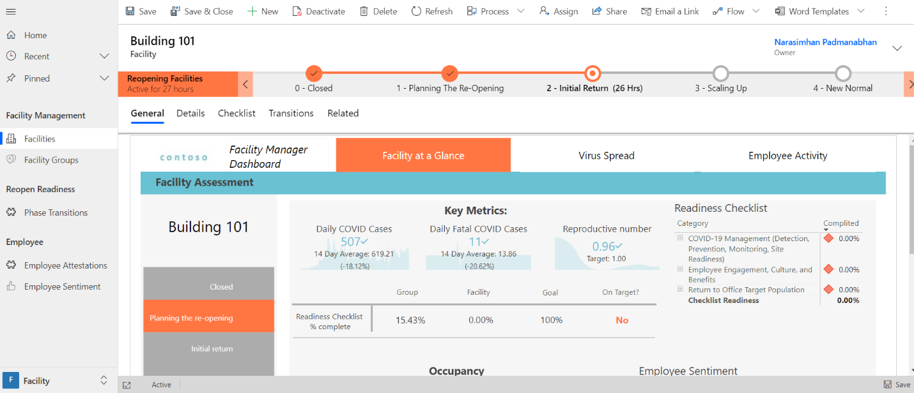
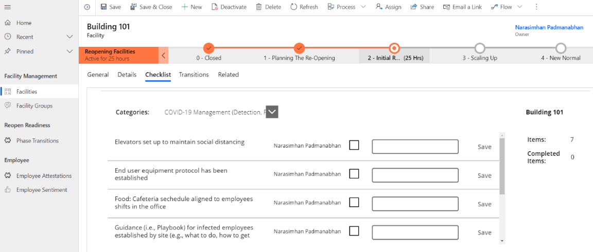
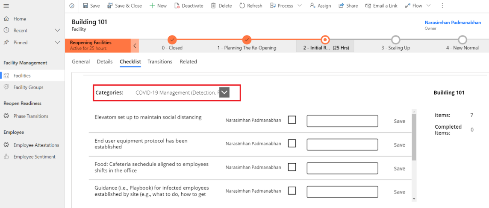
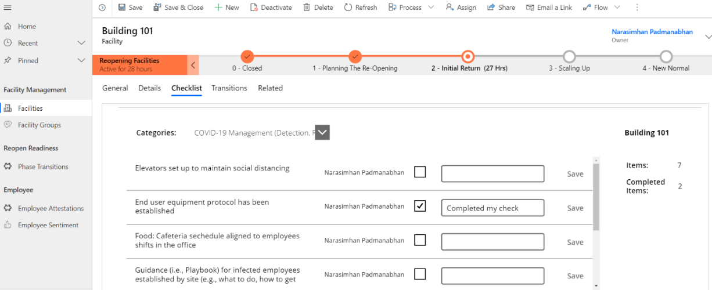

# Use the facility manager app

The facility manager app provides step-by-step instructions to facility managers in organizations on how to use the app to manage the reopening and readiness of the facilities. This helps the organizations ensure that they can provide a safe working environment for employees to return to the workplace using the Return to Workplace solution.

This article has the following sections:

- [Manage and monitor facilities](#manage-and-monitor-facilities)

- [Moving a facility to a new phase](#moving-a-facility-to-a-new-phase)

- [Monitor employee attestations](#monitor-employee-attestations)

- [Monitor employee sentiments](#monitor-employee-sentiments)

## Facility manager app at a glance

The left pane lists all the components available in the **Facility Management** area.

> [!div class="mx-imgBorder"]
> 

## Facility manager app components

The facility manager app has the following components:

**Facility Management**

-  **Facilities**-  List of the facilities (e.g. buildings, plants, etc.) that require monitoring to reopen.

-  **Facility Groups** - Provides a flexible way to group facilities. For example, by campus, or geographical region.

-  **Areas** - Areas are sub components of a facility. This is used to distinguish
    the capacity of these sub components over the various phases.

**Reopen Readiness**

-  **Phase Transitions** - A phase transition is used to create a request to transition to a new phase. When the transition is approved, the facility will be updated with the proposed phase.

-  **Readiness Factors** -  Readiness Factors are basically yes/no type questions regarding reopening a building. They are linked per Reopening Phase to a checklist on a facility.

- **Measurements** -  The actual values for a metric. This allows to track parameters over time. For a single metric, measurements can be entered per facility.

**Employee**

- **Employee Sentiment** -  Keeps track of general employee wellbeing. This is self-reported information, but it is a valuable parameter when tracked consistently over time and with bigger groups. This data is typically entered by employees using the employee app.

- **Employee Attestation** - Keeps track of employee health assessments or attestations based upon a series of questions answered by the employee. This data is typically entered by employees using the employee app.

## Manage and monitor facilities 

This section covers how to manage and monitor facilities.

### Create a facility 

By default, two facilities are provided as an example. To  create anew facility:

1. Select **Facilities** in the left pane and select **New**.

   > [!div class="mx-imgBorder"]
   > 

2. Enter appropriate values in the fields:
 
   > [!div class="mx-imgBorder"]
   > 

   | **Field**              | **Description**                                |
   |------------------------|------------------------------------------------|
   | Facility Number        | Enter a number for the new facility.                  |
   | Name                   | Enter a  name for the new facility.                    |
   | Description            | Enter the description for the new facility.              |
   | Facility Type          | Select the appropriate facility type.   |
   | Facility Group         | Select appropriate facility group. |
   | Reopen Phase           | Select appropriate reopen phase.  |
   | Address Street 1       | Enter the address street 1 information.            |
   | Address Street 2       | Enter the address street 2 information.             |
   | Address Postal Code    | Enter postal code.         |
   | Address City           | Enter the city.               |
   | Address State/Province | Enter state or province.      |
   | Address Country        | Enter country.        |

3. Select **Save & Close**. The newly created record is available in the
    **Active Facility Types** view.

To edit the record, select the newly created record, update the values as
required, and select **Save & Close**.

### Monitor Facility

Facility manager can monitor and assesses the current status of their facilities
by reviewing the facility’s associated dashboard, details, checklist, and
transitions. To monitor a facility.

1. Select **Facility** from  the left pane to see the list of active facilities

2. Select a desired facility record to access the facility data. The **General** tab shows the facility manager dashboard. The dashboard shows the COVID-19 data based on the address details of the facility, checklist completion for the current phase, employee attestation, and employee sentiment. More information: [Power BI dashboard]().

   > [!div class="mx-imgBorder"]
   > 

3. Select **Details** tab for the selected facility
 
   > [!div class="mx-imgBorder"]
   > 

4. Select **Checklist** tab for the selected facility to see checklist items and their completion status.

    > [!div class="mx-imgBorder"]
    > 

5. Select **Transitions** tab for the selected facility to see any related transition requests and their status.

   > [!div class="mx-imgBorder"]
   > 

### Updating the checklist

The **Checklist** tab contains a canvas app displaying the check in the checklist for the current facility or phase combination. The app provides an easy way for the users to find checks by category and then update the individual checks, where applicable. To locate and update checks:

1. Select **Facilities** from the left pane to see the list of active facilities

2. Select a desired facility to access the facility data

3. Select **Checklist** tab for the selected facility to see the checklist items and their completion status.

   > [!div class="mx-imgBorder"]
   > 

4. Select the category from the **Categories** drop-list that you want to search
    within to locate the checks you want to review or update.

   > [!div class="mx-imgBorder"]
   > 

5. Select the checkbox to confirm the check is completed.

6. Add comments in the provided text box and select **Save** that appears next to the text entered.

    > [!div class="mx-imgBorder"]
    > 

## Moving facility to a new phase

When a facility manager asserts that a facility should be moved to a new phase,
the manager can apply for a transition. Only the facility manager can create
a new transition record that indicates the new phase and his rationale to do so.
A reviewer must **Accept** or **Reject** the transition. Either way the transition
record is closed and stored as a historical track record. When the transition is
accepted, the proposed phase is applied to the facility.

The new phase comes with its own set of metrics, goals, and checklist. These
will be made available on the facility by a background process. So there will be
a small delay between accepting a transition and the actual changes on the
facility record.

A reviewer, for instance a facility manager supervising many facility managers
in a facility group, can find the backlog in the phase transitions sub area. For example, the list can be filtered by facility group or by reviewer to find out that the phase transitions requires his or her attention.

> [!div class="mx-imgBorder"]
> 

### Create transition request

To create a transition request:

1. Select **Facilities** in the left pane and select an active facility.

2. Select the **Transitions** tab from the selected facility. If there are any
    existing/previous transition requests established they will appear in the
    sub-grid displayed.

Select the **+New Reopen Phase Transition** button

In the New Transition screen enter the appropriate details:

| **Field**             | **Description**                                                                                                             |
|-----------------------|-----------------------------------------------------------------------------------------------------------------------------|
| Proposed Reopen Phase | Field to select the desired next Reopen Phase to transition to                                                              |
| Summary               | Field allowing summary information regarding any supporting information to support moving to the next/targeted Reopen Phase |
| Reviewer              | Lookup and select an appropriate resource to review and approve the new Transition                                          |

Select **Save & Close**. The newly created record will be available in the
    **Transitions** tab sub-grid for the facility.

To edit the record, select the newly created record, update the values as
required, and select **Save & Close**.

### Approve Transition

Select **Phase Transitions** in the left pane

If not already selected choose the **Reopen Transitions** view

As a Reviewer you need to locate those Transitions with your name identified
    on the **Reviewer** column.

Select/Open the **Transition** record

Complete any analysis you require prior to selecting an Approved or Rejected
    value in the **Review Status** filed select the appropriate.

For Approvals, select the **Approved** status value and enter in any
    associated comments in the **Review Comments** field.

Select the Save & Close button. Transition **Review Status** updated and
    appropriate back end process triggered to move the facility to the targeted
    Reopen Phase.

### Reject Transitions

A reviewer must Accept or Reject transitions. The following are the steps to
review and take approve/reetc action on that request.

Select **Phase Transitions** in the left pane

If not already selected choose the **Reopen Transitions** view

As a Reviewer you need to locate those Transitions with your name identified
    on the **Reviewer** column.

Select/Open the **Transition** record

Complete any analysis you require prior to selecting an Approved or Rejected
    value in the **Review Status** filed select the appropriate.

For rejections, select the **Rejected** status value and enter in any
    associated comments in the **Review Comments** field.

Select the Save & Close button. Transition **Review Status** updated to
    Rejected and appropriate no updates are processed to move the facility to
    the requested Reopen Phase. Facility remains in current phase and status.

## Monitor employee attestations

Facility managers can monitor whether or not their organization’s employees are
feeling healthy enough to be eligible to return to their facility. They are able
to track employee self-attestations of their health based upon a series of
questions presented to and answered by the employees. This data will typically
be entered through employee’s use of the Return to Workplace solution’s canvas
app and available at a summary level in the Facility Manager App’s **Employee
Attestations** sub-area.

## Monitor employee sentiments

Keeps track of general employee sentiment on how they are feeling about the
prospect of returning to their workplace facility. This information is
self-reported information, but it is a valuable parameter when tracked
consistently over time and with bigger groups. This data will typically be enter
through employee’s use of the Return to Workplace solution’s canvas app and can
be viewed by Facility Managers at a summary level in the Facility Manager App’s **Employee
Sentiment** sub-area.

