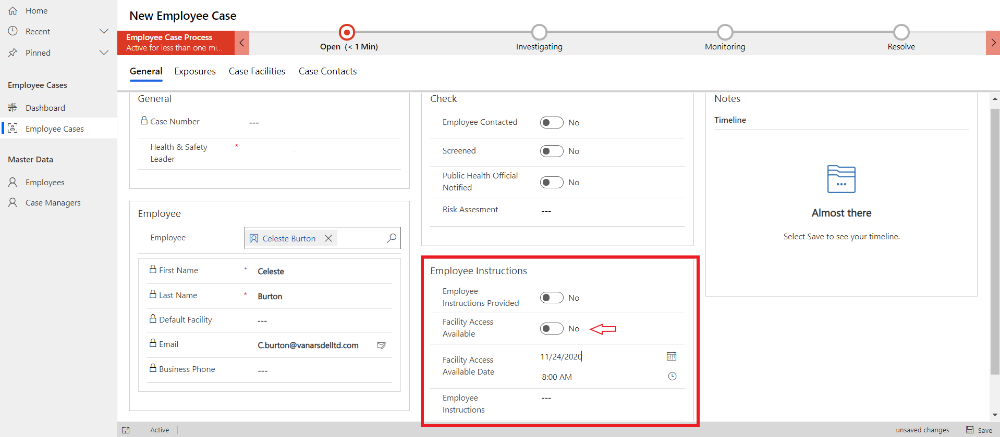
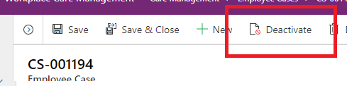
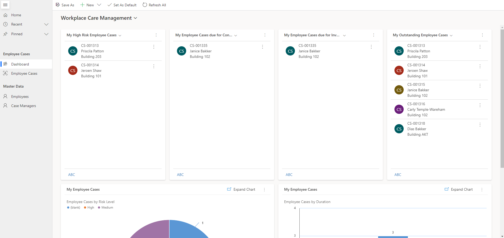

# Use the Workplace Care Management app

This article provides step-by-step instructions to case managers in the organization for using the Workplace Care Management app to manage employee cases. 

To assist Health and Safety Leads, and to help ensure proper case handling, this app implements a four-step process. The current stage of an employee case is clearly depicted in the business process flow on the employee case form. Employee cases will be managed through the following process stages:

1. **Open**: In this stage, you record basic information about the case. At this moment, you as a Health and Safety Lead also become the case manager.

2. **Investigating**: In this stage, you perform steps to ensure that employee checks and screenings are being completed in accordance with company policy. The result of these checks is a clear instruction to the employee. When this is communicated to the employee, the case is moved to the next stage.

3. **Monitoring**: After the investigating stage is complete and the employee has been given instructions or guidelines, they're monitored until they're
healthy enough to be eligible to return to the workplace.

4. **Resolve**: This is the wrap-up stage for the case, where you can enter closing remarks.

You use this app to:

- [Manage employee and case managers data](#manage-employee-and-case-managers-master-data).

- [Manage employee cases](#manage-employee-cases).

## App at a glance

The left pane lists all the components available in the **Employee Cases** area.

> [!div class="mx-imgBorder"]
> 

## App components

The Workplace Care Management app has the following components:

**Employee Cases** 

> [!div class="mx-imgBorder"]
> 

- **Dashboard**: Gives you a dashboard where you can track the status of employee cases.

- **Employee Cases**: List of all employees. Employees are contacts. The Employee Cases component has three views with different filters:

   - **My Employee Cases**: Filtered by owner and only shows active cases. This is the default view.

   - **Active Employee Cases**: Shows all active employee cases. An employee case is considered active when the status field value is set to active. Active Employee Cases are limited to one per employee.

   - **Closed Employee Cases**: Shows all closed employee cases. An employee case is considered closed when it is made inactive either by the case manager or through the process.

      > [!div class="mx-imgBorder"]
      > 

**Master data**

- **Employee**: List of all employees. Employees are contacts.

- **Case Managers**: List of all users who have access to the **Employee Cases** area.

> [!div class="mx-imgBorder"]
> 

## Getting started with the Workplace Care Management app

Employee safety is the main goal for Health and Safety leads. You use this app to decide whether to revoke an employee's ability to check in to the workplace. The goal of care management is to provide clear insight into the work backlog and to make sure the same process is used to manage all cases.

At the case level, no additional personal or privacy-related information is stored or gathered. The case must be regarded as a checklist that proper procedures have been applied.

## Manage employee and case managers master data

This section explains hoe you can manage employees and case managers data.

### Manage employees

You can create a new employee contact if the contact doesn't exist.

**To create an employee contact**

1. Select **Employee** in the left pane, and then select **New**.

   > [!div class="mx-imgBorder"]
   > 

2. Enter appropriate values in the fields:

   | **Field**   | **Description**  |
   |---------------|------------------|
   | User ID| Enter the employee user ID. |
   | First Name | Enter the first name of the employee. |
   | Middle Name | Enter the middle name of the employee. |
   | Last Name | Enter the last name of the employee.  |
   | Default Facility | Select the employee's default facility. |
   | Default Area | Select default area. |
   | Assigned Area | Select an assigned area for the employee. |
   | Email | Enter an employee email address. |
   | Business Phone| Enter the employee mobile or phone number. |
   | Preferred Method of Contact | Select the method of contact the employee prefers from the drop-down list. |
   | Contact Type | Select the contact type. For example, select Employee. |

   > [!div class="mx-imgBorder"]
   > 

3. Select **Save & Close**. The newly created record is available in the **Active Contacts** view.

   To edit the record, select it, update the values, and then select **Save & Close**.

### Manage case managers

Access to employee cases is restricted to only part of the organization. You can view a list of case managers who can manage employee cases.

**To view the list of case managers**

1. Select **Case Managers** in the left pane.

   > [!div class="mx-imgBorder"]
   > 

2. Select the user record you're interested in.

   > [!div class="mx-imgBorder"]
   > 

3. Select **Save & Close**.

   To edit the record, select it, update the values, and then select **Save & Close**.

## Manage employee cases

The following illustration of the case manager process explains how a case is created and managed by capturing different data at various stages to identify, investigate, and resolve the case. When a case manager is notified, an employee case is created. The employee case is taken through stages where you get more details and perform a screening (investigating), provide instructions (monitoring), and close the case (resolved).

> [!div class="mx-imgBorder"]
> 

### Employee case creation

Case managers are the resources who manage employee cases.

1. Select **Employee Cases** from the left pane, and then select **New**.

   > [!div class="mx-imgBorder"]
   > 

2. Enter the employee name for the new case.

   > [!div class="mx-imgBorder"]
   > 

3. Save the record.

### Managing a case – moving a case through the process stages

#### Open

This is the first process stage. The Health and Safety Lead starts the case and can verify that all basic information is available. The Health and Safety Lead becomes the case manager and will verify the employee details and assign the case to a different case manager. 

The key piece of data to be captured and recorded before moving to the next stage is:

- Health & Safety Leader: Case manager owning the case.

  > [!div class="mx-imgBorder"]
  > 

#### Investigating

In this process stage, the case manager contacts the employee to verify how the employee is feeling, and continues to investigate by capturing and recording the case-related data and updating fields on the case form. 

The key pieces of data to be captured and recorded before moving to the next stage are:

- Employee Contacted (Yes/No)

- Screened (Yes/No)

- Risk Assessment

  > [!div class="mx-imgBorder"]
  > 

#### Monitoring

In this process stage, the case manager monitors and manages the cases, ensuring that guidance or instructions that were provided are being followed and that expected target dates for being eligible to return to work are updated for the employee. This stage can be regarded as a holding stage, meaning that it's clear when the next moment of contact will be and when to follow up on the case. 

The key piece of data to be captured and recorded before moving to the next stage is:

- Employee Instructions Provided (Yes/No)

  > [!div class="mx-imgBorder"]
  > 

In the **Employee Instructions** section an employee can be blocked from accessing facilities.

   > [!div class="mx-imgBorder"]
   > 

A case manager can inform an employee that the facility is not available to enter for a while. When **Facility Access Available** is set to **No**, the employee won't be able to get a day pass. To inform an employee that facility access is not available, you'll be able to give **Employee Instructions** that are visible in the app. With the **Facility Access Available Date**, you can inform the employee of when they will be able to get a day pass again. A flow will automatically reset **Facility Access Available** when the date is reached.

This functionality now seamslessly ties in with access controls. For more details see: [Facility Access](app-for-facility-manager.md#facility-access).

#### Resolve

In this process stage, the case manager completes the process by resolving the case, and selects **Finish**. After the process is finished, the employee case becomes inactive. The inactive employee case is then considered completed. 

The key piece of data to be captured and recorded is:

- Employee Instructions Provided (Yes/No)

  > [!div class="mx-imgBorder"]
  > 

### Complete employee case

After you complete the process and select **Finish** in the business process flow, the employee cases become inactive. You can also make employee cases inactive for certain reasons if the employee case is no longer being worked on. In that event, you can deactivate the employee case from the command bar. 

  > [!div class="mx-imgBorder"]
  > 

## Manual contact tracing

To facilitate manual contact tracing and tracking of possible exposures, three elements have been added to the employee case form:

- Exposures
- Case facilities
- Case contacts

### Exposures

When accounting for the whereabouts of an employee, the system stores valuable information in the form of bookings and attestations. That's why those records can be linked to a case. When doing so, a background process is triggered. This process does two things:

1. Creates a case facility record for that day.
2. Creates case contacts for all the other employees that were:
   - In the same area as that person (10 points).
   - In the same entry window for that facility (if applicable) (5 points).
   - On the same floor as that person (3 points).

These case contacts must be regarded as suggestions and can then be cleared by the case manager.

> [!NOTE]
> Case contact records that are created as suggestions do not include guests who were registered.

> [!NOTE]
> Case contact suggestions only work for facilities where the capacity management option has been enabled. See the [Facility Manager app](app-for-facility-manager.md) article for guidance on how to set up floors and areas.

#### Link an employee attestation record

To link an employee attestation record to a case:

1. Open an employee case record and select the **Exposures** tab.
2. In the grid, select **Add Existing Employee Attestation**.
3. Use the lookup to search for the attestation records for the employee under investigation.
4. Select the applicable employee attestation records and then select **Add**.

The employee attestation record is now linked to the case record. This triggers the background suggestion process that creates case contact suggestions that can assist in the manual contact tracing procedure.

Each employee attestation record can only be linked to a single case record. If the duplicate detection rules have been set up, there can also be only one active case per employee. This prevents duplicate work.

### Case facilities

As part of the investigation, a case manager might need to register which facilities are involved in the case. When you open an employee case, this can be done on the **Case Facilities** tab.

On the **Case Facilities** tab, select **New Case Facility** to relate a facility to the case record. When the record is created, select the record and select **Edit** to add the following details:

| **Field**   | **Description**  |
|---------------|------------------|
| Date From | Enter the start date of the employee visiting that facility. |
| Date To | Enter the end date of the employee visiting that facility.  |
| Comment | Enter additional information, when applicable. |
|||

When a case facility record is added as part of the suggestion process, both the **Date From** and **Date To** fields will be set to the day of the attestation.

### Case contacts

An employee under investigation might have contacted with one or more colleagues. This type of information can be captured in the **Case Contacts** tab.

On the **Case Contacts** tab, select **New Case Contact** to relate an employee to the case record. When the record is created, select the record and select **Edit** to add the following details:

| **Field**   | **Description**  |
|---------------|------------------|
| Exposure Score | Whole number used to sort the suggestions based on estimated exposure. |
| Risk Assessment | Provides an easy way to prioritize other employees based on their interactions with the employee under investigation. |
| Employee Case | Refers to an open case for the employee. By default the lookup will filter on active cases for the employee. If the record is added as a system suggestion, this field will be filled if only one active case exists. |
| Comment | Enter additional information, when applicable. |
|||

A case can be directly created from a case contact record. To do so, select the record in the subgrid and then select **Create Case**. 

The **Create Case** option is only visible when a record is selected. The following actions are performed:

- A new employee case gets created.
- The new employee case is linked to the case contact record.
- The new employee case has the employee of the case contact record entered.
- The new employee case is assigned to the current user.
- The user is navigated to the newly created record.
- The new employee case number is entered in the employee case field on the contact record.
- The case contact record is deactivated with status **Case Created**.

A case manager can enter additional information. Select **Save & Close** to return to the original employee case record.

#### Exposure score

Exposure score is calculated when the system generates case contacts as suggestions when a case manager links an employee attestation record. The system creates one record per person. If a person shares area, entry time window, or floor through multiple attestations, the exposure score on the existing record is increased. 

For each day, case contacts get points only for the highest category applicable. For example, if a case contact suggestion shared area on one day (10 points) and shared entry time window on another day (5 points), the total exposure score for that case contact would be 15.

The exposure score functionality is used purely as a means to sort the suggestions based on *proximity* to the employee under investigation.

#### Case contact status

A Case Contact has three status options:

- To be evaluated (Active)
- Case Created (Inactive)
- Evaluated (Inactive)

With these three status options, a case manager can clearly indicate which case contacts have been traced and how they have been dealt with.
  
## Overview of employee cases

For managing the whole process from beginning to end, you can use the **Workplace Care Management** dashboard. You'll find the dashboard under **Dashboards**. The dashboard is separated with two different sections—on the top you'll see the list of four different views that show different aspects of the employee cases and on the bottom it shows charts to get a quick overview.

  > [!div class="mx-imgBorder"]
  > 

**Views**

- **My High Risk Employee Cases**: Shows the employee cases that are high risk.

- **My Employee Cases due for Contact**: Shows the employee cases that aren't contacted yet for over a day.

- **My Employee Cases due for Investigation**: Shows the employee cases that aren't investigated yet for over a day.

- **My Outstanding Employee Cases**: Shows the employee cases outstanding for more than two weeks.

**Charts**

- **Employee Cases by Risk Level**: Shows employee cases by risk level.

- **Employee Cases by Duration**: Shows employee cases by duration over days.

## Feedback about the solution

To provide feedback about the Return to the Workplace solution, visit <https://aka.ms/rtw-community>.
