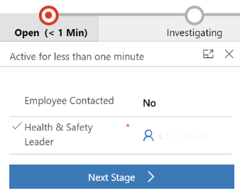
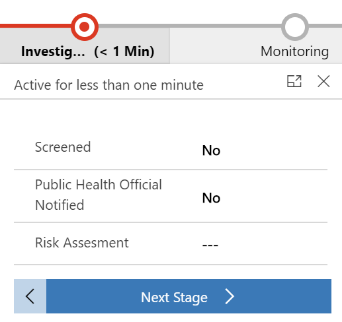

# Use the Employee Case - Return to the Workplace app

This article provides step-by-step instructions to case managers in the organization on how to use the Employee Case - Return to the Workplace app to manage employee cases. 

To assist the Health & Safety Lead and to ensure proper case handling, a 4 step process is implemented. The current stage of an employee case is clearly depicted in the business process flow on the employee case form. The employee cases will be managed through the following process stages:

1. **Open** – In this stage, the Health & Safety Lead records the basic information regarding the case. At this moment the Health & Safety Lead also becomes the case manager for the employee cases.

2. **Investigating** – In this stage, the case manager performs steps to ensure employee checks and screenings are being completed as per the company policy. The result of these checks is a clear instruction to the employee. When this is communicated to the employee, the case is moved to the next stage.

3. **Monitoring** – After the investigating stage is complete and employee is provided with the instructions or guidelines, they are monitored until they are
healthy enough to be eligible to return to the workplace.

4. **Resolve** – Case is in wrap-up stage and the Health & Safety Lead can enter closing remarks.

Health & Safety Lead uses this app to:

- [Manage employee and case managers master data](#manage-employee-and-case-managers-master-data)

- [Manage employee cases](#manage-employee-cases)

- [Monitor employee cases dashboard](#monitor-employee-cases-dashboard)

## Employee Case - Return to the Workplace app at a glance

The left pane lists all the components available in the **Employee Cases** area.

> [!div class="mx-imgBorder"]
> 

## Employee Case - Return to the Workplace app components

The case management app has the following components:

### Employee cases

Employee Cases - Lists of all cases that have been created.

> [!div class="mx-imgBorder"]
> 

### Master data

- Employee - List of all employees. Employees are contacts.

- Case managers - List of all the users that have access to the **Employee Cases** area.

   > [!div class="mx-imgBorder"]
   > 

### Employee cases dashboard

- Cases

- Workload

## Getting started with the Employee Case - Return to the Workplace app

Employee Safety is the main goal for the Health & Safety Lead. Therefore the
employee cases allows the Health & Safety Lead to revoke the employee's ability
to check in to the workplace. The goal of the case management is to provide a
clear insight into the work backlog and to make sure that managing all the cases follow the same process.

At the case level, no additional personal or privacy-related information is
stored or gathered. The case must be regarded as a checklist that proper
procedures have been applied.

## Manage employee and case managers master data

### Manage employee

A Health & Safety Lead can create a new employee contact if the contact doesn't exist.
To create an employee contact:

1. Select **Employee** in the left pane and then select **New**.

   > [!div class="mx-imgBorder"]
   > 

2. Enter appropriate values in the fields:

| **Field**   | **Description**  |
|---------------|------------------|
| First Name | Enter the first name of the employee. |
| Last Name | Enter the last name of the employee.  |
| Email | Enter an employee email address. |
| Business Phone| Enter the employee mobile or phone number. |
| Preferred Method of Contact | Select the desired method of contact from the drop-list. |

3. Select **Save & Close**. The newly created record is available in the
    **Active Contacts** view.

To edit the record, select the newly created record, update the values as
required, and select **Save & Close**.

### Manage case managers

Since employee cases are restricted to be shown only to a part of the organization. You can view a list of case managers who can manage employee cases.
To view the list:

1. Select **Case Managers** in the left pane.

   > [!div class="mx-imgBorder"]
   > 

2. Specific details of a case manager can be seen by selecting the desired user record form the view provided.

   > [!div class="mx-imgBorder"]
   > 

3. Select **Save & Close**. The newly created record is available in the
    **Enabled Users** list.

To edit the record, select the newly created record, update the values as
required, and select **Save & Close**.

## Manage employee cases

The case manager process explains how a case is created and managed by capturing different data at various stages to identify, investigate, and resolve the case. When a case manager is notified, an employee case is created. The employee case is taken through a couple of stages where you get more details and perform a screening (investigating), provide instructions (monitoring), and close the case (resolved).

> [!div class="mx-imgBorder"]
> 

### Employee case creation

Case managers are the resource who manages employee cases. To create a new case:

1. Select **Employee Cases** from the left pane and Select **New**

   > [!div class="mx-imgBorder"]
   > 

2. Enter the employee name for the new case.

   > [!div class="mx-imgBorder"]
   > 

### Managing a case – moving a case through the process stages

#### Open

This is the first process stage, the Health and Safety lead starts the case and can verify if all basic information is available. The Health and Safety lead becomes the case manager and will verify the employee details and / or assign the case to a different case manager. The key pieces of data to be captured and recorded before moving to the next stage are:

- Health & Safety Lead - Case Manager owning the case.

  > [!div class="mx-imgBorder"]
  > 

#### Investigating

In this process stage, the case manager contacts the employee to verify if the employee is feeling well or not and continues to investigate capturing and recording the case-related data and updating the fields on the case form.
The key pieces of data to be captured and recorded before moving to the next stage are:

- Employee Contacted (Yes/No)

- Screened (Yes/No)

- Risk Assessment

  > [!div class="mx-imgBorder"]
  > 

#### Monitoring

In this process stage, the case manager monitors and manages the cases
ensuring that provided guidance or instructions are being followed and expected target dates for return to work eligibility are updated for the employee. This stage can be regarded as a holding stage, meaning that is clear when the next moment of contact will be and when the case needs to be followed up. The key pieces of data to be captured and recorded before moving to the next stage are:

- Employee Instructions Provided (Yes/No)

  > [!div class="mx-imgBorder"]
  > 

#### Resolve

In this process stage, the case manager completes the process by resolving the
case and selects **Finish**. The key pieces of data to be captured and recorded are:

- Employee Instructions Provided (Yes/No)

  > [!div class="mx-imgBorder"]
  > 

### Case facilities

As part of the investigation, a case manager might need to register which facilities are involved in this case. This can be done on the Case Facilities tab.

Open the Case Facilities tab and click New Case Facility to relate a facility to this case. When the record is created, further details can be entered:

| **Field**   | **Description**  |
|---------------|------------------|
| Date From | Enter start date of employee visiting that facility. |
| Date To | Enter end date of employee visiting that facility.  |
| Comment | Enter additional information when applicable. |

### Case contacts

An employee under investigation might have had contact with one or more colleagues. This type of information can be logged on the Case Contacts tab.

Open the Case Contacts tab and click New Case Contact to relate an Employee to this case. When the record is created, further details can be entered:

| **Field**   | **Description**  |
|---------------|------------------|
| Risk Assesment | This field provides an easy way to prioritize other employees based on their interactions with the employee under investigation. |
| Comment | Enter additional information when applicable. |

## Monitor employee cases dashboard

The dashboard consists of two tabs, both with a distinctive set of information.

**Cases**

On this tab, the Health & Safety Lead can see insights into all the cases.
Insights in the workload and work composition:

- New cases per day

- Resolved cases per day

- Number of active cases per phases

**Workload**
  
This tab of the dashboard displays information regarding the progression of the cases so that the Health & Safety Lead can monitor if the cases are dealt 
within a proper way.

- Case duration

- Cases per facility

## Issues and feedback

- To report an issue with the Return to the Workplace solution, visit <https://aka.ms/rtw-issues>.

- For feedback about the Return to the Workplace solution, visit <https://aka.ms/rtw-feedback>.
