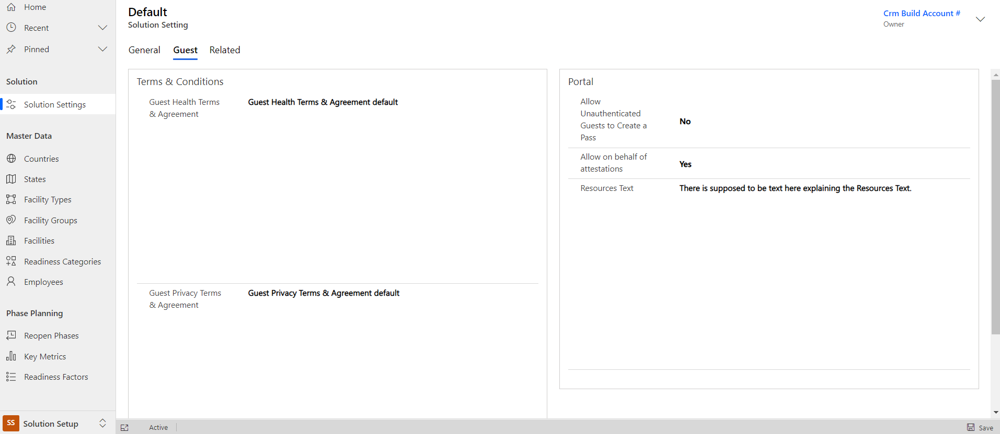
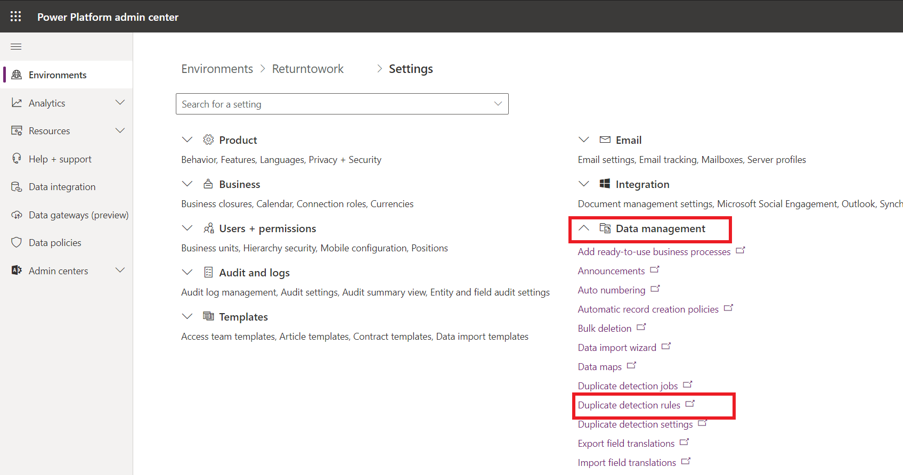
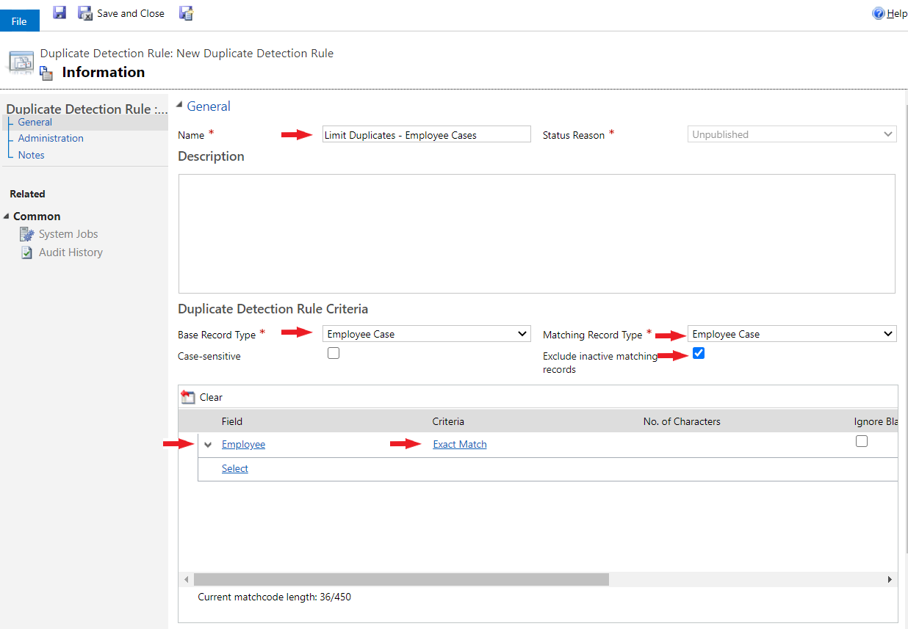

# Configure the Return to the Workplace solution

This article provides step-by-step instructions to IT administrators for configuring the Return to the Workplace solution. IT administrators are responsible for making sure the facility manager can guide their facilities throughout the phases. The following steps will be covered in this article:

- [Plan reopening phases](#plan-reopening-phases)

- [Manage facilities](#manage-facilities)

- [Specify solution settings](#specify-solution-settings)

## Prerequisites

The environment needs to have all Return to the Workplace components in place with the model-driven apps, canvas apps, and Power BI dashboards.

## Plan reopening phases

Reopening workplaces safely requires planning in phases to ensure the safety of the employees. Within these phases, you need to define goals, metrics, and readiness factors.

In the model-driven app, you select the **Solution Setup** module, which allows you to configure the plan.

> [!div class="mx-imgBorder"]
> 

**To define a reopen phase**

1. [Define key metrics](#define-key-metrics).

2. [Set up readiness categories](#set-up-readiness-categories).

3. [Define readiness factors](#define-readiness-factors).

4. [Set up a reopen phase](#set-up-a-reopen-phase).

5. [Set the goals and readiness factors for a phase](#set-the-goals-and-readiness-factors-for-a-phase).

## Define key metrics

By default, the solution provides and tracks five key metrics. You can define more metrics if you want. 

**To create a new key metric**

1. Select **Key Metrics** in the left pane, and then select **New**.

   > [!div class="mx-imgBorder"]
   > 

2. Enter a meaningful name for the metric.

   > [!div class="mx-imgBorder"]
   > 

3. Select **Save & Close**. The newly created record is available in the **Active Key Metrics** view.

To edit the record, select it, update the values, and then select **Save & Close**.

## Set up readiness categories

Readiness categories organize the readiness factors. By default, six categories are defined. 

**To create a new readiness category**

1. Select **Readiness Categories** in the left pane, and then select **New**.

   > [!div class="mx-imgBorder"]
   > 

2. Enter a meaningful name for the category.

   > [!div class="mx-imgBorder"]
   > 

3. Select **Save & Close**. The newly created record is available in the **Active Categories** view.

To edit the record, select it, update the values, and then select **Save & Close**.

## Define readiness factors 

Readiness factors are used to determine whether the workplaces can move through phases. Some readiness factors are defined in the solution by default.

**To create a new readiness factor**

1. Select **Readiness Factors** in the left pane, and then select **New**.

   > [!div class="mx-imgBorder"]
   > 

2. Enter appropriate values in the fields:

   | **Field** |  **Description** |
   |-------------|------------------------------|
   | Factor | Enter a name for the factor.  |
   | Description | Enter the description for the readiness factor. |
   | Category | Select the appropriate thing to assign your readiness factor to.|

   > [!div class="mx-imgBorder"]
   > 

3. Select **Save & Close**. The newly created record is available in the **Active Readiness Factors** view.

To edit the record, select it, update the values, and then select **Save & Close**.

## Set up a reopen phase

In the reopening plan, you define phases that guide a facility to safely reopen the workplace. The phases are defined in the solution by default.

**To create or edit a reopen phase**

1. Select **Reopen Phases** in the left pane, and then select **New**.

   > [!div class="mx-imgBorder"]
   > 

2. Enter appropriate values in the fields:

    | **Field**   | **Description**       |
   |---------------|------------------------------|
   | Index | Enter a unique index number to place the phase in the order you want.|
   | Name | Enter a name for the reopen phase.|
   | Description   | Enter the description for the phase. |
   | Capacity Limit Percentage   | Enter the percentage of capacity for this phase. |
   | Process Stage | Select the appropriate process stage to assign the new reopen phase to. This identifies which stage in the business process flow should be activated. |

   > [!div class="mx-imgBorder"]
   > 

3. Select **Save & Close**. The newly created record is available in the **Active Reopen Phases** view.

To edit the record, select it, update the values, and then select **Save & Close**.

## Set the goals and readiness factors for a phase

**To set goals for a phase**

1. Select **Reopen Phases** in the left pane, and select the reopen phase record for which you want to add a new goal (in this example, we use the **Initial Return** phase).

   > [!div class="mx-imgBorder"]
   > 

2. Under **Key Metrics**, select **New Goal**.

   > [!div class="mx-imgBorder"]
   > 

3. Enter appropriate values in the fields:

   | **Field**    | **Description**     |
   |--------------|--------------------|
   | Reopen Phase | The name of the phase you're adding a goal to will appear here.|
   | Key Metric   | Select a key metric for the goal.  |
   | Type         | Select an appropriate goal type from the list. |
   | Value        | Enter a numerical target value for the goal. |

   > [!div class="mx-imgBorder"]
   > 

4. Select **Save & Close**. The newly created record is available in the **Key Metrics** view.

To edit the record, select it, update the values, and then select **Save & Close**.

**To set readiness factors for a phase**

1. Select the **Readiness Factors** tab.

   > [!div class="mx-imgBorder"]
   > 

2. Select **Add Existing Readiness Factor**.

   > [!div class="mx-imgBorder"]
   

3. Select the readiness factor that you want to add to your reopen phase record. You can select multiple records.

4. Select **Add** to complete the selection process to add the selected readiness factors to your Reopen Phase record.

   > [!div class="mx-imgBorder"]
   > 

## Manage facilities

Facilities are an important part of the Return to the Workplace solution. By default, the solution includes two facility types&mdash;buildings and conference centers. The IT administrator is responsible for creating, updating the existing facility types, and importing records. 

**To manage facilities**

1. [Define facility types](#define-facility-types).

2. [Import facilities](#import-facilities).

## Define facility types

By default, two facility types are provided as an example.

**To create a new facility type**

1. Select **Facility Types** in the left pane, and then select **New**.

   > [!div class="mx-imgBorder"]
   > 

2. Enter appropriate values in the fields:

    | **Field**   | **Description**                     |
   |-------------|-------------------------------------|
   | Type        | Enter a name for the type of facility.    |
   | Description | Enter the description for the facility type. |

   > [!div class="mx-imgBorder"]
   > 

3. Select **Save & Close**. The newly created record is available in the **Active Facility Types** view.

To edit the record, select it, update the values, and then select **Save & Close**.

## Import facilities

The facility sample data file is available in the package. When you want to import your own facilities, you can [download a template to use for data import](https://docs.microsoft.com/power-platform/admin/download-template-data-import).

**To import sample facility data to the Facility entity**

1. On the left pane, under **Facility Management**, select **Facilities**.

2. Select **Import from Excel**, and select the facilities data file.
 
   > [!div class="mx-imgBorder"]
   > 

3. After the sample data is imported, you'll see the imported records in the entity.

   > [!div class="mx-imgBorder"]
   > 

## Specify solution settings

The overall solution requires certain configurations to ensure that the user has the correct information. You can use solution settings to configure your own terms of agreement, health terms of agreement, and contact email. You can also use themes to tailor the experience to your company branding.

When setting up the solution, do the following:

1. [Set solution settings](#set-solution-settings).

2. [Define a theme](#define-a-theme).

## Set solution settings

With solution settings, you define system settings unique to your company. Solution settings are linked to a facility group or to the entire organization, which makes it possible to differentiate them for facilities in that group. One solution setting will act as the default and will be applicable for every facility, which will be the solution setting record that has an empty facility group.

Some of these settings have an impact on the Employee app. The solution setting record that applies is found by matching the facility group of that user's default facility to settings. If no record is found or the user has no default facility set, the default solution settings record is used.

**To set solution settings**

1. Select **Solution Settings** in the left pane, and then select **New**.

   > [!div class="mx-imgBorder"]
   > 

2. Enter the appropriate values in the fields.

   > [!div class="mx-imgBorder"]
   > 

   
   | **Field**              | **Description**                                |
   |------------------------|------------------------------------------------|
   | Name | Name of the solution settings record. |
   | Facility Group | Applicable facility group, leave empty for default. |
   | Company Name |Name of the company for solution settings. |
   | Allow Employee Sentiment | Capture employee sentiment information in the Employee app. |
   | Allow storing of Negative Attestations | When disabled, negative attestations registered in the Employee app are not stored. |
   | Allow QR codes | Enables QR code on the pass in the Employee app.  |
   | Allow Guest Registrations | Enables employees to register guests on their bookings in the Employee app.  |
   | Allow Share Guest Registrations | Enables employees to share passes with guests. |
   | Health & Safety email | Email address shown when the employee doesn't attest to Health & Safety Instructions in the Employee app.   |
   | Health & Safety Instructions | General instructions provided to employee in the Employee app when access is blocked by the case manager. |
   | General Terms & Agreement | Shown in the Employee app during the booking process. |
   | Health Terms & Agreement | Shown in the Employee app during the booking process. |
   |||

3. On the **Guest** tab, add values for the guest-related settings.

   > [!div class="mx-imgBorder"]
   > 

   | **Field**              | **Description**                                |
   |------------------------|------------------------------------------------|
   | Guest Health Terms & Agreement | Shown in the Employee app during the guest registration process.|
   | Guest Privacy Terms & Agreement | Shown in the Employee app during the guest registration process. |
   |||

## Set duplicate detection rules for employee cases 

For active employee cases, the number of cases can be limited to one active case per employee. When you want to enable this, you need to create a **Duplicate rule**. 

1. Go to the [Power Platform admin center](https://admin.powerplatform.microsoft.com).

2. Select the environment in which the app is located.

3. On the command box, select **Settings**.

   > [!div class="mx-imgBorder"]
   > 

4. Expand **Data management** and then select **Duplicate detection rules**.

   > [!div class="mx-imgBorder"]
   > 

5. Select **New** and enter the appropriate values in the fields. 

   | **Field**   | **Description**                     |
   |-------------|-------------------------------------|
   | Name        | Enter a name for the rule.     |
   | Base Record Type | Select Employee Case. |
   | Matching Record Type | Select Employee Case. |
   | Field | Select Employee. |
   | Criteria | Select Exact Match. |

   Select the **Exclude inactive matching records** check box.

   > [!div class="mx-imgBorder"]
   > 

6. Select **Save and Close**.

7. Select the newly created rule from the list of rules and then select **Publish**.

## Define a theme

You can use a theme to enhance the user experience.

1. Select **Settings**, and then select **Customizations**.

   > [!div class="mx-imgBorder"]
   > 

2. Under Customizations, select **Themes**.

   > [!div class="mx-imgBorder"]
   > 

3. From the list, select the default theme.

    > [!div class="mx-imgBorder"]
    > 

4. You can select different colors from the theme.

   > [!div class="mx-imgBorder"]
   > 
   
## Contoso sample data

When installing the Return to the Workplace solution, Contoso sample data is installed with it so you can try out the solution. The sample data includes data around the following entities. We advise you to import or create your own data for these entities.

- Facilities
- Facility Groups
- Facility Types
- Employees
- Solution Settings

Usage sample data is generated by five flows. These need to be disabled when you are not using the Contoso sample data or when accessing the solution in a production environment.

- Sample Data - Generate Facility transitions

  This flow will loop over all the facilities and randomly move a facility one phase backward or forward by generating and approving a Reopen Phase Transition record. Prerequisites: Facility should be in active state and have a Reopen phase set.

- Sample Data - Generate Employee Records

  This flow mimics employees using the app. It will create a booking, attestation, and sentiment record for the current day for each active employee. Prerequisites: Employee's record should be active, have a default facility assigned, and an assigned area that is part of that default facility.

- Sample Data - Guest Registrations

  This flow adds five guests to bookings created by the flow. Each booking receives one guest. This flow creates a new contact record for each guest every time it triggers.

- Sample Data - Create and update employee cases

  This flow runs twice a day and randomly moves cases one step forward through the process. For each employee, a case is created if none exists. If a case exists, it is moved forward one step in the process. If the case reaches the **Resolved** stage, it will be closed. When moving from opening to investigation, it creates a linked case facility record based on the employee's default facility. Prerequisites: Employee's records should be in active state and have a default facility selected.

- Sample Data - Visits

  This flow runs twice a day and creates a visit record for each employee for their default facility. When an employee record is in an active state, has a default facility assigned, and an assigned area that is part of that default facility, then the visit will also be linked to a booking or attestation record.

## Bulk record deletion

Due to privacy regulations, we strongly recommend that you create bulk record-delete jobs to delete personal data after a certain period. Also, to reduce storage, you can delete deactivated share guest registrations or employee attestations after a certain period of time.

**To create bulk record-delete jobs**

1.	Select **Settings**, and then select **Data Management**

2.	Under **Data Management**, select **Bulk Record Deletion**.

   > [!div class="mx-imgBorder"]
   > 

3.	Select **New**.

4.	Go through the **Bulk Deletion Wizard**.

5.	Select the appropriate **entity** and **criteria**.

   > [!div class="mx-imgBorder"]
   > 

6.	Add a name and a schedule for the bulk record-delete job to run.

   > [!div class="mx-imgBorder"]
   > 

7.	Submit the bulk record-delete job.

## Feedback about the solution

To provide feedback about the Return to the Workplace solution, visit <https://aka.ms/rtw-community>.
