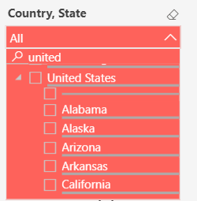

# Use the Power BI dashboard

This article is for executive leaders who uses Power BI dashboard to analyze data to get their employees back to their office locations using the Return to Workplace solution. The following steps will be covered in
this document:

- [System at a glance](#system-at-a-glance)

- [Virus Spread](#virus-spread)

-  [Facility at a glance](#facility-at-a-glance)

-  [Employee activity](#Employee-activity)

## How to view the leadership dashboard

To access the dashboard:

1.  Open the [Power BI dashboard]().

2.  In the top bar search for **Return to Workplace – Leadership** and select it from the dropdown.

    > [!div class="mx-imgBorder"]
    > 

## System at a Glance

System at a glance section surfaces main key metrics regarding returning to
work, including current value, goal values and if they have met goals or not. These key metrics are number of COVID-19 new cases per day, fatality cases per day, new cases per day for million population, fatality cases per day for million population, reproductive
number, and facility Readiness checklist completion percentage.

A Map highlights facilities location, along with number of facilities in certain phase.

Some important statistics are provided on the left side, which includes
number of facilities, facility groups, attestations, and
number of employees for happy, Neutral, and Sad sentiments.

> [!div class="mx-imgBorder"]
> 

**Slicer**

Slicer helps the user to quickly slice and dice the data, focusing on only
interested data points. The country or state slicer lets the user  select the
country and state they are interested. This slicer supports functions like
multiple selections, hierarchy category selections, search, and clean
selections.

> [!div class="mx-imgBorder"]
> 

**Drill-Through Page**

From System at a Glance tab, we can drill down data to related **Facility at a
Glance** tab. There are two ways getting to **Drill-Through Facility at a Glance**
page:

1. Right-click and select **Drill through**.

   > [!div class="mx-imgBorder"]
   > 

2.  Select the data point and then select the drill through function.

    > [!div class="mx-imgBorder"]
    > 

3. You will see details of interested facility next:

   > [!div class="mx-imgBorder"]
   > 

## Virus Spread

Virus Spread section has COVID-19 cases and reproductive number for the country and for state or province level.

> [!div class="mx-imgBorder"]
> 

> [!div class="mx-imgBorder"]
> 

**Toggle button**

The toggle button helps to navigate to another section or topic quickly.
Highlighted color indicates current section or topic.

Example 1 (on top of each page):

> [!div class="mx-imgBorder"]
> 

Example 2 (on Virus Spread Page):

> [!div class="mx-imgBorder"]
> 

## Facility at a glance

Different from System at a glance’s overall view, Facility at a Glance tab will
let user drill down to each facility, track details of facility open readiness
and employee sentiment and attestation. It helps executive leaders to monitor
all kinds of key metrics and decide facility’s opening phase.

> [!div class="mx-imgBorder"]
> 

## Employee activity 

Employee Activity provides an overall time-series view for employee sentiment
and attestation on daily basis. Executive leaders can check every day and see
where numbers were raised or lower compared to previous days.

> [!div class="mx-imgBorder"]
> 

**Tooltip**

By hovering over the transition part of the ribbon chart, users can quickly get an
insight on number changes on tooltip.

> [!div class="mx-imgBorder"]
> 
