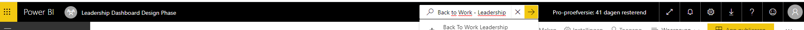
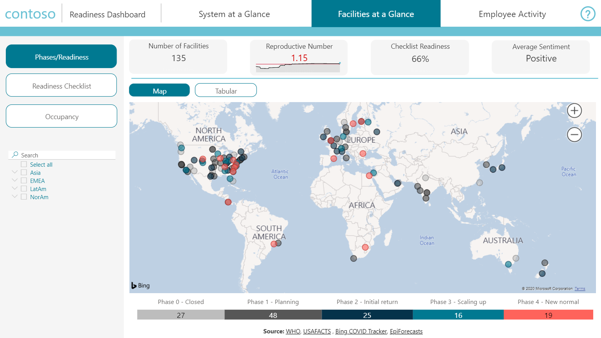
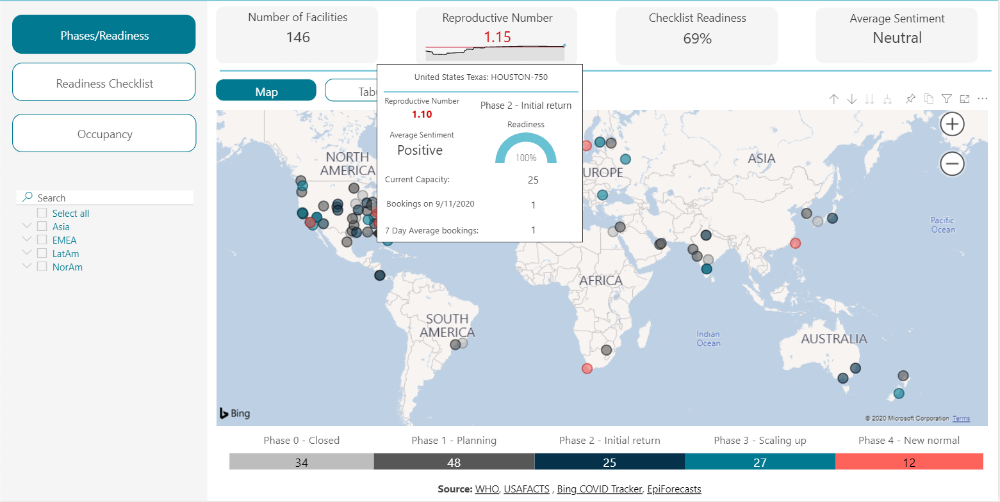
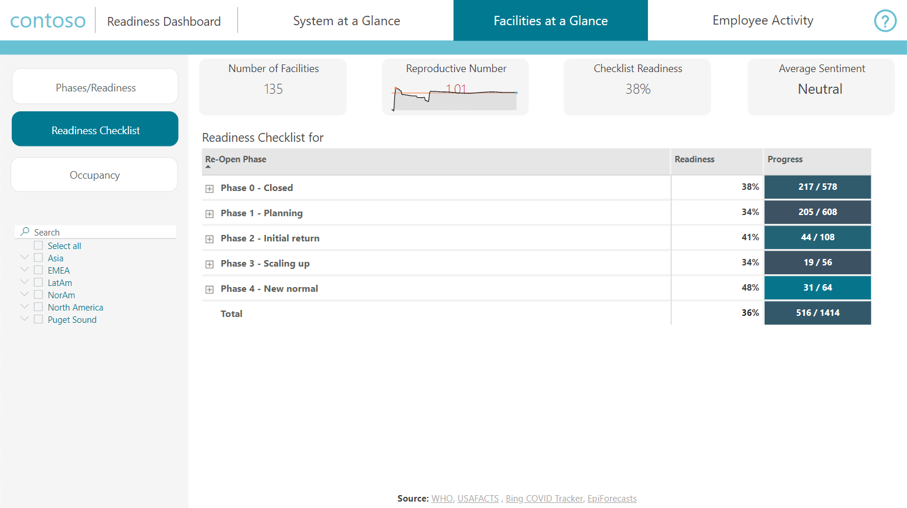
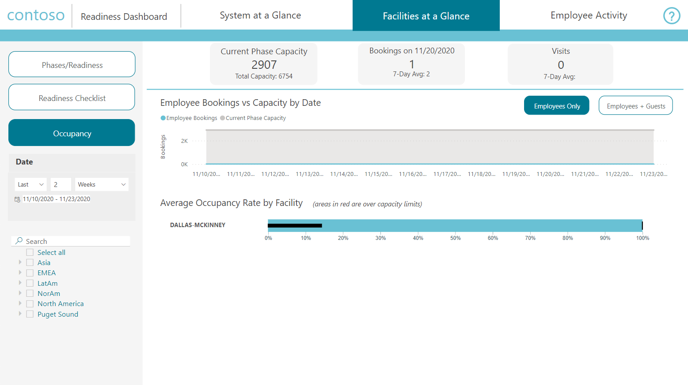
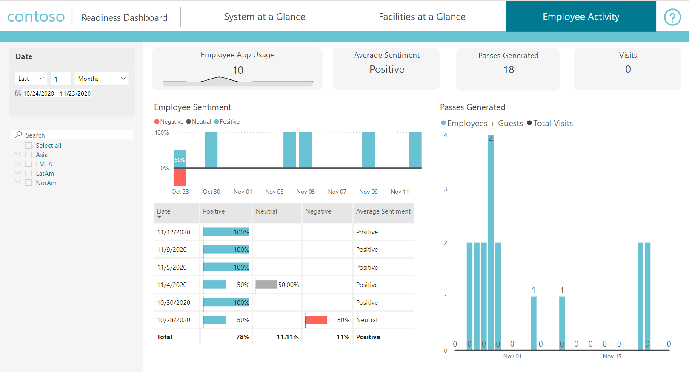

# Use the Location Readiness dashboard

This article is for executive leaders who use the Power BI dashboard to analyze data to help get their employees back to their office locations using the Return to the Workplace solution. 

## How to view the Location Readiness dashboard

1. Open Power BI in the Service.

2. In the search bar, search for **Return to the Workplace – Leadership**.

    > [!div class="mx-imgBorder"]
    > 

## System at a glance

The **System at a Glance** tab provides visibility into key metrics to monitor virus spread and facility status. 

The key metrics are the number of COVID-19 new cases per day, fatal cases per day, 14 day moving average per one hundred thousand population and associated risk level, 14 day moving average fatal cases per million population, reproductive number.

Users can switch between two different views in terms of virus metrics: Worldwide & United States. Virus metrics for worldwide view are shown on a country level and on a state/county level for the United States.

> [!div class="mx-imgBorder"]
> 

A map highlights the locations of facilities, along with the number of facilities that are in a certain phase. Hovering over a facility gives you insights into the virus spread at that location.

Important statistics are provided at the top, including the number of facilities, new cases, new fatal cases, and the reproductive number.

> [!div class="mx-imgBorder"]
> 

### Key metrics

#### Phases

Review the phases that facilities are in, the number of facilities, new cases, new fatal cases, and the reproductive number.

> [!div class="mx-imgBorder"]
> 

#### Confirmed COVID cases 

Information is shown about the number of cases for the last reporting day, 14 day moving average in absolute numbers and per population with the associated risk level, daily trend, and the total number of cases and per population.

> [!div class="mx-imgBorder"]
> 

#### Fatal COVID cases

The data on this tab shows information for COVID-19 cases with fatalities, giving you easy access to information about new fatal cases and total fatal cases in absolute terms and per population, and daily trend.

> [!div class="mx-imgBorder"]
> 

#### Effective Reproductive Number

Effective Reproductive Number is a key measure of how fast the virus is growing or decreasing, showing the average number of people who are infected.

> [!div class="mx-imgBorder"]
> 

### Filter on a region

When you want to drill down on certain facility locations, you can filter on them based on country/region.

> [!div class="mx-imgBorder"]
> 

## Facility at a Glance

Different from the overall view of **System at a Glance**, the **Facility at a Glance** tab lets you drill down to each facility and track details about facility open readiness, employee sentiment, and employee attestation. It helps executive leaders to monitor all kinds of key metrics and determine the facility's opening phase.

> [!div class="mx-imgBorder"]
> 

### Key metrics

#### Phases/Readiness

In this area, you can find employees average sentiment, reproductive numbers, facilities, and current phases.

> [!div class="mx-imgBorder"]
> 

#### Readiness Checklist

The checklist shows the steps needed to move facilities through phases.

> [!div class="mx-imgBorder"]
> 

#### Occupancy

The Occupancy section provides metrics regarding facility capacity and usage, such as:

- Facility’s total capacity, and current capacity based on reopening phase.
- Number of bookings and visits for the most recent day and daily average for the last seven days.
- Two charts, that can be filtered by date range:
   - Number of bookings and the current capacity.
   - Average daily occupancy, shown as a black bar. Capacity is represented by the green zone.  Facilities with black bars in the red zone are over-capacity.

> [!div class="mx-imgBorder"]
> 

## Employee Activity 

The **Employee Activity** tab provides an overall time-series daily view for employee sentiment and daily passes generated for employees and guests. You can check every day to see where numbers increased or were lower compared to previous days. 

> [!div class="mx-imgBorder"]
> 

## Tools

Throughout the report you can use numerous tools like sliders, date filters, and bookmarks. The visualizations include bar and column charts, cards, gauge charts, maps, and more.

### Slicer

Slicer helps you quickly "slice and dice" the data, focusing only on data points you're interested in. You can use the country or state slicer to select the country and state you're interested in. This slicer supports functions like multiple selections, hierarchy category selections, search, and clean selections.

> [!div class="mx-imgBorder"]
> 

### Tooltip

When you hover over the transition part of the ribbon chart, tooltips give you quick insights into the numbers.

> [!div class="mx-imgBorder"]
> 

## Data sources

The dashboard consists of data from the model-driven app and the canvas app, but also consists of external data. The following data sources are used:

1. WHO (cases/deaths): <https://covid19.who.int/>  
© World Health Organization 2020, All rights reserved.  
WHO supports open access to the published output of its activities as a fundamental part of its mission and a public benefit to be encouraged wherever possible. Permission from WHO isn't required for the use of the WHO Coronavirus disease (COVID-19) dashboard material or data available for download. It's important to note that:

   - WHO publications can't be used to promote or endorse products, services, or any specific organization.
   - The WHO logo can't be used without written authorization from WHO.
   - WHO provides no warranty of any kind, either expressed or implied. In no event shall WHO be liable for damage arising from the use of WHO publications.

   For further information, visit [WHO Copyright, Licensing, and Permissions](https://www.who.int/about/who-we-are/publishing-policies/copyright).

2. USAFACTS (cases/deaths, population US only): <https://usafacts.org/visualizations/coronavirus-covid-19-spread-map/>  

   © 2020 USAFacts. All rights reserved.  USAFacts data is available under a Creative Commons license. Learn more at <https://usafacts.org/faq/> 

3. Bing COVID Tracker (cases/deaths for China (mainland), Taiwan, Hong Kong SAR, and Macao SAR: <https://github.com/microsoft/Bing-COVID-19-Data>

    Bing COVID-19 Data.  This data is available strictly for educational and academic purposes, such as medical research, government agencies, and academic institutions, under terms and conditions available at <https://github.com/microsoft/Bing-COVID-19-Data/blob/master/LICENSE.txt>. Data used or cited in publications should include an attribution to 'Bing COVID-19 Tracker' with a link to www.bing.com/covid.

4. Reproductive factor estimates: <https://epiforecasts.io/covid/posts/global/> 

    This dataset is from EpiForecasts and the CMMID COVID-10 working group at <https://epiforecasts.io/covid/posts/global> and is licensed under Creative Commons Attribution CC BY 4.0.

5. Global Population data:  https://population.un.org/wpp/Download/Standard/Population/ is puled from UN department of economic and social affairs.

## Feedback about the solution

To provide feedback about the Return to the Workplace solution, visit <https://aka.ms/rtw-community>.