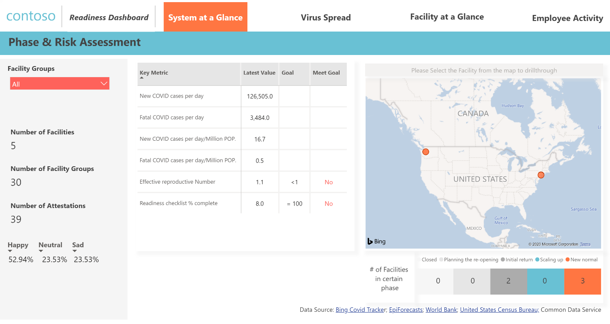
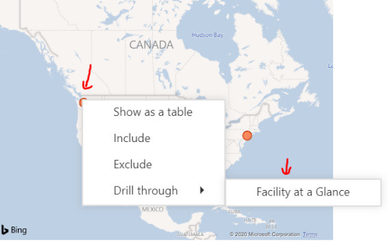
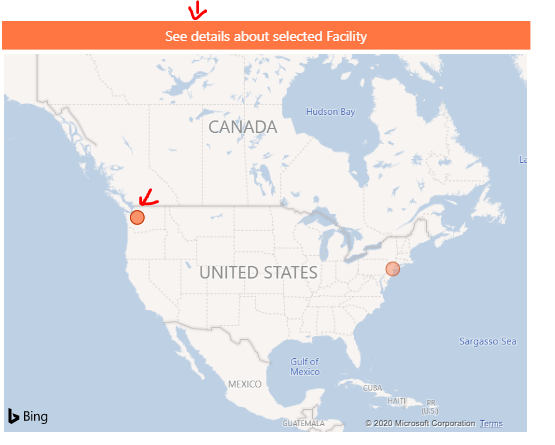
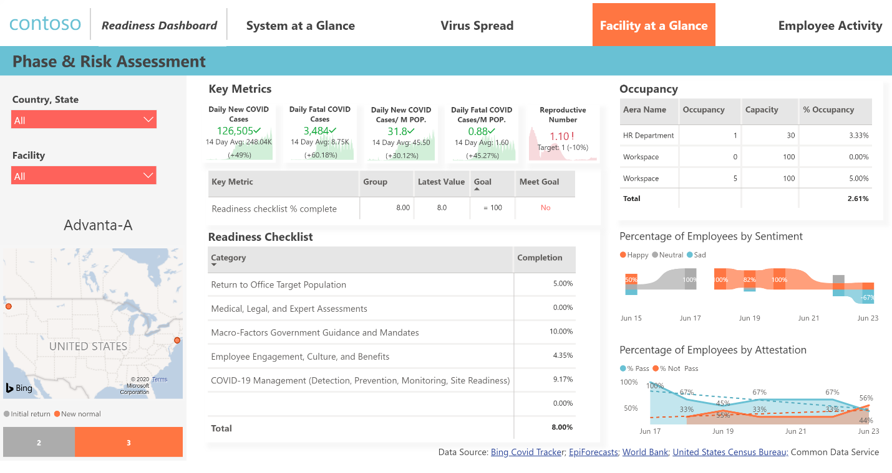
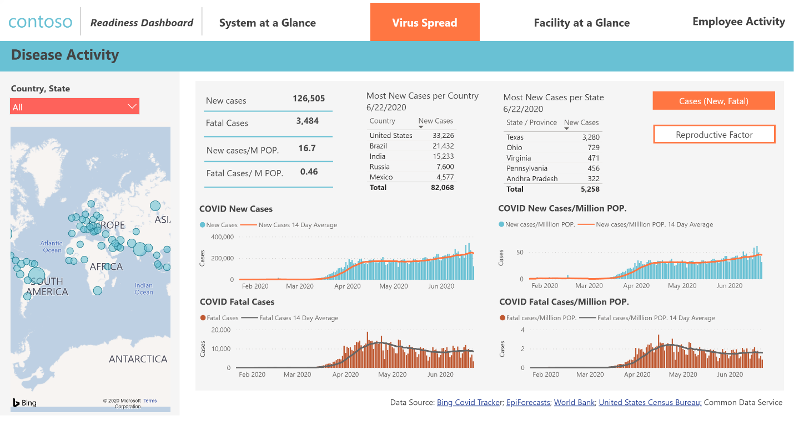
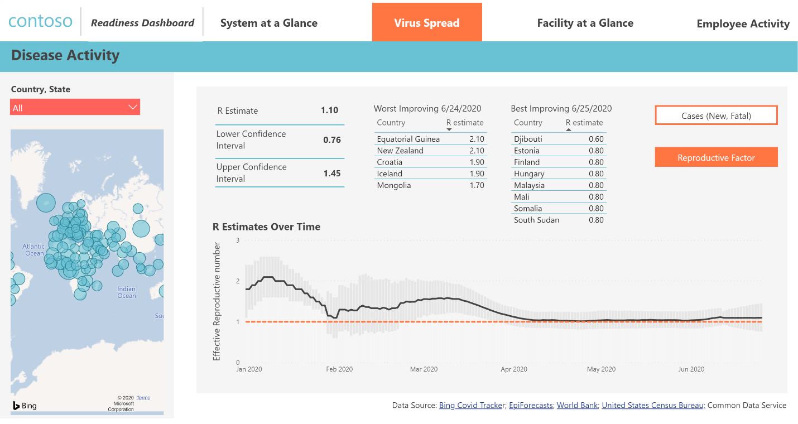
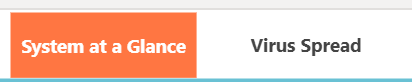
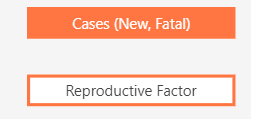
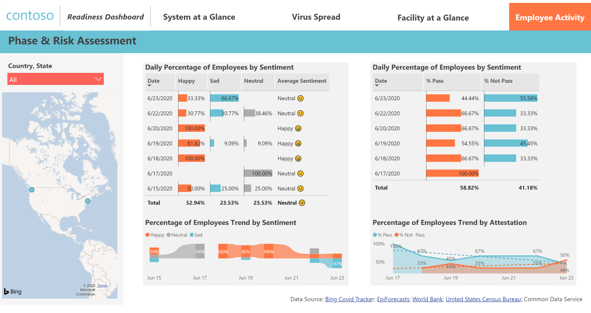
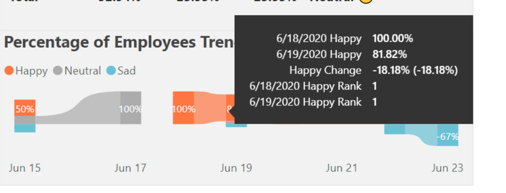

# Overview

This guide is meant for Executive Leaders that will use PBI Dashboard to assist
them with analysis of data to support their roles in their organization within
the processes established to get their employees back to their office locations
using the Return to Workplace solution. The following steps will be covered in
this document:

-   [System at a Glance](#System-at-a-Glance)

-   [Virus Spread](#Virus-Spread)

-   [Facility at a Glance](#Facility-at-a-Glance)

-   [Employee Activity](#Employee-Activity)

## Prerequisites
The following prerequisites apply to this guide:
-   The environment needs to have all the Return to Workplace components in
    place with the Model Driven Apps, Canvas Apps and Power BI Dashboards.
-   For the following steps you need to have the right security roles in place.
-   Contact your IT Administrator if you are unable to access.
-   The sample data is in the package and needs to be installed on the
    environment.

## How to view the Leadership dashboard?
The Leadership dashboard is available on Power BI. To access the dashboard you
follow the following steps:

1.  Open **powerbi.com**

2.  In the top bar search for **Return to Workplace – Leadership** and select if
    from the dropdown.

    

## System at a Glance

System at a Glance section surfaces main key metrics regarding returning to
work, including current value, goal values and if they meet goals or not. These
key metrics are local number of COVID new cases per day, local number of COVID
fatal cases per day, local number of COVID new cases per day/Million POP., local
number of COVID fatal cases per day/Million POP., local Effective reproductive
number, facility Readiness checklist completion percentage.

A Map highlights facilities’ location, along with number of facilities in
certain phase.

Some important statistics are provided at the left side too, which includes
number of facilities, number of facility groups, and number of attestations, and
number of employees for happy, Neutral and Sad sentiments.

**Slicer**

Slicer helps the user to quickly slice and dice data, focusing on only
interested data points. The Country/state slicer will let user select the
country and state they are interested in. This slicer supports functions like
multiple selections, hierarchy category selections, search, and clean
selections.

**Drill-Through Page**

Through System at a Glance tab, we can drill down to related Facility at a
Glance tab. There are two ways getting to Drill-Through Facility at a Glance
page:

1.  Right click and choose drill through

    

2.  Click on data point and then click on button with drill through function.

    

You will see details of interested facility next:

## Virus Spread

Virus Spread section has COVID cases and Reproductive number for country and
state/province level.

**Toggle button**

This type of button helps to navigate to another section or topic quickly.
Highlighted color indicates current section or topic.

Example 1 (on top of each page):

Example 2 (on Virus Spread Page):

## Facility at a Glance

Different from System at a glance’s overall view, Facility at a Glance tab will
let user drill down to each facility, track details of facility open readiness
and employee sentiment and attestation. It will help Executive Leaders monitor
all kinds of key metrics and decide facility’s opening phase.

## Employee Activity 

Employee Activity provides an overall time-series view for employee sentiment
and attestation on daily basis. Executive Leaders can check every day and see
where numbers were raised or lower compared to previous days.

   **Tooltip**

By hovering over the transition part of ribbon chart, users can quickly get an
insight on number changes on tooltip.

