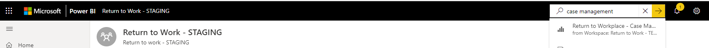
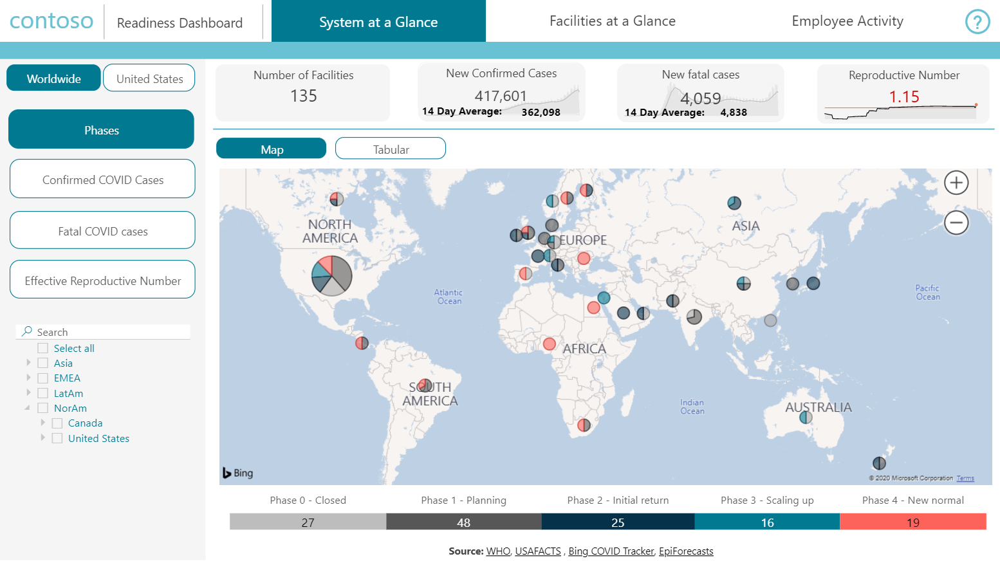
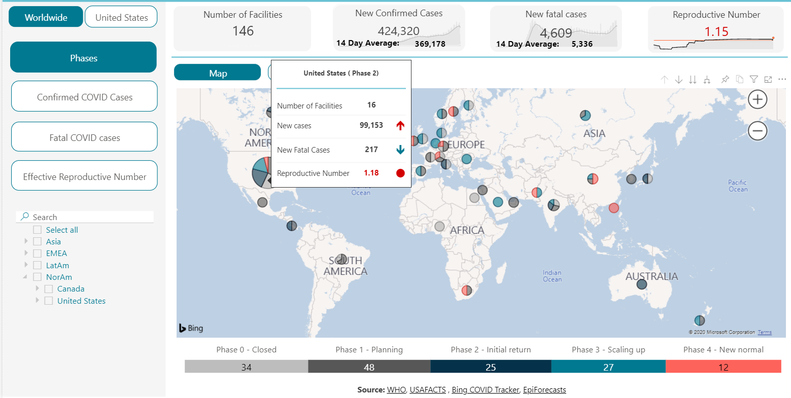
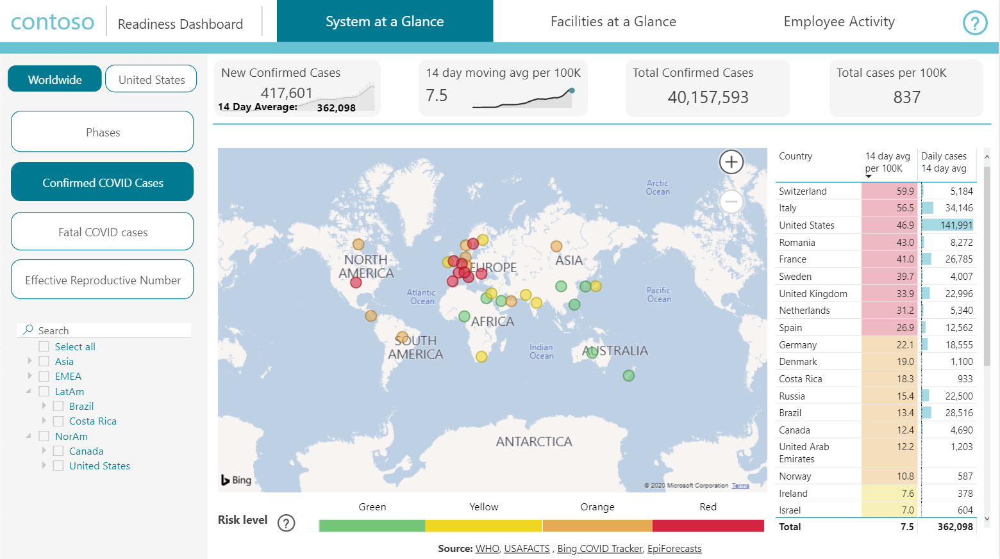
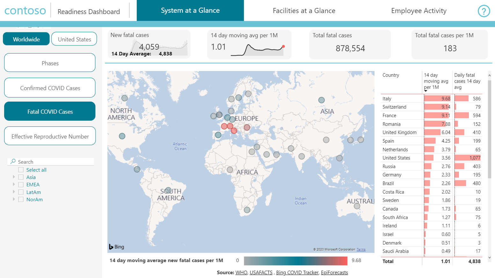
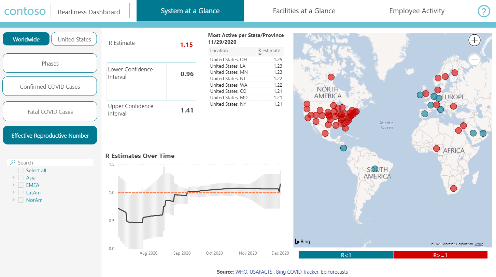
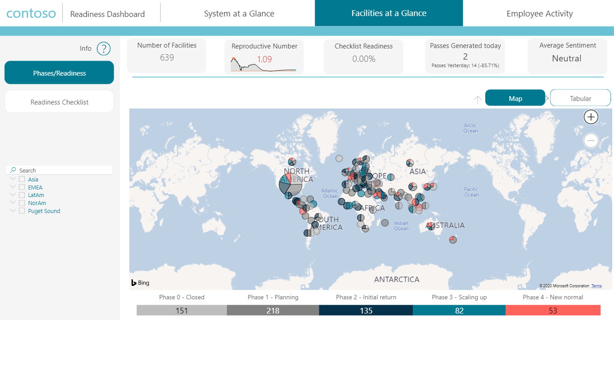
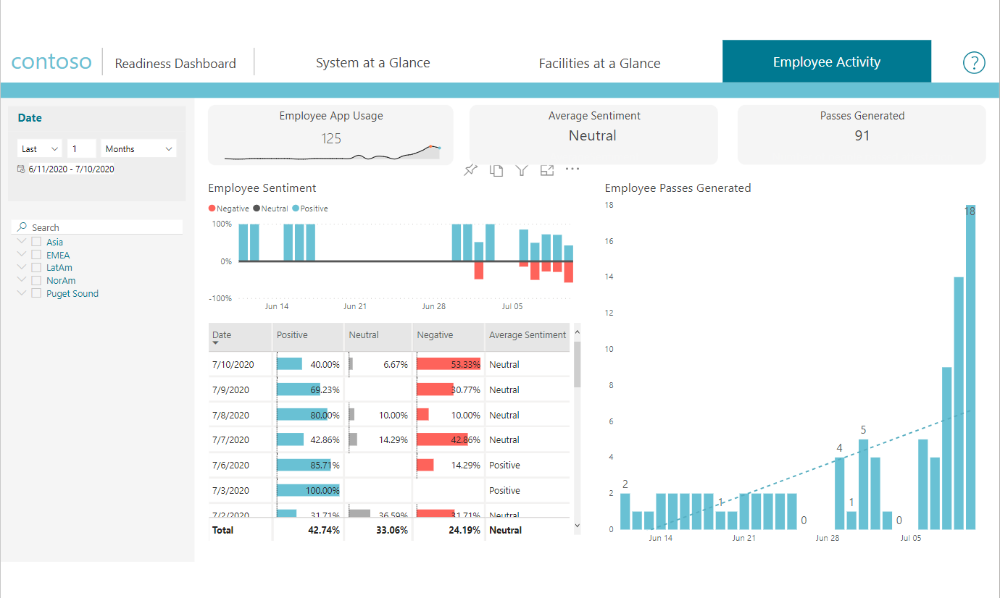
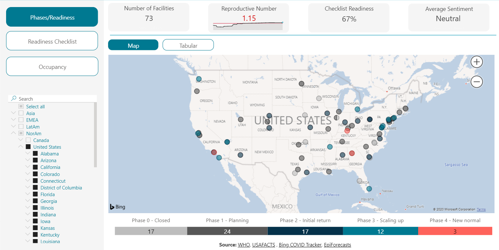
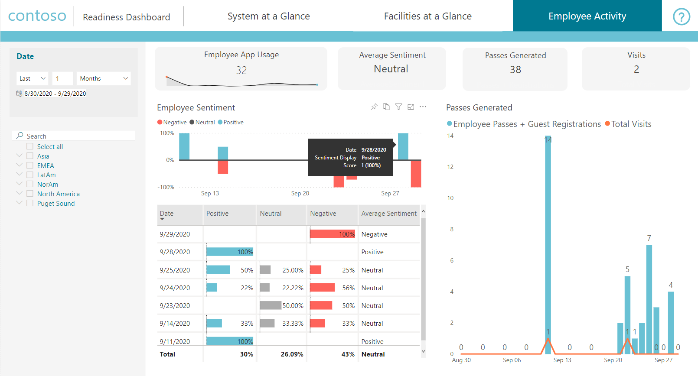

# Use the Location Readiness Dashboard

This article is for executive leaders who use the Power BI dashboard to analyze data to get their employees back to their office locations using the Return to the Workplace solution. 

## How to view the location readiness dashboard?

To access the dashboard:

1. Open the Power BI dashboard.

2. In the search bar, search for **Return to the Workplace – Leadership**.

    > [!div class="mx-imgBorder"]
    > 

## System at a glance

The system at a glance section provides main key metrics regarding returning to work, including current value, goal values, and if they have met the goals or not. These key metrics are the number of COVID-19 new cases per day, fatality cases per day, new cases per day for million population, fatality cases per day for million population, reproductive
number, and facility Readiness checklist completion percentage.

A map highlights facilities location, along with the number of facilities in a certain phase. Hovering over a facilities gives you insights in the virus spread on that location.

Some important statistics are provided at the top, which includes the number of facilities, new COVID cases, new Fatal COVID cases and reproductive numbers.

> [!div class="mx-imgBorder"]
> 

### Key Metrics

In the dashboard we have a number of key metrics on which you can focus in system at a glance.

1. Phases

Review phases in which facilities are, number of facilities, new cases, new fatal cases and reproductive number.

> [!div class="mx-imgBorder"]
> 

2. New COVID cases per day

New confirmed cases and average cases information is available as well for the most active spread states.

> [!div class="mx-imgBorder"]
> 

3. Fatal COVID cases per day

The data on confirmed deaths shown in these visualizations. Have easy access to information on the most active spread by states, new fatal cases and total fatal covid cases.

> [!div class="mx-imgBorder"]
> 

4. Effective reproductive numbers

These are key measure of how fast the virus is growing or decreasing. Showing average number of people who become infected. 

> [!div class="mx-imgBorder"]
> 

### Filter on a region

When you want to drill down in the facilities, you can filter on them based on the country.

> [!div class="mx-imgBorder"]
> 

## Facility at a glance

Different from the system at a glance’s overall view, facility at a glance tab will let users drill down to each facility, track details of facility open readiness, employee sentiment, and attestation. It helps executive leaders to monitor all kinds of key metrics and decide the facility’s opening phase.

> [!div class="mx-imgBorder"]
> 

### Key metrics

1. Phases / Readiness

In this area find employees average sentiment, reproductive numbers, facilities and current phases.

> [!div class="mx-imgBorder"]
> 

2. Readiness checklist

The checklist appears with the needed steps to move through the facilities phases.

> [!div class="mx-imgBorder"]
> 

## Employee activity 

Employee activity provides an overall time-series view for employee sentiment and attestation daily. Executive leaders can check every day and see where numbers were raised or lower compared to previous days.

> [!div class="mx-imgBorder"]
> 

## Tools

Through the report there are numerous tools like sliders, date filters and bookmarks. Some of the visualizations are bar and column charts, cards, gauge charts, maps and more.

### Slicer

Slicer helps the user to quickly slice and dice the data, focusing on only interested data points. The country or state slicer lets the user select the country and state they are interested. This slicer supports functions like multiple selections, hierarchy category selections, search, and clean
selections.

> [!div class="mx-imgBorder"]
> 

### Tooltip

By hovering over the transition part of the ribbon chart, users can quickly get an
insight on number changes on the tooltip.

> [!div class="mx-imgBorder"]
> 

## Data Sources

The dashboard consist of data from the model-driven app and the canvas app, but also consist of external data. The following data sources are used:

1.	WHO (cases/deaths): https://covid19.who.int/  
© World Health Organization 2020, All rights reserved.  
WHO supports open access to the published output of its activities as a fundamental part of its mission and a public benefit to be encouraged wherever possible. Permission from WHO is not required for the use of the WHO coronavirus disease (COVID-19) dashboard material or data available for download. It is important to note that:
•	WHO publications cannot be used to promote or endorse products, services or any specific organization.
•	WHO logo cannot be used without written authorization from WHO.
•	WHO provides no warranty of any kind, either expressed or implied. In no event shall WHO be liable for damages arising from the use of WHO publications.
For further information, please visit WHO Copyright, Licencing and Permissions.

2.	USAFACTS (cases/deaths US only): https://usafacts.org/visualizations/coronavirus-covid-19-spread-map/  

© 2020 USAFacts. All rights reserved.  USAFacts data is available under a Creative Commons license. Learn more at https://usafacts.org/faq/ 

3.	Bing COVID Tracker (cases/deaths for China (mainland), Taiwan, Hong Kong SAR, and Macao SAR: https://github.com/microsoft/Bing-COVID-19-Data

Bing COVID-19 Data.  This data is available strictly for educational and academic purposes, such as medical research, government agencies, and academic institutions, under terms and conditions available at https://github.com/microsoft/Bing-COVID-19-Data/blob/master/LICENSE.txt. Data used or cited in publications should include an attribution to 'Bing COVID-19 Tracker' with a link to www.bing.com/covid.

4.	Reproductive factor estimates: https://epiforecasts.io/covid/posts/global/ 

This dataset is from EpiForecasts and the CMMID Covid working group at https://epiforecasts.io/covid/posts/global/ and is licensed under Creative Commons Attribution CC BY 4.0.  
<!--
## Issues and feedback

- To report an issue with the Return to the Workplace solution, visit <https://aka.ms/rtw-issues>.

- For feedback about the Return to the Workplace solution, visit <https://aka.ms/rtw-feedback>.
-->
