# Deploy the Return to the Workplace solution

This article provides step-by-step instructions to IT administrators for deploying the Return to the Workplace solution.

Estimated time to complete these steps: 60&ndash;90 minutes

## Prerequisites

- You should be a Global administrator or Microsoft Power Platform administrator to perform the installation.

- You must be a Global administrator and must have a Power BI Pro license to configure and publish reports.

- Sign in to Power BI and create a workspace to publish the report. More information: [Create the new workspaces in Power BI](https://docs.microsoft.com/power-bi/collaborate-share/service-create-the-new-workspaces) and [Share the workspace with others](https://docs.microsoft.com/power-bi/collaborate-share/service-create-the-new-workspaces#give-access-to-your-workspace)

## Step 1: Sign up for Power Apps and create an environment

Sign up for [Power Apps](https://docs.microsoft.com/power-platform/admin/signup-for-powerapps-admin) if you don't have it already, and purchase an appropriate license. More information: [Power Apps pricing](https://powerapps.microsoft.com/pricing/)

After you've purchased Power Apps, create an environment with a Common Data Service database.

1. Sign in to the [Power Platform admin center](https://aka.ms/ppac).

2. Create a Common Data Service environment with a database. More information: [Create and manage environments](https://docs.microsoft.com/power-platform/admin/create-environment)

   > [!IMPORTANT]
   > If you select a security group for the database while you're creating it, the apps can be shared only with users who are members of the security group.

3. Create appropriate users, and assign security roles. More information: [Create users and assign security roles](https://docs.microsoft.com/power-platform/admin/create-users-assign-online-security-roles)

After you've created your environment, you can access it by using the following URL: `https://[myenv].crm.dynamics.com`, where [myenv] is the name of your environment. Make a note of this environment URL.

## Step 2: Install the package

You can install the Return to the Workplace solution by from Microsoft AppSource. 

> [!NOTE]
> If you are a US Government customer, you'll have to install using the deployment package available on GitHub. More information: [Appendix: Deploy the app and publish Power BI dashboard (US Government customers only)](#appendix-deploy-the-app-and-publish-power-bi-dashboard-us-government-customers-only).

1. Go to [AppSource](https://aka.ms/rtw-app) to install the **Return to the Workplace solution**.

    > [!div class="mx-imgBorder"]
    > 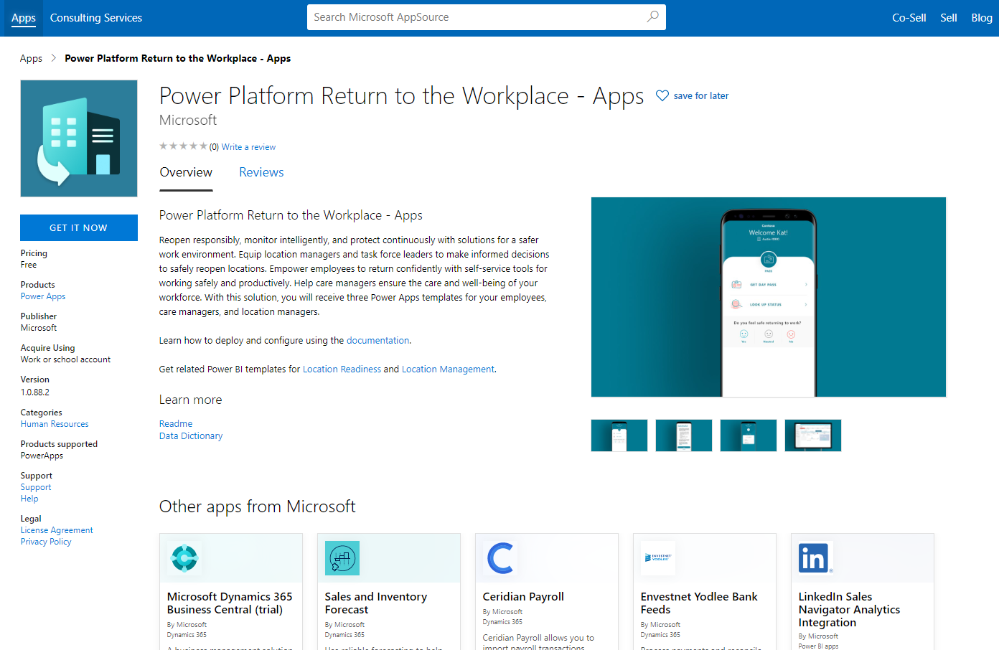

2. Select **GET IT NOW** to install the solution in your environment. You'll be redirected to the actual installation page, where you can select the environment where you want to install it. Installation starts after you select the environment and accept the terms and agreement.

3. After the app is installed, sign in to [Power Apps](https://make.powerapps.com) and select your environment from the upper-right corner. In the left pane, select **Apps** to see the new apps.

    > [!div class="mx-imgBorder"]
    > 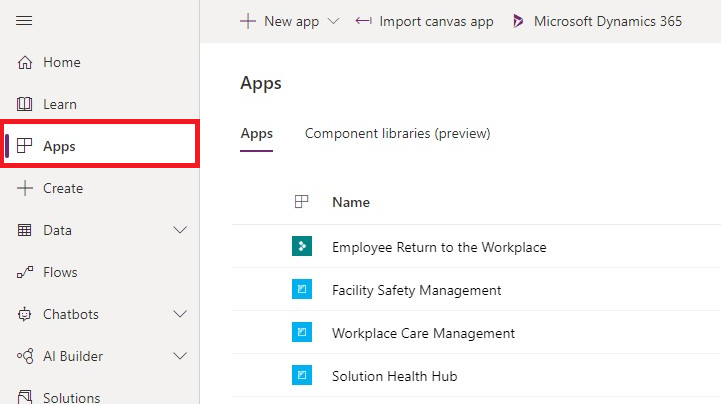

> [!TIP]
> Note the URL of your Common Data Service environment instance. You'll need it to connect the template app to the data.

## Step 3: Configure and publish Power BI dashboards

The Return to the Workplace solution has two Power BI dashboards, one for executive leadership and one for facility managers. You can publish the Power BI dashboards by using the template app from AppSource.

> [!NOTE]
> If you are a US Government customer, you'll have to publish Power BI dashboards using the deployment package available on GitHub. More information: [Appendix: Deploy the app and publish Power BI dashboard (US Government customers only)](#appendix-deploy-the-app-and-publish-power-bi-dashboard-us-government-customers-only).

### Install the template app for dashboards

1. Go to AppSource to install [Return to the Workplace – Location Readiness](https://aka.ms/rtw-leadershippbi) and [Return to the Workplace - Location Management](https://aka.ms/rtw-facilitypbi) dashboards. 

2. Select **GET IT NOW** to install the solution in your environment.
    > [!div class="mx-imgBorder"]
    > 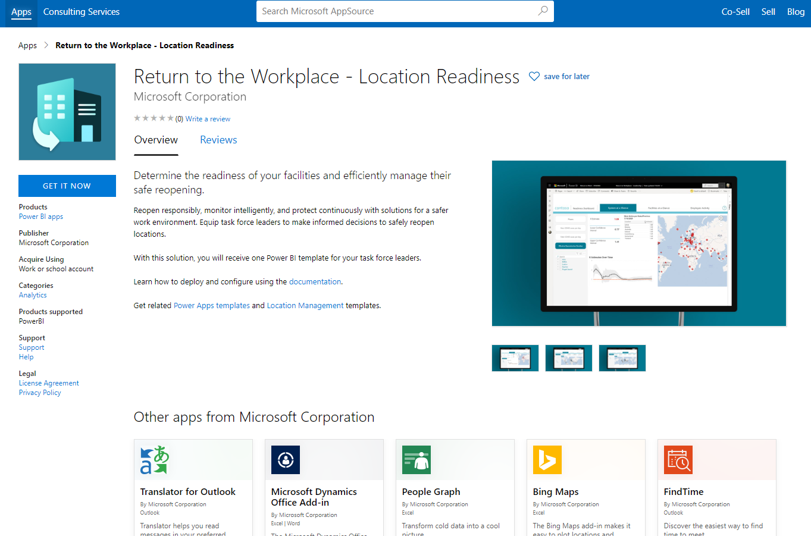

    You're directed to an agreement pop-up window. Select **Continue** if you agree to the terms.

3. Sign in to Power BI, and then select **Install**.  
    > [!div class="mx-imgBorder"]
    > 

4. Enter a name for the workspace, and then select **Continue**.
    > [!div class="mx-imgBorder"]
    > 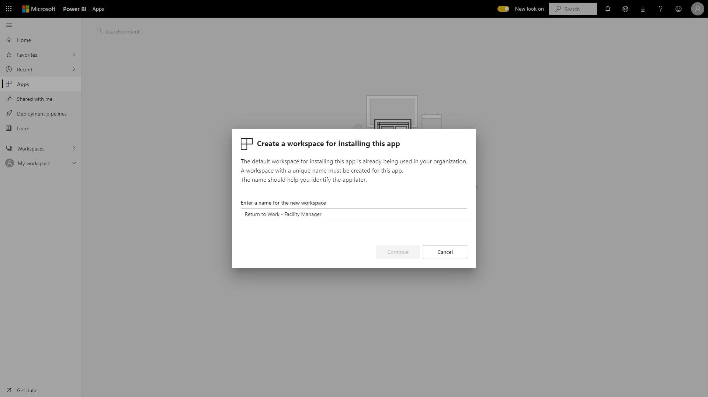

   > [!NOTE]
   > Share the workspace with other users who require access. More information: [Give access to workspace](https://docs.microsoft.com/power-bi/collaborate-share/service-create-the-new-workspaces#give-access-to-your-workspace)

### Connect to data sources

1. Select the icon on your Apps page to open the app.

2. On the splash screen, select **Connect**.
    > [!div class="mx-imgBorder"]
    > 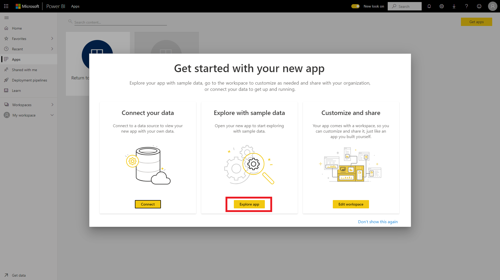

3. Enter the URL of the Common Data Service environment (for example, https://[myenv].crm.dynamics.com), and then select **Next**.
    > [!div class="mx-imgBorder"]
    > 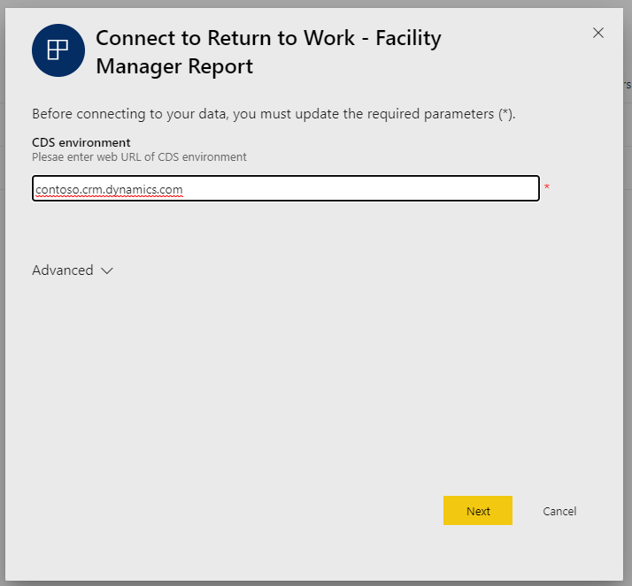

4. Determine where the displayed URL is pointing to in the Common Data Service environment:

    - If it's pointing to Common Data Service, set the **Authentication method** to **OAuth** and set **Privacy level setting for this data source** to **Organizational**. Select **Sign in**.
    - If it's not pointing to Common Data Service, set the **Authentication method** to **Anonymous** and set **Privacy level setting for this data source** to **Public**. Select **Sign in**
    > [!div class="mx-imgBorder"]
    > 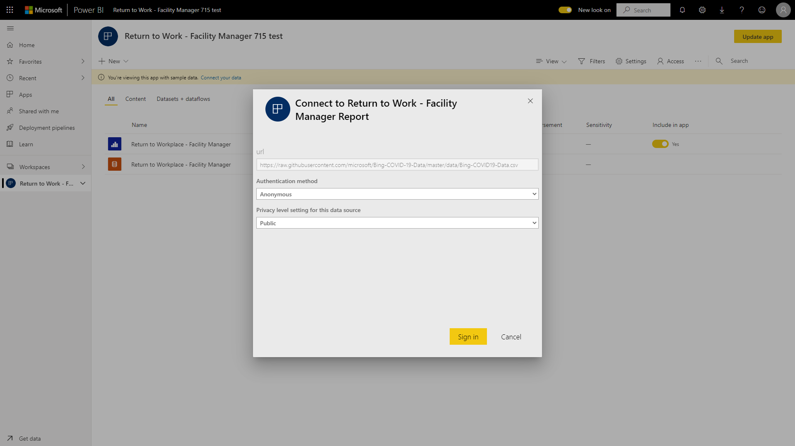

After you've configured your data sources, the report will be populated with your data. Repeat these steps for both dashboards.

Next, we'll configure the data refresh settings for the dataset.

## Step 4: Schedule report refresh

1. On the **Datasets** tab of your workspace, select **Schedule refresh** for the dataset of your report.

      > [!div class="mx-imgBorder"] 
      > 

2. The first time you try to schedule data refresh, the **Settings** page displays a message that your credentials aren't valid. Under **Data source credentials**, select **Edit credentials** to specify your credentials.

      > [!div class="mx-imgBorder"] 
      > 

3. On the next screen for the Common Data Service data source, do the following:

      - For **Authentication method**, select **Microsoft account**.

      - For **Privacy level setting for this data source**, select **Organizational**.

      - Select **Sign in**.

        > [!div class="mx-imgBorder"] 
        > 

      You'll be prompted to specify your credentials and sign in. After you've successfully signed in, you'll return to the **Settings** page.

      For all other data sources, do the following:
      - For **Authentication method**, select **Anonymous**.

      - For **Privacy level setting for this data source**, select **Public**.

      - Select **Sign in**.

          > [!div class="mx-imgBorder"] 
          > 

4. On the **Settings** page, expand **Scheduled refresh**, and then specify the schedule you want for refreshing data. Select **Apply**.

      > [!div class="mx-imgBorder"] 
      > 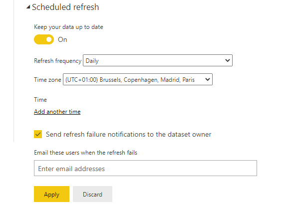

      > [!NOTE]
      > - There are limits to how many times data can be refreshed. Power BI limits datasets on shared capacity to eight daily refreshes. If the dataset resides on a Power BI Premium capacity node, you can schedule up to 48 refreshes per day in the dataset settings. More information: [Refresh data](https://docs.microsoft.com/power-bi/refresh-data#data-refresh)
      >- We recommend scheduling data to be refreshed every 30 minutes.

5. Go back to your workspace, select the **Reports** tab, and then select the report to open it in a browser.

## Step 5: Embed the Power BI report in the model-driven app

The facility manager Power BI dashboard is used in the model-driven app. Because these reports are published in a different location, you need to change the location.

1. Go to the [Power Platform admin center](https://admin.powerplatform.microsoft.com/).

2. Select the correct environment, and then select **Settings**.

3. Select **Product** > **Feature**, turn on the **Power BI visualization embedding** toggle, and then select **Save**.

   > [!div class="mx-imgBorder"]
   > 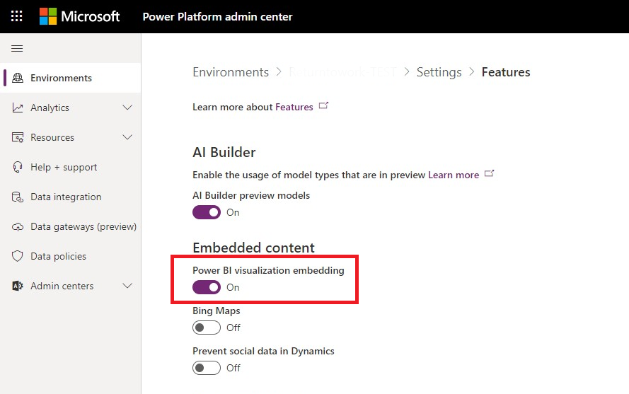

4. Go to [Power Apps](https://make.powerapps.com), select **Solutions** in the left pane, and create a new solution. After opening the solution, select **Add existing**, and then select **Entity**. From the list of entities, select **Facility** > **select components**, under the **Forms** tab, select **Main - Information Form**.

   > [!div class="mx-imgBorder"]
   > 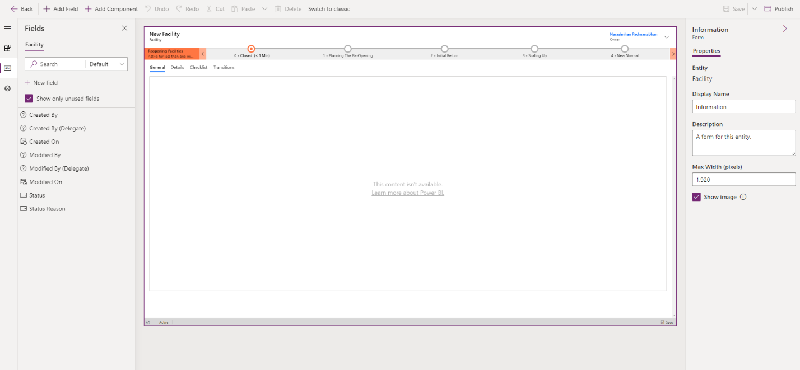

5. Export the solution, unpack the solution, and then apply the changes in the form XML listed in this article: [Embed a Power BI report in a model-driven system form](https://docs.microsoft.com/powerapps/maker/model-driven-apps/embed-powerbi-report-in-system-form). Pack the solution, reimport the solution, and then select **Publish all customizations**.

For ease of implementation, you can also use the [Power BI Embedder](https://www.xrmtoolbox.com/plugins/Fic.XTB.PowerBiEmbedder/) in XRMToolBox.

## Step 6: Publish a theme

You can change the look and feel of the app by applying themes to match your company branding.

1. Go to **Settings** > **Customizations**.

   > [!div class="mx-imgBorder"]
   > 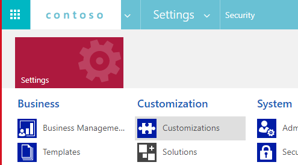

2. Select **Themes**.

   > [!div class="mx-imgBorder"]
   > 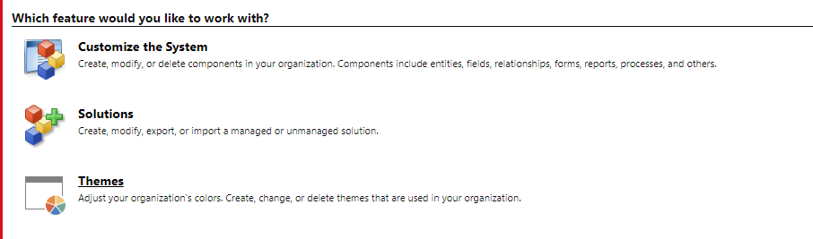

3. Select **New**. Enter the **Name** and determine which colors you want to use. You can also specify the logo, which is used in the site map.

   > [!div class="mx-imgBorder"]
   > 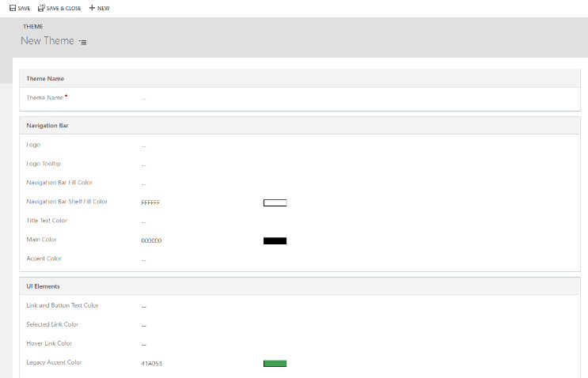

4. Select **Save**, and then **Publish**. 

   > [!div class="mx-imgBorder"]
   > 

## Step 7: Share the canvas app to users

1. Sign in to [Power Apps](https://make.powerapps.com). Select the **Environment** from the upper-right corner.

2. On the left pane, select **Apps**.

3. Select the **Employee Return to the Workplace App**.
 
   > [!div class="mx-imgBorder"]
   > 

4. Select the app, and then select **Share**.

   > [!div class="mx-imgBorder"]
   > 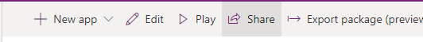

5. Select users from the list of available users with whom you want to share the app.

## Step 8: Set the security roles

In the Return to the Workplace solution, the following security roles are defined:

- Return to the Workplace - Employee, which is used to check in and look at the details of a location.

- Return to the Workplace - Facility Manager, which is used to look at facilities and plan phasing.

- Return to the Workplace - Leadership, which is used to view details over the entire system.

- Return to the Workplace - Health & Safety Leader, which is used to manage employee cases.

**To assign security roles**

1. Go to **Settings** > **Security**.

   > [!div class="mx-imgBorder"]
   > 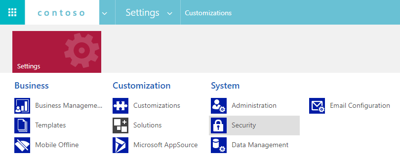

2. Select **Users**, and then select the user to whom you want to give permissions.

   > [!div class="mx-imgBorder"]
   > 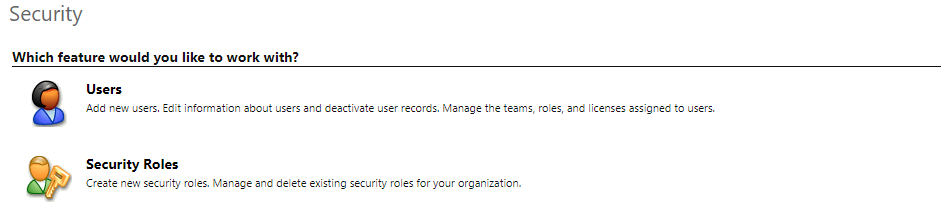

3. Select the user, and then select **Manage Roles**. After assigning the roles, select **OK**.

   > [!div class="mx-imgBorder"]
   > 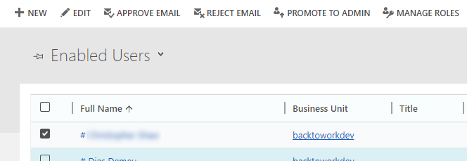
   
## Appendix: Deploy the app and publish Power BI dashboard (US Government customers only)

This section provides information for US Government customers about how to install the app and publish the Power BI dashboard using the deploymemt package.

> - [Step 1: Download the latest deployment package](#step-1-download-the-latest-deployment-package)
> - [Step 2: Install the app by using the deployment package](#step-2-install-the-app-by-using-the-deployment-package)
> - [Step 3: Publish by using the .pbit file in the deployment package](#step-3-publish-by-using-the-pbit-file-in-the-deployment-package)

### Step 1: Download the latest deployment package

Download the latest deployment package (.zip) from <https://aka.ms/rtw-solution>. Before extracting the .zip file, you must unblock it.

**To unblock the .zip file**

1. Right-click the .zip file, and then select **Properties**.

2. In the **Properties** dialog box, select the **Unblock** check box, select **Apply**, and then select **OK**.

    > [!div class="mx-imgBorder"] 
    > 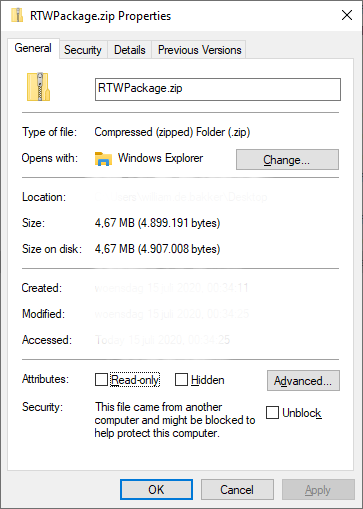

After extracting the .zip file, you'll see the following in the extracted folder.

|Folder  |Description |
|---------|---------|
|Package | Contains the Package Deployer tool and the package that you'll import later to set up the solution in your environment.       |
|Power BI | Contains the Power BI Reports that will be used to configure reporting. More information: [Step 3: Configure and publish Power BI dashboards](#step-3-configure-and-publish-power-bi-dashboards)| 

### Step 2: Install the app by using the deployment package

1. Go to the location where you extracted the deployment package (.zip file). Open the **Package** folder, and then run **PackageDeployer.exe**.

2. On the next screen, select **Continue**.

3. You'll be prompted to connect to your environment. Select **Office 365** as the **Deployment Type**, select **Show Advanced**, and then type your credentials to connect to your environment.

    > [!div class="mx-imgBorder"] 
    > 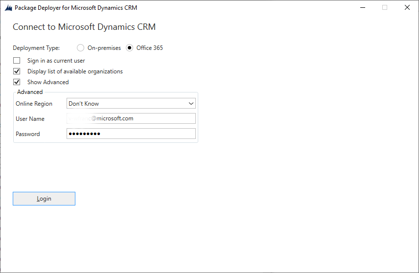

4. Select **Login** to continue.

5. If you have access to more than one Common Data Service environment, the next screen will prompt you to select the environment where you want to install the package. Select an environment, and then select **Login**.

    > [!div class="mx-imgBorder"] 
    > 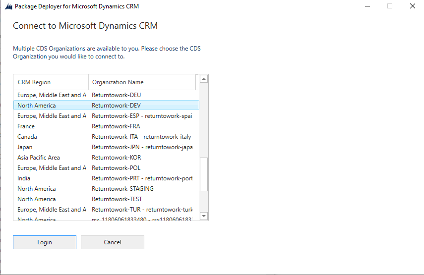

6. On the next screen, select **Next.**

7. The next screen displays the environment name where the package will be installed. Review the information, and then select **Next**.

8. The next screen validates whether all dependencies are available in your environment. Select **Next**.

9. The next screen displays the installation status of the package. Note that it might take a while for the package installation to be completed.

10. After the installation is complete, select **Next**.

11. On the next screen, select **Finish** to complete and close the setup.

12. After the app is installed, sign in to [Power Apps](https://make.powerapps.com) and select your environment from the upper-right corner. In the left pane, select **Apps** to see the new apps.

    > [!div class="mx-imgBorder"]
    > 

> [!TIP]
> After installing the Return to Workplace solution, note the URL of your Common Data Service environment instance. You'll need it to connect the template app to the data.

### Step 3: Publish by using the .pbit file in the deployment package

This section provides information about how GCC customers can use the **Return to the Workplace - Location Readiness** and **Return to the Workplace - Facility Manager** dashboard .pbit files available in the deployment package to publish the dashboards.

#### Prerequisites

Install Power BI Desktop from Microsoft Store: [Power BI Desktop](https://aka.ms/pbidesktop)

> [!NOTE]
> If you installed Power BI Desktop by downloading it directly from the Download Center page in the past, remove it and then download it from Microsoft Store. The Microsoft Store version will be updated automatically as new releases become available. If you can't install from Microsoft Store, install the latest non&ndash;Microsoft Store version from the [Download Center page](https://www.microsoft.com/download/details.aspx?id=58494).

#### The process
Follow the steps below for each .pbit file.

1. Run Power BI Desktop, and sign in using your account.

2. Go to the location where you extracted the deployment package (.zip file). In the **Power BI Template** folder, you'll find the appropriate .pbit file.

3. Open the .pbit file in Power BI Desktop. You'll be prompted to enter the following value: **Common Data Service Environment**. Enter the URL of the Common Data Service environment (for example, https://*[myenv]*.crm.dynamics.com, where [myenv] is the name of your environment). Select **Load**.

    > [!div class="mx-imgBorder"] 
    > 

4. You'll be prompted to enter the credentials to connect to your Common Data Service environment. Select **Organizational account** > **Sign in** to specify your Common Data Service credentials.

    > [!div class="mx-imgBorder"] 
    > 

5. After signing in, select **Connect** to connect to your data in Common Data Service.

6. After connecting to your Common Data Service environment, you'll see a series of pop-up windows to configure access to data sources. These access-level and privacy-level settings need to be configured to connect to the public data sources for the COVID-19 report data. Complete access level and privacy selections as shown in the following screenshots.
     
    > [!div class="mx-imgBorder"] 
    > 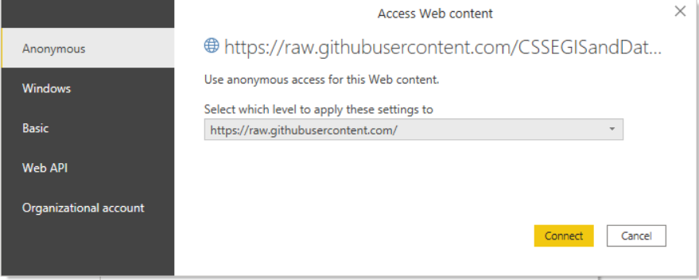

    > [!div class="mx-imgBorder"] 
    > 

    > [!div class="mx-imgBorder"] 
    > 

    > [!div class="mx-imgBorder"] 
    > 

    > [!div class="mx-imgBorder"] 
    > 
    
    > [!div class="mx-imgBorder"] 
    > 

    After you've configured the access and privacy levels for COVID-19 public data, you must set the privacy level for Common Data Service data to **Organizational**. 

    > [!div class="mx-imgBorder"] 
    > 

7. After a connection is successfully made, the Power BI report will be displayed. You'll be prompted to apply pending changes to your query. Select **Apply changes**.

    > [!NOTE]
    > The report is blank because you haven't yet added data in the system.

8. Select **Publish**. When prompted to save your changes, select **Save**.

     > [!div class="mx-imgBorder"] 
     > 

9. You'll be prompted to save the file as a .pbix file along with your Common Data Service environment information. Enter a name, and save it on your computer. The file name you enter is displayed in your Power BI website.

10. After saving the .pbix file, you'll be prompted to publish the report. In the **Publish to Power BI** page, select the workspace where you want to publish, and then select **Select**.

    > [!div class="mx-imgBorder"] 
    > 

    The report becomes available in your workspace.

11. For the facility manager dashboard, the URL will be in the following format:
    https://app.powerbi.com/groups/3d6db5d0-22c7-4674-b957-0605c021511d/reports/bf9cd5a1-c176-4786-9c4e-684a79678575/ReportSection?redirectedFromSignup=1 
    Copy the Power BI report URL to a text file, because you'll need to embed it in the model-driven app.

12. Follow steps 1 through 11 for each dashboard.

Next, you must configure the data refresh settings for the dataset. More information: [Step 4: Schedule report refresh](#step-4-schedule-report-refresh)

### Service URLs for US Government customers

There is a different set of URLs to access Power Apps US Government environments and Power BI US Government tenants. The commercial version of the service URLs is used throughout the article. If you have a US Government organization, use the respective US Government URL for your deployment:

| **Commercial version URL**| **US Government version URL**  |
|-------------------|--------------------------------|
| [https://make.powerapps.com](https://make.powerapps.com)  | [https://make.gov.powerapps.us](https://make.gov.powerapps.us) (GCC)  [https://make.high.powerapps.us](https://make.high.powerapps.us) (GCC High)                |
| [https://admin.powerplatform.microsoft.com](https://admin.powerplatform.microsoft.com) | [https://gcc.admin.powerplatform.microsoft.us](https://gcc.admin.powerplatform.microsoft.us) (GCC)  [https://high.admin.powerplatform.microsoft.us](https://high.admin.powerplatform.microsoft.us) (GCC High) |
| [https://app.powerbi.com/](https://app.powerbi.com/)                  | [https://app.powerbigov.us](https://app.powerbigov.us) (GCC)  [https://app.high.powerbigov.us](https://app.high.powerbigov.us) (GCC High)                 |

For detailed information about the US Government plans for Power Apps and Power BI, see:

- [Power Apps for US Government](https://docs.microsoft.com/power-platform/admin/powerapps-us-government)
- [Power BI for US Government](https://docs.microsoft.com/power-bi/service-govus-overview)

## Feedback about the solution

To provide feedback about the Return to the Workplace solution, visit <https://aka.ms/rtw-community>.

## Next step

[Configure the Return to the Workplace solution](configure.md)
