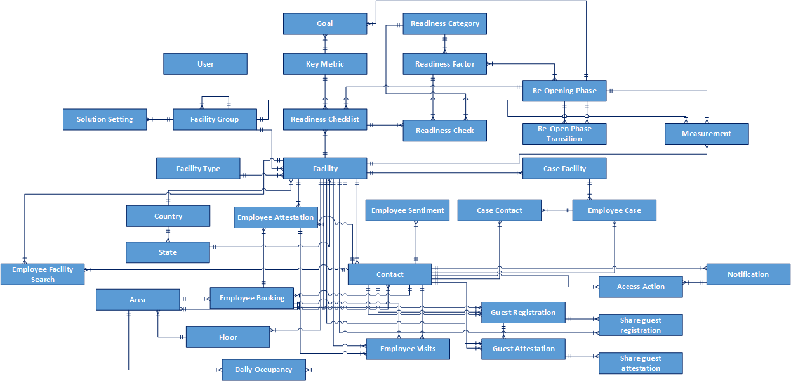

# Overview

This article provides a detailed description of the data model, workflows, and Power Automate flows used by the Return to the Workplace solution. The solution extends the Common Data Model and utilizes several components of the Common Data Model. Administrators, developers, and end users should be mindful of the solution and possible implications of
other solutions that coexist in the same environment. 

The definitions provided in this article indicate the intended purpose of the entities, relationships, attributes, flows, and workflows contained in the Return to the Workplace solution. These definitions can be fully or partially adopted depending on your business requirements.

## Integration and extension

Return to the Workplace solution is built on Microsoft Power Platform. To learn more about working with model-driven apps and Common Data Service, see:

- [Model-driven apps guide](https://docs.microsoft.com/powerapps/maker/model-driven-apps/model-driven-app-overview)
- [Common Data Service developer guide](https://docs.microsoft.com/powerapps/developer/common-data-service/overview)
- [Common Data Service entities](https://docs.microsoft.com/powerapps/developer/common-data-service/entities)
- [Work with data using code in Common Data Service](https://docs.microsoft.com/powerapps/developer/common-data-service/work-with-data-cds)
- [Best practices and guidance for Common Data Service](https://docs.microsoft.com/powerapps/developer/common-data-service/best-practices/)
- [Business process flows](https://docs.microsoft.com/power-automate/business-process-flows-overview)

To learn more about solutions and application lifecycle management guidance to maintain the solution integrity, see:

- [Introduction to solutions](https://docs.microsoft.com/powerapps/developer/common-data-service/introduction-solutions)
- [Application lifecycle management (ALM) with Microsoft Power Platform](https://docs.microsoft.com/power-platform/alm/)

To learn more about supported extension methods, see:

- [Get started with model-driven apps customizations using code](https://docs.microsoft.com/powerapps/developer/model-driven-apps/supported-customizations)

## Entity relationship diagram

The entity relationship diagram illustrates the entities and their relationships that are present in the Common Data Service environment. System-generated entities and relationships such as **Created By** and **Modified By** attributes are not displayed in the diagram.

> [!div class="mx-imgBorder"]
> 

## Entities

The entities listed below are grouped by the application in the Return to the Workplace solution.

## Core entities

These entities are used across multiple applications and are considered core to the platform.

| **Entity name** | **Information in the entity** |
|-----------------|------------------------------|
| Country   | Contains standard country names.  |
| Employee   | Contains contact information.  |
| Facility  | Contains demographic information of a physical place and reopen phase planning progress.  |
| Facility Group | Contains logic grouping metadata used to create a hierarchical relationship of facilities.  |
| Facility Type   | Contains metadata used to segment facilities.  |
| Solution Setting | Contains metadata used to drive platform behavior for specific facility groups. |
| State  | Contains standard state names. |
|||

## Employee Return to the Workplace

These entities are primarily used by the Employee Return to the Workplace canvas app.

| **Entity name**          | **Information in the entity**                                                                                  |
|--------------------------|---------------------------------------------------------------------------------------------------------------|
| Area                     | Contains a list of physically or logically segmented spaces.                                                  |
| Floor                    | Contains a list of physically segmented spaces associated to a single facility and multiple areas.            |
| Daily Occupancy          | Contains the capacity and occupancy for an area on a certain day.                            |
| Employee Attestation     | Contains associations of employee to their attestations.                                                        |
| Employee Booking         | Contains associations of employee and specific areas, floors, and facilities for a given time.           |
| Employee Facility Search | Contains a list of most recently used employee app facility results associated with system users.             |
| Employee Sentiment       | Contains associations of employee and information relevant to their recorded sentiment.                         |
| Employee Visit           | Contains associations of employee and facilities for a given time representing a physical entry and exit.|
| Guest Registration           | Contains associations of employees (hosts) and guests which are associated with an Employee Booking.|
|||

## Workplace Care Management

These entities are primarily used by the Workplace Care Management model-driven app.

| **Entity name**          | **Information in the entity**                   |
|--------------------------|-------------------------------------------------------|
| Case Contact             | Contains individuals associated with an employee case. |
| Case Facility            | Contains facilities associated with employee cases. |
| Employee Case            | Contains associations of employee and information relevant to their case.  |

## Facility Safety Management

These entities are primarily used by the Facility Safety Management model-driven app.

| **Entity name**          | **Information in the entity**                                                                                  |
|--------------------------|---------------------------------------------------------------------------------------------------------------|
| Goal                     | Contains associations of reopen phases and key metrics with target values.                                    |
| Key Metric               | Contains a list of measurable indications to evaluate progress.                                               |
| Measurement              | Contains a list of key metric values measured at a point in time with relation to a facility.                 |
| Readiness Category       | Contains metadata used to group readiness factors.                                                            |
| Readiness Check          | Contains a list of activities and their status associated with a checklist for a given facility.               |
| Readiness Checklist      | Contains a group of activities associated with a facility and a reopening phase.                              |
| Readiness Factor         | Contains a list of items that are evaluated through the reopening process.                                    |
| Reopen Phase             | Contains a list of associated readiness factors and metrics to be tracked and evaluated at the current stage. |
| Reopen Phase Transition  | Contains a list of requests to move from one phase to another with relevant process information.              |
|||

## Data definitions

The data definitions section provides information on list of entities, data attributes, and the areas of the solution where they are used. System-generated attributes
such as **Created On**, **Modified On** are not displayed.

### Area

| Display name  | Data type     | Description     | Platform use    |
|---------------|---------------|-----------------|------------------|
| Area  | Text | Primary identifier of the record. | Model-driven app and canvas app |
| Capacity | Whole Number| Used to capture total allowable occupancy for the area. | Model-driven app and canvas app |
| Capacity of Current Phase | Whole Number    | Used to capture allowable occupancy for the area in the current phase.| Model-driven app and canvas app|
| Description   | Text  | Used to capture additional details to describe the area.| Model-driven app and canvas app |
| Facility | Lookup | Used to associate the parent facility. |Model-driven app and canvas app |
| Floor | Lookup | Used to associate the parent floor. | Model-driven app and canvas app |
|||||

### Case Contact

| Display name | Data type | Description   | Platform use|
|-----------|---------------|----------------|------------------|
| Name | Text  | Primary identifier of the record. | Model-driven app |
| Do you feel safe returning to work? | Option Set | Used to capture the employee feeling to return to work. | Canvas app   |
| Employee | Lookup  | Used to capture the employee record.  | Canvas app       |
| Sentiment Date | Date and Time | Used to capture the time when the sentiment is collected. | Canvas app   |
|||||

### Case Facility

| Display name  | Data type | Description | Platform use    |
|---------------|-----------|-------------|------------------|
| Name          | Text      | Primary identifier of the record. | Model-driven app |
| Employee Case | Lookup    | Used to associate the employee case with the case facility. | Model-driven app |
| Facility      | Lookup    | Used to associate the facility with the case facility.      | Model-driven app |
|||||

### Country

| Display name   | Data type | Description    | Platform use    |
|----------------|-----------|------------------------------------|------------------|
| Name           | Text      | User-friendly name of the country. | Model-driven app |
| ISO Short Code | Text      | ISO identifier of the country.     | Model-driven app |
|||||

### Daily Occupancy

| Display name     | Data type    | Description   | Platform use                |
|------------------|--------------|------------------|------------------------------|
| Area ID          | Lookup       | Used to associate an area to the daily occupancy. | Model-driven app and canvas app |
| Facility ID      | Lookup       | Used to associate a facility to the daily occupancy.| Model-driven app and canvas app |
| Capacity         | Whole Number | Total capacity for that area.| Model-driven app and canvas app |
| Occupancy        | Whole Number | Occupied spaces for an area. | Model-driven app and canvas app |
| Date             | Date         | The date for which the occupancy and capacity are tracked. | Model-driven app and canvas app |
|||||

### Employee (Contact)

| Display name     | Data type | Description   | Platform use|
|------------------|-----------|------------|----------------|
| Default Facility | Lookup    | Used to associate a facility to the employee. | Model-driven app and canvas app |
| User ID          | Text      | Used to provide a unique identifier specific to the organization for the employee. | Model-driven app |
|||||

### Employee Attestation

| Display name     | Data type     | Description  | Platform use |
|------------------|---------------|-------------------------------------------|------------------------------|
| Attestation Date | Date and Time | Used to capture the date and time the attestation was recorded.     | Model-driven app             |
| Attested         | Option Set    | Used to capture if the employee has attested or not                 | Model-driven app and canvas app |
| Employee         | Lookup        | Used to denote the employee completing the attestation.             | Model-driven app             |
| Facility         | Lookup        | Used to associate the facility for which the employee is attesting. | Model-driven app and canvas app |
| Name             | Text          | Used to create a name for the employee attestation record.  | Model-driven app             |
|||||

### Employee Booking

| Display name     | Data type     | Description   | Platform use|
|------------------|---------------|---------------|------------------|
| Area | Lookup | Used to associate the location booked. | Model-driven app and canvas app|
| End Arrival Time | Date and Time    | Used to capture the ending point in time for the booking. | Model-driven app; Canvas app |
| Start Arrival Time  | Date and Time | Used to capture the beginning point in time for the booking. | Model-driven app and canvas app|
| Booking Date     | Date          | Used to determine the date of the booking.| Model-driven app and canvas app |
| Employee         | Lookup        | Used to associate the employee creating the booking. | Model-driven app and canvas app|
| Name             | Text          | Primary identifier of the record. | Model-driven app |
|||||

### Employee Case

| Display name                    | Data type     | Description                                                                                      | Platform use                |
|---------------------------------|---------------|--------------------------------------------------------------------------------------------------|------------------------------|
| Case Number                     | Text          | Unique identifier for the employee case.                                                         | Model-driven app             |
| Facility Access Available       | Option Set    | Used to denote whether the employee can get a pass for a facility.                               | Model-driven app and canvas app |
| Facility Access Available Date  | Date and Time | Used to specify when the employee will be able to get a pass for a facility.                     | Model-driven app             |
| Facility Access Unavailable Note| Text          | Used to give the employee a note on why they are blocked from booking a pass.                    | Model-driven app             |
| Employee                        | Lookup        | Used to associate the employee to the employee case.                                             | Model-driven app             |
| Employee Contacted              | Option Set    | Used to denote whether the employee was contacted.                                               | Model-driven app             |
| Employee Instructions Provided  | Option Set    | Used to denote whether the employee was provided instructions.                                   | Model-driven app             |
| Public Health Official Notified | Option Set    | Used to denote whether the appropriate public health officials have been notified if applicable. | Model-driven app             |
| Risk Assessment                 | Option Set    | Used to denote the current risk of the employee case.                                            | Model-driven app             |
| Screened                        | Option Set    | Used to denote whether the screening process has occurred.                                       | Model-driven app             |
| First Time Employee Contacted   | Date and Time | Marked by a workflow and used to in the Power BI dashboards to track performance.                | Model-driven app             |
| First Time to Investigation     | Date and Time | Marked by a workflow and used to in the Power BI dashboards to track performance.                | Model-driven app             |
| Process Stage                   | Text          | Indicated the actual process stage the BPF is in.                                                | Model-driven app             |
|||||

### Employee Facility Search

| Display name | Data type | Description                                         | Platform use                |
|--------------|-----------|-----------------------------------------------------|------------------------------|
| Employee     | Lookup    | Used to capture the employee conducting the search. | Model-driven app and canvas app |
| Facility     | Lookup    | Used to capture the facility searched.              | Model-driven app and canvas app |
|||||

### Employee Sentiment

| Display name                       | Data type     | Description                                                      | Platform use                |
|------------------------------------|---------------|------------------------------------------------------------------|------------------------------|
| Employee                           | Lookup        | Used to capture the employee completing the sentiment.           | Model-driven app and canvas app |
| Name                               | Text          | Used to provide a name for the employee sentiment record.        | Model-driven app             |
| Do you feel safe returning to work | Option Set    | Used to capture a response to the question: Sad, Neutral, Happy. | Model-driven app and canvas app |
| Sentiment Date                     | Date and Time | Used to capture the date and time the sentiment was recorded.    | Model-driven app             |
|||||

### Employee Visit

| Display name     | Data type     | Description  | Platform use  |
|------------------|---------------|--------------|----------------|
| Employee Attestation | Lookup | Used to associate an attestation.     | Model-driven app             |
| Employee Booking     | Lookup | Used to associate a booking.     | Model-driven app             |
| Employee              | Lookup        | Used to associate the employee creating the visit. | Model-driven app |
| End Time              | Date and Time | Used to denote the end of the visit.     | Model-driven app             |
| Facility              | Lookup          | Used to denote the facility visited.         | Model-driven app             |
| Name                  | Text | Primary identifier of the record.     | Model-driven app             |
| Start Time            | Date and Time | Used to denote the beginning of the visit.     | Model-driven app             |
|||||

### Facility 

| Display name           | Data type | Description                                                 | Platform use    |
|------------------------|-----------|-------------------------------------------------------------|------------------|
| Address Street 1       | Text      | Used to provide address information for the facility.       | Model-driven app |
| Address Street 2       | Text      | Used to provide address information for the facility.       | Model-driven app |
| Address City           | Text      | Used to provide address information for the facility.       | Model-driven app |
| Address Country        | Lookup    | Used to associate the standardized state to the facility.   | Model-driven app |
| Address Latitude       | Text      | Used to provide address information for the facility.       | Model-driven app |
| Address Longitude      | Text      | Used to provide address information for the facility.       | Model-driven app |
| Address Postal Code    | Text      | Used to provide address information for the facility.       | Model-driven app |
| Address State/Province | Lookup    | Used to associate the standardized state to the facility.   | Model-driven app |
| Description            | Text      | Used to provide address information for the facility.       | Model-driven app |
| Group                  | Lookup    | Used to associate the group this facility belongs to.       | Model-driven app |
| Number                 | Text      | Used to provide a recognizable identifier for the facility. | Model-driven app |
| Type                   | Lookup    | Denotes the facility type.                                  | Model-driven app |
| Name                   | Text      | Used to provide a recognizable name for the facility.       | Model-driven app |
| Reopen Phase           | Lookup    | Used to associate the current reopen phase.                 | Model-driven app |
|||||

### Facility Group

| Display name          | Data type | Description                                                  | Platform use    |
|-----------------------|-----------|--------------------------------------------------------------|------------------|
| Description           | Text      | Used to provide additional details about the facility group. | Model-driven app |
| Name                  | Text      | Used to provide a name for the facility group.               | Model-driven app |
| Parent Facility Group | Lookup    | Used to group facilities in a hierarchical manner.           | Model-driven app |
|||||

### Facility Type

| Display name | Data type | Description                                                 | Platform use    |
|--------------|-----------|-------------------------------------------------------------|------------------|
| Description  | Text      | Used to provide additional details about the facility type. | Model-driven app |
| Type         | Text      | Used to provide a name for the facility type.               | Model-driven app |
|||||

### Floor

| Display name                        | Data type     | Description                                                    | Platform use    |
|-------------------------------------|---------------|----------------------------------------------------------------|------------------|
| Description | Text    | Used to capture additional details to describe the floor.                     | Model-driven app and canvas app       |
| Facility                      | Lookup | Used to associate the parent facility. |Model-driven app and canvas app     |
| Floor                                | Text          | Primary identifier of the record.                              | Model-driven app and canvas app |
| Floor Index                    | Whole Number  | Used to create a structured order of floors within a facility. | Model-driven app and canvas app       |
||||

### Goal

| Display name | Data type  | Description                                                                                              | Platform use    |
|--------------|------------|----------------------------------------------------------------------------------------------------------|------------------|
| Key Metric   | Lookup     | Used to associate the appropriate key metric.                                                            | Model-driven app |
| Name         | Text       | Used to provide a name for the goal.                                                                     | Model-driven app |
| Reopen Phase | Lookup     | Used to associate the appropriate reopen phase.                                                          | Model-driven app |
| Target Type  | Option Set | Used to designate if the target value should be higher or lower than the value provided by target value. | Model-driven app |
| Target Value | Decimal    | The value used to evaluate success.                                                                      | Model-driven app |
|||||

### Guest Registration

| Display name | Data type  | Description                                                                                              | Platform use    |
|--------------|------------|----------------------------------------------------------------------------------------------------------|------------------|
| Employee Booking   | Lookup     | Used to associate the appropriate employee booking tied to the guest registration.  | Model-driven app |
| Guest   | Lookup     | Used to associate the non-employee to the registration.                   | Model-driven app |
| Host   | Lookup     | Used to associate the employee making the registration.                   | Model-driven app |
| Name   | Text     | Used to provide a name for the guest registration record.                   | Model-driven app |
| Registration Date   | Date     | Used to denote the date of registration.                   | Model-driven app |

### Key Metric

| Display name | Data type | Description                                | Platform use    |
|--------------|-----------|--------------------------------------------|------------------|
| Name         | Text      | Used to provide a name for the key metric. | Model-driven app |
|||||

### Measurement

| Display name     | Data type     | Description                                                                       | Platform use    |
|------------------|---------------|-----------------------------------------------------------------------------------|------------------|
| Facility Group   | Lookup        | Used to associate the appropriate facility group.                                 | Model-driven app |
| Facility         | Lookup        | Used to associate the appropriate facility.                                       | Model-driven app |
| Key Metric       | Lookup        | Used to associate the appropriate key metric.                                     | Model-driven app |
| Measurement Date | Date and Time | Denotes the date and time a measurement was taken displayed in user local format. | Model-driven app |
| Name             | Text          | Used to provide a name for the measurement.                                       | Model-driven app |
| Value            | Decimal       | Used to capture the value of the measurement.                                     | Model-driven app |
|||||

### Readiness Category

| Display name | Data type | Description                                     | Platform use    |
|--------------|-----------|-------------------------------------------------|------------------|
| Category     | Text      | Used to provide a name for the category record. | Model-driven app |
|||||

### Readiness Check

| Display name        | Data type   | Description                                                                  | Platform use                |
|---------------------|-------------|------------------------------------------------------------------------------|------------------------------|
| Comment             | Text        | Used to capture additional notes about the readiness check.                  | Model-driven app and canvas app |
| Factor              | Lookup      | Denotes the factor being checked.                                            | Model-driven app and canvas app |
| Check Completed     | Two Options | Denotes completion of the readiness check.                                   | Model-driven app and canvas app |
| Name                | Text        | Denotes the readiness check name.                                            | Model-driven app and canvas app |
| Readiness Checklist | Lookup      | Used to associate the readiness check to the applicable readiness checklist. | Model-driven app and canvas app |
|||||

### Readiness Checklist

| Display name | Data type | Description                                                       | Platform use    |
|--------------|-----------|-------------------------------------------------------------------|------------------|
| Description  | Text      | Used to provide additional details for this checklist.            | Model-driven app |
| Facility     | Lookup    | Used to designate the applicable facility for this checklist.     | Model-driven app |
| Name         | Text      | Denotes the readiness checklist name.                             | Model-driven app |
| Reopen Phase | Lookup    | Used to designate the applicable reopen phase for this checklist. | Model-driven app |
|||||

### Readiness Factor

| Display name | Data type | Description                                                   | Platform use    |
|--------------|-----------|---------------------------------------------------------------|------------------|
| Category     | Lookup    | Used to group factors by the standard set of category values. | Model-driven app |
| Description  | Text      | Used to provide additional detail about the readiness factor. | Model-driven app |
| Factor       | Text      | The primary name of the readiness factor.                     | Model-driven app |
|||||

### Reopening Phase

| Display name | Data type    | Description                                          | Platform use                |
|--------------|--------------|------------------------------------------------------|------------------------------|
| Description  | Text         | Used to document details about the reopen phase.     | Model-driven app and canvas app |
| Name         | Text         | The name of the reopen phase.                        | Model-driven app             |
| Index        | Whole Number | Used to provide a logical sequence to reopen phases. | Model-driven app             |
||||

### Reopen Phase Transition

| Display name          | Data type  | Description                                                                   | Platform use    |
|-----------------------|------------|-------------------------------------------------------------------------------|------------------|
| Name                  | Text       | The primary identifier of the record.                                         | Model-driven app |
| Facility              | Lookup     | Used to associate the applicable facility.                                    | Model-driven app |
| Proposed Reopen Phase | Lookup     | Used to capture the reopen phase the facility is attempting to transition to. | Model-driven app |
| Current Reopen Phase  | Lookup     | Used to capture the current reopen phase of the applicable facility.          | Model-driven app |
| Review Comments       | Text       | Used to capture notes from the review.                                        | Model-driven app |
| Reviewer              | Lookup     | Used to associate the appropriate reviewer to the transition record.          | Model-driven app |
| Review Status         | Option Set | Used to denote the current status of the reopen phase transition.             | Model-driven app |
| Summary               | Text       | Used to provide an additional context of the transition.                      | Model-driven app |
|||||

### Solution Setting

| Display name                | Data type  | Description                                                              | Platform use                    |
|-----------------------------|------------|--------------------------------------------------------------------------|---------------------------------|
| Health Contact Email        | Text       | Used to capture the email address of the primary health contact.         | Model-driven app and canvas app |
| Health Contact Name         | Text       | Used to capture the name of the primary health contact.                  | Model-driven app and canvas app |
| Health Contact Phone        | Text       | Used to capture the phone number of the primary health contact.          | Model-driven app and canvas app |
| Health Contact Instructions | Text       | Instructions provided to an employee when they are blocked from booking. | Model-driven app and canvas app |
| Maximum Temperature         | Decimal    | Used to set the value of the temperature question in the canvas app.     | Canvas app                      |
| Minimal Temperature         | Decimal    | Used to set the value of the temperature question in the canvas app.     | Canvas app                      |
| Name                        | Text       | The primary name of the setting record.                                  | Model-driven app                |
| Target Temperature          | Decimal    | Used to set the value of the temperature question in the canvas app.     | Canvas app                      |
| Temperature Scale           | Option Set | Used to display the value of the temperature question in the canvas app. | Canvas app                      |
|||||

### State

| Display name | Data type | Description                        | Platform use   |
|--------------|-----------|------------------------------------|------------------|
| Name         | Text      | User-friendly name of the state.   | Model-driven app |
| State Code   | Text      | ISO identifier of the state.       | Model-driven app |
| Country      | Lookup    | Association to the parent company. | Model-driven app |
|||||

## Power Automate flows

This section of the solution describes the different flows within the solution and explains their purposes. These flows can be extended, used, or turned off depending on the business requirements.

| Flow | Entity | Description                        |
|--------------|-----------|-------------------------------------------------|
| Area - Update Capacity for future Occupancies         | Area      | Updates the daily occupancy when then capacity changes on an area.|
| Area - Update Capacity of Current Phase   | Area      | Updates the capacity of a current phase when a capacity changes. |
| Checklist - Generate Checks      | Checklist    | Generate checks based on readiness factors linked to the reopen phase. |
| Checklist - Update Checks      | Checklist    | Makes readiness checks inactive or active based on status changes of the checklist. |
| Employee Booking - Update Daily Occupancy      | Employee Booking    | Create or update daily occupancy when an employee booking is created. |
| Employee Booking - Update Daily Occupancy on Status      | Employee Booking    | Re-educate occupancy in daily occupancy when employee bookings are disabled. |
| Employee Case - Reset Facility Access Available      | Employee Case    | Reset the employee case facility access available when the time is reached. |
| Employee Visit - Name and match to booking or attestation      | Employee Visit    | Sets the name of the employee visit and matches a visit to bookings and attestations. |
| Facility - Apply and Update Phase      | Facility    | Applies a new phase to a facility, which creates a checklist, changes the business process flow and updates the capacities. |
| Reopen Phase - Update Capacity      | Reopen phase    | Update capacity when the capacity limits change for a reopen phase. |
| Reopen Phase Transition - Update facility reopen phase      | Reopen phase transition    | Updates and changes the reopen phase for a facility. |
||||

For the solution, we generate sample data, which will be refreshed for 12 hours. You can turn off these flows if you don't need sample data in your environments.

| Flow  | Description |
|--------------|----------|
| Sample Data - Create and Update Employee Cases          | Create employee cases and move them through different stages.|
| Sample Data - Generate Employee Records      | Create employee bookings and employee attestations. |
| Sample Data - Generate Facility Transitions   | Create reopen phase transitions and move facilities to other phases.  |
| Sample Data - Visits  | Create employee visits |
|||

## Feedback about the solution

To provide feedback about the Return to the Workplace solution, visit <https://aka.ms/rtw-community>.

