# Return to the Workplace Guest Portal

The Return to the Workplace solution now contains a guest portal. This portal allows people outside your organization to get a pass by completing a health attestation. The portal has been designed to provide a mobile experience for users but will scale to tablet and desktop screens as well. This enables users to access  portal from any device.

> [!div class="mx-imgBorder"]
> 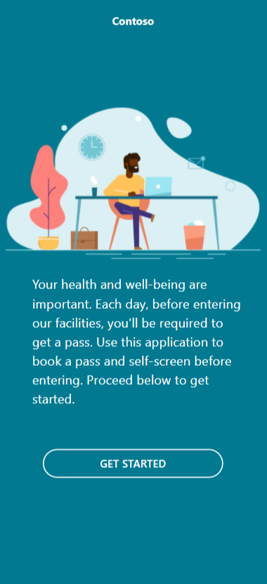

> [!div class="mx-imgBorder"]
> 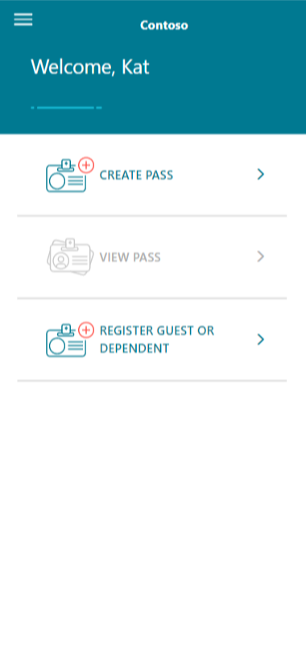

## Configuration

To alter the portals behavior you can change the solution settings. You can alter the following portal behavior: 

- Allow self registration
- Allow unauthenticated users to self-screen
- Allow authenticated users to add guests or create passes for guests/dependents.

More information: [Configure the solution](configure.md#set-solution-settings)

## Getting started with the portal

The Return to Workplace Guest Portal provides two ways of authentication for end users to self-screen.

1. **Unauthenticated**: Allows users to complete guest attestation sent to them through email. Users can also create new guest attestations in order to get a pass to access a facility. The unauthenticated way approach is more relevant for infrequent visitors as it allows users to get a pass without creating an account.

2. **Authenticated**. Guests can be invited to the portal and are prompted to create an account. They can create passes for themselves and for their guests or dependents. The unauthenticated way approach is more relevant for frequent visitors, suppliers/vendors or schools, where a guardian creates a pass for a dependent.

### Unauthenticated access to portal

When the user open the portal in the browser,  **GET STARTED** screen is displayed. Select **GET STARTED** to continue.

In the unauthenticated mode the users are directed to the **terms and conditions** page. User must accept the terms and conditions by checking the box and selecting the **Accept** button. 

On the next screen, the user provides contact details. After this a facility can be selected. At this point the visitor can self-screen and attest to the company policies.At the end of the process, a pass is shown and can be e-mailed if needed.

### Authenticated access to the portal

The portal provides guests with the ability to attest to company health policies. If a user is not signed in, they are given the options to **SIGN IN**, **REGISTER**, or **REDEEM INVITATION**. More information: [Overview of authentication in Power Apps portals](https://docs.microsoft.com/powerapps/maker/portals/configure/configure-portal-authentication) 

If the user wants to use the **REDEEM INVITATION** option to access the portal, the user need to do the following:

1. Open the link in the e-mail to redeem the invitation and create an account.
2. Select **Accept** on the daily health check.
3. Selects **Agree** on the Health Terms and Agreements.
4. You can now view the pass. 

While logged in to the portal, the guest can do the following things:

- Create a pass
- View existing passes
- View resources
- Update their profile

The first two options are directly available from the home screen. The second two are available in the hamburger menu located on the top-left or the navigation bar on devices with larger screens. Next to those, the hamburger menu provides a link **home** to the home screen and a link to sign out.

#### Home screen

On the home screen you have several options:

- Hamburger menu thats displays
    - HOME
    - RESOURCES
    - PROFILE 
    - SIGN OUT

> [!div class="mx-imgBorder"]
> 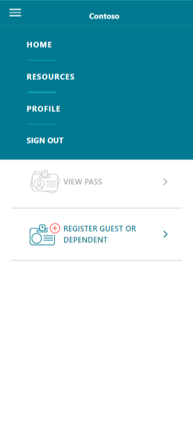

- CREATE PASS 
- VIEW PASS 
- REGISTER GUEST OR DEPENDENT

> [!div class="mx-imgBorder"]
> 

#### Creating a pass

To create a guest pass using the portal: 

1. Sign in to the portal.
1. On the home screen, select **CREATE PASS**.
1. Select the guest name.
1. From the list of available facilities, select the facility and then select **NEXT**.

   > [!div class="mx-imgBorder"]
   > 

1. **Accept** the disclaimers on the **Take the daily health check** screen.

    > [!div class="mx-imgBorder"]
    > 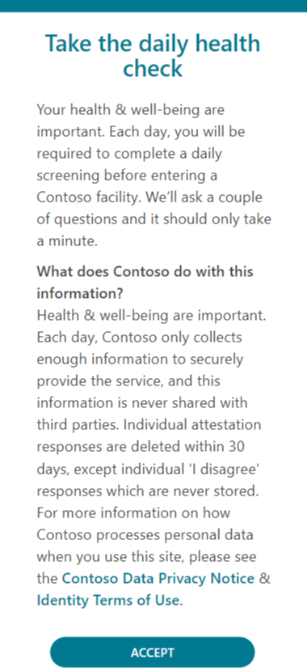

1. Select **I AGREE** if you don't have any symptoms.

   > [!div class="mx-imgBorder"]
   > 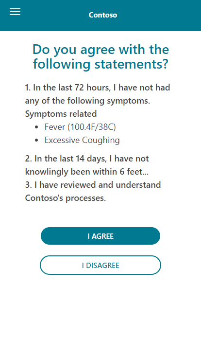

1. A pass is generated for the guest/dependent for that day.

   > [!div class="mx-imgBorder"]
   > 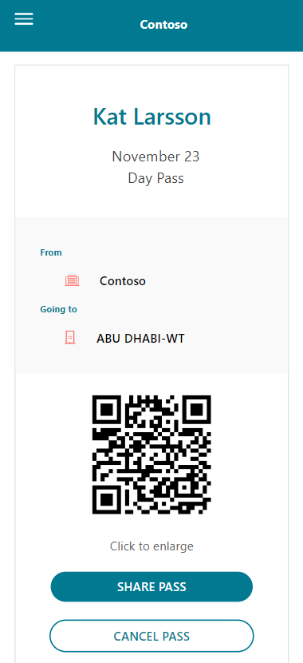

> [!NOTE]
> System administrator can disable the storing of negative attestations in the solution settings. This will stop a negative attestation from being created and wont save the record.

#### View existing passes

To view existing guest or dependent passes select **VIEW PASS** on the home screen. If no pass exists, the **VIEW PASS** option will be disabled on the home screen and in the hamburger menu. 

> [!div class="mx-imgBorder"]
> 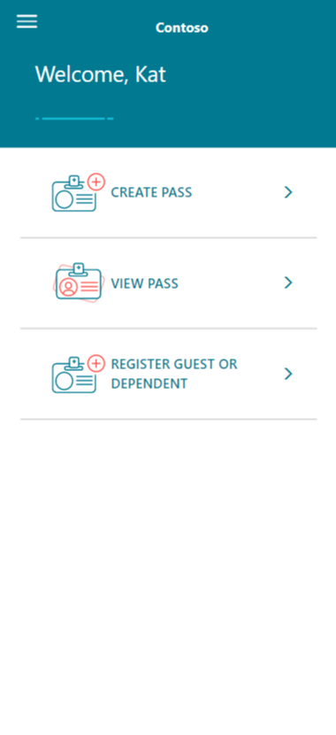

The pass displays:

1. Name of the guest
2. Pass date
3. Employee contact
4. Facility
5. Parent organization 
6. QR code
7. CANCEL PASS
8. SHARE PASS

> [!div class="mx-imgBorder"]
> 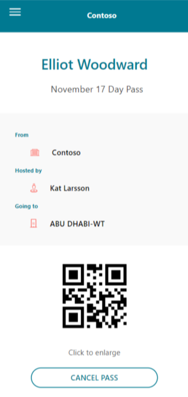

When **CANCEL PASS** is selected, the portal asks for confirmation. When a pass is cancelled it will no longer show up in the **VIEW PASS** screen and the attestation will be deactivated. The record will still exist in the system.

> [!div class="mx-imgBorder"]
> 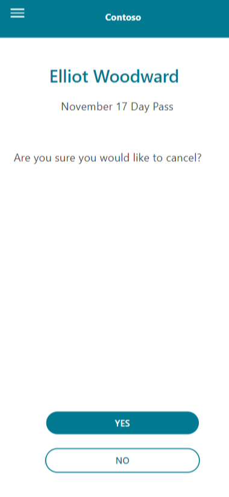

> [!NOTE]
> System administrator can disable the use of QR codes in the solution settings. This applies to both employee and guest passes.

#### View resources

The resources screen displays general information from your organization to the portal user.

> [!NOTE]
> System administrator can configure this information in the solution settings, therefore the information displayed depends on the default facility and facility group associated with that facility.

#### Update profile

On the profile screen, guests can perform basic operations. They can update their personal information, change their password or change their login method.

> [!div class="mx-imgBorder"]
> 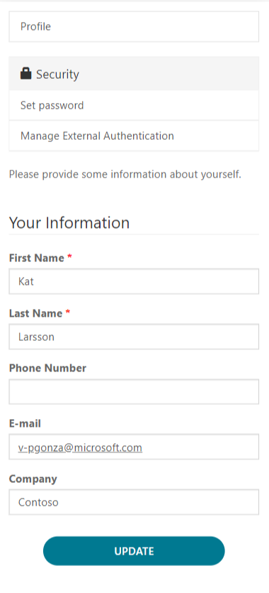

> [!NOTE]
> The options presented to **Manage external authorization** depend on the authentication methods configured by the system administrator.

## Inviting users to the portal

This section describes the way guests can start interacting with the portal.

### Sending invites to contacts

In the Facility Management app and the Workplace Care Management app, the facility manager or the health and safety leader can invite contacts to the portal.

To invite contact to the portal:

1. Open the **Facility Management app**.
2. Select **Solution Setup** area.
3. Select **Employees**.
4. Select the contact you would like to invite to the portal.
5. Verify that the e-mail address is correct.
6. Set the field **Requires portal access** to **YES**
7. Select **Save**.

In the background, invite will be created and an e-mail is sent to the contact. The email contains a personal link that allows the contact to redeem the invitation and create an account that will be linked to the contact.

In the Workplace Care Management app, skip step 1 and 2 described above. The **Employees** section is directly available from the side menu.

## Creating dependents for guests

To create a pass for the dependents, go to **Home** and select **REGISTER GUEST OR DEPENDENT**. Contact details must first be filled in for all the dependents:

Mandatory fields: 

1. First Name 
2. Last Name
3. Email 

Non-mandatory fields:

1. Phone Number
2. Organization 

> [!div class="mx-imgBorder"]
> 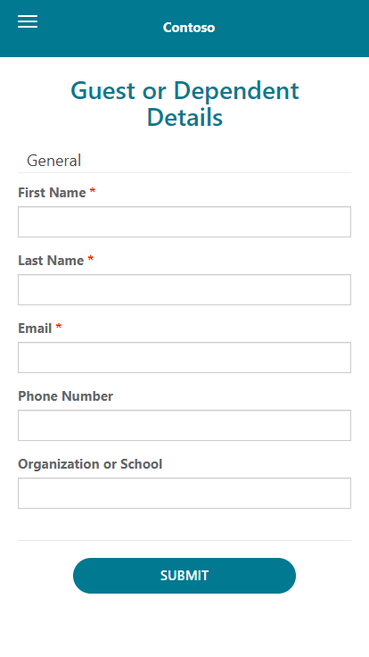

After creating dependents, user will see them listed by selecting the **CREATE PASS** option.

> [!div class="mx-imgBorder"]
> 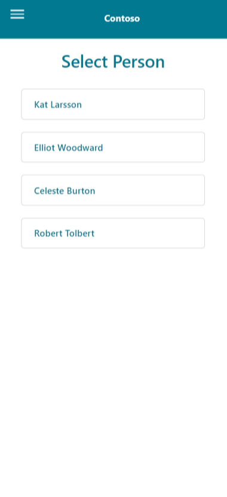

To find dependents in the Facility  Management app, go to **Solution Setup** and select **Employees**. On **My Active Contacts** view, open a record and find dependents on the **Guest** tab. All dependents can be found on the **Active Guests** view.

## Extend portal

To extend portal to fit for your business requirements, see:

[Extend the Return to the Workplace solution](extend.md) page.
[Power Apps portals documentation](https://docs.microsoft.com/powerapps/maker/portals/)

## Give feedback about the solution

To provide feedback about the Return to the Workplace solution, visit <https://aka.ms/rtw-community>.