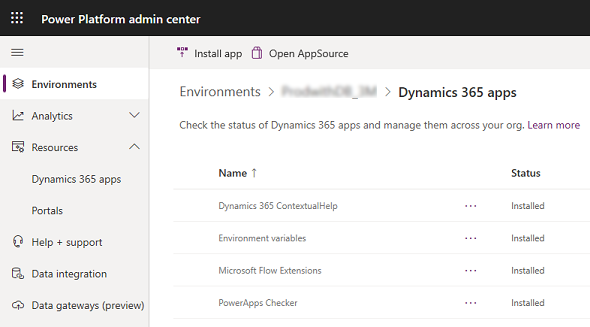

# Upgrade the Return to Work solution.

This article provide step-by-step instructions on how to upgrade the existing Return to Work solution to the latest version. If you're deploying the solution for the first time, see [deploy solution](deploy.md) article.

## Prerequisites

- Ensure you have the Global Admin credentials and environment details where the Return to Work solution is deployed currently. 

- Ensure all the users are disconnected from your environment before you upgrade. You might have to plan the upgrade process at a time when there is minimal obstruction for your users. 

## Step 1: Update the Package

Update the **Return to the Workplace** solution via the Power Platform admin center. 

> [!div class="mx-imgBorder"]
> 

  1. Sign in to the Power Platform admin center.

  2. Select **Environments** and then select an environment.

  3. Under **Resources**, select **Dynamics 365 apps**. In the list you will find **Power Platform Return to the Workplace - Apps** which will be the **Return to the Workplace** solution.

> [!div class="mx-imgBorder"]
> 

  4. Select **Power Platform Return to the Workplace - Apps**. From the top menu bar, depending on the status of the app, you can select **Update** to start the update process. From the top menu bar you can also select **Details** to see the process of the installation.

## Step 2: Update the Power BI dashboards

Yet to be documented based on experience.

## Step 3: Update the Facilities

With the new version, we are introducing the notations of areas and floors for a certain facility. A floor indicates how many levels are there within a building. An area allows you to define a space within a floor that has a certain capacity. Through bookings in the employee app, you can book the area and a floor. View the facility manager safety app section to see how you add floors and areas.

## Step 4: Define capacity for your reopen phases

Even though the capacity is defined on an area, it is bound by the phase your facility is in. Every reopen phase defines a percentage of the capacity, view the [configure the solution](configure.md) section to see how you can assign this to a reopen phase. 

## Step 5: Employee Cases

Employee cases are made inactive when they are finished now. For any employee cases you are finished, move them to inactive state.

## Appendix: Update the app and publish Power BI dashboard (US Government customers only)

For GCC customers, we still support the process outside of AppSource, before executing the steps above you need to follow **Appendix: Deploy the app and publish Power BI dashboard (US Government customers only)** in the [Deploy the solution](deploy.md) page.

