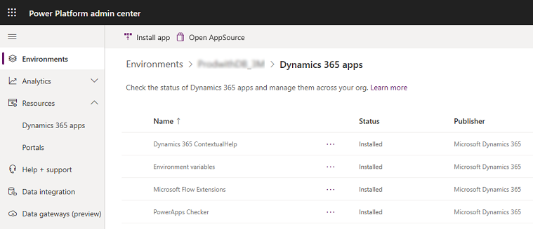
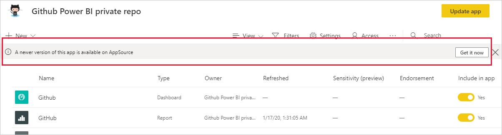
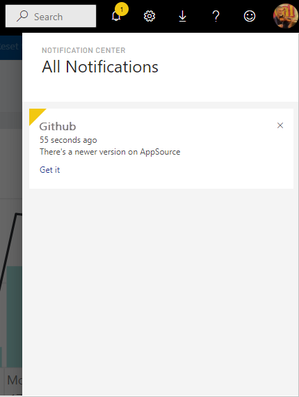
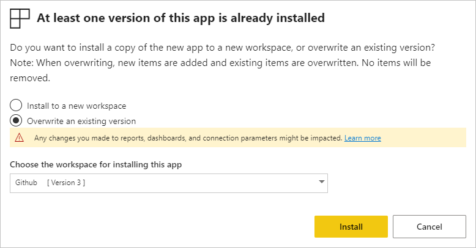

# Upgrade the Return to the Workplace solution

This article provides step-by-step instructions on how to upgrade the existing Return to the Workplace solution to the latest version. If you're deploying the solution for the first time, see [deploy the solution](deploy.md).

## Prerequisites

- You should be a Global administrator or Microsoft Power Platform administrator to do the installation.

- You must be a Global administrator and must have a Power BI Pro license to configure and publish reports.

- You must have installed the earlier version of **Return to the Workplace** and have the environment details. 

> [!TIP]
> Upgrading the solution impacts the user experience, so it is recommended to upgrade the solution outside of the normal business hours and test the changes on a development or test environment before moving it to production environment. 

## Step 1: Update the solution

You can update the **Return to the Workplace** solution using the Power Platform admin center.

> [!NOTE]
> If you are a US Government customer, you'll have to update the solution using the latest version of the deployment package available on GitHub. More information: [Appendix: Deploy the app and publish Power BI dashboard (US Government customers only)](deploy.md#appendix-deploy-the-app-and-publish-power-bi-dashboard-us-government-customers-only).

  1. Sign in to [Power Platform admin center](https://admin.powerapps.com).

  2. Select **Environments** from the left pane and then select an environment where you want to upgrade the solution.

  3. On the command bar select **Resources**,  and then select **Dynamics 365 apps**. From the list of apps, you'll find **Power Platform Return to the Workplace - Apps**, which will be the **Return to the Workplace** solution.

     > [!div class="mx-imgBorder"]
     > 

  4. The status field indicates that there is an **Update Available** for **Power Platform Return to the Workplace - Apps**. From the command bar, select **Update** or select the **Update Available** status to start the update process. From the command bar, you can also select **Details** to see the process of the installation.
  
To learn more about the update process, see: [Manage Dynamics 365 apps](https://docs.microsoft.com/power-platform/admin/manage-apps).

## Step 2: Update Power BI dashboards

When a new version of the  **Return to the Workplace** solution is available, you can get notified in two ways:

- An update banner appears in the Power BI Service informing you that a new app version is available.

    > [!div class="mx-imgBorder"]
    > 

- You'll receive a notification on Power BI's notification pane.

    > [!div class="mx-imgBorder"]
    > 

> [!NOTE]
> If you are a US Government customer, you'll have to update the Power BI dashboard using the latest version of the deployment package available on GitHub. More information: [Appendix: Deploy the app and publish Power BI dashboard (US Government customers only)](deploy.md#appendix-deploy-the-app-and-publish-power-bi-dashboard-us-government-customers-only).

To install the update, either select **Get it** on the notification banner or in the notification center, or find the app in the AppSource and select **Get it now**. If you have a direct link for the update, select the link.

You'll be asked whether you wish to overwrite the current version or to install the new version in a new workspace. By default, overwrite is selected.

> [!div class="mx-imgBorder"]
> 

  - **Overwrite an existing version:** Overwrites the existing workspace with the updated version of the template app. More information: [overwrite behavior](#overwrite-behavior).

  - **Install to a new workspace:** Installs a fresh version of the workspace and app that you need to reconfigure (connect to data, define navigation and permissions).

### Overwrite behavior

Overwriting the solution updates the reports, dashboards, and dataset inside the workspace, not the app. Overwriting doesn't change app navigation, setup, and permissions.

After you update the workspace, you need to update the app to apply changes from the workspace to the app.

Overwriting the existing version keeps the configured parameters and authentication. After the update, an automatic dataset refresh starts. During the refresh, the sample data is still present in the app, reports, and dashboards.

> [!div class="mx-imgBorder"]
> 

Overwriting always presents sample data until the refresh is complete. If the template app author made changes to the dataset or parameters, users of the workspace and app will not see the new data until the refresh is complete. Rather, they will continue to see sample data during this time.

Overwriting never deletes new reports or dashboards you've added to the workspace. It only overwrites the original reports and dashboards with changes from the original author.

> [!NOTE]
> Remember to update the app after overwriting to apply changes to the reports and dashboard for your organizational app users.

To learn more about the update process, see: [Update a template app](https://docs.microsoft.com/power-bi/connect-data/service-template-apps-install-distribute#update-a-template-app)

## Step 3: Install the Workplace Care Management dashboard

The Workplace Care Management dashboard gives you an overall overview where you can track the employee cases. More information: [Use the Workplace Care Management dashboard](dashboard-case-management.md).

To install the Workplace Care Management dashboard, follow the instructions as provided in the [deploy the solution](deploy.md#step-3-configure-and-publish-power-bi-dashboards) article.

## Step 4: Update facilities

With the new version, we are introducing the notations of areas and floors for a certain facility. A floor indicates how many levels are present within a building. 

An area allows you to define a space within a floor that has a certain capacity. Through bookings in the Employee app, you can book an area. More information: [Use the Facility Safety Management app](app-for-facility-manager.md#manage-and-monitor-facilities).

## Step 5: Define capacity for your reopen phases

Capacity is defined in an area, but it is also bound by the phase of your facility it is in. Every reopen phase defines the percentage of the capacity. 
To learn more about how you can indicate capacity limit per reopen phase, see [configure the solution](configure.md).

## Step 6: Employee cases

Employee cases are made inactive when they are finished with the new version of the solution. For any employee cases that is finished, move them to the inactive state by completing them. More information: [Use the Workplace Care Management app](app-for-health-and-safety-lead.md#manage-employee-cases).

## Feedback about the solution

To provide feedback about the Return to the Workplace solution, visit <https://aka.ms/rtw-community>.
