# What's new in the Return to the Workplace solution?

This article provides resources where you can learn about the new features that have recently released.

## New and updated features in December 2020 (v1.3)

### Return to the Workplace Portal
Facility managers can provide access to third parties. A third party can choose a facility, attest to being symptom-free and receive a personalized day pass for facilities entry. A facility manager can also share resources such as FAQs, guidelines, and restrictions with third parties. 

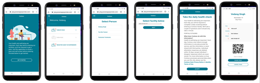

With the introduction of portals we added a new way for people approaching the solution. Below you will find a comparison how the portal related to the mobile app.

||Employee App (Mobile App)|Portal (Web App)|
|-----|------------|---------------|
|Persona|Employee|3rd Party|
|Target Users|Employees, students|Vendors, parents or guardians of students, “of-age” student|
|Security||Authentication Azure AD|Multiple types supported (including Azure AD B2C, Gmail, Facebook)|
|Booking level||Facilities, floors, areas, arrival times|Facilities|
|Attestation|Yes|Yes|
|Access controls|Yes|No|
|Notifications (e.g., in-app, email, text)|Yes|No|
|Included in occupancy metrics|Yes|Yes|
|Included in occupancy capacity limits|Yes|No|
|Included in case management|Yes|By company policy|
|Manual contract tracing|Yes|Limited (manual data entry)|

### Access Control 
Facility or case managers can now manage facility access for employees via access controls. They are a new way of blocking facility access for an employee which allows people create them either via other ways which can also be automated via Power Automate or an API. Access controls tie in to notifications, so people find guidance in the employee app.

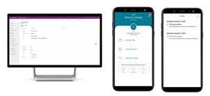

### Notifications
Employees can now have in app notifications when booking or when facility access has been enabled or disabled. Out of the box there email notification is also provided, but these can be extended via Power Automate or other solutions.

### Upgraded Dashboards with County Level Virus Data
COVID-19 data and insights at a county level for US, including new metrics such as confirmed cases per 100K and Fatal cases per 1M population.

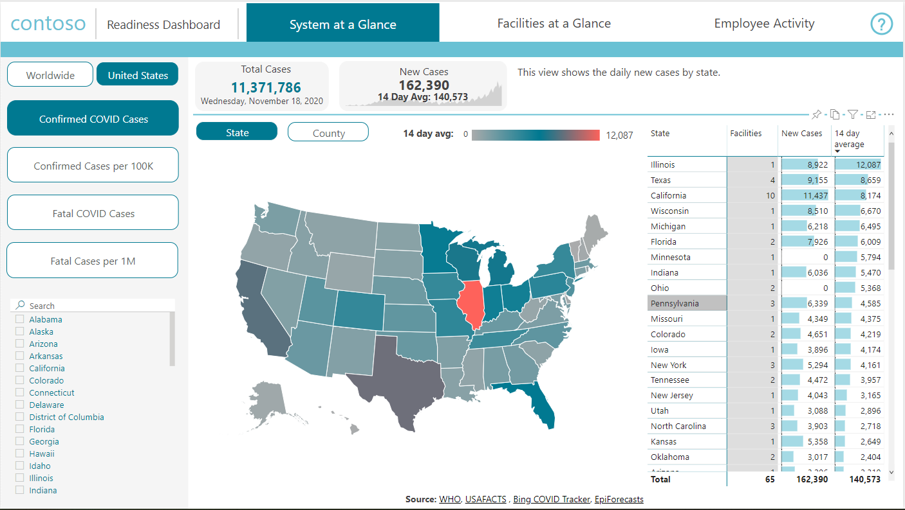
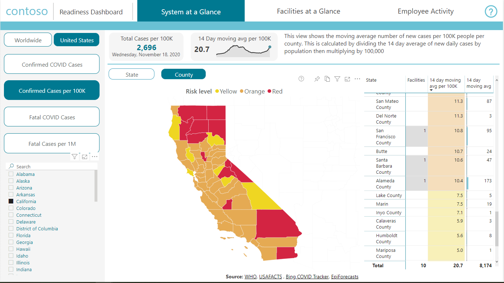

## New and updated features in October 2020 (v1.2)

### Guest bookings 

To support guest visits to a facility, employees can now book passes for their guests. Passes can be shared to guests through email (Outlook), so that guests are aware of policies and details of the facility. More information: [Employee app](app-for-employee.md).

> [!div class="mx-imgBorder"]
> 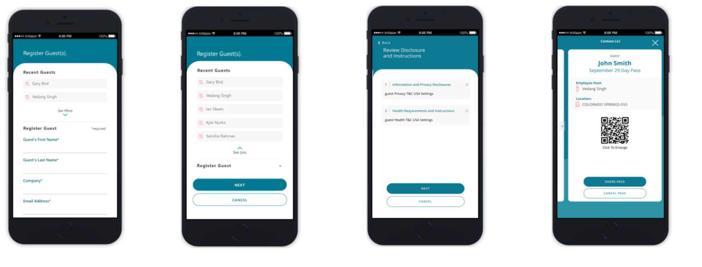

### QR code 

Employees and guest pass now contains QR code that enable integration with health and safety systems, such as temperature scanning and badge reader systems. Depending on your preferences, you can turn off this feature in the solution settings. More information: [Employee app](app-for-employee.md).

### Manual contact tracing 

Manual contact tracing can quickly identify case contacts through a suggested list, and manually add additional case contacts. The case contacts can be evaluated and new cases can be opened, if needed. More information: [Workplace Care Management app](app-for-health-and-safety-lead.md).

### Employee access management 

Case managers can now manage facility access like blocking employees entering into the facility. When blocking the employee, you can provide a notification to the employee when the employee is trying to book a facility. Case managers can also set the date when facility access will be available again for the  employee. More information: [Workplace Care Management app](app-for-health-and-safety-lead.md)

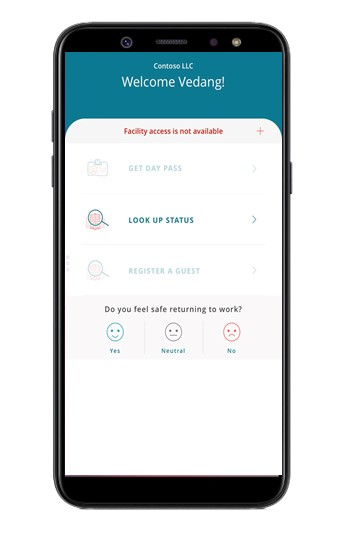    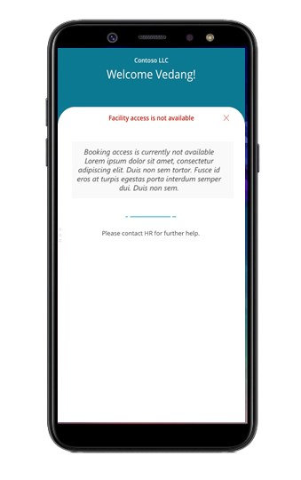

### Prioritized case dashboard 

A new dashboard for case managers has been introduced to help them prioritize their case workload. Case managers can view the list of high-risk cases and cases due for contact and investigation. Case managers can also visualize cases by duration they have been open and by their risk. More information: [Workplace Care Management app](app-for-health-and-safety-lead.md).

### View and assess case clusters 

Health and safety leads can visualize case clusters and view associated metrics to assess the risk of an outbreak and take immediate actions. The core data for visualizations is sourced from the manual contact tracing feature. More information: [Use the Workplace Care Management dashboard](dashboard-case-management.md).

> [!div class="mx-imgBorder"]
> 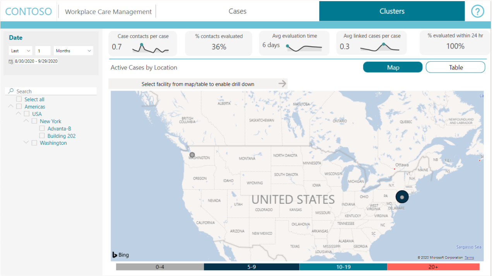

> [!div class="mx-imgBorder"]
> 

### Contact type 

Contacts are now differentiated by a new contact type field (Employee and Guest) that enables a facility manager to differentiate between an employee and non-employee. More information: [Facility Safety Management app](app-for-facility-manager.md).

### Enhanced occupancy dashboards 

The occupancy dashboards have been updated to reflect the guest registrations. More information: [Facility Safety Management app](app-for-facility-manager.md).

## New and updated features in August 2020 (v1.1)

### Employee bookings and arrivals 

Employees can now book space in available buildings remotely through the app. They can choose from specific floors and areas that are available, choose arrival times to avoid high traffic hours, attest to being symptom free, and receive a personalized day pass that can be used for building entry.  More information: [Employee app](app-for-employee.md).

> [!div class="mx-imgBorder"]
> 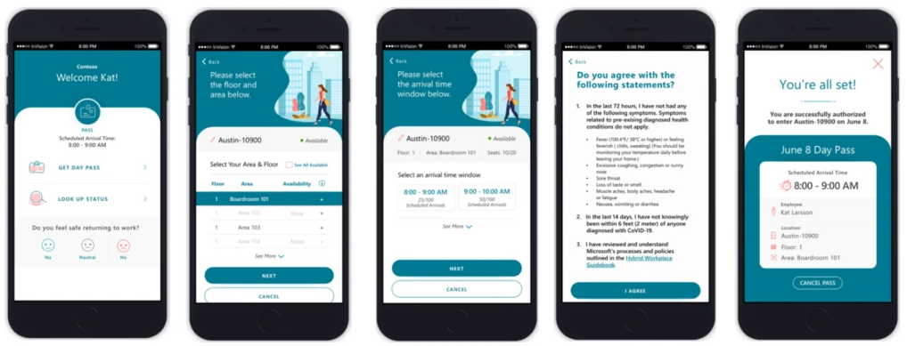

### New dashboard for health and safety leads

With this update, we are introducing a new Microsoft Power BI dashboard for health and safety leads that is authorized to view employee cases across the organization. The dashboard provides an overview of all cases with filters to view specific locations. There are also focused reports for viewing cases under investigation and cases being monitored to ensure health and safety and task force leadership have a comprehensive and consolidated view.  More information: [Use the Workplace Care Management dashboard](dashboard-case-management.md).

> [!div class="mx-imgBorder"]
> 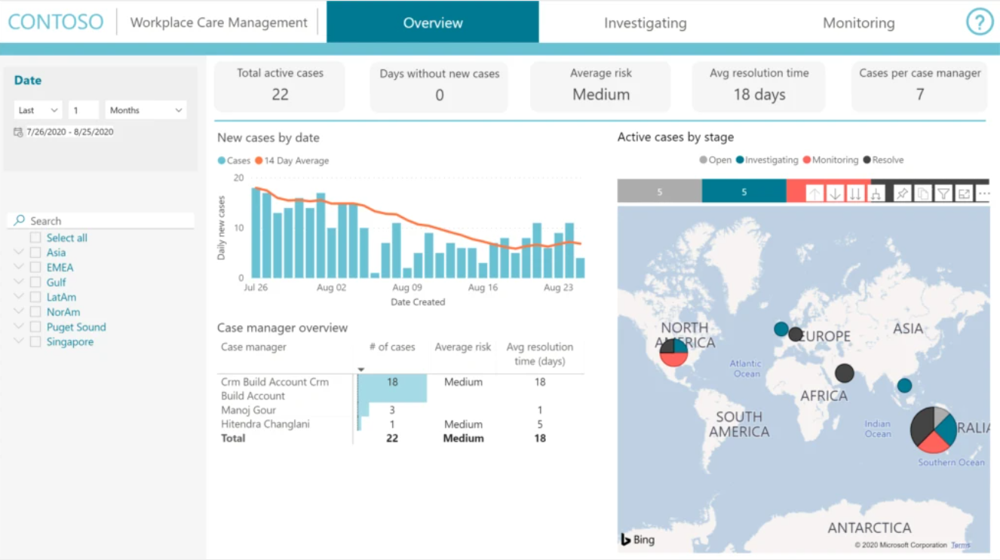

### Partition facility and set capacity limits 

A new location management capability designed to enable companies to better manage facility occupancy and arrivals, ensuring effective social distancing. Facility managers can partition workspace into floors and areas based on adjusted designs and establish capacity limits for each. Area capacity can also be limited by phase. These limits establish how many passes can be issued daily to ensure adherence to safety constraints. More information: [Facility Safety Management app](app-for-facility-manager.md).

### New occupancy tab 

The new occupancy tab enables a facility manager to monitor and manage occupancy by comparing bookings and visits against capacity. The facility manager can view trends by time and drill down to a floor and an area level to identify the high occupancy spaces. More information: [Facility Management dashboard](dashboard-for-executive-leadership.md).

> [!div class="mx-imgBorder"]
> 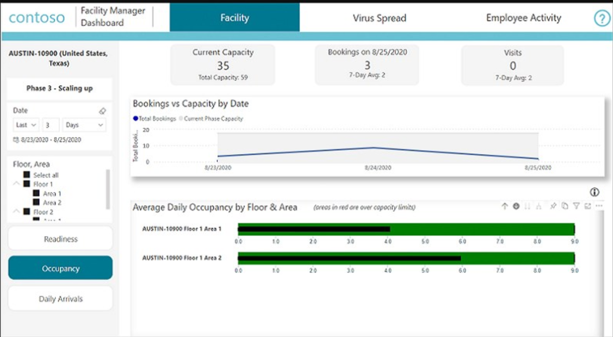

### New daily arrivals tab 

The new daily arrivals tab shows booking information to assist a facility manager in controlling the facility traffic, such as bookings by day of the week and by arrival time window.
More information: [Facility Management dashboard](dashboard-for-executive-leadership.md).

> [!div class="mx-imgBorder"]
> 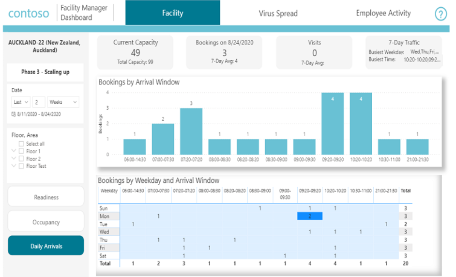

## New and updated features in July 2020 (v1.0)

### Employee app

Allow employees to self-serve in looking up facility status and workspace availability. Employees can let the organization know how they are feeling about safely returning to work. More information: [Employee app](app-for-employee.md).

> [!div class="mx-imgBorder"]
> 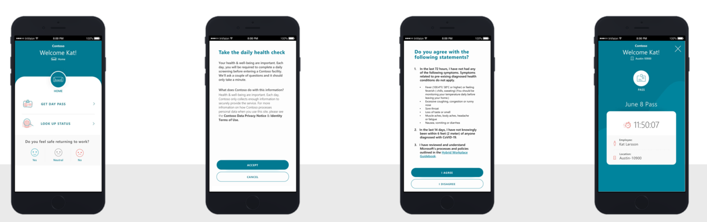

### Facility Safety Management app

Provide facility managers the tools they need to manage the reopening and readiness of the facilities. This helps organizations ensure that they can provide a safe working environment for employees to return to the workplace. More information: [Facility Safety Management app](app-for-facility-manager.md).

> [!div class="mx-imgBorder"]
> 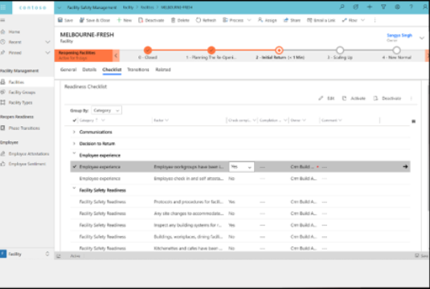

### Workplace Care Management app

Allow case managers to open and investigate cases for affected employees and import data from external systems to support case management. More information: [Workplace Care Management app](app-for-health-and-safety-lead.md).

> [!div class="mx-imgBorder"]
> 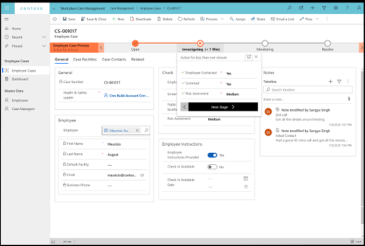

### Facility management dashboard

The app allows facility managers to:

- Visualize reopening readiness based on virus spread, COVID-19 cases, and facility readiness.

- Monitor locations daily to advance or retreat phases.

- Consolidate signals and scores into a readiness model.

   > [!div class="mx-imgBorder"]
   > 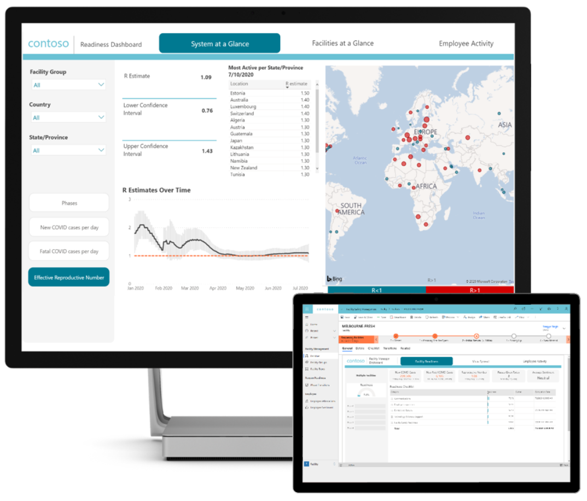

### Location readiness dashboard

Allow executive leadership to review current data related to all the conditions and facility readiness factors, compare selected measures and metrics associated to targets for locations, review guidelines set for locations by government agencies. More information: [Location readiness dashboard](dashboard-for-executive-leadership.md).

> [!div class="mx-imgBorder"]
> 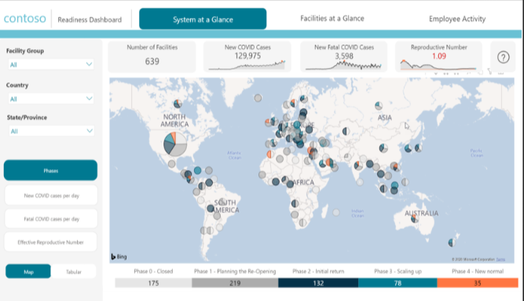
