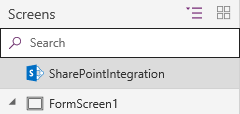

# Understand SharePoint forms integration
You can now easily [customize any SharePoint list form](customize-sharepoint-form.md) in PowerApps. In this article, we will walk through the details of how these forms work and how you can customize them further.

If you have customized a form for a SharePoint list, you must have experienced that the default generated form just works for all operations like creating, showing or editing an item. This is accomplished by the help of generated formulas and the SharePointIntegration control.

## Understand the default generated form

The default generated form consists of the following controls and their corresponding defaults:

* **FormScreen1** - This is the [screen](./controls/control-screen.md) that contains the form.

* **SharePointForm1** - This is the [form](working-with-forms.md) that is used to create, show or edit the list item.

    * **Data Source** - The list for which the form has been customized.

    * **Item** - The selected item from list. We also set this to First() of the list for your convenience when working in PowerApps Studio.

        **If(IsBlank(SharePointIntegration.Selected) || IsEmpty(SharePointIntegration.Selected),First('*YourListName*'),SharePointIntegration.Selected)**

    * **OnSuccess** -  Once the item is created or saved successfully, the form is reset and SharePoint is requested to hide the form.

        **ResetForm(SharePointForm1); RequestHide()**

* **SharePointIntegration** - The control responsible for communicating user actions between SharePoint and PowerApps.

    * **Data Source** - The list for which the form has been customized.

        **'*YourListName*'**

    * **OnNew** - Set the **SharePointForm1** in new mode.

        **NewForm(SharePointForm1)**

    * **OnView** - Set the **SharePointForm1** in view mode.

        **ViewForm(SharePointForm1)**

    * **OnEdit** - Set the **SharePointForm1** in edit mode.

        **EditForm(SharePointForm1)**

    * **OnSave** - Submit the changes to **SharePointForm1**. On successful submission of the form, **SharePointForm1.OnSuccess** formula will be executed.

        **SubmitForm(SharePointForm1)**

    * **OnCancel** - Reset the changes to **SharePointForm1**. SharePoint always hides the form when user clicks or taps cancel button in SharePoint.

        **SubmitForm(SharePointForm1)**

These defaults ensure that the form works when running within SharePoint. They change the PowerApps form mode as the user interacts with in SharePoint and also ensure the changes are submitted to SharePoint.

## Understand the SharePointIntegration control
The **SharePointIntegration** control is responsible for communicating user actions between SharePoint and PowerApps.

The properties for SharePointIntegration are only available when the form is running in SharePoint and cannot be accessed when customizing the form in PowerApps studio.

It has the following properties:

**Selected** - The selected item from the SharePoint list.

**OnNew** - How an app responds when user clicks or taps **New** button or opens the create item form in SharePoint.

**OnView** - How an app responds when user clicks or taps an **item** or opens the detail form in SharePoint.

**OnEdit** - How an app responds when user clicks or taps **Edit all** button or opens the edit item form in SharePoint.

**OnSave** - How an app responds when user clicks or taps **Save** button in SharePoint.

**OnCancel** - How an app responds when user clicks or taps **Cancel** button in SharePoint.

**SelectedListItemID** - Item id for the selected item in SharePoint list.

**Data Source** - The list that contains the record that the form will show, edit, or create.

* If you change this property, the **Selected** and **SelectedItemID** property may stop working.

## Customize the default form

Now that you have a good understanding of the default generated form and the **SharePointIntegration** control, you can change the formulas to customize the forms further. Here are few tips on how to customize the forms:

* To customize the experience separately for creating, showing, or editing an item; set the **OnNew**, **OnView**, or **OnEdit** formulas of **SharePointIntegration** control to set variables or navigate to different screens.

* Use the **OnSave** formula of **SharePointIntegration** control to customize what happens when user clicks or taps **Save** in SharePoint. If you have multiple forms, make sure to submit the changes only for the form currently being used.

    * **Tip**: Set different values for a variable in **OnNew**, **OnView**, and **OnEdit** formulas. You can use this variable in **OnSave** formula to determine which form is being used.

* Make sure to include **RequestHide()** in **OnSuccess** of all your forms. If you forget this, SharePoint will not know when to hide the form.

* You cannot control hiding of the form when user clicks or taps **Cancel** in SharePoint. So make sure to reset your forms in **OnCancel** formula of **SharePointIntegration** control.