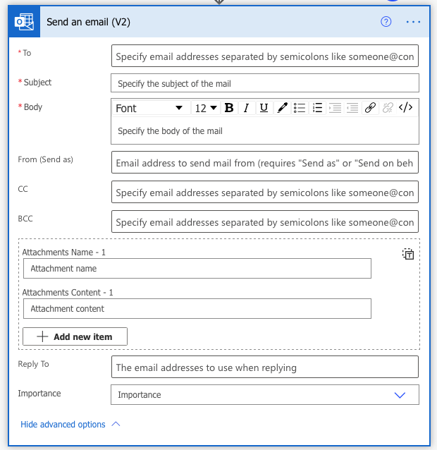

# Add notifications to make your apps collaborative

Apps in Microsoft Teams are designed to enable collaboration between people in your organization. When you have an app that has a hand-off of information, such as group A doing something that group B then needs to process, if everything happens in the app, users may miss important updates and processes might stall.

Using notifications for critical events in your apps in Teams enhances collaboration by proactively letting users know that there's something that needs their attention, or needs to be done.

Teams and Power Platform give you many options in the ways that you can notify people.

- Email notifications
- SMS/text notifications
- Teams messages
- Adaptive cards
- Channel posts

## Choose the right notification type

How should you decide what type of notification to use? Many people default to email notifications, but many people also complain that they receive too many emails. Email is an acceptable type of notification, but it should be used sparingly. Especially for urgent notifications, as frequently emails aren't seen immediately.

Here are some questions to ask when defining the appropriate type of notification:

1. **Is the notification urgent?**

    If you're creating an app to track safety issues, and there's an urgent issue that requires immediate attention, a notification like SMS text, push notification, or high priority Teams message should be used so the notification is immediately noticed. But don’t over-use these types of notifications for non-urgent notifications, or you risk irritating your users.

1. **Is the notification informational or actionable? If you're creating a notification, what do you want to have the notification recipient do with the notification?**

    Informational notifications are to notify users, but they're for information purposes only. For example, in the Employee Ideas sample app for Teams, when a new idea is created, a message is posted in a Teams channel notifying people that a new idea has been created.

    Actionable notification enable one or more follow-up activities by the recipient. In the extending Employee Ideas article, we show how to change the notification to an adaptive card so users can open the submitted idea and vote for it.

    If the notification requires that the user be able to do something with the notification, such as open a record or respond, an actionable notification should be used&mdash;such as an interactive card, or add a hyperlink to deep link to the app.

    Also, Teams makes other types of notifications more actionable by enabling conversations around the notification&mdash;when you post a message to a Teams channel, users can respond to it in the channel, facilitating the ability for multiple people to discuss the notification.

1. **Is the notification personal, or to a group?**

    Is there a specific person that should be notified? Or, is there a group of people that needs to know about the notification? For personal notifications, consider sending a message, email, or text message so that other users aren't overloaded with non-applicable notifications. If the message should be seen by multiple people in a group, a post In a Teams channel is a better choice, as the users in the group can all see the message and collaborate on it.

1. **What is the frequency of notification?**

    In the Inspection sample app for Teams, by default, a message is posted to a Teams channel when an inspection is completed. However, if you've a high frequency of inspections, many messages will be posted to the channel. And when many notifications are posted to a channel, individual notifications can get lost. Think of your phone notification center&mdash;when you've a few apps giving you notifications, they're helpful, but if you've many apps posting updates, notifications become noise. In this case, you'd want to reevaluate your notifications, and either change the notification to only notify on urgent inspections, or issues.

1. **What is the impact on the users?**

    Your colleagues are probably busy, and each interruption can add stress to their lives&mdash;especially in high quantities. Notifications are good if they make important information more available. But they can also have negative impact if too frequent or unnecessary. Also, arbitrary notifications can diminish a user's sense of control&mdash;if many messages start arriving that a user has no control over. And it can be a frustrating experience. Consider giving users an option in the app to control their notifications&mdash;this can be a settings toggle to opt in to notifications, or a preference to select what type of notification to receive. See [extending bulletins](bulletins-notification-preference.md) for an example.

## Notifications: Power Apps or Power Automate

When creating a notification, you have two options:

- Have your app create the notification directly.
- Or, trigger a Power Apps flow to post the notification.

The decision as to which approach you should use depends on what type of notification you're using, and how the notification should be triggered. Some notification types&mdash;such as adaptive cards, require Power Automate. Others, like sending emails, text messages, or Teams channel messages can be sent from a Power Automate formula, or a Power Automate flow. While there isn’t a “right or wrong” answer to this question, here are some rules to consider:

- Notifications sent directly from an app without flow will be in the context of the user making the change in the app. That means that the user will need access to the service sending the message, and some types of messages like emails may come from their personal account. If you want to send messages from a service account or general notification mailbox, a Power Automate flow can be owned by a different user account, and send a message when triggered by a data condition (like a record being created).

- If a flow sends a notification, and is triggered directly by the app, the flow needs to be shared or assigned with the user triggering the flow. If a flow sends a notification, and is triggered by a data condition (like a record creation or update), the flow doesn't need to be shared or owned by the triggering user.

- By using Power Automate to send notifications, you can update your notifications without having to republish your app. If your notification details frequently change, or users other than the maker of the app need to modify them, having the notification sent by Power Automate can segment your workloads and enable other users to work on the notifications while you work on the app.

- Power Apps sending notifications directly use formulas to define the notification logic, Power Automate flow uses a more graphical interface to set the properties of a notification. For example, from a Power Apps app, you can use the following formula to send email with the Outlook connector:

```powerapps-dot
Microsoft365Outlook.SendEmail("mailbox@contoso.com", Summary, Description)
```

In Power Automate instead, the send an email action is presented in a graphical manner, allowing users to populate the fields in a manner similar to how they send an email in Outlook.



Sending an email from Power Apps directly is faster for experienced makers, but the more details are required&mdash;such as attachment files and formatted text. For the less experienced makers, sending the email with Power Automate flow might be easier.

### See also

- [Boards (Preview) sample app](boards.md)
- [Bulletins sample app](bulletins.md)
- [Employee ideas sample app](employee-ideas.md)  
- [Inspection sample apps](inspection.md)  
- [Issue reporting sample apps](issue-reporting.md)
- [Milestones sample app](milestones.md)
- [Perspectives (Preview) sample app](perspectives.md)
- [Profile+ (Preview) sample app](profile-app.md)
- [Customize sample apps](customize-sample-apps.md)
- [Sample apps FAQs](sample-apps-faqs.md)

[!INCLUDE[footer-include](../includes/footer-banner.md)]
