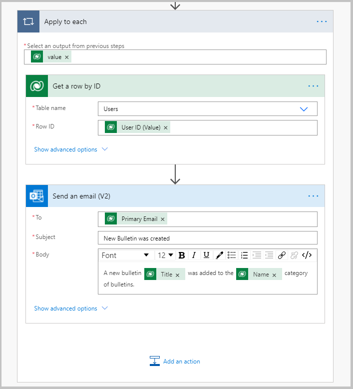

# Bulletins App – Add "notify me" settings to category

The Bulletins Power App Template for Microsoft Teams provides a central location for all company communication such as broadcasts, memos, announcements, and company news. The app allows you to create, categorize, bookmark, search and read bulletin posts.

The Bulletins app solution consists of two apps:

[**Manage bulletins app**](https://docs.microsoft.com/powerapps/teams/bulletins#manage-bulletins-app)

-   Manager experience for managing **Bulletins** app.

-   Allows managers to create, edit, and categorize posts read through the Bulletins app.

[**Bulletins app**](https://docs.microsoft.com/powerapps/teams/bulletins#bulletins-app)

-   Central location for all company communication such as memos, broadcasts, and news.
    
-   Shows bulletins, FAQs, links, and contacts created using the **Manage bulletins** app.

In this topic we will learn how to add functionality where the user can select for which categories they should get notified when bulletins get added send an email notification using Power Automate flow, when a new bulletin is created.

Employees are very busy, and excessive notifications can be a distraction. Users want to know when relevant announcements and news are posted, but they don’t want to be distracted by the noise of information about things that don’t apply to them. By allowing users to opt in to notifications, they can subscribe to the topics that are relevant for them and be notified about things that matter most to them.

> NOTE: before starting this topic, please review **How to customize Bulletins **(insert link).

## Prerequisites

To complete this lesson, we would need the ability to log in into Microsoft Teams which will be available as part of select Microsoft 365 subscriptions and
will also need to have the Bulletins Power Apps template for Microsoft Teams installed. This app can be installed from aka.ms/TeamsBulletins (confirm link).

## Create a new table called Bulletin Notifications

To get started, let’s add a table to store the notification settings. 

1. Select the Power Apps button from the left navigation menu in Teams.

2. Go to the Build tab and select Built by this team tab.

3.  Select the See all hyperlink under list of all items created to open the list of all the Objects used in all the apps that are installed and created
    in the selected Team.
    
4. Select the +New -\> Table.

5. Enter the Table name Bulletin Notifications.

6. The table gets created.

7. Open the table and open the Name field of the table.

8. Change Data type to Autonumber.

9. Set Minimum number of digits = 4 and Seed value = 1000.

10. Select the Add column on the top.

    - Enter Display Name = User ID.

    - Select Data type = Lookup.

    - Select Related table = User.

    - Hit the Done button at the bottom.

11. Select the Add column on the top.

    - Enter Display Name = Category.

    - Select Data type = Lookup.

    - Related table = Bulletin Category.

    - Hit the Done button at the bottom.

## Add a Toggle control to turn notifications on and off

1.  Select the Power Apps button from the left navigation menu in Teams.

2.  Go to the Build tab and select Installed apps.

3.  Open the Bulletins app.

4.  From the Tree view, select the Home screen.

5.  Select galBulletins_ByCategory from the tree view.

6.  Select the Insert option from the left navigation menu.

7.  Select Input -\> Toggle.

8.  The Toggle control gets added to the gallery.

9. Set the following properties on the Toggle.

   - X = Parent.Width - Self.Width

   - Y = lblGalBulletins_ByCategory_Name.Y

   - On Text = Turn off notifications

   - Off Text = Turn on notifications

   - Width = 200

   - Height = lblGalBulletins_ByCategory_Name.Height

   - OnCheck = Patch('Bulletin Notifications',{Category: LookUp('Bulletin Categories', 'Bulletin Category' = ThisItem.appCategoryGUID),'User
     ID':gblUserRecord})

   - OnUncheck = Remove('Bulletin Notifications',LookUp('Bulletin Notifications',Category.'Bulletin Category'=ThisItem.appCategoryGUID&&'User ID'.User=gblUserRecord.User))

   - Checked = !IsBlank(LookUp('Bulletin Notifications', Category.'Bulletin Category' = ThisItem.appCategoryGUID && 'User ID'.User =
     gblUserRecord.User))

## Publish the Bulletins App

1.  All the changes to the Bulletins app are completed.

2.  The app can now be published by selecting the Publish to Teams button on the top right.

## Create Power Automate Flow to send email notification

1.  Select the Power Apps button from the left navigation menu in Teams.

2.  Go to the Build tab and select Built by this team tab.

3.  Select the See all hyperlink under list of all items created to open the list of all the Objects used in all the apps that are installed and created in the selected Team.
    
4.  Select the +New -\> Cloud flow -\> Automated.

5.  Enter Flow name = Send notification based on Notification flag when a new bulletin is created.
    
6.  Select the trigger – When a new row is added, modified or deleted.

7.  Create the flow with the steps as shown below.

8.  Save the flow.

## Test the app

1.  Login into Teams and navigate to Team where the Bulletins app is installed.

2.  Select the Bulletins tab on the top.

3.  The Bulletins app opens.

4.  Verify that the Turn on notifications toggle shows up on the top right of each row of the categories gallery.
    
5.  Select the Turn on notifications toggle to turn notifications on for the particular categories.

6. Now, select the Manage Bulletins tab on the top.

7. Select the New Bulletin button on the top right.

8. The New bulletin screen appears.

9. Select the Category for which you want the bulletin created – Customer Updates.

10. Enter a title in the Add title text box – Upcoming Offers.

11. Enter a subtitle in the Add subtitle text box – Summer offers for customers.

12. Enter a description in the big text box – This Bulletin will list all the upcoming summer offers for customers.

13. Hit the Save button on top.

14. Then hit the Publish button.

15. In a few minutes, an email as shown in the image below should appear in the inbox of the email address provided in the Power Automate flow.

