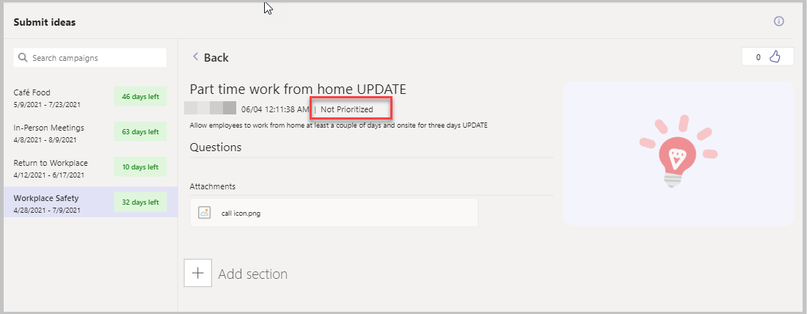

# Add tag to mark prioritized ideas

The Employee Ideas sample app for Microsoft Teams provides a platform for employees to submit ideas for various campaigns (that is, categories for grouping ideas around common themes).

With the Ideas app, managers can set up campaigns, users can submit ideas, view other users’ ideas, and also vote for ideas that they like the best. The experience can be customized by the admin or managers by editing campaigns, specifying justification questions that need to be answered by people submitting the ideas and also specify date threshold between which the campaign would be open for submitting ideas. The app also includes insights about who is submitting the greatest number of ideas and the most popular ideas during the week.

But once the ideas have been submitted and the voting period is over, how should a manager prioritize which ideas to act upon? You might prioritize those ideas with the most votes, or the ideas that are most aligned with your business goals and initiatives. After you determine your prioritization logic, you'll need a way to flag the ideas that are priority.

In this article, we'll learn how to add a **Priority** tag to an idea in the Manage Idea app so that the manager can tag prioritized ideas. We'll also add a label on the idea in the Ideas app to indicate if it was a prioritized idea or not. When done, the manager will be able to mark prioritized ideas in the Manage Ideas app, and users of the ideas app will be able to see that their idea has been prioritized.

> [!NOTE]
> Before starting with the steps in this article, read [Customize the Employee Ideas app](customize-employee-ideas.md).

## Prerequisites

To complete this tutorial, you'll need the ability to sign in to Microsoft Teams, which will be available as part of select Microsoft 365 subscriptions. You'll also need to have the [Employee Ideas sample app](employee-ideas.md) installed. This app can also be installed using <https://aka.ms/TeamsEmployeeIdeas>.

## Log in into the Manage Ideas app

1. Select the Power Apps icon on the left-pane, and go to the **Build** tab.

1. Select the team in which the Employee Ideas app is installed from the left-pane.

1. Select **Installed Apps**, and then select **Manage Ideas** to open the app. The Manage Ideas app opens.

## Add a new field to the Employee Ideas table

1. Select **Data** from the left-pane.

1. Select the **Employee Ideas**, table and select **...** (ellipsis).

1. Select **Edit data**.

1. Select **+ Add column**.

1. Set the following column properties:

    | Property | Value |
    | - | - |
    | Name | Prioritize |
    | Type | Yes/No |
    | Default | No |

1. Select **Done**.

## Add new control to the Campaign Detail Screen

1. From the tree view, select the **Campaign Summary Screen**.

1. Press the **Alt** key on the keyboard, and select one of the campaigns. All the ideas under the select campaign are listed.

1. Press the **Alt** key again, and select one of the ideas. The idea details show up.

1. Select the container **conCampaignIdeaControls**.

1. Select **+ Insert** from the left-pane.

1. Select **Input** > **Toggle** to add a toggle button to the controls section of the Campaign Details Screen.

1. You'll want to make the toggle button have consistent look and feel with the other controls on the screen, and set it to patch the idea priority field when set to prioritized.

    Set the following properties of the new toggle button.

    | Property | Value |
    | - | - |
    | X | btnCampaignIdeaControls_Share.X – 200 |
    | Y | btnCampaignIdeaControls_Share.Y |
    | OnText | "Prioritized" |
    | OffText | "Not prioritized" |
    | Font size | 12 |
    | OnCheck | `Patch('Employee Ideas', gblRecordCampaignIdea, {Prioritize: 'Prioritize (Employee Ideas)'.Yes})` |
    | OnUncheck | `Patch('Employee Ideas', gblRecordCampaignIdea, {Prioritize: 'Prioritize (Employee Ideas)'.No})` |

## Publish the Manage Ideas app

All the changes to the Manage Ideas app are completed. The app can now be published by selecting the **Publish to Teams** button on the top-right.

## Log in into the Ideas app

1. Select Power Apps on the left-pane, and go to the **Build** tab.

1. Select the team in which the Employee Ideas app is installed from the left-pane..

1. Select **Installed Apps**, and then select **Ideas** to open the app. The Ideas app opens.

## Add a label to the Ideas app

1. From the tree view, select the **Campaign Summary Screen**.

1. Press the **Alt** key on the keyboard, and select one of the campaigns. The Ideas list for the selected campaign opens.

1. Press the **Alt** key again, and select one of the ideas. The Idea Details for the selected idea opens.

1. Select the label **lblCampaignIdeaCard_CreatedByOn**.

1. To update the label text to indicate that the idea is prioritized, update the **Text** property to the following formula:

    ```powerapps-dot
    Concatenate(
    
    gblRecordCampaignIdea.'Owning User'.'Full Name',
    
    " ",
    
    Text(
    
    gblRecordCampaignIdea.'Created On',
    
    "[\$-en-US]mm/dd h:mm:ss AM/PM "
    
    ),
    
    If(gblRecordCampaignIdea.Prioritize='Prioritize (Employee Ideas)'.Yes," \|
    Prioritized", " \| Not Prioritized")
    
    )
    ```

## Test the app

1. Sign in to Teams, and go to the team where the Employee Ideas app is installed.

1. Select the **Manage Ideas** tab on the top.

1. Select one of the campaigns. For example, Workplace Safety.

1. Open an existing idea.

1. Verify that the label showing the creator of the idea plus the timestamp also shows whether the idea was prioritized or not.

    


### See also

- [Understand Employee ideas app architecture](employee-ideas-architecture.md)
- [Customize sample apps](customize-sample-apps.md)
- [Sample apps FAQs](sample-apps-faqs.md)
- [Use sample apps from the Teams store](use-sample-apps-from-Teams-store.md)

[!INCLUDE[footer-include](../includes/footer-banner.md)]
