# Area Walk

[!INCLUDE [cc-beta-prerelease-disclaimer.md](../includes/cc-beta-prerelease-disclaimer.md)]

In this tutorial, learn about the **Area Walk** (User) and **Area Walk** (Manager) apps, and how to use them effectively.

## Overview

**Area Walk** consists of two different apps, one app for the users, and another app for the manager.

- [Area Walk (Manager) app](#area-walk-manager-app)

    This app is used by a manager to perform the following actions:

    - Configure area walk forms and define outcome
    - Gain visibility to inspection results and issue status.
    - Ensure that all identified issues have been addressed by the staff.
    - Identify repeat issues from prior area walks and analyze root cause and prevent them from happening in future.

- [Area Walk (User) app](#area-walk-user-app)

    This app is used by employees to perform the following actions:

    - Inspect an area within a building or other location in the course of
    completing their job. The app provides inspection checklists so that
    multiple areas can be inspected. For example, a store employee can use this app to inspect a section of a retail store to verify that the store is ready to open for the day.
    - When an issue is found during the inspection, the employee can log the issue and assign it to the right person so that it can be resolved quickly.

## Prerequisites

Before using this app:

- Find the app in Teams store.
- Install the app.
- Set up the app for the first use.

For details about the above steps, go to [Use sample apps from the Teams store](use-sample-apps-from-teams-store.md).

## Area Walk (Manager) app

Manager app gives the manager the following capabilities.

- [Configure the app](#configure-the-app)
- [Edit the app configuration](#edit-the-app-configuration)
- [Add area types](#add-area-types)
- [Add areas](#add-areas)
- [Group areas](#group-areas)
- [Add inspection forms](#add-inspection-forms)

### Configure the app

To configure the app:

1. Sign in to Teams.

1. Select the team.

1. Select the **Area Walks (Manager)** tab.

1. Select the *Channel* where the messages will be posted.

1. (Optional) Select the *Tasks* (Planner) instance to integrate the app with Planner.

1. Select **Continue** if you selected a *Tasks* (Planner) instance in the previous step, otherwise select **Skip**.

    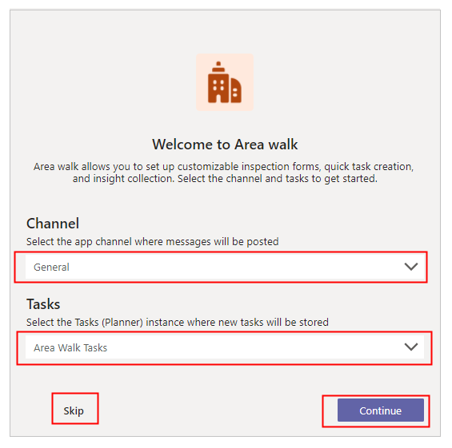

1. If you selected **Continue** in the previous step, follow the steps provided on the page (Steps 1 and 2) to get the SharePoint site URL. And then, paste the URL in *Step 3* input box.

1. Select **Let's go** if you entered a SharePoint site URL in the previous step, otherwise select **Skip** to use the app without SharePoint integration.
Select **Back** if you want to go back to the previous screen.

    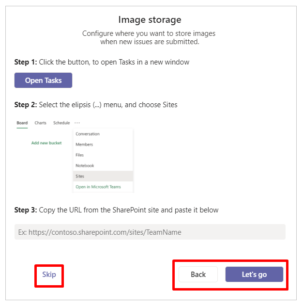

### Edit the app configuration

To edit the app configuration:

1. Go to the **Area Walk (Manager)** tab in Teams.

1. Select  from the top-right corner.

1. Select **General** from the settings menu.

1. Change the required settings.

1. Select **Save**.

    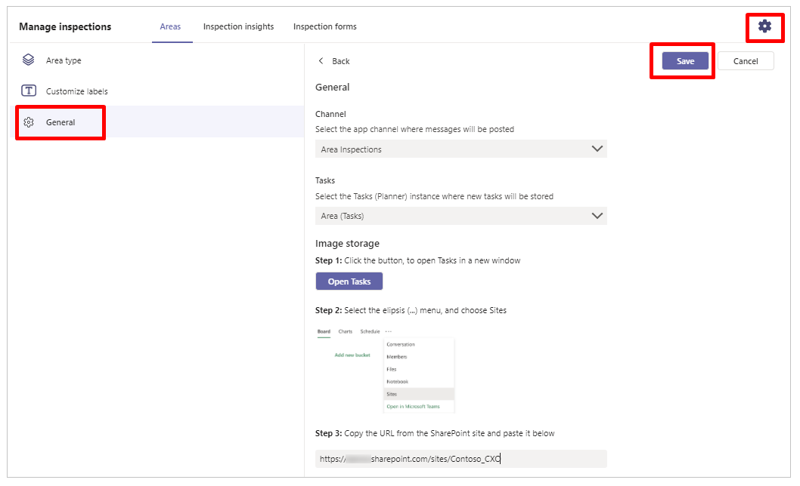

### Add area types

To start with the Area Walk app, you'll need to add area types first. The area types define the classes of different areas that can be added to the app for inspection.

To add the area types:

1. Select the **Area Walk (Manager)** tab in Teams.

1. Select **Areas** tab inside the app.

1. Select  from the top-right corner.

1. Select **Area type** from the left-pane inside the app.

1. Add, update, or delete area types as required. Examples: Interior, Food, Shopping.   For each area, you can enter *Title*, *Menu label*, and update icon.

1. Select **Save**.

    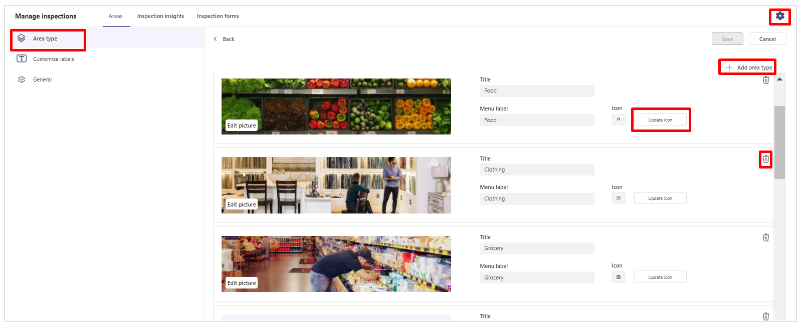

### Add areas

Areas are the portions that need to be inspected.

To add areas:

1. Go to the **Area Walk (Manager)** tab in Teams.

1. Select **Add area** from the left-pane inside the app.

1. Enter the area details, such as *Title*.

1. Select the **Area type** from the dropdown.

1. Select **Save**.

    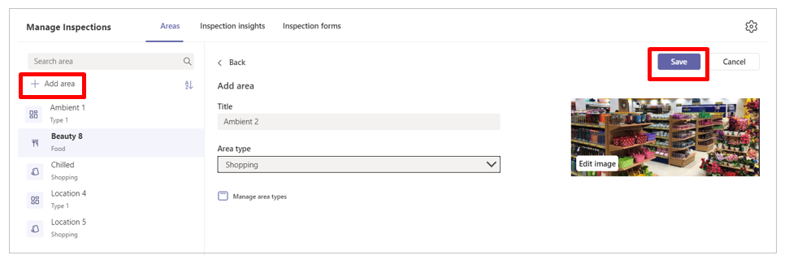

### Group areas

Grouped areas allow users to aggregate areas that are commonly inspected together to ensure that employees can more easily inspect all the necessary areas.

To group areas:

1. Select the **Area Walk (Manager)** tab in Teams.

1. Select **Areas** tab inside the app.

1. Select **Settings**.

    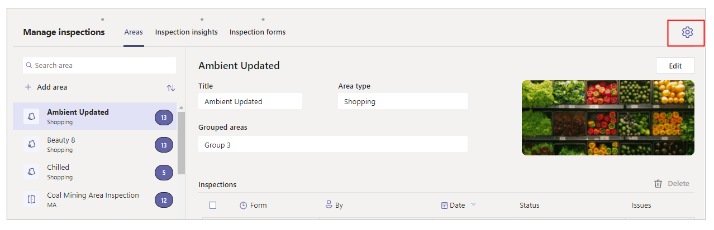

1. Select **Grouped areas**.

1. Select **Add group**.

    

1. Enter *Title*.

1. Select *Area type* from the drop-down.

1. Select the required areas from the *Areas* drop-down.

1. Select **Save** to save the group.

    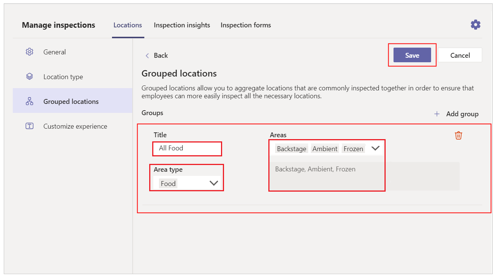

### Add inspection forms

Inspections forms are tied to area types. You can define more than one
inspection form for each area type. Each inspection form can be tied to
more than one area types.

To add inspection forms:

1. Go to **Area Walk (Manager)** tab in Teams.

1. Select **Inspection Forms** tab inside the app.

1. Select **Add a form** to create a new inspection form.

    1. Enter *Title*.
    1. Select *Area type*.
    1. Add *Checklist step* using **Add step**.

    Copy, delete, or move checklist steps up and down as required. You can enter one or more checklist steps for the inspection form. Each checklist step can have a *Title*, *Detailed Instructions*, and an *Image*. Each checklist item can also have up to three action buttons associated, reflecting "Ok", "Issue" and "Not Applicable" outcomes. The labels of the buttons can be customized.

1. Select **Save**.

    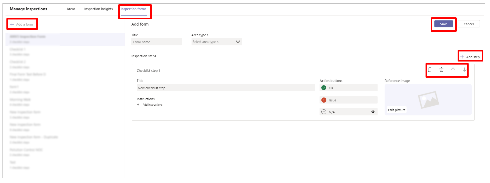

## Area Walk (User) app

User app enables users to complete a full inspection of the areas as and when
required in their job.

> [!NOTE]
> To run the installed app, select **Area Walk** app from the available
tabs inside the Teams channel.

The user app for inspection provides the following capabilities.

- [Home screen](#home-screen)
- [Choose an area to inspect](#choose-an-area-to-inspect)
- [Select an inspection form](#select-an-inspection-form)
- [Inspection overview](#inspection-overview)
- [Fill the inspection form](#inspection-form)
- [Add a Planner task to an inspection step](#add-a-planner-task-to-an-inspection-step)
- [Review inspection](#review-inspection)
- [Submit inspection of grouped areas](#submit-inspection-of-grouped-areas)

### Home screen

The app greats you based on your time of the day. If Planner is integrated from the manager app, statistics of the Planner tasks, and all inspections for last seven days are displayed.

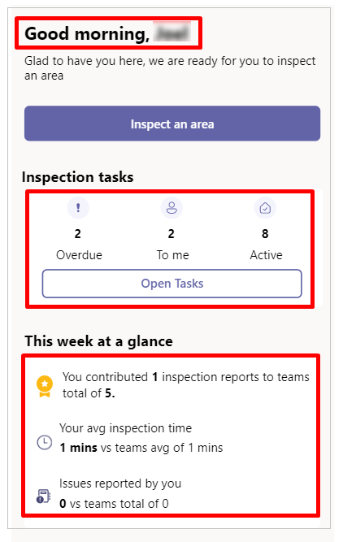

If Planner isn't integrated from the manager app, below screen is displayed when selecting **Open Tasks**. Selecting **Close** takes you back to the previous screen.

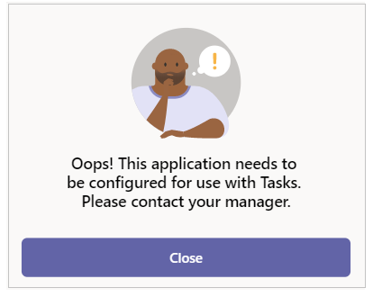

### Choose an area to inspect

Selecting **Inspect an area** takes you to the next screen that allows
you to select the area that needs to be inspected.

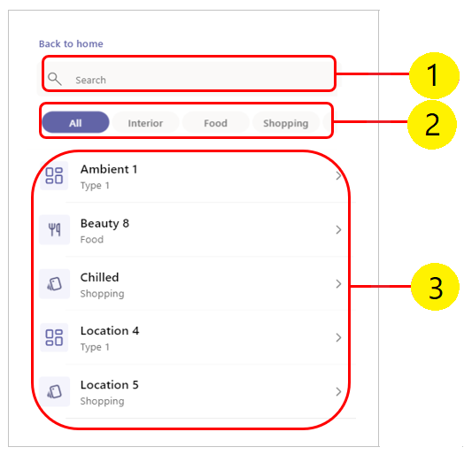

1. **Search box** - searches for areas based on the area type selected.

1. **Area types** - lists all the area types with and additional option. Default: *All*.

1. **Areas** - lists all the areas based on selected area. If *All* is selected, all the areas are listed by default.

### Select an inspection form

If there are more than one inspection forms associated to the area type, the app allows you to choose one of the inspection forms. Otherwise, the app takes you to *Inspection overview* screen.

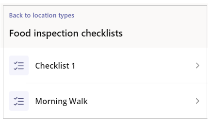

### Inspection overview

This screen shows the image of the area with the checklist, and checklist steps configured in the manager app. To start an inspection, select **Begin inspection**, or any of the checklist items.

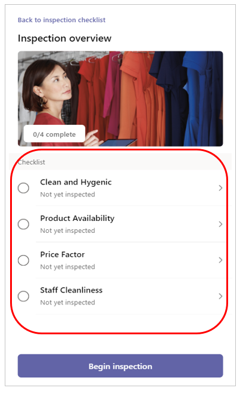

### Inspection form

Inspect the area and fill in the details on the inspection form. The checklist instructions configured in the manager app are displayed.

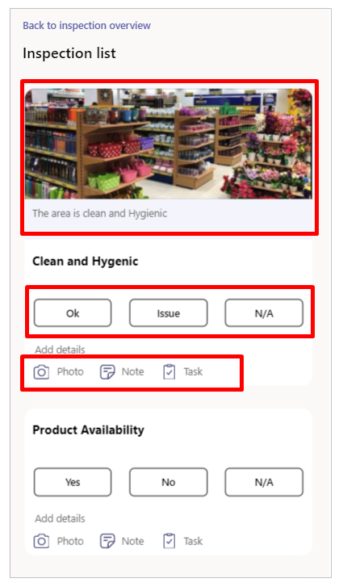

Select **Ok**, **Issue**, or **N/A** against each checklist. Select **Photo** to add an image, **Note** to add a note, and **Task** to add a Planner task.

### Add a Planner task to an inspection step

You can add task that automatically creates a Planner task inside the team to complete.

1. Select **Task** from the inspection step. This action updates the *Images* and *Notes*.

1. Add more images using **Add Photos**, or delete the unwanted images by selecting the images.

1. Select **Assign** to search for the user(s) that you wanted to assign the task to.

1. Select a due date.

1. If necessary, update the description.

1. Select **Add Task**.

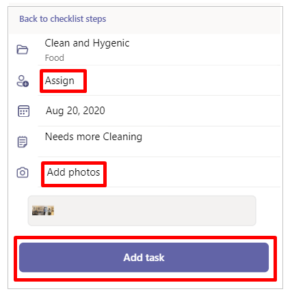

You can't create tasks and the following screen is displayed if the Planner isn't integrated from the manager app.

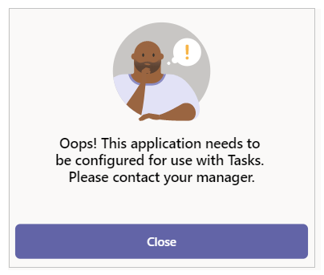

Selecting **Close** takes you to the previous screen.

### Review inspection

Select the checklist step to go back to the previous screen, and
modify the outcome. Or, select **Submit inspection** to submit the inspection form.

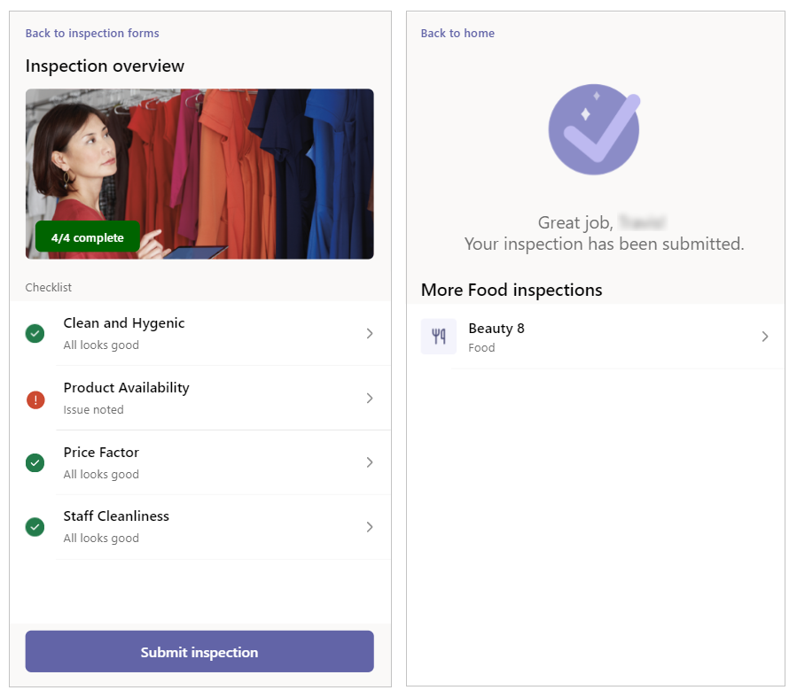

Once inspection is submitted, the app takes you to the next screen that shows the status of the submission, and the list of all the areas of the current area type.

### Submit inspection of grouped areas

To submit inspection of grouped areas:

1. Open **Area Walk** tab in Teams.

1. Select **Inspect an area**.

1. Select the group from **Grouped areas** section.

    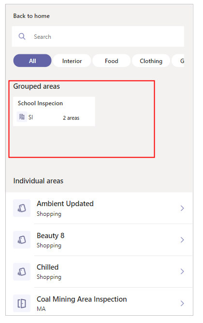

1. Select **Begin inspection**.

    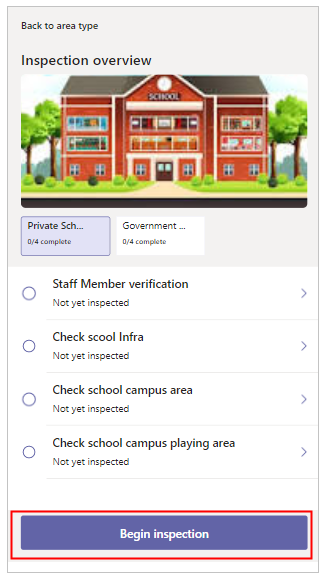

1. Respond to the inspection steps on screen.

1. Select **Review inspection**.

    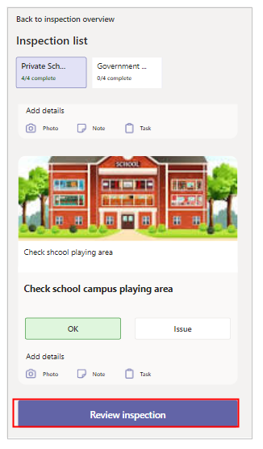

1. Select the next area in the tab.

1. Select **Continue inspection**.

    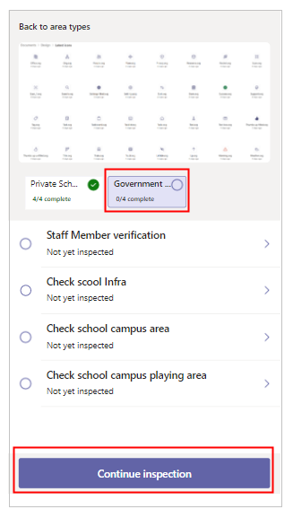

1. Respond to the inspection steps on screen.

1. Select **Submit inspection**.

    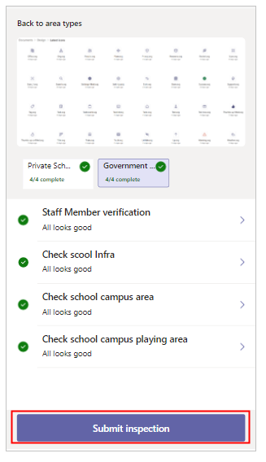

### See also

- [Asset Inspection](asset-inspection.md)
- [Employee Ideas](employee-ideas.md)
- [Issue Reporting](issue-reporting.md)
