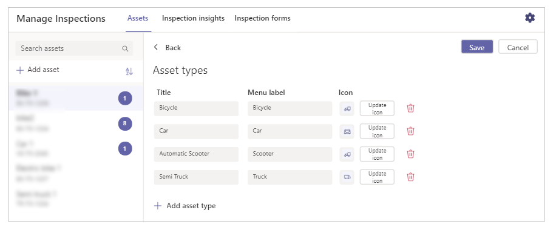
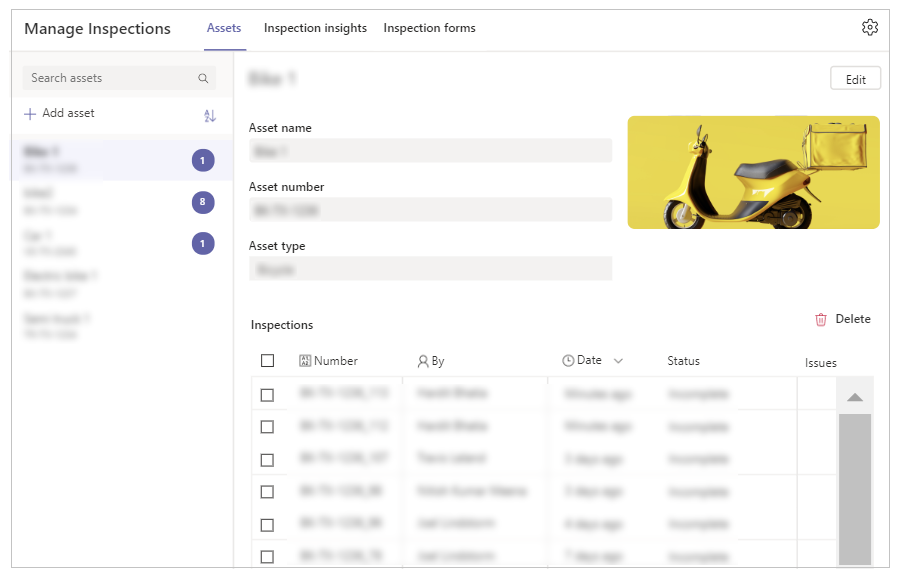
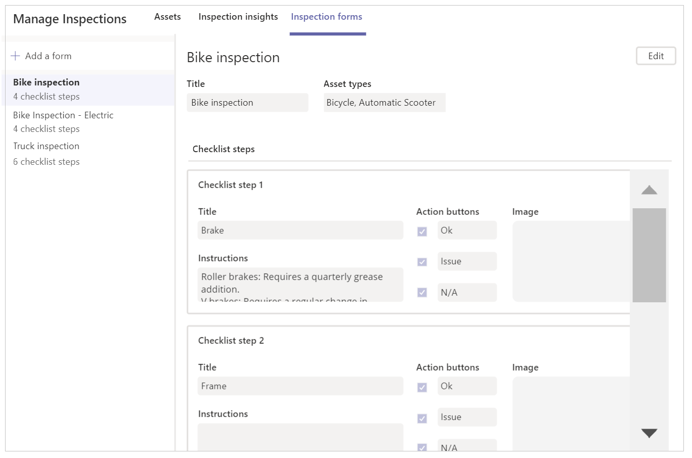
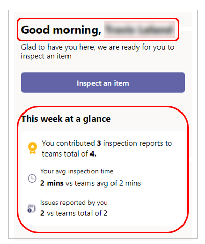
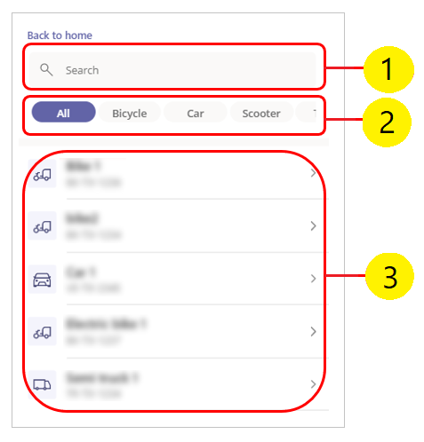
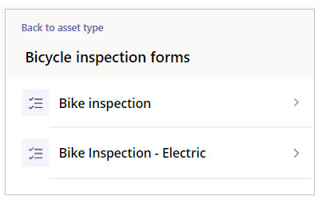
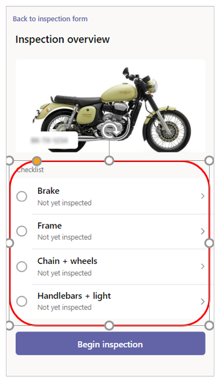
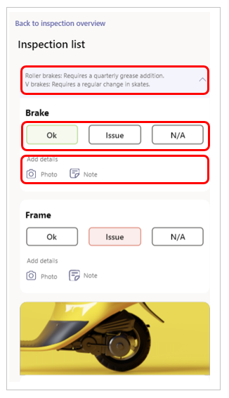
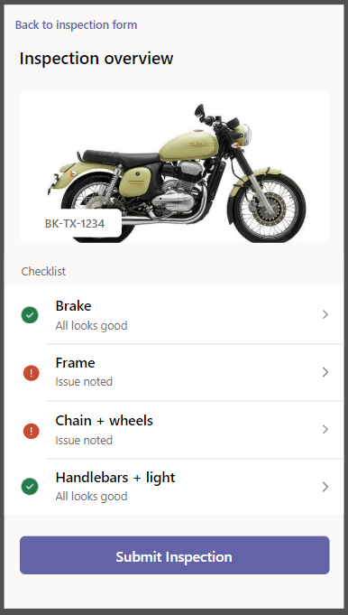

# Asset Inspection

In this tutorial, learn about using the Asset Inspection (User), and Asset Inspection (Manager) apps.

## Overview

**Asset Inspection** consists of two different apps, one app for the users, and another app for the manager.

- [Asset Inspection (Manager) app](#asset-inspection-manager-app)

    This app is used by the manager for the following:

    - To ensure that assets and equipment are healthy and downtime won’t impact employee productivity.
    - Receive notification when an inspection is complete, along with any issues identified so that the manager can quickly resolve the issue.
    - Validate that assets and equipment meets safety standards.
    - Configure the app user experience, including adding, updating, or removing assets, creating and modifying inspection forms, and configuring inspection response outcome options.
    - View insights and metrics about completed inspection history. For example, a manager managing a fleet of vehicles may want to see recurring issues so to address the root cause, and improve the efficiency of the organization.

- [Asset Inspection (User) app](#asset-inspection-user-app)

    This app is used by an employee for the following:

    - To complete inspections effectively and efficiently so that the user can focus on their job and ensure that the asset or equipment is compliant with company standards. For example, a delivery driver can deliver packages with confidence that the vehicle will not have any issues during their shift.
    - To document and notify managers about issues discovered during the inspection so that problems can be addressed in a timely manner.

## Prerequisites

Before using this app:

- Find the app in Teams store.
- Install the app.
- Set up the app for the first use.

For details about the above steps, go to [Use sample apps from the Teams store](use-sample-apps-from-teams-store.md).

## Asset Inspection (Manager) app

Manager app gives the manager following capabilities.

- [Add asset types](#add-asset-types)
- [Add assets](#add-assets)
- [Add inspection forms](#add-inspection-forms)
- [Associate forms to asset types](#associate-forms-to-asset-types)

### Add asset types

To start with the manager app, you’ll need to add asset types. The asset types define the classes of different assets that can be added to the app for inspection.

To add asset types:

1. Sign in to Teams.

1. Select the team.

1. Select the **Asset Manager** tab.

1. Select **Assets** tab inside the app.

1. Select  from the top-right corner.

1. Add the required asset types. For example, Bike, Car or Truck.

    

1. Select **Save**.

### Add assets

Assets are the individual items or vehicles that you want to inspect.

To add assets:

1. Select **Manage Asset Classes** tab in Teams.

1. Select **Assets** tab inside the app.

1. Select **Add assets**.

1. Fill in the asset details such as the asset name, asset number and asset type.

    

### Add inspection forms

Inspections forms are tied to asset types. You can define more than one
inspection form for each asset type. For example, you can define a “Daily Car
Inspection” and a “Weekly Car Inspection” form for the asset type “Car”.

To add inspection forms:

1. Select **Manage Asset Classes** tab in Teams.

1. Select **Inspection forms** tab inside the app.

1. Select **Add a form** from the left-pane inside the app.

    You can enter one or more checklists for this inspection form. Each checklist step can have a *Title*, *Detailed Instructions*, and an *Image*. Each checklist item can also have up to three action buttons associated, reflecting "Ok", "Issue" and "Not Applicable" outcomes. The labels of the buttons can be customized.The labels of the buttons can be customized.

    

### Associate forms to asset types

To associate forms to the asset types:

1. Select **Manage Asset Classes** tab in Teams.

1. Select **Assets** tab inside the app.

1. Associate the inspection form to the asset type.

## Asset Inspection (User) app

User app enables employees to complete a full inspection of the vehicle.

> [!NOTE]
> To run the installed app, select **Asset inspection** app from the available
tabs inside the Teams channel.

The user app for inspection provides the following capabilities.

- [Home screen](#home-screen)
- [Choose an asset to inspect](#choose-an-asset-to-inspect)
- [Inspection overview](#inspection-overview)
- [Inspection form](#inspection-form)
- [Review inspection](#review-inspection)

### Home screen

The app greats you based on your time of the day and lists the statistics of all inspections for the last 7 days.

### Choose an asset to inspect

Selecting to inspect takes you to select the asset that needs to be inspected.

1. **Search box** - searches for assets based on the asset type selected.

1. **Asset types** - lists all the asset types with and additional option. Default: *All*.

1. **Assets**- lists all the assets based on selected asset. If *All* selected, all the assets are listed by default.

### Select an inspection form

If there are more than one inspection forms associated to the area type, the app allows you to choose one of the inspection forms. Otherwise, the app takes you to *Inspection overview* screen.

### Inspection overview

This screen shows the image of the asset with the checklist, and checklist steps configured in the manager app. To start an inspection, select **Begin inspection**, or any of the checklist item.

### Inspection form

Inspect the asset and fill in the details on the inspection form. The checklist instructions configured in the manager app are displayed.

Select **Ok**, **Issue**, or **N/A** against each checklist. Select **Photo** to add an image, and **Note** to add a note.

### Review inspection

Select the checklist step to go back to the previous screen, and
modify the outcome. Or, select **Submit inspection** to submit the inspection form.

Once inspection is submitted, the app takes you to the next screen that shows the updated statistics with the current submission.
