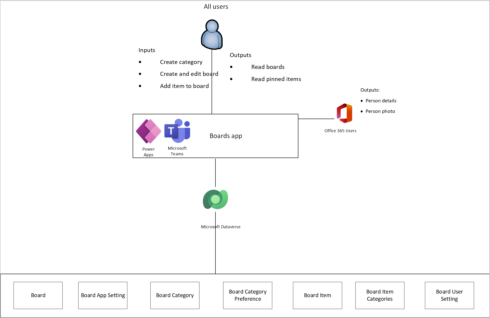
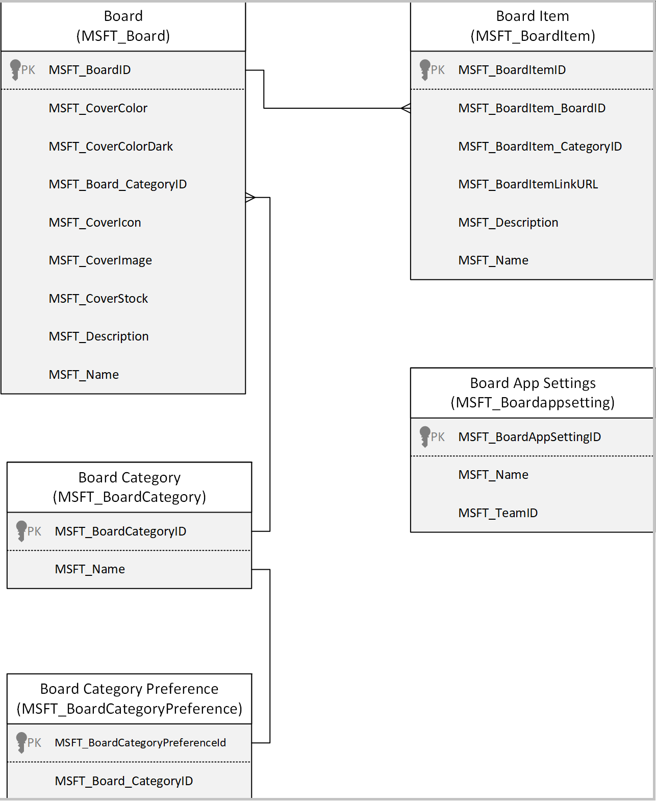

# Understand Boards sample app architecture (preview)

[This article is pre-release documentation and is subject to change.]

In this article, you'll learn about the collections and global variables used by
the [Boards](boards.md) app, and understand how to
use them effectively. If you want to learn more about how to install, and use
the Boards sample app instead, go to [Boards app](boards.md).

## Prerequisites

To understand and use information in this article, you'll need to know about
different controls, features, and capabilities of canvas apps.

-   [Create and update a collection in a canvas app](../maker/canvas-apps/create-update-collection.md)
    
-   [Collect, Clear, and ClearCollect functions in Power Apps](../maker/canvas-apps/functions/function-clear-collect-clearcollect.md)
    
-   [Understand canvas-app variables in Power Apps](../maker/canvas-apps/working-with-variables.md)
    
-   [Add and configure a canvas-app control in Power Apps](../maker/canvas-apps/add-configure-controls.md)
    
-   [Add a screen to a canvas app and navigate between screens](../maker/canvas-apps/add-screen-context-variables.md)

You'll also need to know about how to [install](use-sample-apps-from-teams-store.md), and [use](boards.md)
Boards sample app.

## Architecture model

The following diagram illustrates the way that users and systems interact with
data in the Boards solution

### Connectors

The following connectors are used in the Boards app:

-   **Microsoft Dataverse** - used to read and write data in Dataverse.

-   **Office 365 Users** - used to read Microsoft 365 user profile data.

## Data model

The following diagram explains the data model used by the Boards sample app.

### Tables

The section describes the tables contained in the Boards solution, along with their purpose.

| Table                     | Description                                                                                                                                                                                                                                                                |
|---------------------------|----------------------------------------------------------------------------------------------------------------------------------------------------------------------------------------------------------------------------------------------------------------------------|
| Board                     | Boards are digital bulletin boards, and users can pin items to them so they can be discovered by other users. These items can be websites, Teams, channels, conversations, apps, or files.                                                                                  |
| Board Category            | Board Category stores category records that are available to users when users create their boards.  Details such as name, the board category to which it is associated and the date when the category was created on, modified on are stored under Board Category table.   |
| Board Item                | Board items are the items that users can pin to boards.  Details such as name, the board item category, and the date when the item was created on, modified on are stored in the board Item table.                                                                         |
| Board Category Preference | Board category preference records are created when a user sorts or sets visibility preferences for board categories.  Details such as name, the category, and the user for whom the category applies are stored in the board category preference table.                    |
| Board User Settings       | Table to store if a user has logged into the app or not and if they want others to send them requests or show the splash screen.                                                                                                                                           |

## Boards app

This section explains collections, and global variables used by the
[Boards](boards.md) app.

### Collections

Boards app uses following collections.

| Collection Name                   | Description                                                                          | Screen Used                                              |
|-----------------------------------|--------------------------------------------------------------------------------------|----------------------------------------------------------|
| colLocalization                   | Used to build a Localization Collection based on the User Language.                   | OnStart property of the app                              |
| colUserSettings                   | Collection of User Settings used to store the user who used the app.                  | OnVisible property of the Loading Screen                 |
| colStockIcons                     | Collection of Stock Icons to show the icons in the app.                               | OnSelect property of the app OnStart                     |
| colStockImages                    | Collection of Stock Images to show the icons in the app.                              | OnSelect property of the app OnStart                     |
| colBoardCoverColors               | Collection of board cover colors used to show the covers in the app.                  | OnSelect property of the app OnStart                     |
| colBoardCategories                | Collection of Board Categories to store and show the categories.                      | OnVisible property of the app Boards Screen              |
| colDeleteBoardCategories          | Collection of the board categories that are to be removed.                           | OnSelect property of the save button in settings screen  |
| colBoards                         | Collection of Boards shown for the users.                                             | OnVisible property of the app Boards Screen              |
| colAppNewUserCategories           | Collection indicating a new user category was added.                                  | OnVisible property of the app Boards Screen              |
| colBoardCategoryPreferences       | Collection indicating board category preferences.                                     | OnVisible property of the app Boards Screen              |
| colBoardCategoryPreferenceUpdates | Collection indicating updated board category preferences.                             | OnVisible property of the app Boards Screen              |
| colSelectedBoardItems             | Collection of all Board item of the Board.                                            | OnVisible property of the app Board Items Screen         |
| colAppSettings                    | App settings to check the team ID of the team where the app was originally installed. | OnSelect property of the app OnStart                     |

### Global Variables

Boards app uses following global variables.

| Variable Name                   | Type    | Description                                                                                |
|---------------------------------|---------|--------------------------------------------------------------------------------------------|
| gblAppLoaded                    | Boolean | To check whether the App is loaded.                                              |
| gblUserLanguage                 | Text    | To check the logged in User’s Language.                                                     |
| gblThemeDark                    | Boolean | To check whether the Teams theme is set to Dark.                                            |
| gblThemeHiCo                    | Boolean | To check whether the Teams theme is set to High Contrast.                                   |
| gblMobileMode                   | Boolean | Variable to check whether the app is running on mobile.                                     |
| gblAppSetting_inputMobileOnWeb  | Boolean | Variables to Scale fonts for mobile-oriented apps, running in desktop.                      |
| gblAppSetting_inputScaleFontsby | Number  | Use this variable for scaling all fonts by a fixed amount.                                  |
| gblFirstRun                     | Boolean | To check whether the app is being run for the first time.                                  |
| gblAppSetting_inputMobile       | Boolean | Variables to Scale fonts for mobile-oriented apps.                                          |
| gblAppColors                    | Record  | Variable to set the Color value in the app.                                                 |
| gblAppSizes                     | Record  | Variable to set the Color value in the app.                                                 |
| gblAppStyles                    | Record  | Variable to set the Styling values in the app.                                              |
| gblIsTeamsContext               | Boolean | Variable to check context of group of teams.                                                |
| gblIsManager                    | Boolean | Global variable to store the admin value.                                                  |
| gblCurrUserEmail                | Record  | GblCurrUserEmail                                                                           |
| gblCurrUser                     | Record  | Global variable to store the current user record.                                           |
| gblRecordUserSettings           | Record  | Global variable to store the latest Project User Settings records for the current user.    |
| gblCurrentTeamId                | Record  | Used to store current team ID.                                                              |
| gblIsOriginalTeamInstalTeam     | Boolean | To check if the current team is same as original install team.                              |
| gblIsAdmin                      | Boolean | To check if the current team is same as original team then current user is the team owner.  |
| gblAppColors                    | Record  | Variable to set the Color value in the app.                                                 |
| gblAppSizes                     | Record  | Global variable to store the app sizes for app in mobile and mobile on web.                 |
| **gblOriginalInstallTeamId**    | Record  | Store the original installation team ID.                                                    |
| gblAppStyles                    | Record  | Global variable to store styling properties for all controls.                               |
| gblDisplayWarning               | Boolean | Determines if warning should be displayed.                                                  |
| gblWarningType                  | Record  | Determines the type of warning to display.                                                  |

### App OnStart

This section explains the collections, variables, and execution details used on
start of the app.

##### OnStart Collections

The following collections are used during start of the app.

| **Collection name**  | **Description**                                                     |
|----------------------|---------------------------------------------------------------------|
| colLocalization      | Collection of localized text based on users language.               |
| colCharsWidth        | Collection of widths for each character used for auto width labels. |
| colStockImages       | Collection of stock project cover images.                           |
| colBoardCoverColors  | collection of board cover colors.                                    |
| colStockIcons        | collection of stock board cover icons.                               |

##### OnStart Variables

The following variables are used during start of the app

| **Variable name**               | **Description**                                              |
| ------------------------------- | ------------------------------------------------------------ |
| gblAppLoaded                    | Global variable to check if the app has loaded completely.   |
| gblUserLanguage                 | Global variable to store the user's language.                 |
| gblThemeDark                    | Global variable to store if Teams is running in dark mode.   |
| gblThemeHiCo                    | Global variable to store if Teams is running in contrast mode. |
| gblMobileWidth                  | Global variable to define the width of the app for mobile.   |
| gblMobileMode                   | Global variable to store if the app is being accessed from a mobile device. |
| gblAppSetting_inputMobileOnWeb  | Global variable to scale fonts for mobile-oriented apps, running in desktop. |
| gblAppSetting_inputMobile       | Global variable to scale fonts for mobile-oriented apps.     |
| gblAppSetting_inputScaleFontsBy | Global variable for scaling all fonts by a fixed amount.     |
| gblCurrUserEmail                | Global variable to store the current user email address      |
| gblIsManager                    | Global variable to store the admin value.                    |
| gblTeamsTabContext              | Global variable to store the Teams context value.             |
| gblCurrUser                     | Global variable to store the current user record.             |

##### OnStart execution details

1.  When a user accesses the app, **gblAppLoaded** is set to false. The user’s
    language code is stored in **gblUserLanguage**, with English - US being the
    default one.

2.  The user’s language is then used to collect localized text used throughout
    the app (for example, label and button text) in **colLocalization**.

3.  The label’s auto width is calculated and stored in **colCharsWidth**

4.  The user’s Teams theme/mode is checked to see if the theme is default, dark
    or high contrast. The **gblThemeDark** and **gblThemeHiCo** variables are
    set.

### Loading Screen

This section explains the collections, variables, and execution details used on the loading screen

#### Loading screen collections

The following collections are used on the loading screen.

| **Collection name** | **Description**                                                                      |
|---------------------|--------------------------------------------------------------------------------------|
| colUserSettings     | Used to collect user settings record.                                                |
| colAppSettings      | App settings to check the team ID of the team where the app was originally installed. |

#### Loading screen variables

| **Variable name**               | **Description**                                              |
| ------------------------------- | ------------------------------------------------------------ |
| gblFirstRun                     | Global variable to check whether the app is being run for the first time. |
| gblRecordUserSettings           | Global variable to store the latest Project User Settings records for the current user. |
| gblOriginalInstallTeamId        | Stores the original installation team ID.                     |
| gblCurrentTeamId                | Used to store current team ID.                                |
| gblIsOriginalInstallTeam        | To check if the current team is same as original install team. |
| gblIsAdmin                      | If the current team is same as original team, then current user is the team owner. |
| gblAppSetting_inputMobileOnWeb  | Global variable to scale fonts for mobile-oriented apps, running in desktop. |
| gblThemeDark                    | Global variable to store if Teams is running in dark mode.   |
| gblThemeHiCo                    | Global variable to store if Teams is running in contrast mode. |
| gblAppColors                    | Global variable to store the app design colors.               |
| gblAppSizes                     | Global variable to store the app sizes for app in mobile and mobile on web |
| gblAppStyles                    | Global variable to store styling properties for all controls (set on the OnVisible of the Loading Screen). |
| locNavigationTimer              | If the navigation timer has been set to true after the time interval the app settings and sizes will be updated. |
| gblAppSetting_inputMobile       | Global variable to scale fonts for mobile-oriented apps.     |
| gblAppSetting_inputScaleFontsBy | Global variable for scaling all fonts by a fixed amount.     |

#### Loading screen execution details

1.  If **gblAppLoaded** is true (which means the app’s OnStart has completed),
    **gblAppStyles** is not blank (which means the styling variable has been
    loaded), and **gblAppContext,** **gblIsTeamsContext** is true (which means
    the app is being accessed from within organization or Teams), then the user
    is navigated to the:

    - **gblFirstRun**: If the current run is the first run of the app as indicated
      by **gblFirstRun**, this variable is set to true, if not, then false.

    - If the latest Boards User Settings record for the current user (stored in
      **gblRecordUserSettings**) has a value of Yes for ‘Display Splash (Power
      Apps)’ column, then this variable is set to true, if not, then false.

2.  If **gblAppContext** is false, then the user is navigated to the Welcome
    Dialog Screen.

3.  The loading screen will initialize all the global variables like
    **gblAppStyles, gblAppSizes,** gblAppColors to show the screen and color
    settings as per the user setup like dark mode or high contrast mode in Teams
    desktop or in browser

### Boards Screen

#### Displaying the welcome dialog

This section explains the collections, variables, and execution details used when the welcome dialog is displayed

##### Welcome screen collection

The following collections are used when the welcome dialog is displayed.

| **Collection name**               | **Description**                                              |
| --------------------------------- | ------------------------------------------------------------ |
| colBoards                         | Collection of Boards that are shown for the users.          |
| colBoardCategories                | Collection of Board Categories.                               |
| colBoardCategoryPreferences       | Collection of Board Category Preferences.                     |
| colBoardCategoryPreferenceUpdates | Collection of Board Category Preference Updates.              |
| colAppNewUserCategories           | App only collection, indicating a new user category was added. |
| colLocalization                   | Collection of localized text based on user’s language.       |

##### Welcome screen variables

The following variables are used when the welcome dialog is displayed.

| **Variable name**               | **Description**                                              |
| ------------------------------- | ------------------------------------------------------------ |
| gblAppStyles                    | Global variable to store styling properties for all controls (set on the OnVisible of the Loading Screen). |
| locBlockUserInput               | Local variable to set up the user input to false and update the dialog user preference. |
| locNavFromAbout                 | Local variable to set up the Boolean value as true while navigating from boards screen to the About screen. |
| locScreenReaderAnnouncedText    | Local variable to start the announcement of screen reader.   |
| locSelectedBoard                | Local variable to update the variable context to the selected item. |
| locSequenceCurrent              | Local variable to show the boards in a sequential order setup in the sort preferences. |
| locSequenceNew                  | Local variable to show the new board created by the user.     |
| locSetFocusControlTarget        | Local variable to keep the focus on the target on each item where the user cursor moves. |
| locSetFocusTimerStart           | Local variable to start the focus timer on the properties of screen where the user cursor moves. |
| locShowFirstRun                 | Local variable to indicate if the current run of the app is the first run for the user. |
| locShowPowerAppsPrompt          | Local variable to indicate if the user has set the preference to see the Power Apps prompt to yes or no. |
| locVisibleDialogUserPreferences | Local variable to indicate the boards based on the sort preference set by the user. |

##### Welcome screen execution details

1.  The first screen will show only once when any user opens the app for the
    first time to show the detailed view about the app and once the user selects
    on **Continue** the second screen will be shown on how the app has been
    created and two options are available.

2.  **Doesn’t show this again** - once you check this box, user settings will be updated
    to not show this pop up and if the user doesn’t select the check box and
    select **Got it** then this pop up will be shown each time

#### Displaying the boards screen

This section explains the collections, variables, and execution details used when viewing the boards screen.

##### Boards display collections

The following collections are used when the boards screen is displayed.

| **Collection name**               | **Description                                          |
| --------------------------------- | ------------------------------------------------------ |
| colocalization                    | Collection of localized text based on user’s language. |
| colBoardCategoryPreferences       | Collection of Board Category Preferences.               |
| colBoards                         | Collection of Boards that are shown for the users.    |
| colBoardCategoryPreferenceUpdates | Collection of Board Category Preference Updates.        |

##### Boards display variables

| **Variable name**               | **Description**                                              |
| ------------------------------- | ------------------------------------------------------------ |
| gblAppStyles                    | Global variable to check if the app has loaded completely.   |
| locSelectedBoard                | Global variable to store the user's language.                 |
| gblThemeDark                    | Global variable to store if Teams is running in dark mode.   |
| gblThemeHiCo                    | Global variable to store if Teams is running in contrast mode. |
| locVisibleDialogUserPreferences | Local variable to store the visible dialog preference.       |
| locScreenReaderAnnouncedText    | Local variable to start the announcement of screen reader.   |
| locSelectedBoard                | Local variable to update the variable context to the selected item. |
| locShowFirstRun                 | Local variable to indicate if the current run of the app is the first run for the user. |
| locShowPowerAppsPrompt          | Local variable to indicate if the user has set the preference to see the Power Apps prompt to yes or no. |
| locVisibleDialogUserPreferences | Local variable to indicate the boards based on the sort preference set by the user. |
| locBoardMode                    | Local variable to indicate the Add board screen is enabled.  |
| locBlockUserInput               | Local variable to set up the user input to false and update the dialog user preference. |
| locSetFocusControlTarget        | Local variable to keep the focus on the target on each item where the user cursor moves. |
| locSetFocusTimerStart           | Local variable to start the focus timer on the properties of screen where the user cursor moves. |
| gblCurrUserEmail                | Global variable to store the current user email address.     |

##### Boards display execution variables

1.  Boards are displayed in this screen with the details like category of the
    board, count of board items and boards for each category.

2.  The galleries that list boards, categories, filtered results are:

    -   galBoardCategories on the boards screen.

    -   galBoards on the boards screen.

    -   galSortPreferences on the boards screen

#### Sort preferences 

This section explains the collections, variables, and execution details used when sort preferences are set.

##### Sort preference collections

The following collections are used when sort preferences are set.

| **Collection name**               | **Description**                                        |
| --------------------------------- | ------------------------------------------------------ |
| colocalization                    | Collection of localized text based on user’s language. |
| colBoardCategoryPreferences       | Collection of board category preferences.              |
| colBoardCategoryPreferenceUpdates | Collection of board category preference updates.       |

##### Sort preferences variables

The following variables are used when sort preferences are set.

| **Variable name**               | **Description**                                              |
| ------------------------------- | ------------------------------------------------------------ |
| gblAppStyles                    | Global variable to store styling properties for all controls (set on the OnVisible of the loading screen). |
| locSelectedBoard                | Global variable to store the user's language.                 |
| gblThemeDark                    | Global variable to store if Teams is running in dark mode.   |
| gblThemeHiCo                    | Global variable to store if Teams is running in contrast mode. |
| locVisibleDialogUserPreferences | Local variable to store the visible dialog preference.       |
| locScreenReaderAnnouncedText    | Local variable to start the announcement of screen reader.   |
| locSelectedBoard                | Local variable to update the variable context to the selected item. |
| locShowFirstRun                 | Local variable to indicate if the current run of the app is the first run for the user. |
| locShowPowerAppsPrompt          | Local variable to indicate if the user has set the preference to see the Power Apps prompt to yes or no. |
| locVisibleDialogUserPreferences | Local variable to indicate the boards based on the sort preference set by the user. |
| locBoardMode                    | Local variable to indicate the Add board screen is enabled.  |
| locBlockUserInput               | Local variable to set up the user input to false and update the dialog user preference. |
| locSetFocusControlTarget        | Local variable to keep the focus on the target on each item where the user cursor moves. |
| locSetFocusTimerStart           | Local variable to start the focus timer on the properties of screen where the user cursor moves. |
| gblCurrUserEmail                | Global variable to store the current user email address.     |

##### Sort preference execution details

The galSortPreferences variable shows the sort preferences where Users can select the sort preference and the board categories to make them visible or not visible in the boards screen.

### Add Board Screen

#### Add board

This section explains the collections, variables, and execution details used when a board is added.

##### Add board collections

| Collection name     | Description                                            |
| ------------------- | ------------------------------------------------------ |
| colLocalization     | Collection of localized text based on user’s language. |
| colBoardCoverColors | Collection of board cover colors.                      |
| colStockIcons       | Collection of stock board cover icons.                 |
| colStockImages      | Collection of stock board cover images.                |

##### Add board variables

| Variable name                | Description                                                  |
| ---------------------------- | ------------------------------------------------------------ |
| gblAppStyles                 | Global variable to store styling properties for all controls (set on the OnVisible of the loading screen). |
| locScreenReaderAnnouncedText | Local variable to start the announcement of screen reader.   |
| gblThemeDark                 | Global variable to store if Teams is running in dark mode.   |
| locDefaultBoardCoverColor    | Local variable to set the first board cover color.           |
| gblThemeHiCo                 | Global variable to store if Teams is running in contrast mode. |
| locCoverChanged              | Local variable to store the changed cover.                   |
| locCustomImageSelected       | Local variable to store the custom image add by the user.    |
| locCoverImageSelected        | Local variable to store the selected image cover.            |
| locCoverColorSelected        | Local variable to make the cover color selected to false when image is selected. |
| locDefaultBoardCoverIcon     | Local variable to set the first cover icon as a default one. |
| locBoardMode                 | Local variable to set the board mode as add.                 |

### Edit Board Screen

#### Deletion warning

This section explains the collections, variables, and execution details used when the deletion warning appears.

##### Deletion warning collections

The following collections are used when the deletion warning appears.

| Collection name | Description                                            |
| --------------- | ------------------------------------------------------ |
| colLocalization | Collection of localized text based on user’s language. |

##### Deletion warning variables

The following variables are used when the deletion warning appears

| Variable name                | Description                                                  |
| ---------------------------- | ------------------------------------------------------------ |
| gblAppStyles                 | Global variable to store styling properties for all controls (set on the OnVisible of the loading screen). |
| locScreenReaderAnnouncedText | Local variable to start the announcement of screen reader.   |
| gblThemeDark                 | Global variable to store if Teams is running in dark mode.   |
| locDefaultBoardCoverColor    | Local variable to set the first board cover color.           |
| gblThemeHiCo                 | Global variable to store if Microsoft Teams is running in contrast mode. |
| locCoverChanged              | Local variable to store the changed cover.                   |
| locCustomImageSelected       | Local variable to store the custom image add by the user.    |
| locCoverImageSelected        | Local variable to store the selected image cover.            |
| locCoverColorSelected        | Local variable to make the cover color selected to false when image is selected. |
| locDefaultBoardCoverIcon     | Local variable to set the first cover icon as a default one. |
| locBoardMode                 | Local variable to set the board mode as add.                 |
| locDeleteBoardWarning        | Local variable to set the value to true if the delete board item is selected else set to false. |
| locSelectedBoard             | Local variable to store the selected board ID to edit the board. |
| locSelectedBoardColor        | Local variable to store the color of board that is selected. |
| locSelectedBoardIcon         | Local variable to set the value as the selected board icon by the user. |
| locSetFocusControlTarget     | Local variable to keep the focus on the target on each item where the user cursor moves. |
| locSetFocusTimerStart        | Local variable to start the focus timer on the properties of screen. |
| gblAppColors                 | Variable to set the Color value in the app.                  |

##### Deletion warning execution details

1.  The warning edit board screen will show once the user selects delete board item in the edit board screen. The user has options to cancel the
    warning that will show the edit board screen or delete the board
    
2.  Once user selects on delete, the board will be deleted and the app will return to the board screen.

#### Edit Board

This section explains the collections, variables, and execution details used when a board is edited.

##### Board edit collections

The following collections are used when a board is edited.

| Collection name     | Description                                            |
| ------------------- | ------------------------------------------------------ |
| colLocalization     | Collection of localized text based on user’s language. |
| colBoardCoverColors | Collection of board cover colors.                      |
| colStockIcons       | Collection of stock board cover icons.                 |
| colStockImages      | Collection of stock board cover images.                |

##### Board edit variables

| Variable name                | Description                                                  |
| ---------------------------- | ------------------------------------------------------------ |
| gblAppStyles                 | Global variable to store styling properties for all controls (set on the OnVisible of the loading screen). |
| locScreenReaderAnnouncedText | Local variable to start the announcement of screen reader.   |
| gblThemeDark                 | Global variable to store if Teams is running in dark mode.   |
| locDefaultBoardCoverColor    | Local variable to set the first board cover color.           |
| gblThemeHiCo                 | Global variable to store if Teams is running in contrast mode. |
| locCoverChanged              | Local variable to store the changed cover.                   |
| locCustomImageSelected       | Local variable to store the custom image add by the user.    |
| locCoverImageSelected        | Local variable to store the selected image cover.            |
| locCoverColorSelected        | Local variable to make the cover color selected to false when image is selected. |
| locDefaultBoardCoverIcon     | Local variable to set the first cover icon as a default one. |
| locBoardMode                 | Local variable to set the board mode as add.                 |
| locDeleteBoardWarning        | Local variable to set the value to true if the delete board item is selected else set to false. |
| locSelectedBoard             | Local variable to store the selected board ID to edit the board. |
| locSelectedBoardColor        | Local variable to store the color of board that is selected. |
| locSetFocusControlTarget     | Local variable to keep the focus on the target on each item where the user cursor moves. |
| locSetFocusTimerStart        | Local variable to start the focus timer on the properties of screen. |
| gblAppColors                 | Variable to set the color value in the app.                  |

##### Board edit execution details

1.  The Edit board screen will show once the user selects a board using Edit button in the boards item screen. The user has the
    options to delete the board if the user had created the board if not, the user has options to update the board description and title and other
    details.
    
2.  Categories shown in the drop-down are coming from the board categories that are set up by the admin. the cover icons, colors, and cover image can be selected from these galleries galCoverIcons_AddBoard, galCoverColors_AddBoard, galCovers_AddBoard.

### Board Items Screen

This section explains the collections, variables, and execution details used on the Board Items screen.

##### Board items collections

The following collections are used on the board items screen.

| Collection name       | Description                                            |
| --------------------- | ------------------------------------------------------ |
| colLocalization       | Collection of localized text based on user’s language. |
| colSelectedBoardItems | Collection of all board items of the board.            |

##### Board items variables

| Variable name                | Description                                                  |
| ---------------------------- | ------------------------------------------------------------ |
| gblAppStyles                 | Global variable to store styling properties for all controls (set on the OnVisible of the loading screen). |
| locScreenReaderAnnouncedText | Local variable to start the announcement of screen reader    |
| gblThemeDark                 | Global variable to store if Teams is running in dark mode.   |
| gblThemeHiCo                 | Global variable to store if Teams is running in contrast mode. |
| locSelectedBoard             | Local variable to update the variable context to the selected board. |
| locBoardItemCategoryFilter   | Local variable to set the board item category selected.      |
| locSelectedBoardItem         | Local variable to update the variable context to the selected board item. |

##### Board item execution details

1.  The board items screen has options to add new board items and can view the existing the board items that are added by the users. Current user who created the board item will have the option to show the edit board item if not the edit option is disabled, and we can search for board item by typing the text in the find an item space the galBoardItems_Nested will show the items that are related to the text by name of the item or the description.

### Add Board Item Screen

#### Add board item

This section explains the collections, variables, and execution details used when a board item is added

##### Add board item collections

The following collections are used when a board item is added.

| Collection name | Description                                              |
| --------------- | -------------------------------------------------------- |
| colLocalization | - collection of localized text based on user’s language. |

##### Add board item variables

| Variable name                | Description                                                  |
| ---------------------------- | ------------------------------------------------------------ |
| gblAppStyles                 | Global variable to store styling properties for all controls (set on the OnVisible of the loading screen). |
| locScreenReaderAnnouncedText | Local variable to start the announcement of screen reader.   |
| gblThemeDark                 | Global variable to store if Teams is running in dark mode.   |
| gblThemeHiCo                 | Global variable to store if Teams is running in contrast mode. |
| locSelectedBoard             | Local variable to update the variable context to the selected board. |
| locBoardItemChannel          | Local variable to set the board item category.               |
| locBoardItemConversation     | Local variable to update the variable context to the selected board item. |
| locBoardItemTeam             | Local variable to set the value to true when user selects on customize with Power Apps. |
| gblCurrUserEmail             | Global variable to store the current user email address.     |

##### Add board execution details

The **Add Board Item** screen has options to add new board items like website, Teams channel, files, or other categories, and stores the new board items under the board selected.

### Edit Board Item Screen

#### Warning Edit Board Item

This section explains the collections, variables, and execution details used when the board item delete warning appears.

##### Warning edit board item collections

The following collections are used when the board item delete warning appears.

| Collection name | Description                                            |
| --------------- | ------------------------------------------------------ |
| colLocalization | Collection of localized text based on user’s language. |

##### Warning edit board item variables

| Variable name                | Description                                                  |
| ---------------------------- | ------------------------------------------------------------ |
| gblAppStyles                 | Global variable to store styling properties for all controls (set on the OnVisible of the loading screen). |
| locScreenReaderAnnouncedText | Local variable to start the announcement of screen reader.   |
| gblThemeDark                 | Global variable to store if Teams is running in dark mode.   |
| gblThemeHiCo                 | Global variable to store if Teams is running in contrast mode. |
| locDeleteBoardWarning        | Local variable to set the value to true if the delete board item is selected. |
| locSetFocusControlTarget     | Local variable to keep the focus on the target on each item where the user cursor moves. |
| locSetFocusTimerStart        | Local variable to start the focus timer on the properties of screen. |
| gblAppColors                 | Variable to set the Color value in the app.                  |

#### Execution details

1.  The warning edit board screen will show once the user selects delete board item in the edit board item screen. The user has options to cancel the
    warning that will show the edit board item screen. 
    
2.  Once user selects on delete, the board item will be deleted and the app will return to the board screen.

#### Edit board item

This section explains the collections, variables, and execution details used when a board item is edited.

##### Board item edit collections

The following collections are used when a board item is edited.

| Collection name     | Description                                            |
| ------------------- | ------------------------------------------------------ |
| colLocalization     | Collection of localized text based on user’s language. |
| colBoardCoverColors | Collection of board cover colors.                      |
| colStockIcons       | Collection of stock board cover icons.                 |
| colStockImages      | Collection of stock board cover images.                |

##### Board item edit variables

| Variable name                | Description                                                  |
| ---------------------------- | ------------------------------------------------------------ |
| gblAppStyles                 | Global variable to store styling properties for all controls (set on the OnVisible of the loading screen). |
| locScreenReaderAnnouncedText | Local variable to start the announcement of screen reader.   |
| gblThemeDark                 | Global variable to store if Teams is running in dark mode.   |
| locDefaultBoardCoverColor    | Local variable to set the first board cover color.           |
| gblThemeHiCo                 | Global variable to store if Teams is running in contrast mode. |
| locNewBoardItemLink          | Local variable to set the board mode as add.                 |
| locDeleteBoardWarning        | Local variable to set the value to true if the delete board item is selected else set to false. |
| locSetFocusControlTarget     | Local variable to keep the focus on the target on each item where the user cursor moves. |
| locSetFocusTimerStart        | Local variable to start the focus timer on the properties of screen. |
| gblAppColors                 | Variable to set the color value in the app.                  |
| locSelectedBoardItem         | Local variable to update the variable context to the selected board item. |
| gblTeamsTabContext           | Global variable to store the Teams context value.            |
| gblIsAdmin                   | Global variable to check whether the user is admin.          |
| gblCurrUserEmail             | Global variable to store the current user email address.     |
| locBoardItemChannel          | Local variable to set the board item category.               |
| locBoardItemConversation     | Local variable to update the variable context to the selected board item. |
| locPreloadBoardItem          | Local variable to set the value to true when the screen is initialized. |

#### Execution details

The edit board item screen will show once the user selects on edit button in the boards item screen. User has the options to delete the board item if the user created the board if not, the user has options to update the board description, title, and other details.

## Setting Screen

This section explains the collections, variables, and execution details used in the settings screen.

##### Settings screen collections

The following collections are used in the settings screen.

| Collection name           | Description                                                 |
| ------------------------- | ----------------------------------------------------------- |
| colLocalization           | Collection of localized text based on user’s language.      |
| colBoardCategories        | Collection of Board categories added by the admin.          |
| colDeletedBoardCategories | Collection of the board categories that are to be removed. |

##### Settings screen variables

The following variables are used in the settings screen.

| Variable name             | Description                                                  |
| ------------------------- | ------------------------------------------------------------ |
| gblAppStyles              | Global variable to store styling properties for all controls (set on the OnVisible of the loading screen). |
| locSettingsChanged        | Local variable to set the value to true when the user adds a category. |
| locGalleryDefaultCategory | Local variable to store the gallery of categories that are available in the galCategories. |

#### Execution details

Selecting the back button on the **Settings** container navigates back to the boards screen.

### About Screen

This section explains the collections, variables, and execution details used in the about screen.

##### About screen collections

The following collections are used in the about screen.

| Collection name | Description                                            |
| --------------- | ------------------------------------------------------ |
| colLocalization | Collection of localized text based on user’s language. |

##### About screen variables

The following variables are used in the about screen.

| Variable name | Description                                                  |
| ------------- | ------------------------------------------------------------ |
| gblAppStyles  | Global variable to store styling properties for all controls (set on the OnVisible of the loading screen). |

##### About screen execution details

Selecting the back button on the **conNavigtion_About** container navigates back to the board screen.

### See also

[Boards sample app (preview)](boards.md)  
[Use sample apps from the Microsoft Teams store](use-sample-apps-from-teams-store.md)  
[Customize sample apps installed from Teams store](customize-sample-apps.md)  
[Frequently Asked Questions (FAQs) for sample apps](sample-apps-faqs.md)
