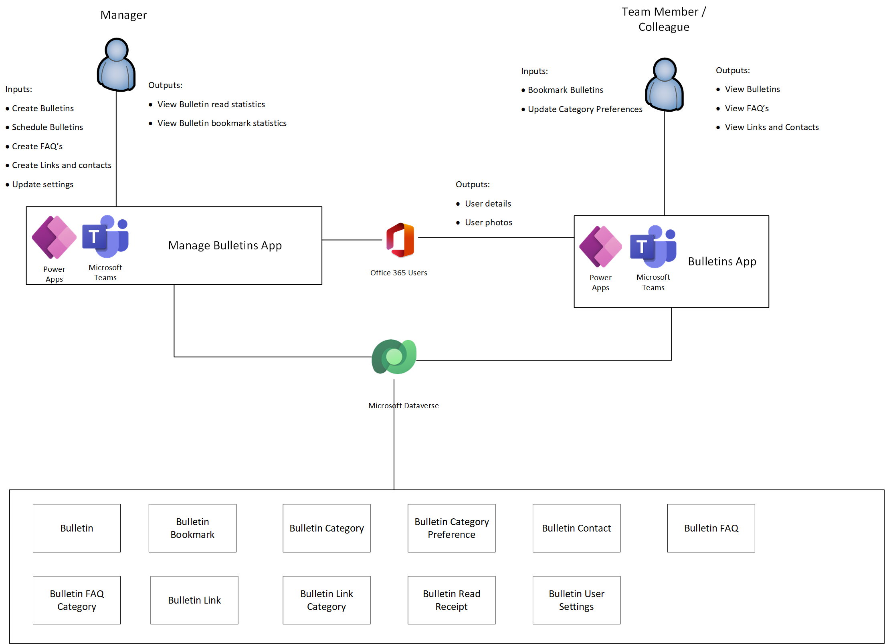
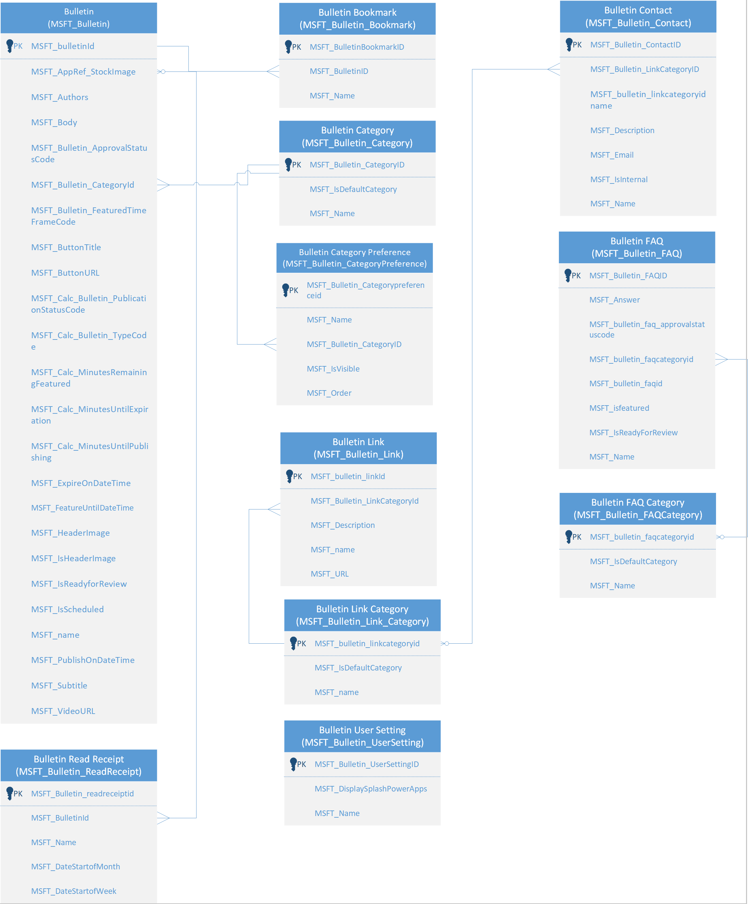

# Understand Bulletins sample app architecture

In this article, you'll learn about the collections and global variables used by the [Manage Bulletins](bulletins.md#manage-bulletins-app) and [Bulletins](bulletins.md#bulletins-app) apps, and understand how to use them effectively. If you want to learn more about how to install, and use the Bulletins sample app instead, go to [Bulletins sample app](bulletins.md).

## Prerequisites

To understand and use information in this article, you'll need to know about different controls, features, and capabilities of canvas apps.

- [Create and update a collection in a canvas app](../maker/canvas-apps/create-update-collection.md)
- [Collect, Clear, and ClearCollect functions in Power Apps](../maker/canvas-apps/functions/function-clear-collect-clearcollect.md)
- [Understand canvas-app variables in Power Apps](../maker/canvas-apps/working-with-variables.md)
- [Add and configure a canvas-app control in Power Apps](../maker/canvas-apps/add-configure-controls.md)
- [Add a screen to a canvas app and navigate between screens](../maker/canvas-apps/add-screen-context-variables.md)

You'll also need to know about how to [install](use-sample-apps-from-teams-store.md), and [use](bulletins.md) Bulletins sample app.

## Architecture model

The following diagram illustrates the way that users and systems interact with data in the Bulletins solution

### Connectors

The following connectors are used in the Bulletins app:

- **Microsoft Dataverse** - used to read and write data in Dataverse.
- **Office 365 Users** - used to read Microsoft 365 user profile data.

## Data model

The following diagram explains the data model used by the Bulletins sample app.

### Tables

The section describes the tables contained in the Bulletins solution, along with their purpose.

| Table name                   | Description                                                  |
| ---------------------------- | ------------------------------------------------------------ |
| Bulletin                     | The primary table in the Bulletins solution. Primary Bulletin data is stored in this table. |
| Bulletin Read Receipt        | When a user views a bulletin, a read receipt record is created. |
| Bulletin Bookmark            | When a user bookmarks a bulletin, a record is created in Bulletin Bookmark. |
| Bulletin Category            | Bulletin Category provides the list of categories that can be associated with Bulletins. Since users in the app create, edit, and remove categories, a lookup table was used for categorization rather than a choice field. |
| Bulletin Category Preference | When a user changes the sort and display options for Bulletin Categories, records are created in Bulletin Category Preference table. |
| Bulletin FAQ                 | FAQ records are stored in the Bulletin FAQ table.            |
| Bulletin FAQ Category         | Bulletin FAQ Category provides the list of categories that can be associated with FAQs. Since users in the app create, edit, and remove categories, a lookup table was used for categorization rather than a choice field. |
| Bulletin Link                | Links created in the Bulletins app are stored in Bulletin Link table. |
| Bulletin Contact             | Contacts created in the Bulletins app are stored in the Bulletin Contact table. |
| Bulletin Link Category       | Bulletin Link Category provides the list of categories that can be associated with links and contacts in the Bulletins app. Since users in the app create, edit, and remove categories, a lookup table was used for categorization rather than a choice field. |
| Bulletin User Settings       | User settings, such as don't display the splash screen, are stored in the Bulletin User Settings table. |

## Manage Bulletins app

This section explains collections, and global variables used by the [Manage Bulletins](bulletins.md#manage-bulletins-app) app.

### Collections

Manage Bulletins app uses following collections.

| Collection name                   | Description                                                                                            | Where used                                                                      |
|-----------------------------------|--------------------------------------------------------------------------------------------------------|----------------------------------------------------------------------------------|
| colAppNewUserCategoies            | App only collection, indicating a new user category was added.                                          | App OnStart                                                      |
| colCdsBulletinCategoryPreferences | Collection to collect the User’s category preferences from the **My Bulletin Category Preferences** view. | App OnStart                                                      |
| colCdsBulletinUserSettings        | Collection to collect the User setting record from the **My Bulletin Category Preferences** view.           | App OnStart                                                      |
| colCdsBulletinBookmarks           | Collection to collect the bookmarked bulletins record from the **My Bulletin bookmarks** view.              | App OnStart                                                      |
| colCdsBulletinReadReceipts        | Collection to collect the read receipts record from the **My Bulletin Read Receipts** view.                 | App OnStart                                                      |
| colCdsBulletinCategories          | Collection to collect the active bulletin categories from the **Active Bulletin** categories.               | App OnStart                                                      |
| colCdsBulletins                   | Collection to collect the list of published bulletins from the **Publication Group: Published** view.       | App OnStart                                                      |
| colStockImages                    | Collection to collect the stock images used in the app.                                                 | App OnStart                                                      |
| colLocalization                   | Used to build a localization collection based on the user language.                                     | App OnStart                                                      |
| colUserImages                     | Collection used to store the **UserImage** and **Username**.                                                    | OnHidden property of Bulletins Screen, FAQs Screen, and Links and Contacts screen. |

### Global Variables

Manage Bulletins app uses following global variables.

| Variable Name                   | Type    | Description                                                                 |
|---------------------------------|---------|-----------------------------------------------------------------------------|
| gblAppLoaded                    | Boolean | To check whether the app is loaded completely.                               |
| gblUserLanguage                 | Text    | To check the logged in user’s language.                                      |
| gblPadding                      | Record  | Used to set padding values in the app.                                       |
| gblUser                         | Record  | Variable to get user record for the context.                                     |
| gblUserFirstName                | Text    | Variable to get the first name of the user.                                  |
| gblAppMenu                      | Record  | Variable to store the label, width, and the screen name for the menu records. |
| gblAppSetting_inputMobileOnWeb  | Boolean | Variables to scale fonts for mobile-oriented apps, running in desktop devices.       |
| gblAppSetting_inputMobile       | Boolean | Variables to scale fonts for mobile-oriented apps.                           |
| gblAppSetting_inputScaleFontsby | Number  | Use this variable for scaling all fonts by a fixed amount.                   |
| gblThemeDark                    | Boolean | To check whether the Teams theme is set to Dark.                             |
| gblThemeHiCo                    | Boolean | To check whether the Teams theme is set to High Contrast.                    |
| gblAppColors                    | Record  | Variable to set the color value in the app.                                  |
| gblAppSizes                     | Record  | Variable to set the color value in the app.                                  |
| gblAppStyles                    | Record  | Variable to set the styling values in the app.                               |

#### OnStart execution details

1. When a user accesses the app, **gblAppLoaded** is set to false. The user’s language code is stored in **gblUserLanguage**, with English - US being the default one.
2. The user’s language is then used to collect localized text used throughout the app (for example, label and button text) in **colLocalization**.
3. User details from Bulletin User Settings table is collected in **colUserSettings**. If no records exist, a new Bulletin user setting record is created. This in turn controls the visibility of the splash dialog. If there are multiple project user settings record exist, the oldest record is selected and stored in the **gblRecordUserSettings** variable.

### Bulletins screen

This section explains bulletins screen execution details. There are no collections or variables used by the bulletins screen.

#### Bulletins screen execution details

This screen will mainly show the information of Bulletins retrieved from Dataverse table **Bulletins**. The bulletins are divided in to two types that are **Draft** and **Published**.  **GalBulletins_Drafts_Records** and **galBulletins_Published_Records** galleries data sources will be pointed to Dataverse table views that will filter the records based on its status, such as draft or published.

### Bulletin details screen

#### Creating a new bulletin

This section explains collections, global variables, and execution details used when creating a new bulletin.

#### New bulletin collections

Collections used by new bulletin screen:

| Collection name | Description                     |
| --------------- | ------------------------------- |
| colStockImages  | Collection to hold stock images |

#### New bulletin variables

Variables used by new bulletin screen:

| Variable name | Description |
| - | - |
|  gblRecordBulletin              | Global variable record to store the newly entered bulletin’s details|
|  locBlockUserInput              | Local variable to control restrictions for App user when there's a functionality that is specific to team owner. |
|  locVisibleDialogReadyForReview | Local variable to set the visibility of the dialog showing confirmation once a bulletin is created                |
| locVisibleDialog                | Local variable to set the visibility of a dialog|
| varValidCategory                | Variable to check if the category is blank or not|
| varValidTitle                   | Variable to check if the title is blank or not|
| varValidDescription             | Variable to check if the description(body) is blank or not|

#### New bulletin execution details

1. On selecting **New Bulletin** button from Bulletins screen, **gblRecordBulletin** is set to blank, so it gets updated when the user fills in the Bulletins information such as title, sub title, Image, category, or description and saves the information
2. Once the required information is filled the **Save** button gets activated. **varValidCategory , varValidTitle, and **varValidDescription** variables are used to know if the required fields contains data or not.
3. When **Save** button is pressed,  a bulletin record will get created with either **Draft** state or **Pending** state based up on the status value selection of the **Ready for Review** checkbox.
4. Once the save process is complete, a dialog confirming the action will be shown using the variables **locVisibleDialogReadyForReview** and **locVisibleDialog**.
5. If the newly created bulletin is marked **Ready for Review**, its status will be **Pending** and the team owner needs to approve it and publish it before it's visible to users in the Bulletins app. If the bulletin isn't flagged as ready for review, it will be in **Draft** state so the user can make updates to the bulletin.

### Updating a bulletin

This section describes the collections and variables used when a bulletin is updated, and the execution details of updating a bulletin.

#### Bulletin update collections

Collections used during the update of a bulletin:

| Collection name | Description                     |
| --------------- | ------------------------------- |
| colStockImages  | collection to hold stock images |

#### Bulletin update variables

Variables used during the update of a bulletin:

| Variable name                  | Description                                                  |
| ------------------------------ | ------------------------------------------------------------ |
| gblRecordBulletin              | Global variable record to store the selected draft bulletin. |
| locBlockUserInput              | Local variable to control restrictions for App user when there's a functionality that is specific to team owner. |
| locVisibleDialogReadyForReview | Local variable to set the visibility of the dialog showing confirmation once a bulletin is created. |
| locVisibleDialog               | Local variable to set the visibility of a dialog.            |
| varValidCategory               | Variable to check if the category is blank or not.           |
| varValidTitle                  | Variable to check if the title is blank or not.              |
| varValidDescription            | Variable to check if the description(body) is blank or not.  |
| varDirtyCategory               | Variable to check if the category selected isn't the same as before. |
| varDirtyTitle                  | Variable to check if the title entered isn't the same as before. |
| varDirtySubtitle               | Variable to check if the subtitle entered isn't the same as before. |
| varDirtyBody                   | Variable to check if the body/description entered isn't the same as before. |
| varDirtyStockImage             | Variable to check if the stock image selected isn't the same as before. |
| varDirtyImage -                | Variable to check if the image selected isn't the same as before. |
| varDirtyVideoUrl               | Variable to check if the video URL entered isn't the same as before. |
| varDirtyReadyForReview         | Variable to check if ready for review is selected same as previous. |
| varDirtyScheduled              | Variable to check if scheduled is selected same as previous. |
| varDirtyScheduleOn             | Variable to check if the scheduled on date isn't the same as before. |
| varDirtyFeaturedUntil          | Variable to check if the featured until date isn't the same as before. |
| varDirtyButtonTitle            | Variable to check if the button title entered isn't the same as before. |
| varDirtyButtonUrl              | Variable to check if the button url isn't the same as before. |
| varDirtyAuthors -              | Variable to check if the authors aren't the same as before  |

#### Bulletin update execution details

1. On Selecting any Draft bulletin from Bulletin’s screen, **gblRecordBulletin** is set to the bulletin selected, and gets updated as the user updates the Bulletin information, such as title, sub title, image, category, and description in Bulletin Detain Screen.

2. The user can make updates to the Bulletin information, and the save button will be activated only if there's any valid change in data. This validation uses the **varDirtyCategory, varDirtyTitle, varDirtySubtitle, varDirtyBody, varDirtyStockImage, varDirtyImage, varDirtyVideoUrl, varDirtyReadyForReview, varDirtyScheduled, varDirtyScheduleOn, varDirtyFeaturedUntil, varDirtyButtonTitle, varDirtyButtonUrl,** and **varDirtyAuthors** variables

3. The process also verifies that required fields on for bulletins aren't blank before activating the save button. This is controlled by checking the required fields contains data with the help of **varValidCategory**, **varValidTitle**, and **varValidDescription**.

4. Updating the mandatory field to blank won't be treated as an update.

5. Once a valid update is made then the **Save** button gets activated.

6. When the **Save** button is pressed, the bulletin record will get updated and once the update process is complete a dialog confirming the action will be shown using the variables **locVisibleDialogReadyForReview** and **locVisibleDialog**.

### Bulletin overview screen

#### Publishing a bulletin

This section explains bulletin overview screen global variables and execution details used when a bulletin is published. No collections are involved in the bulletin publish process.

#### Bulletin publish variables

Variables used when a bulletin is published:

| Variable name     | Description                                                                                                                    |
| ----------------- | ------------------------------------------------------------------------------------------------------------------------------ |
| gblRecordBulletin | Global variable record to store the selected draft bulletin                                                                    |
| locBlockUserInput | Local variable to control restrictions for App user when there's a functionality that is specific to team owner.              |
| varPublishOnDate  | Local variable to store scheduled date and time if bulletin have a schedule date and time else to store current date and time. |

#### Bulletin publish execution details

1. Once a team owner selects any bulletin from the draft list the **gblRecordBulletin** stores the selected draft bulletin and opens the record in the Bulletin Details Screen

2. The **Publish** button will be enabled. If the user isn't a team owner, the same button will be disabled and this is controlled with the help of **locBlockUserInput,**

3. When the **Publish** button is selected, the approval status of the bulletin is updated to **Approved** and the published on date will be either scheduled date and time if scheduled date contains data or the current date and time. This is updated with the help of **varPublishOnDate.**

4. Once published, the app will navigate back to bulletins screen and the published bulletin can be seen in the **Published** list as long as the current date is on or after the **published on** date.

#### Deleting a published bulletin

This section explains bulletin overview screen global variables and execution details used when a bulletin is deleted. No collections are involved in the bulletin deletion process.

#### Bulletin delete variables

Variables used when a bulletin is deleted:

| **Variable name**      | **Description**                                              |
| ---------------------- | ------------------------------------------------------------ |
| gblRecordBulletin      | Global  variable record to store the selected draft bulletin. |
| locStatsViews          | Local  variable to store number of views for the selected bulletin. |
| LocStatsBookmarks      | Local variable  to store number of bookmarks for the selected bulletin. |
| locVisibleDialog       | Local  variable to set the visibility of a dialog.           |
| locVisibleDialogDelete | Local  variable to set the visibility of a dialog            |

#### Bulletin delete execution details

1. When a user selects any published bulletin from Bulletin screen, the selected bulletin will be stored at a global variable **gblRecordBulletin.**
2. The app will navigate to overview screen where the stats of the Bulletin are displayed with the help of **locStatsViews** and **locStatsBookmarks** .
3. User can unpublish, delete, or edit the bulletin from this screen.
4. If the user selects **Delete**, a dialog appears asking for confirmation. The visibility of this dialog is controlled by using **locVisibleDialog** and **locVisibleDialogDelete.**
5. The user needs to check the **I understand** checkbox to activate the **Delete** button.
6. On select of delete button, the bulletin that matches **gblRecordBulletin** will be deleted from Dataverse.

### FAQs screen

#### Displaying FAQ records

This section explains the variables and execution details used when displaying an FAQ on the FAQ screen. There are no collections involved in this process.

#### FAQ view variables

The following are the variables used when a FAQ is viewed from the FAQ screen.

| **Variable name**    | **Description**                                              |
| -------------------- | ------------------------------------------------------------ |
| gblRecordBulletinFAQ | Global variable  record to store the selected Bulletin FAQ.  |
| locBlockUserInput    | **L**ocal variable to control  restrictions for App user when there's a functionality that is specific to  team owner. |

#### FAQ view execution variables

This screen will mainly show the information of FAQs retrieved from Dataverse table **Bulletin FAQs**. The FAQs are displayed as a table list with the key information. User can select on any of the FAQs to navigate to FAQ Detail screen to view the FAQ in more detail.

### FAQ detail screen

#### Creating an FAQ

This section explains the variables and execution details used when creating an FAQ on the FAQ detail screen. There are no collections involved in this process.

#### FAQ creation variables

The following are the variables used when an FAQ is created from the FAQ detail screen:

| Variable name                  | Description                                                  |
| ------------------------------ | ------------------------------------------------------------ |
| gblRecordBulletinFAQ           | Global variable record to store the newly entered Bulletin FAQ. |
| locBlockUserInput              | Local variable to control restrictions for App user when there's a functionality that is specific to team owner. |
| locVisibleDialogReadyForReview | Local variable to set the visibility of the dialog showing confirmation once a bulletin is created. |
| locVisibleDialog               | Local variable to set the visibility of a dialog.            |
| varValidCategory               | Variable to check if the category is blank or not.           |
| varValidTitle                  | Variable to check if the title is blank or not.              |
| varValidDescription            | Variable to check if the description(body) is blank or not.  |

#### FAQ creation execution details

1. Once a user selects any Bulletin FAQ from FAQ’s screen, the selected Bulletin FAQ will be stored at a global variable **gblRecordBulletinFAQ.** 
2. The Bulletin FAQ details like category, question, and answer are displayed using **gblRecordBulletinFAQ**. 
3. If the user makes any changes to the Bulletin FAQ, then the **Save** button gets activated. This is known with the help of **varDirtyCategory, varDirtyQuestion, varDirtyAnswer, varDirtyReadyForReview, varDirtyFeatured variables**. 
4. Once saved, the Bulletin FAQ moves to Draft state if "Ready for review" is marked as "No" else Bulletin FAQ moves to pending state if ‘Ready for review’ is marked as ‘Yes’. So Team owners can approve them to publish.

#### Updating an FAQ

This section explains the variables and execution details used when updating an FAQ on the FAQ detail screen. There are no collections involved in this process.

#### FAQ update variables

The following are the variables used when an FAQ is updated from the FAQ detail screen:

| Variable name        | Description                                                |
| -------------------- | ---------------------------------------------------------- |
| gblRecordBulletinFAQ | Global variable record to store the selected Bulletin FAQ. |

#### FAQ update execution details

1. When a user selects any Bulletin FAQ from **FAQs** screen, the selected Bulletin FAQ will be stored at a global variable **gblRecordBulletinFAQ.**

2. The Bulletin FAQ details like category, question, and answer are displayed using **gblRecordBulletin.**

3. If the user makes any changes to the Bulletin FAQ the **Save** button gets activated. This validation uses the **varDirtyCategory, varDirtyQuestion, varDirtyAnswer, varDirtyReadyForReview, varDirtyFeatured** variables.
4. Once saved, the Bulletin FAQ moves to draft state if **Ready for review** is marked as **No.** Otherwise, Bulletin FAQ moves to pending state if **Ready for review** is marked as **Yes**.

#### Publishing an FAQ

This section explains the variables and execution details used when publishing an FAQ on the FAQ detail screen. There are no collections involved in the process.

#### FAQ publish variables

The following are the variables used when an FAQ is published from the FAQ detail screen:

| Variable name        | Description                                                  |
| -------------------- | ------------------------------------------------------------ |
| gblRecordBulletinFAQ | Global variable record to store the newly entered Bulletin FAQ. |
| locBlockUserInput    | Local variable to control restrictions for App user when there's a functionality that is specific to team owner. |

#### FAQ publish execution details

1. Once a team owner selects any bulletin from **Drafts** list the **gblRecordBulletinFAQ** stores the selected draft Bulletin FAQ and opens the record in the **FAQ Detail Screen**.
2. The **Publish** button will be enabled. If the user isn't a team owner the same button will be disabled and this is controlled with the help of **locBlockUserInput.**
3. On selecting **Publish** button, the approval status of the Bulletin FAQ gets updated to **Approved.**
4. Once published the app will navigate back to FAQs screen and the same Bulletin FAQ’s Approval status can be seen as **Approved**.

#### Deleting an FAQ

This section explains the variables and execution details used when deleting an FAQ on the FAQ detail screen. There are no collections involved in the process.

#### FAQ deletion variables

| Variable name        | Description                                                  |
| -------------------- | ------------------------------------------------------------ |
| gblRecordBulletinFAQ | Global variable record to store the newly entered Bulletin FAQ. |
| locBlockUserInput    | Local variable to control restrictions for App user when there's a functionality that is specific to team owner. |

#### FAQ delete execution details

1. Once a user selects an FAQ from FAQs screen, the selected bulletin will be stored at a global variable **gblRecordBulletinFAQ** and the record will be opened in the **FAQ Detail Screen**.
2. The bulletin details will be displayed using **gblRecordBulletinFAQ.**
3. Based upon the user's access the user can update or delete the selected Bulletin FAQ from this screen.
4. If the user selects **Delete**, a dialog appears asking for confirmation, the visibility of this dialog is controlled by using **locVisibleDialog** and **locVisibleDialogDelete.**
5. The user needs to check the **I understand** checkbox to activate the **Delete** button.
6. On select of **Delete** button the Bulletin FAQ row from Dataverse that matches with **gblRecordBulletinFAQ** will be deleted.

### Links and Contacts Screen

#### Displaying bulletin links and bulletins contacts

This section explains the execution details used when viewing links and contacts. There are no collections or variables involved in the process.

#### Link and contact view execution details

1. This screen will mainly show the information of Links and Contacts related to their categories using Dataverse tables **Bulletin Links**, **Bulletin Contacts** and **Bulletin Link Categories.**
2. User can search the needed **Bulletin Links**, **Bulletin Contacts** and **Bulletin Link Categories** by using search box and the results will be filtered in the respective galleries.
3. Using **launch** function, the links will be opened in a separate browser tab.

### Links Details Screen

#### Creating a new Bulletin Link

This section explains the variables and execution details used when creating a link from the link detail screen. There are no collections involved in the process.

#### Link creation variables

The following are the variables used when a link is created:

| Variable name         | Description                                                  |
| --------------------- | ------------------------------------------------------------ |
| gblRecordBulletinLink | Global variable record to store the newly created Bulletin Link. |
| locBlockUserInput     | local variable to control restrictions for App user when there's a functionality that is specific to team owner. |

#### Link creation execution details

1.  When **Add a link** button is selected from **Links and contacts** screen, **gblRecordBulletinLink** is set to blank, so it gets updated when the user fills the Bulletin Link information such as Title, Category, Description & URL and saves it.
2. Once the required information is filled then the **Save** button gets activated. **varValidCategory, varValidTitle and varValidURL** variables are used to know if the required fields contain data or not.
3. When **Save** button is selected, a new Bulletin Link record will get created and the **gblRecordBulletinLink** global variable is set to the newly created record. Once the save process is complete, the app navigates to **Links and Bulletins** screen.

#### Updating a Bulletin Link

This section explains the variables and execution details used when updating a link from the link detail screen. There are no collections involved in the process.

#### Link update variables

The following are the variables used when a link is updated

| Variable name         | Description                                                  |
| --------------------- | ------------------------------------------------------------ |
| gblRecordBulletinLink | Global variable record to store the newly created Bulletin Link. |
| locBlockUserInput     | local variable to control restrictions for App user when there's a functionality that is specific to team owner. |

#### Link update execution details

1. Once a user selects any Bulletin Link from Links and Contacts screen, the selected Bulletin Link will be stored at a global variable **gblRecordBulletinLink.**
2. The Bulletin Link details like title, category, URL, and description are displayed using **gblRecordBulletin** in **Link Details Screen**.
3. If the user makes any changes to the Bulletin Link, then the **Save** button becomes active. This validation is facilitated by  **varDirtyCategory, varDirtyTitle, varDirtyDescription and varDirtyURL** variables that check if the details aren't same as previously saved. Further it also validates if mandatory information is filled to activate **Save** button with the help of **varValidCategory, varValidTitle and varValidURL** variables that check the mandatory fields are filled. 
4. Once the Save process is complete the app navigates to Links and Bulletins screen.

#### Deleting a Bulletin Link

This section explains the variables and execution details used when deleting a link from the link detail screen. There are no collections involved in the process.

#### Link deletion variables

The following are the variables used when a link is deleted.

| Variable name         | Description                                                  |
| --------------------- | ------------------------------------------------------------ |
| gblRecordBulletinLink | Global variable record to store the selected Bulletin Link.  |
| locBlockUserInput     | local variable to control restrictions for App user when there's a functionality that is specific to team owner. |

#### Link deletion execution details

1. Once a user selects any Bulletin Link from Links and Bulletins screen, the selected Bulletin Link will be stored at a global variable **gblRecordBulletinLink.**
2. The Bulletin Link details like title, category, URL, and description are displayed using **gblRecordBulletin** in **Link Details Screen**.
3. If the user is a team owner, then the user can see **Delete** button this is identified by using the variable **locBlockUserInput.**
4. If the user selects **Delete** then a dialog appears asking for confirmation, the visibility of this dialog is controlled by using **locVisibleDialog** and **locVisibleDialogDelete.**
5. The user needs to check the **I understand** checkbox to activate the **Delete** button.
6. When the **Delete** button is selected,  the link row from Dataverse that matches with **gblRecordBulletinLink** will be deleted.
7. Once the Delete process is complete the app navigates to Links and Bulletins screen.

### Contact Details Screen

#### Creating a new Bulletin Contact

This section explains the variables and execution details used when creating a new contact from the contact detail screen. There are no collections involved in the process.

###  Contact creation variables

| Variable name            | Description                                                  |
| ------------------------ | ------------------------------------------------------------ |
| gblRecordBulletinContact | Global variable record to store the selected Bulletin Contact. |
| locBlockUserInput        | local variable to control restrictions for App user when there's a functionality that is specific to team owner. |

#### Contact creation execution details

1. When **Add Contact** button is selected from Links and contacts screen, **gblRecordBulletinContact** is set to blank, so it can be updated when the user fills the contact information and saves it.
2. Once the required information is filled then the **Save** button gets activated. **varValidCategory, varValidName, varValidEmail and varValidDescription** variables are used to know if the required fields contain data or not.
3. When **Save** button is selected, , a new Bulletin Contact record will get created and the **gblRecordBulletinContact** global variable is set to the newly created record.
4. Once the save process is complete the app navigates to Links and Bulletins screen.

### Updating a Bulletin Contact

This section explains the variables and execution details used when updating a contact from the contact detail screen. There are no collections involved in the process.

####  Contact update variables

The following variables are used in the contact update process:

| Variable name            | Description                                                  |
| ------------------------ | ------------------------------------------------------------ |
| gblRecordBulletinContact | Global variable record to store the selected Bulletin Contact. |
| locBlockUserInput        | local variable to control restrictions for App user when there's a functionality that is specific to team owner. |

#### Contact update execution details

1. Once a user selects any contact from Links and Contacts screen, the selected Bulletin Contact will be stored at a global variable **gblRecordBulletinContact.**
2. The Bulletin Contact details like name, category, email, and description are displayed using **gblRecordBulletinContact** in **Contact Details Screen**. The fields displayed will be different depending on whether the contact is an internal or external contact.
3. If the user makes any changes to the Bulletin Contact, then the **Save** button gets activated. This validation is facilitated by the **varDirtyCategory, varDirtyName, varDirtyEmail, varDirtyDescription and varDirtyInternal** variables that check if the details aren't same as previously saved. Further it also validates if mandatory information is filled to activate **Save** button with the help **varValidCategory, varValidName, varValidEmail and varValidDescription** variables that check the mandatory fields are filled. 
4. Once the Save process is complete the app navigates to Links and Bulletins screen.

### Deleting a Bulletin Contact

This section explains the variables and execution details used when deleting a contact from the contact detail screen. There are no collections involved in the process.

####  Contact deletion variables

The following variables are used in the contact deletion process:

| Variable name            | Description                                                  |
| ------------------------ | ------------------------------------------------------------ |
| gblRecordBulletinContact | Global variable record to store the selected Bulletin Contact. |
| locBlockUserInput        | local variable to control restrictions for App user when there's a functionality that is specific to team owner. |

#### Contact update execution details

1. Once a user selects any Bulletin Contact from Links and Bulletins screen, the selected Bulletin Link will be stored at a global variable **gblRecordBulletinContact.**
2. The Bulletin Contact details are displayed using **gblRecordBulletinContact**. 
3. If the user is a team owner, then the user can see **Delete** button this is identified by using the variable **locBlockUserInput.**
4. If the user selects **Delete** then a dialog appears asking for confirmation, the visibility of this dialog is controlled by using **locVisibleDialog** and **locVisibleDialogDelete.**
5. The user needs to check the **I understand** checkbox to activate the **Delete** button.
6. On selecting **Delete** button the Bulletin Link record from Dataverse that matches with **gblRecordBulletinContact** will be deleted.
7. Once the delete process is complete the app navigates to Links and Contacts screen.

### About screen

This section describes the variables used when navigating the **About** screen.

#### About screen navigation execution details

1. Selecting the info icon the app navigates to **About Screen.**

2. There are help links available in the **galAbout_HelpLinks** gallery.

   Selecting **Learn how to customize this app** button navigates to an external link that explains on how to make customizations on the app. 

   Selecting **Send us your ideas** button navigates to an external link where ideas can be posted for the Milestones app.

   Selecting **Engage with community** button navigates to the Power Apps Community.

3. The **conAbout_AppVideo** container contains the video link that provides an overview of the Milestones app.

4. The gallery **galAbout_OtherApps** contains the links to other Microsoft apps. 

   Selecting **View app** button navigates to the app page in the Microsoft Teams app store.

   Selecting the **App Overview** button navigates to the App overview video on YouTube.

5. The **conAbout_Version** gives information about the app versioning.

### Settings Screen

#### Creating a new Bulletin Category

This section explains the variables and execution details used when creating a category from the settings screen. There are no collections involved in the process.

#### Bulletin category creation variables

The following variable is used what a category is created:

| Variable name     | Description                                                  |
| ----------------- | ------------------------------------------------------------ |
| locBlockUserInput | Local variable to control restrictions for App user when there's a functionality that is specific to team owner. |

#### Bulletin category creation execution details

1. When **Add category** button is selected under Bulletin categories, a text input control is shown to enter the name of the Bulletin category.
2. Once the user enters the name the user can select either save button on cancel icon available next to this text box
3. On selection of **Save** icon a new Bulletin category record gets created in Dataverse.

#### Updating a Bulletin Category

This section explains the collections, variables, and execution details used when updating a category from the settings screen.

#### Bulletin category update collections

The following collection is used what a category is updated:

| Collection name           | Description                                               |
| ------------------------- | --------------------------------------------------------- |
| colUpdateBulletinCategory | Collection of bulletin categories that need to be updated |

#### Bulletin category update variables

The following variable is used what a category is updated:

| Collection name   | Description                                                  |
| ----------------- | ------------------------------------------------------------ |
| locBlockUserInput | Local variable to control restrictions for app user when there's a functionality that is specific to team owner. |

#### Bulletin category update execution details

1. On change of any bulletin category, the bulletin category ID and the name of the bulletin category are added to **colUpdateBulletinCategory** collection and the "Update"’" button become active.
2. On selecting **Update** button, the Bulletin categories that have changes in their name will get updated.

### Deleting a Bulletin Category

This section explains the collections, variables, and execution details used when deleting a category from the settings screen. 

#### Bulletin category deletion collections

The following collections are used what a category is deleted:

| Collection name           | Description                                                  |
| ------------------------- | ------------------------------------------------------------ |
| colDeleteBulletinCategory | Collection of bulletin categories that needs to get deleted. |
| colReparentBulletins      | Collection of Bulletins that has no associated bulletin category. These are the bulletins that are associated to the deleted bulletin category. |

#### Bulletin category deletion variable

The following variable is used what a category is updated:

| Collection name   | Description                                                  |
| ----------------- | ------------------------------------------------------------ |
| locBlockUserInput | Local variable to control restrictions for app user when there's a functionality that is specific to team owner. |

#### Bulletin category deletion execution details

1. On selecting the **delete** icon for any bulletin category, the category gets added to **colDeleteBulletinCategory** collection and the **Update** button gets activated.
2. On selecting **Update** button, the categories that are collected at **colDeleteBulletinCategory** will get deleted from Dataverse
3. The bulletins that are associated to the deleted bulletin categories are collected in **colReparentBulletins** and will get updated with the default category.

### Creating a new Bulletin FAQ Category

This section explains the variables and execution details used when creating an FAQ category from the settings screen. 

#### FAQ category creation variables

The following variables are used what an FAQ category is created:

| Variable name     | Description                                                  |
| ----------------- | ------------------------------------------------------------ |
| locBlockUserInput | Local variable to control restrictions for App user when there's a functionality that is specific to team owner. |

#### FAQ category creation execution details

1. On selecting **Add category** button under FAQ categories, a text input control is shown to enter the name of the FAQ category.
2. Once the user enters the name the user can select either **save** button or **cancel** icon available next to this text box.
3. On selection of **Save** icon a new Bulletin FAQ category record gets created in Dataverse.

### Updating a Bulletin FAQ Category

This section explains the collections, variables, and execution details used when updating an FAQ category from the settings screen. 

#### FAQ category update collections

The following collection is used in the update of FAQ categories:

| Collection name              | Description                                                 |
| ---------------------------- | ----------------------------------------------------------- |
| colUpdateBulletinFAQCategory | Collection of bulletin categories that needs to get updated |

 

#### FAQ category update variables

The following variables are used what an FAQ category is created:

| Variable name     | Description                                                  |
| ----------------- | ------------------------------------------------------------ |
| locBlockUserInput | Local variable to control restrictions for App user when there's a functionality that is specific to team owner. |

#### FAQ category update execution details

1. On change of any FAQ category, the bulletin FAQ category ID and the name of the bulletin FAQ category are added to **colUpdateBulletinFAQCategory** collection and the **Update** button is activated.
2. On selection of **Update** button, the bulletin FAQ categories that have changes in their name will get updated.

### Deleting a Bulletin FAQ Category

This section explains the collections, variables, and execution details used when deleting an FAQ category from the settings screen. 

#### FAQ category deletion collections

The following collections are used in the update of FAQ categories:

| Collection name              | Description                                                  |
| ---------------------------- | ------------------------------------------------------------ |
| colDeleteBulletinFAQCategory | Collection of bulletin categories that needs to get deleted. |
| colReparentFAQs              | Collection of Bulletins that has no associated bulletin category. These are the bulletins that are associated to the deleted bulletin category. |

#### FAQ category deletion variables

The following variables are used in the deletion of FAQ categories:

| Variable name     | Description                                                  |
| ----------------- | ------------------------------------------------------------ |
| locBlockUserInput | Local variable to control restrictions for App user when there's a functionality that is specific to team owner. |

#### FAQ category deletion execution details

1. On selection of the **Delete** icon for any bulletin category, the bulletin category gets added to **colDeleteBulletinFAQCategory** collection and the **Update** button gets activated.
2. On selection of the  **Update** button, the bulletin categories that are collected at **colDeleteBulletinFAQCategory** will get deleted from Dataverse.
3. The bulletins that are associated to the deleted bulletin categories are collected at **colReparentFAQs** and will get updated with the default category.

### Creating a new Bulletin Link Category

This section explains the collections, variables, and execution details used when creating a bulletin link category from the settings screen. 

#### Bulletin link category creation variables

The following variable is used in the deletion of FAQ categories:

| Variable name     | Description                                                  |
| ----------------- | ------------------------------------------------------------ |
| locBlockUserInput | Local variable to control restrictions for App user when there's a functionality that is specific to team owner. |

#### Bulletin link category creation execution details

1. On selection of **Add category** button under Link categories, a text input control is shown to enter the name of the Link category.
2. Once the user enters the name the user can select either save button on **cancel** icon available next to this text box.
3. On selection of **Save** icon a new bulletin link category record gets created in Dataverse.

### Updating a bulletin link category

This section explains the collections, variables, and execution details used when updating a bulletin link category from the settings screen. 

#### Bulletin link category update collections

The following collection is used in the update of bulletin link categories:

| Variable name                 | Description                                                 |
| ----------------------------- | ----------------------------------------------------------- |
| colUpdateBulletinLinkCategory | Collection of bulletin categories that needs to get updated |

####  Bulletin link category update variables

The following collection is used in the update of bulletin link categories:

| Variable name     | Description                                                  |
| ----------------- | ------------------------------------------------------------ |
| locBlockUserInput | Local variable to control restrictions for App user when there's a functionality that is specific to team owner. |

#### Bulletin link category update execution details

1. On change of any FAQ category, the bulletin link category ID and the name of the bulletin link category are added to **colUpdateBulletinLinkCategory** collection and the **Update** button gets activated.
2. On selecting **Update** button, the Bulletin Link categories that have changes in their name will get updated.

### Deleting a bulletin link category

This section explains the collections, variables, and execution details used when deleting a bulletin link category from the settings screen. 

#### Bulletin link category deletion collections

The following collection is used in the deletion of bulletin link categories:

| Variable name                 | Description                                                  |
| ----------------------------- | ------------------------------------------------------------ |
| colDeleteBulletinLinkCategory | Collection of bulletin categories that needs to get deleted. |
| colReparentLinks              | collection of Bulletins that has no associated bulletin category. These are the bulletins that are associated to the deleted bulletin category. |

####  Bulletin link category deletion variables

The following collection is used in the deletion of bulletin link categories:

| Variable name     | Description                                                  |
| ----------------- | ------------------------------------------------------------ |
| locBlockUserInput | Local variable to control restrictions for App user when there's a functionality that is specific to team owner. |

#### Bulletin link category deletion execution details

1. On selecting the **Delete** icon for any Bulletin category, the Bulletin category gets added to **colDeleteBulletinLinkCategory** collection and the **Update** button gets activated.

2. On selecting **Update** button, the Bulletin categories that are collected at **colDeleteBulletinLinkCategory** will get deleted from Dataverse

3. The bulletins that are associated to the deleted bulletin categories are collected at **colReparentLinks** and will get updated with the default category.

 

## Bulletins app

This section explains collections, global variables used by the  [Bulletins](bulletins.md#bulletins-app) app, and the execution details for each screen.

### App OnStart

This section explains app OnStart collections, variables, and execution details.

#### OnStart collections

Collections used during app OnStart:

| Collection name | Description |
| - | - |
| colStockImages | Collection of stock cover images. |
| colLocalization | Collection of localized text based on user’s    language.  |
| colCdsBulletins | Collection to hold bulletins data from Dataverse. |
| colCdsBulletinCategories | Collection to hold bulletin categories data from Dataverse. |
| colCdsBulletinReadReceipts | Collection to hold bulletin read receipts data from Dataverse. |
| colCdsBulletinBookmarks | Collection to hold bulletin bookmarks data from Dataverse. |
| colCdsBulletinUserSettings | Collection to hold bulletin user settings data from Dataverse. |
| colCdsBulletinCategoryPreferences | Collection to hold bulletin category preferences data from Dataverse. |
| colAppNewUserCategories | Collection to store user preferences. |

#### OnStart variables

Variables used during app OnStart:

| Variable name | Description |
| - | - |
| gblAppLoaded | Global variable used to check if the app is loaded or not. |
| gblUserLanguage | Global variable that holds the user’s local language. |
| gblPadding | Global variable that holds the padding details of the app. |
| gblUser | Global variable to hold the user record for context. |
| gblUserFirstName | Global variable to hold the first name of the user. |
| gblAppMenu | Global variable to hold the menu details. |

#### OnStart execution details

1. When a User loads the app, the **gblAppLoaded** variable is set to false. The user’s language code is stored in the **gblUserLanguage** variable, with "English - US" as the default.

1. The user’s language is then used to collect localized text used throughout the app (such as label and button text) in the **colLocalization** collection.

1. While continuing to load, the app collects the data from Dataverse, and stores it into the following collections.

    - colCdsBulletins
    - colCdsBulletinCategories
    - colCdsBulletinReadReceipts
    - colCdsBulletinBookmarks
    - colCdsBulletinUserSettings
    - colCdsBulletinCategoryPreferences

1. The stock images are collected to the **colStockImages** collection that helps the user to pick any images for the bulletin’s cover.

1. The menu details on various screens of the app are collected to
    the **gblAppMenu** variable that helps to create the menu as per the screen.

1. The user preferences are collected to the **colAppNewUserCategories** collection that  helps the user to have a personalized experience of the app as it shows the bulletins based on the user bulletin category preferences.

### Home screen

This section explains app home screen collections, variables, and execution details.

#### Home screen collections

Collections used by the home screen:

| Collection name | Description |
| - | - |
| colCdsBulletins | Collection to hold bulletins data from Dataverse. |
| colCdsBulletinBookmarks | Collection to hold bulletin bookmarks data from Dataverse. |
| colCdsBulletinCategoryPreferences | Collection to hold bulletin category preferences data from Dataverse. |

#### Home screen variables

Variables used by the home screen:

| Variable name | Description |
| - | - |
| gblUser | Global variable to hold the User record for context. |
| gblUserFirstName | Global variable to hold the first name of the user. |
| locVisibleDialog | Local variable used to show and hide the dialog pop-up. |
| locVisibleDialogBulletinReader | Local variable used to show and hide a bulletin. |
| locBulletinRecord | Local variable used to store the selected bulletin record. |
| locBulletinBody | Local variable used to store the selected bulletin’s  body. |

#### Home screen execution details

1. Using the collections **colCdsBulletins** and
    **colCdsBulletinCategoryPreferences**, the screen is loaded with the
    published bulletins. More information: [Understand the Bulletins app user interface](bulletins.md#understand-the-bulletins-app-user-interface)

1. User can search any bulletin by the name or category of the bulletin using
    the search box available on this screen.

1. Galleries are filtered depending on the search terms.

1. Once the user selects a bulletin, a dialog pop-up shows using the
    variables **locVisibleDialog** and **locVisibleDialogBulletinReader.**

1. The dialog shows the information of selected bulletin that includes
    image, video, and body from the bulletin record using the variables
    **locBulletinRecord** and **locBulletinBody**. More information: [View a post](bulletins.md#view-a-post)

1. To close the dialog, user can select the close button, or the empty space around the dialog. This action sets the
    **locVisibleDialog** and **locVisibleDialogBulletinReader** variables to *false* hiding the dialog pop-up.

### FAQs screen

This section explains app FAQs screen collections, variables, and execution details.

#### FAQs screen collections

FAQs screen doesn't use any collections.

#### FAQs screen variables

Variables used by the home screen:

| Variable name | Description |
| - | - |
| locVisibleDialog | Local variable used to show and hide the dialog pop-up. |

#### FAQs screen execution details

1. This screen will mainly show the information of FAQs retrieved from Dataverse&mdash;**Bulletin FAQs** and **Bulletin FAQ Categories**.

1. User can search the needed FAQs using the search box by its name and the galleries showing these entities will get filtered as per the search.

1. User can use the open icon to open the FAQ in a dialog with the help of **locVisibleDialog** variable. Upon selecting the close button on the pop-up dialog using the variable, the dialog will become hidden.

More information: [View frequently asked questions (FAQs)](bulletins.md#view-frequently-asked-questions-faqs)

### Links and contacts screen

This section explains the Links and contacts screen collections, variables, and execution details.

#### Links and contacts collections

Links and contacts screen doesn't use any collections.

#### Links and contacts screen variables

Links and contacts screen doesn't use any variables.

#### Links and contacts screen execution details

1. Links and contacts screen shows the information of FAQs retrieved from Dataverse&mdash;**Bulletin Link Categories**, **Bulletin Contacts**, and **Bulletin Link Categories**.

1. User can search the needed **Bulletin Link Categories**, **Bulletin Contacts**, and **Bulletin Link Categories** by using search box and the results will be filtered in the respective galleries.

1. Using **launch** function, the links will be opened in a separate browser tab.

More information: [View links and contacts](bulletins.md#view-links-and-contacts)

### See also

[Bulletins sample app (Preview)](bulletins.md)  
[Use sample apps from the Microsoft Teams store](use-sample-apps-from-teams-store.md)  
[Customize sample apps installed from Teams store](customize-sample-apps.md)  
[Frequently Asked Questions (FAQs) for sample apps](sample-apps-faqs.md)
