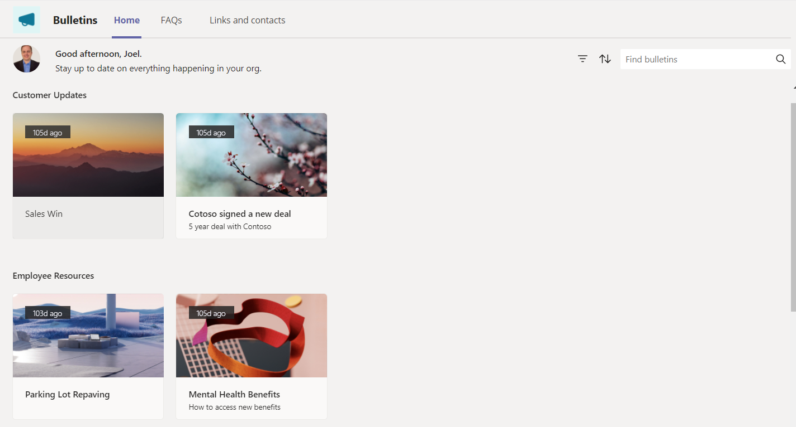
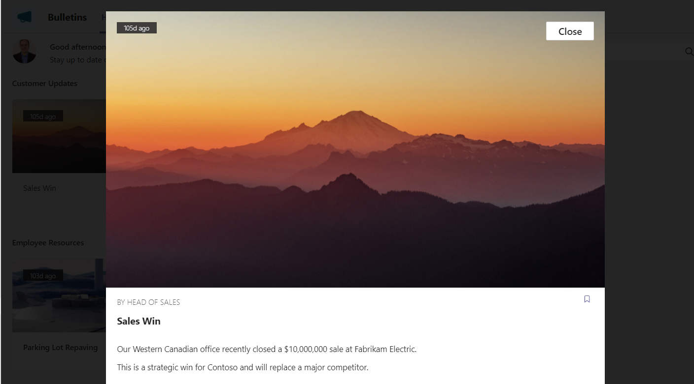
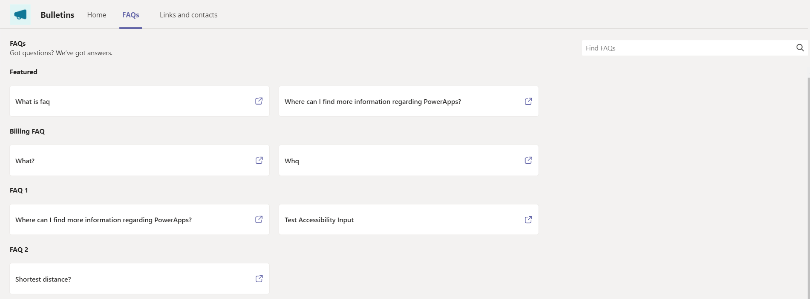
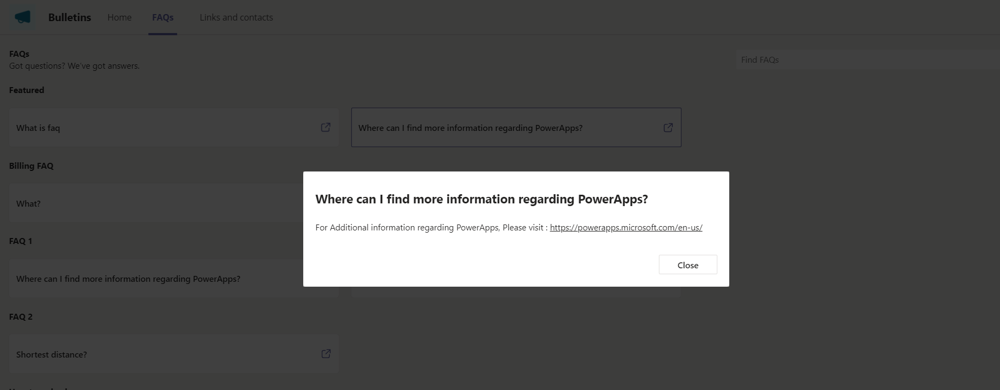
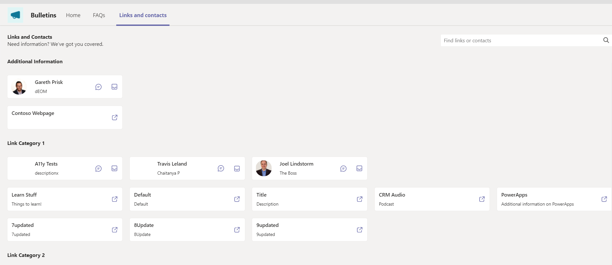

# Understand Bulletins sample app architecture

In this Document, you'll learn about the collections and global variables used by the [Manage Bulletins](bulletins.md#manage-bulletins-app) and [Bulletins](bulletins.md#bulletins-app) apps, understand and how to use them effectively. If you want to learn more about how to install, and use the Bulletins sample app instead, go to [Bulletins sample app](bulletins.md).

## Prerequisites

To understand and use information in this article, you'll need to know about different controls, features, and capabilities of canvas apps.

- [Create and update a collection in a canvas app](canvas-apps/create-update-collection.md)
- [Collect, Clear, and ClearCollect functions in Power Apps](canvas-apps/functions/function-clear-collect-clearcollect.md)
- [Understand canvas-app variables in Power Apps](canvas-apps/working-with-variables.md)
- [Add and configure a canvas-app control in Power Apps](canvas-apps/add-configure-controls.md)
- [Add a screen to a canvas app and navigate between screens](canvas-apps/add-screen-context-variables.md)

## Data model

The following diagram explains the data model used by the Bulletins sample app.

## Manage Bulletins app

This section explains collections, and global variables used by the Manage Bulletins app.

### Collections

| Collection Name               | Description                                                            | Screen Used                                                                      |
|-------------------------------|------------------------------------------------------------------------|----------------------------------------------------------------------------------|
| colUserImages                 | Collection used to store the UserImage and Username                    | OnHidden property of Bulletins Screen, FAQs Screen and Links and Contacts screen |
| colDeleteBulletinLinkCategory | Used to collect Bulletin Link categories which are marked for deletion |                                                                                  |
| colUpdateBulletinLinkCategory | Used to collect Bulletin Link categories which are to be updated       |                                                                                  |
| colDeleteBulletinFAQCategory  | Used to collect FAQ categories which are marked for deletion           |                                                                                  |
| colUpdateBulletinFAQCategory  | Used to collect FAQ categories which are to be updated                 |                                                                                  |
| colDeleteBulletinCategory     | Used to collect Bulletin categories which are marked for deletion      |                                                                                  |
| colUpdateBulletinCategory     | Used to collect Bulletin categories which are to be updated            |                                                                                  |
| colLocalization               | Used to build a Localization Collection based on the User Language     | OnStart property of the App                                                      |
| colReparentContacts           | Used to collect Contacts whose category is blank                       |                                                                                  |
| colReparentLinks              |                                                                        |                                                                                  |
| colReparentFAQ                |                                                                        |                                                                                  |
| colReparentBulletins          |                                                                        |                                                                                  |
| colUserSettings               | Used to collect User Settings CDS record if it exists                  | OnStart property of the App                                                      |
| colStockImages                | Collection to collect the Stock Images used in the app                 | OnStart property of the app                                                      |

Global Variables
----------------

| Variable Name                   | Type    | Description                                                                 |
|---------------------------------|---------|-----------------------------------------------------------------------------|
| gblAppLoaded                    | Boolean | To check whether the App is completely loaded                               |
| gblUserLanguage                 | Text    | To check the logged in User’s Language                                      |
| gblPadding                      | Record  | Used to set padding values in the app                                       |
| gblUser                         | Record  | Variable to get User record for context                                     |
| gblAppMenu                      | Record  |                                                                             |
| gblRecordUserSettings           | Record  | Variable to use the Oldest Record in case multiple records exist            |
| gblUserFirstName                | Text    | Variable to get the First Name of the User                                  |
| gblUserIsTeamOwner              | Boolean | Variable to check if User is a Team Owner                                   |
| gblRecordBulletinFAQ            | Record  | A bulletin link variable used to refer a FAQ record which is in context     |
| gblAppSetting_inputMobileOnWeb  | Boolean | Variables to Scale fonts for mobile-oriented apps, running in desktop       |
| gblAppSetting_inputMobile       | Boolean | Variables to Scale fonts for mobile-oriented apps                           |
| gblAppSetting_inputScaleFontsby | Number  | Use this variable for scaling all fonts by a fixed amount                   |
| gblThemeDark                    | Boolean | To check whether the Teams theme is set to Dark                             |
| gblThemeHiCo                    | Boolean | To check whether the Teams theme is set to High Contrast                    |
| gblAppColors                    | Record  | Variable to set the Color value in the app                                  |
| gblAppSizes                     | Record  | Variable to set the Color value in the app                                  |
| gblAppStyles                    | Record  | Variable to set the Styling values in the app                               |
| gblRecordBulletin               | Record  | A bulletin variable used to refer a Bulletin record which is in context     |
| gblRecordBulletinLink           | Record  | A bulletin link variable used to refer a link record which is in context    |
| gblRecordBulletinContact        | Record  | A bulletin link variable used to refer a contact record which is in context |

Bulletins App Story
===================

### On Start 

#### Collections involved

1.  **colLocalization –** collection of localized text based on user’s
    language**.**

2.  **colStockImages –** collection of stock cover images.

3.  **colCdsBulletins –** collection to hold bulletins data from CDS.

4.  **colCdsBulletinCategories –** collection to hold bulletin categories data
    from CDS.

5.  **colCdsBulletinReadReceipts –** collection to hold bulletin read receipts
    data from CDS.

6.  **colCdsBulletinBookmarks –** collection to hold bulletin bookmarks data
    from CDS.

7.  **colCdsBulletinUserSettings –** collection to hold bulletin user settings
    data from CDS.

8.  **colCdsBulletinCategoryPreferences –** collection to hold bulletin category
    preferences data from CDS

9.  **colAppNewUserCategories –** collection to store user preferences.

#### Variables involved

1.  **gblAppLoaded –** global variable used to check if the App is loaded or
    not.

2.  **gblUserLanguage** – global variable which holds the user’s local language.

3.  **gblPadding –** global variable which holds the padding details of the app.

4.  **gblUser –** global variable to hold the User record for context.

5.  **gblUserFirstName –** global variable to hold the First Name of the User.

6.  **gblAppMenu –** global variable to hold the menu details.  
    

#### Detailed Steps

1.  When a User loads the app, **gblAppLoaded** is set to false. The user’s
    language code is stored in **gblUserLanguage**, with English - US being the
    default one.

2.  The user’s language is then used to collect localized text used throughout
    the app (e.g. label and button text) in **colLocalization**.

3.  As the app loads it collects the data from the CDS and stores in to the
    collections to use the data across the app. The collections that holds the
    CDS data are **colCdsBulletins , colCdsBulletinCategories ,
    colCdsBulletinReadReceipts , colCdsBulletinBookmarks,
    colCdsBulletinUserSettings** and **colCdsBulletinCategoryPreferences.**

4.  The stock images are collected to **colStockImages** collection which helps
    the user to pick any images for the bulletin’s cover from the app itself.

5.  The menu details on various screens of the app are collected to
    **gblAppMenu** which helps to create menu’s as per the screen.

6.  The user preferences are collected to **colAppNewUserCategories,** which
    helps the user to have a personalized experience of the app as it shows the
    bulletins based on the user bulletin category preferences.

### Home Screen 

#### Collections involved

1.  **colCdsBulletins –** collection to hold bulletins data from CDS.

2.  **colCdsBulletinBookmarks –** collection to hold bulletin bookmarks data
    from CDS.

3.  **colCdsBulletinCategoryPreferences –** collection to hold bulletin category
    preferences data from CDS.

#### Variables involved

1.  **gblUser –** global variable to hold the User record for context.

2.  **gblUserFirstName –** global variable to hold the First Name of the User.

3.  **locVisibleDialog –** local variable used to show and hide the dialog
    pop-up

4.  **locVisibleDialogBulletinReader –** local variable used to show and hide a
    bulletin

5.  **locBulletinRecord –** local variable used to store the selected bulletin
    record

6.  **locBulletinBody –** local variable used to store the selected bulletin’s
    body

#### Detailed Steps

1.  Using the collections **colCdsBulletins** and
    **colCdsBulletinCategoryPreferences** the screen is loaded with the
    published bulletins.

2.  User can search any bulletin by the name or category of the bulletin using
    the search box available on this screen.

3.  Based on the search the galleries will be filtered.

4.  Once the user selects a bulletin, a dialog pop-up appears using the
    variables **locVisibleDialog** and **locVisibleDialogBulletinReader.**

5.  The dialog will show the information of selected bulletin which include
    image, video, body etc.. from the bulletin record using the variables
    **locBulletinRecord** and **locBulletinBody**

6.  If the user wants to close the dialog, the user will click on close button
    or the empty space around the dialog in order to set the
    **locVisibleDialog** and **locVisibleDialogBulletinReader** variables to
    false and there by hiding the dialog pop-up.

#### Screens 

### FAQ’s Screen 

#### Collections involved

**None**

#### Variables involved

1.  **locVisibleDialog –** local variable used to show and hide the dialog
    pop-up

#### Detailed Steps

1.  This screen will mainly show the information of FAQ’s retrieved from CDS
    entities **Bulletin FAQs** and **Bulletin FAQ Categories**

2.  User can search the needed FAQ’s using the search box by it’s name and the
    galleries showing these entities will get filtered as per the search.

3.  User can use the open icon to open the FAQ in a dialog with the help of
    **locVisibleDialog.** On selecting the close button on the pop-up dialog
    using the variable the dialog will be hidden.

#### Screens 

### FAQ’s Screen 

#### Collections involved

**None**

#### Variables involved

**None**  

#### Detailed Steps

1.  This screen will mainly show the information of FAQ’s retrieved from CDS
    entities **Bulletin Link Categories** , **Bulletin Contacts** and **Bulletin
    Link Categories.**

2.  User can search the needed **Bulletin Link Categories** , **Bulletin
    Contacts** and **Bulletin Link Categories** by using search box and the
    results will be filtered in the respective galleries

3.  Using **launch** function, the links will be opened in a separate browser
    tab.

Collections 
------------

Use a collection to store data that users can manage in your app. A collection
is a group of items that are similar, such as products in a product list.

### Important Functions

1.  **Collect**: The Collect function adds records to a data source.

2.  **Clear**: The Clear function deletes all the records of a collection. The
    columns of the collection will remain.

3.  **ClearCollect**: The ClearCollect function deletes all the records from a
    collection. And then adds a different set of records to the same collection.
    With a single function, ClearCollect offers the combination of Clear and
    then Collect.

| Collection Name                   | Description                                                                                            | Screen Used                                                                      |
|-----------------------------------|--------------------------------------------------------------------------------------------------------|----------------------------------------------------------------------------------|
| colAppNewUserCategoies            | App only collection, indicating a new user category was added                                          | OnStart property of the App                                                      |
| colCdsBulletinCategoryPreferences | Collection to collect the User’s category preferences from the My Bulletin Category Preferences (view) | OnStart property of the App                                                      |
| colCdsBulletinUserSettings        | Collection to collect the User setting record from the My Bulletin Category Preferences view           | OnStart property of the App                                                      |
| colCdsBulletinBookmarks           | Collection to collect the bookmarked bulletins record from the My Bulletin bookmarks view              | OnStart property of the App                                                      |
| colCdsBulletinReadReceipts        | Collection to collect the read receipts record from the My Bulletin Read Receipts view                 | OnStart property of the App                                                      |
| colCdsBulletinCategories          | Collection to collect the Active bulletin categories from the Active Bulletin categories               | OnStart property of the App                                                      |
| colCdsBulletins                   | Collection to collect the list of Published bulletins from the Publication Group: Published view       | OnStart property of the app                                                      |
| colStockImages                    | Collection to collect the Stock Images used in the app                                                 | OnStart property of the app                                                      |
| colLocalization                   | Used to build a Localization Collection based on the User Language                                     | OnStart property of the App                                                      |
| colUserImages                     | Collection used to store the UserImage and Username                                                    | OnHidden property of Bulletins Screen, FAQs Screen and Links and Contacts screen |

Global Variables
----------------

| Variable Name                   | Type    | Description                                                                 |
|---------------------------------|---------|-----------------------------------------------------------------------------|
| gblAppLoaded                    | Boolean | To check whether the App is completely loaded                               |
| gblUserLanguage                 | Text    | To check the logged in User’s Language                                      |
| gblPadding                      | Record  | Used to set padding values in the app                                       |
| gblUser                         | Record  | Variable to get User record for context                                     |
| gblUser                         | Record  | Variable to get User record for context                                     |
| gblUserFirstName                | Text    | Variable to get the First Name of the User                                  |
| gblAppMenu                      | Record  | Variable to store the label, width and the screen name for the menu records |
| gblAppSetting_inputMobileOnWeb  | Boolean | Variables to Scale fonts for mobile-oriented apps, running in desktop       |
| gblAppSetting_inputMobile       | Boolean | Variables to Scale fonts for mobile-oriented apps                           |
| gblAppSetting_inputScaleFontsby | Number  | Use this variable for scaling all fonts by a fixed amount                   |
| gblThemeDark                    | Boolean | To check whether the Teams theme is set to Dark                             |
| gblThemeHiCo                    | Boolean | To check whether the Teams theme is set to High Contrast                    |
| gblAppColors                    | Record  | Variable to set the Color value in the app                                  |
| gblAppSizes                     | Record  | Variable to set the Color value in the app                                  |
| gblAppStyles                    | Record  | Variable to set the Styling values in the app                               |
