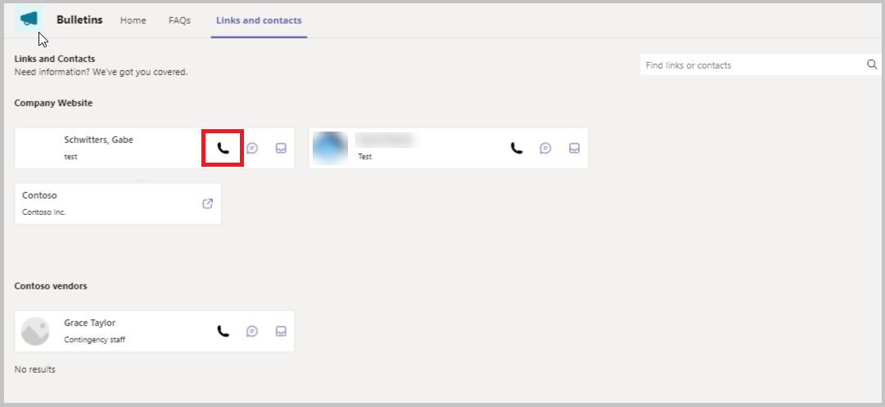
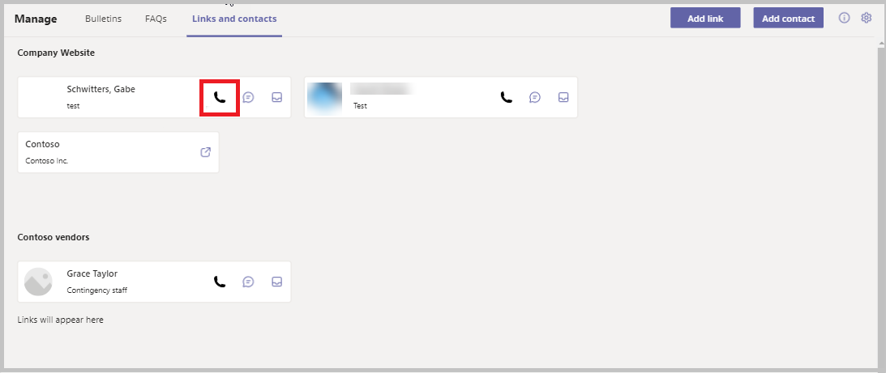

# Add contact phone in links and contacts section

The Bulletins sample app for Microsoft Teams provides a central location for all company communication such as broadcasts, memos, announcements, and company news. The app allows you to create, categorize, bookmark, search and read bulletin posts.

The Bulletins app solution consists of two apps:

The Bulletins app solution consists of two apps:

[Manage bulletins app](bulletins.md#manage-bulletins-app)

-   Manager experience for managing **Bulletins** app.

-   Allows managers to create, edit, and categorize posts read through the Bulletins app.

[Bulletins app](bulletins.md#bulletins-app)

-   Central location for all company communication such as memos, broadcasts, and news.
    
-   Shows bulletins, FAQs, links, and contacts created using the **Manage bulletins** app.

In this article, we'll learn how to enable users to initiate a call to their contacts from within the app using Teams.

The Bulletins app provides links to relevant contacts in the organization and external to the organization that are relevant to specific categories. For example, if you want to know who is responsible for health insurance benefits, you can add the appropriate contact under the category of health insurance.

By default, there's no phone number to call the person. We'll add the ability to call the person from within the app.

> [!NOTE]
> Before you proceed, review [customize Bulletins app](customize-bulletins.md).

## Prerequisites

To complete this lesson, we'd need the ability to login into Teams which will be available as part of select Microsoft 365 subscriptions, and will also need to have the Bulletins app for Teams installed. This app can be installed from <https://aka.ms/TeamsBulletins>. Also, we'd need to complete lesson 82&mdash;Add "notify me" settings to category (confirm link). We'll use steps followed in that lesson and build up on those in this topic.

> [!NOTE]
> Follow below steps on both the Bulletins and the Manage Bulletins apps where you want the "Call contact" functionality enabled.

## Add a Call image media file

1. Download the call image to your local desktop.
1. Select **Power Apps** from the left-pane in Teams.
1. Go to the **Build** tab and select Installed apps.
1. Open the **Bulletins** app.
1. Select **Insert** > **Media** from the left-pane.
1. Select **Upload** below the Search box and upload the image downloaded above.

## Add the Call icon to the contact card

1. From the tree view, open **Links and Contacts** screen, and select **galLinksContacts_Contacts** gallery.
1. Select **imgGalLinksContacts_Contacts_IM** from the tree view, and press **Ctrl + C** on the keyboard to copy it.
1. Press **Ctrl + V** on the keyboard to paste this image. The image gets saved on the screen.
1. Cut the from the screen using **Ctrl + X**, and paste it on to the gallery **galLinksContacts_Contacts**.
1. Update the following properties with the values for the pasted image:

    | Property | Value |
    | - | - |
    | Name | imgGalLinksContacts_Contacts_Call |
    | X | Parent.TemplateWidth - Self.Width\*3 |
    | Image | 'call icon' |
    | OnSelect | `Launch("msteams://teams.microsoft.com/l/call/0/0?users="&ThisItem.Email,{},LaunchTarget.New)` |

    > [!NOTE]
    > This action will launch the Teams call option, and will open a pop-up asking if you'd like to call the contact using Teams.

1. Update the width of the gallery **galLinksContacts_Contacts** as `'Links and Contacts Screen'.Size – 1`.

1. Update the width of the button **btnGalLinksContacts_Contacts_Select** as `imgGalLinksContacts_Contacts_Call.X - Self.X`.

    > [!NOTE]
    > This button only exists in the **Manage Bulletins** app.

1. Select **Save** to save your changes.

## Publish the Manage Bulletins app

All the changes to the Bulletins app are completed. The app can now be published by selecting **Publish to Teams** on the top right.

## Test the app

1. Login into Teams, and go to Team where the Bulletins app is installed.
1. Select the Bulletins tab on the top.
1. The Bulletins app opens.
1. Select the **Links and Contacts** tab on the top ribbon.
1. Verify that the **Call** icon shows on the Contact card.

    

1. If you don't have a contact from your organization that exists in the list of contacts already, you can add one by selecting the **Add contact** button on the top-right.
1. Select the office contact from the **Select a contact** dropdown, enter a description, and then select **Save** on the top-right.
1. Select **Back** to go to the **Links and contacts** screen. The contact just added shows up on this screen.
1. Select the newly added **Call** image to call the contact.
1. A popup opens asking to start a call.
1. Select **Start call** to call the contact.
1. The call gets connected and you are able to call the contact from the Manage Bulletins app using Teams.
1. Repeats the previous steps for the Manage Bulletins app

    

### See also

- [Understand Bulletins sample app architecture](bulletins-architecture.md)
- [Customize Bulletins app](customize-bulletins.md)
- [Sample apps FAQs](sample-apps-faqs.md)
- [Use sample apps from the Teams store](use-sample-apps-from-teams-store.md)

[!INCLUDE[footer-include](../includes/footer-banner.md)]
