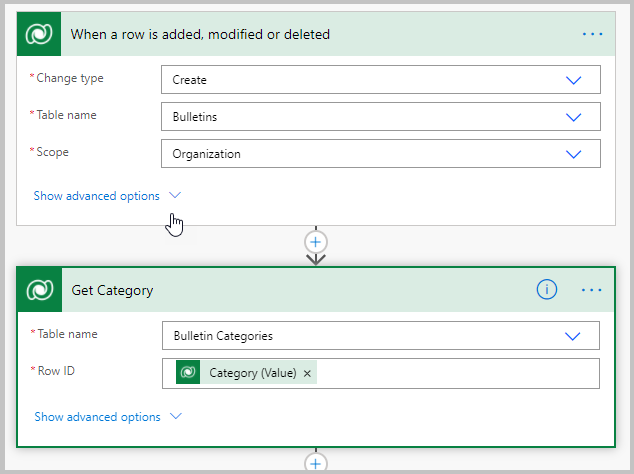
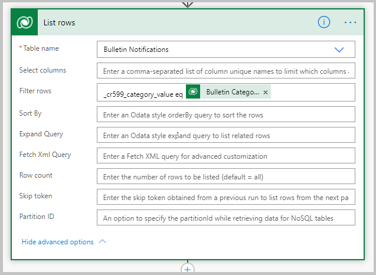
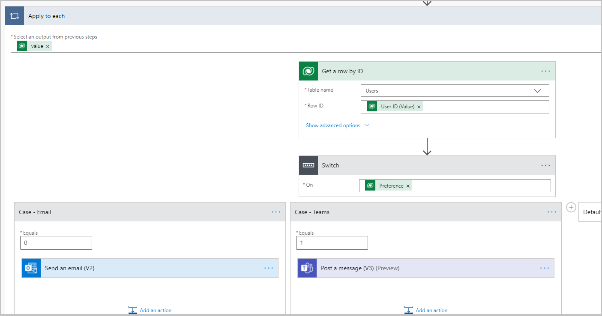
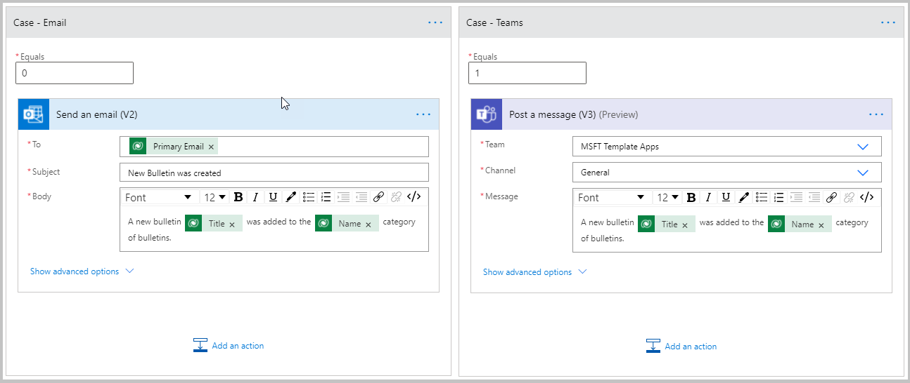
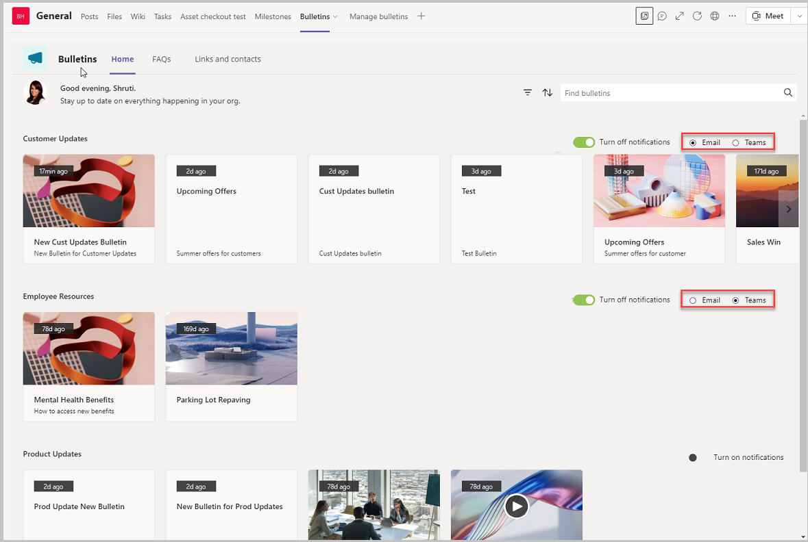
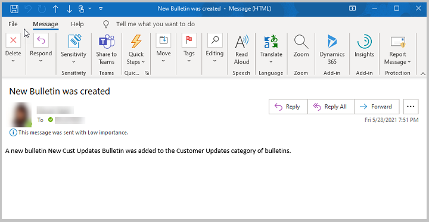
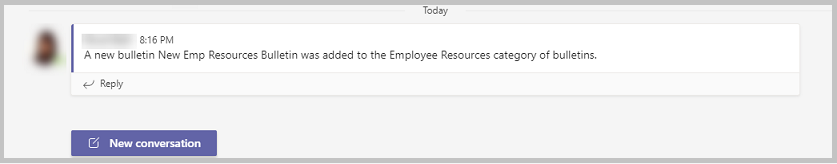

# Customize apps for end user to add notification preferences

The Bulletins sample app for Microsoft Teams provides a central location for all company communication such as broadcasts, memos, announcements, and company news. The app allows you to create, categorize, bookmark, search, and read bulletin posts.

Watch this video to learn how to customize apps for end user to add notification preferences:
> [!VIDEO https://www.microsoft.com/videoplayer/embed/RWLn9F]

The Bulletins app solution consists of two apps:

[Manage bulletins app](bulletins.md#manage-bulletins-app)

-   Manager experience for managing **Bulletins** app.

-   Allows managers to create, edit, and categorize posts read through the Bulletins app.

[Bulletins app](bulletins.md#bulletins-app)

-   Central location for all company communication such as memos, broadcasts, and news.
    
-   Shows bulletins, FAQs, links, and contacts created using the **Manage bulletins** app.

In this article, we'll learn how to enable users to set notification preferences per category for which they want to get notified when new bulletins get added.

> [!NOTE]
> Before you proceed, review [customize Bulletins app](customize-bulletins.md).

## Prerequisites

To complete this lesson, we'd need the ability to log in into Teams that will be available as part of select Microsoft 365 subscriptions and will also need to have the Bulletins Power Apps template for Teams installed. This app can be installed from <https://aka.ms/TeamsBulletins>. Also, we'd need to review [Send an alert when a new bulletin is posted](new-bulletin-alert.md).

## Add a column to the Bulletin Notifications table

1. Select the Power Apps button from the left-pane in Teams.

1. Go to the Build tab, and select Installed apps.

1. Open the Bulletins app.

1. Select **Data** from the left-pane.

1. Find the Bulletin Notifications table, select **...** (ellipsis), and then select **Edit data** option (Bulletin Notifications table was created as part of the [Add "notify me" settings to category](bulletins-notify-me.md).

1. Select **+ Add column** to add a new column with the following configuration.

    | Property | Value |
    | - | - |
    | Name | Preference |
    | Type | Choice |
    | Choices | Choice 1 - "Email"   Choice 2 - "Teams" |

## Turn on the Classic Controls Setting

1. Select **Settings** on the top ribbon.

1. Select **Upcoming features** from the left menu.

1. Select the **Experimental** tab.

1. Scroll to the bottom, and then turn on the **Classic Controls** setting.

1. Close the Settings.

Now if you select **+ Insert** on the left-pane, you'll see classic controls listed.

## Add a Dropdown control to select Notification Preference

1. From the Tree view, select the Home screen.

1. Select **galBulletins_ByCategory** from the tree view to select the gallery control.

1. Now, select the gallery **galBulletins_ByCategory** from the tree view again.

1. Select **Insert** from the left-pane.

1. Select **Classic** > **Radio** button.

1. Set the following properties on the List box.

    | Property | Value |
    | - | - |
    | Width | 208 |
    | Height | 40 |
    | Padding Top | 10 |
    | Padding Bottom | 10 |
    | X | `Parent.Width - Self.Width - 20` |
    | Y | `lblGalBulletins_ByCategory_Name.Y` |
    | Items | `Choices('Preference (Bulletin Notifications)')` |
    | Tooltip | "Notification Preference" |
    | Visible | `Toggle1.Checked` |
    | OnChange | `Patch('Bulletin Notifications',LookUp('Bulletin Notifications',Category.'Bulletin Category'=ThisItem.appCategoryGUID&&'UserID'.User=gblUserRecord.User),{Preference:Self.Selected.Value})`   **NOTE**: Patch function is to save the selected preference on the record in the Bulletin Notifications table. |
    | Default | `LookUp('Bulletin Notifications',Category.'Bulletin Category'=ThisItem.appCategoryGUID&&'UserID'.User=gblUserRecord.User).Preference` |

1. Select the **Toggle1** control (added as part of the [Add "notify me" settings to category](bulletins-notify-me.md)), and change the following properties:

    | Property | Value |
    | - | - |
    | X | `If(Self.Checked, Parent.Width - Self.Width - Radio1.Width - 20, Parent.Width - Self.Width - 20)` |
    | OnCheck | `Patch('Bulletin Notifications',{Category:LookUp('Bulletin Categories','Bulletin Category'=ThisItem.appCategoryGUID),'UserID':gblUserRecord,Preference:'Preference (Bulletin Notifications)'.Email})` |

## Publish the Bulletins App

All the changes to the Bulletins app are completed. The app can now be published by selecting the **Publish to Teams** button on the top-right.

## Update the Power Automate flow to send email notification

1. Go to https://flow.microsoft.com.

1. Open the flow **Send notification based on notify me flag when a new bulletin is created** created as part of [Add "notify me" settings to category](bulletins-notify-me.md).

1. Verify that the flow was created in the environment with the same name as the team in which the app was installed.

    The current flow sends an email notification to the user when a new bulletin is added for a category, they have chosen to get notified for.

    As a part of this topic, we'll add a couple more steps where the system would look at the notification preference selected by the user whether email or teams message and send out the notification accordingly.

    

    

1. In the **Apply to each step below**, add a switch case step to check if the preference on the record is Email(0) or Teams(1).

1. Move the Send and email step under the Email case.

1. Add a step under the Teams case as shown below. Ensure to select the team where you would like to receive the notification.

    

    

## Test the app

1. Open Teams, and the team where the Bulletins app is installed.

1. Select the **Bulletins** tab on the top.

1. Verify that the Turn on notifications toggle show up on the top right of each row of the categories gallery.

1. Verify that the Email/Teams Radio button shows up only when the Toggle button is set to On.

1. Select the Turn on notifications toggle to turn on notifications for the particular categories.

1. Set the Notification preference to Email for one and Teams for the other.

    

1. Select the **Manage Bulletins** tab on the top.

1. Select **New Bulletin** on the top-right.

1. Select the Category for which you want the bulletin created; such as "Customer Updates".

1. Enter a title, such as "New Customer Updates Bulletin".

1. Enter a subtitle, such as "New Bulletin for Customer Updates".

1. Enter a description, such as "New Bulletin for Customer Updates".

1. Select **Upload**, and select an image.

1. Select **Save**.

1. Select **Publish**.

    In a few minutes, an email as shown in the image below should appear in the inbox of the primary email address of all the users who registered for email notifications of the selected category.

    

    Now we'll run another test to verify the Teams notification scenario.

1. Select **New Bulletin** on the top-right.

1. Select the Category for which you want the bulletin created, such as "Employee Resources".

1. Enter a title, such as "New Employee Resources Bulletin".

1. Enter a subtitle, such as "New Bulletin for Employee Resources".

1. Enter a description, such as "New Bulletin for Employee Resources".

1. Select **Upload**, and select an image.

1. Select **Save**.

1. Select **Publish**.

    In a few minutes, a Teams message should appear in the Teams channel in which the app is installed as shown in the image below.

    

### See also

- [Understand Bulletins sample app architecture](bulletins-architecture.md)
- [Customize Bulletins app](customize-bulletins.md)
- [Sample apps FAQs](sample-apps-faqs.md)
- [Use sample apps from the Teams store](use-sample-apps-from-teams-store.md)

[!INCLUDE[footer-include](../includes/footer-banner.md)]