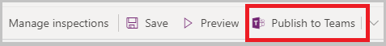
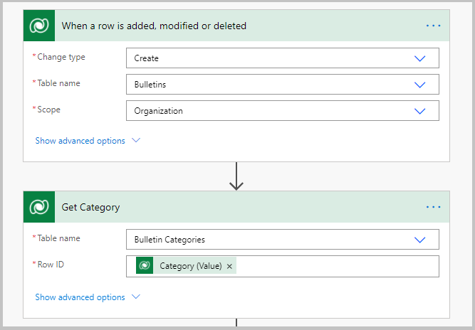
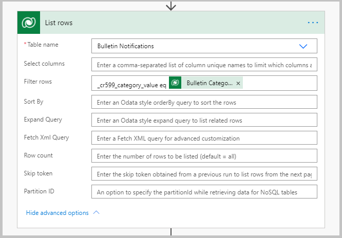
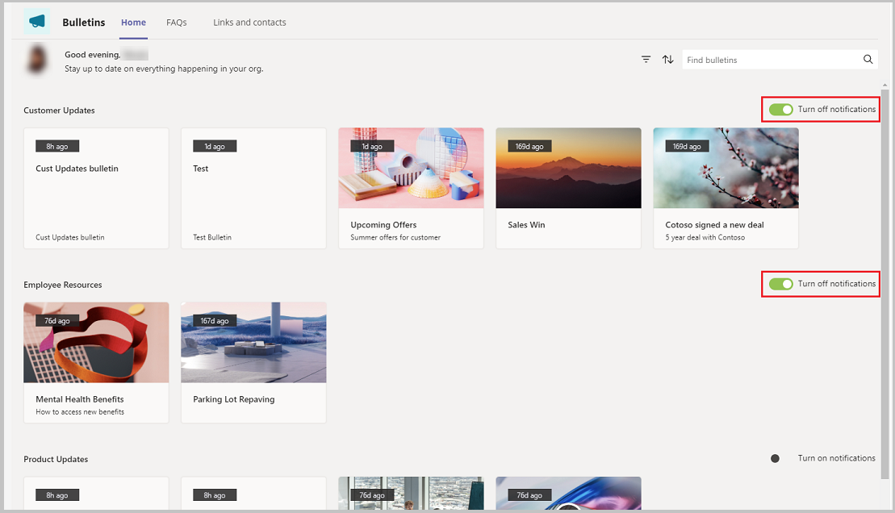
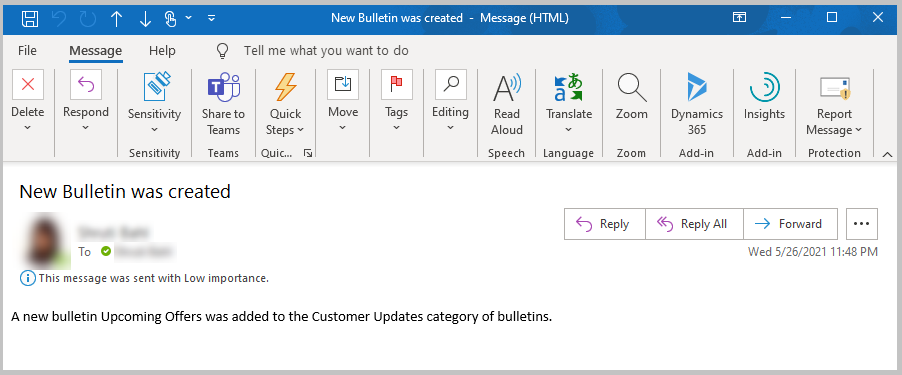

# Add "Notify me" settings to category

The Bulletins Power App Template for Teams provides a central location for all company communication such as broadcasts, memos, announcements, and company news. The app allows you to create, categorize, bookmark, search, and read bulletin posts.

The Bulletins app solution consists of two apps:

[Manage bulletins app](bulletins.md#manage-bulletins-app)

- Manager experience for managing **Bulletins** app.

- Allows managers to create, edit, and categorize posts read through the Bulletins app.

[Bulletins app](bulletins.md#bulletins-app)

- Central location for all company communication such as memos, broadcasts, and news.

- Shows bulletins, FAQs, links, and contacts created using the **Manage bulletins** app.

In this article, we'll learn how to add functionality where the user can select for which categories they should get notified when bulletins get added, and send an email notification using Power Automate flow, when a new bulletin is created.

When users are busy, excessive notifications can be a distraction. Users want to know when relevant announcements and news are posted, but they don’t want to be distracted by the noise of information about areas that don’t apply to them. By allowing users to opt in to notifications, they can subscribe to the areas that are relevant for them, and be notified about what matter most to them.

> [!NOTE]
> Before you proceed, review [customize Bulletins app](customize-bulletins.md).

## Prerequisites

To complete this lesson, we'd need the ability to log in into Teams that will be available as part of select Microsoft 365 subscriptions, and will also need to have the Bulletins Power Apps template for Teams installed. This app can be installed from <https://aka.ms/TeamsBulletins>.

## Create a new table called Bulletin Notifications

To get started, let’s add a table to store the notification settings.

1. Select **Power Apps** from the left-pane in Teams.

1. Go to **Build** > **Built by this team**.

1. Select **See all** under list of all items created to open the list of all the objects used in all the apps created in the selected team.

1. Select the **+ New** > **Table**.

1. Enter the table name as "Bulletin Notifications".

1. Open the table, and open the **Name** field of the table.

1. Change data type to autonumber.

1. Set the minimum number of digits to 4, and the seed value as 1000.

1. Using **Add column** on the top, add the following columns.

    | Column name | Data type | Related table |
    | - | - |
    | User ID | Lookup | User |
    | Category | Lookup | Bulletin Category |

## Add a toggle control to turn the notifications on and off

1. In the Bulletins app.

1. From the **Tree view**, select the **Home** screen.

1. Select **galBulletins_ByCategory** from the tree view.

1. Select **Insert** > **Input** > **Toggle**.

1. Set the following properties on the added toggle control.

    | Property | Value |
    | - | - |
    | X | `Parent.Width - Self.Width` |
    | Y | `lblGalBulletins_ByCategory_Name.Y` |
    | On Text | Turn off notifications |
    | Off Text | Turn on notifications |
    | Width | 200 |
    | Height | `lblGalBulletins_ByCategory_Name.Height` |
    | OnCheck | `Patch('Bulletin Notifications',{Category: LookUp('Bulletin Categories', 'Bulletin Category' = ThisItem.appCategoryGUID),'UserID':gblUserRecord})` |
    | OnUnCheck | `Remove('Bulletin Notifications',LookUp('Bulletin Notifications',Category.'Bulletin Category'=ThisItem.appCategoryGUID&&'User ID'.User=gblUserRecord.User))` |
    | Checked | `!IsBlank(LookUp('Bulletin Notifications', Category.'Bulletin Category' = ThisItem.appCategoryGUID && 'User ID'.User = gblUserRecord.User))` |

## Publish the Bulletins App

All the changes to the Bulletins app are completed. The app can now be published by selecting **Publish to Teams** on the top-right.

## Create Power Automate flow to send email notification

1. Open Power Apps in Teams.

1. Go to **Build** > **Built by this team**.

1. Select **See all**.

1. Select **+ New** > **Cloud flow** > **Automated**.

1. Enter the flow name as "Send notification based on the notification flag when a new bulletin is created".

1. Select the trigger as **When a new row is added, modified, or deleted**.

1. Create the flow with the steps explained in the following screens.

    

    

    

1. Save the flow.

## Test the app

1. Log in into Teams, and go to the team where the Bulletins app is installed.

1. Select the **Bulletins** app.

1. Select the Turn on notifications toggle to turn on notifications for the particular categories.

    

1. Now, select the **Manage Bulletins** tab on the top.

1. Select **New Bulletin** on the top-right.

1. Select the category for which you want the bulletin created, such as "Customer Updates".

1. Enter a title, such as "Upcoming Offers".

1. Enter a subtitle, such as "Summer offers for customers".

1. Enter a description, such as "This Bulletin will list all the upcoming summer offers for customers".

1. Select **Save**, and **Publish**.

1. In a few minutes, an email as shown in the image below should appear in the inbox of the email address that was provided in the Power Automate flow.

    

### See also

- [Understand Bulletins sample app architecture](bulletins-architecture.md)
- [Customize Bulletins app](customize-bulletins.md)
- [Sample apps FAQs](sample-apps-faqs.md)
- [Use sample apps from the Microsoft Teams store](use-sample-apps-from-teams-store.md)

[!INCLUDE[footer-include](../includes/footer-banner.md)]
